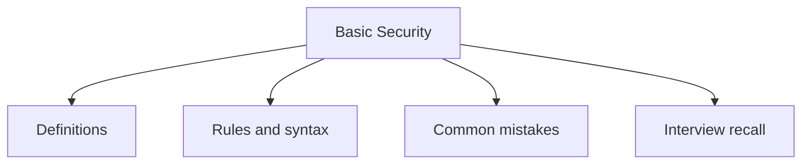

# 36 - Basic Security

This topic follows the master outline in [outline.md](../outline.md). The goal is to understand each concept deeply enough to explain it, recognize it in code, and answer interview-style questions.

## Study Order

- [Basic Secure Coding Concepts](theory/01-basic-secure-coding-concepts.md)
- [Avoid Insecure Deserialization Concepts](theory/02-avoid-insecure-deserialization-concepts.md)
- [Key Terms](terms/01-key-terms.md)

## Outline Checklist

- Basic secure coding
- Hashing
- MessageDigest
- SHA-256
- Base64
- Basic encryption/decryption
- KeyStore
- Basic SSL/TLS
- Input validation
- Avoid SQL Injection
- Avoid insecure deserialization

## Anki Cards

- [Basic](anki/basic.tsv)
- [Basic Extra](anki/basic-extra.tsv)
- [Cloze](anki/cloze.tsv)
- [Code Question](anki/code-question.tsv)

## Mermaid Overview

## Reference Links

- https://docs.oracle.com/javase/tutorial/security/
- https://docs.oracle.com/en/java/javase/21/security/
