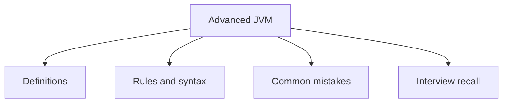

# 37 - Advanced JVM

This topic follows the master outline in [outline.md](../outline.md). The goal is to understand each concept deeply enough to explain it, recognize it in code, and answer interview-style questions.

## Study Order

- [Jvm Architecture Concepts](theory/01-jvm-architecture-concepts.md)
- [Execution Engine Concepts](theory/02-execution-engine-concepts.md)
- [Survivor Concepts](theory/03-survivor-concepts.md)
- [Shenandoah Concepts](theory/04-shenandoah-concepts.md)
- [Xx Concepts](theory/05-xx-concepts.md)
- [Key Terms](terms/01-key-terms.md)

## Outline Checklist

- JVM architecture
- Class Loader Subsystem
- Runtime Data Areas:
- Heap
- Stack
- Method Area / Metaspace
- PC Register
- Native Method Stack
- Execution Engine
- Interpreter
- JIT Compiler
- Garbage Collector
- Native Interface
- Heap generation:
- Young Generation
- Eden
- Survivor
- Old Generation
- GC algorithms:
- Serial GC
- Parallel GC
- old CMS
- G1 GC
- ZGC
- Shenandoah
- Stop-the-world
- Minor GC
- Major GC
- Full GC
- Basic JVM tuning:
- -Xms
- -Xmx
- -XX
- Basic profiling
- Memory dump
- Thread dump

## Self-Check

Before moving to the next topic, verify that you can answer these questions:
1. Why does the JVM class loading subsystem split loading into three phases (Loading, Linking, and Initializing), and what security role does class verification play?
   &rarr; See [Why Class Loading Has Three Distinct Phases](theory/01-jvm-architecture-concepts.md#why-class-loading-has-three-distinct-phases)
2. Why does the JVM Execution Engine combine JIT Compilation (with C1/C2 compilers) and Interpretation, and how does hot-spot profiling determine compile thresholds?
   &rarr; See [Why JIT Compilation and Interpretation Are Combined](theory/02-execution-engine-concepts.md#why-jit-compilation-and-interpretation-are-combined)
3. Why does the Generational Garbage Collection model use Survivor spaces (S0/S1) alongside Eden, and how does object aging prevent heap fragmentation?
   &rarr; See [Why Survivor Spaces Prevent Heap Fragmentation](theory/03-survivor-concepts.md#why-survivor-spaces-prevent-heap-fragmentation)
4. Why does Shenandoah GC achieve ultra-low pause times compared to G1, and how do Brooks Pointers (or load barriers) enable concurrent compaction?
   &rarr; See [Why Shenandoah GC Achieves Ultra-Low Pause Times](theory/04-shenandoah-concepts.md#why-shenandoah-gc-achieves-ultra-low-pause-times)
5. Why are JVM `-XX` flags classified into standard, non-standard (`-X`), and developer/unstable (`-XX`) options, and how do heap tuning flags affect GC behavior?
   &rarr; See [Why JVM Flag Classifications Exist](theory/05-xx-concepts.md#why-jvm-flag-classifications-exist)

## Anki Cards

- [Basic](anki/basic.tsv)
- [Basic Extra](anki/basic-extra.tsv)
- [Cloze](anki/cloze.tsv)
- [Code Question](anki/code-question.tsv)

## Mermaid Overview

## Reference Links

- https://docs.oracle.com/javase/specs/jvms/se21/html/
- https://docs.oracle.com/en/java/javase/21/gctuning/
