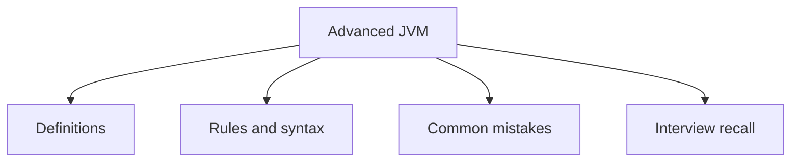

# 37 - Advanced JVM

This topic follows the master outline in [outline.md](../outline.md). The goal is to understand each concept deeply enough to explain it, recognize it in code, and answer interview-style questions.

## Study Order

- [Jvm Architecture Concepts](theory/01-jvm-architecture-concepts.md)
- [Execution Engine Concepts](theory/02-execution-engine-concepts.md)
- [Survivor Concepts](theory/03-survivor-concepts.md)
- [Shenandoah Concepts](theory/04-shenandoah-concepts.md)
- [Xx Concepts](theory/05-xx-concepts.md)
- [Key Terms](terms/01-key-terms.md)

## Outline Checklist

- JVM architecture
- Class Loader Subsystem
- Runtime Data Areas:
- Heap
- Stack
- Method Area / Metaspace
- PC Register
- Native Method Stack
- Execution Engine
- Interpreter
- JIT Compiler
- Garbage Collector
- Native Interface
- Heap generation:
- Young Generation
- Eden
- Survivor
- Old Generation
- GC algorithms:
- Serial GC
- Parallel GC
- old CMS
- G1 GC
- ZGC
- Shenandoah
- Stop-the-world
- Minor GC
- Major GC
- Full GC
- Basic JVM tuning:
- -Xms
- -Xmx
- -XX
- Basic profiling
- Memory dump
- Thread dump

## Anki Cards

- [Basic](anki/basic.tsv)
- [Basic Extra](anki/basic-extra.tsv)
- [Cloze](anki/cloze.tsv)
- [Code Question](anki/code-question.tsv)

## Mermaid Overview

## Reference Links

- https://docs.oracle.com/javase/specs/jvms/se21/html/
- https://docs.oracle.com/en/java/javase/21/gctuning/
