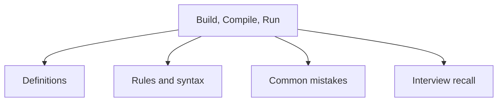

# 38 - Build, Compile, Run

This topic follows the master outline in [outline.md](../outline.md). The goal is to understand each concept deeply enough to explain it, recognize it in code, and answer interview-style questions.

## Study Order

- [Javac Concepts](theory/01-javac-concepts.md)
- [Standard Project Structure Concepts](theory/02-standard-project-structure-concepts.md)
- [Key Terms](terms/01-key-terms.md)

## Outline Checklist

- javac
- java
- jar
- Create JAR file
- Executable JAR
- Classpath
- Manifest file
- Basic Maven
- Basic Gradle
- Dependency management
- Standard project structure
- Basic unit test with JUnit

## Anki Cards

- [Basic](anki/basic.tsv)
- [Basic Extra](anki/basic-extra.tsv)
- [Cloze](anki/cloze.tsv)
- [Code Question](anki/code-question.tsv)

## Mermaid Overview

## Self-Check

Answer these questions after studying the theory to verify your depth of understanding:

1. **Why do we need build automation tools like Maven or Gradle** instead of using `javac` and `java` directly for large-scale projects?
2. **How does Classpath resolution work at runtime**, and what is the technical distinction between a `NoClassDefFoundError` and a `ClassNotFoundException`?
3. **What is the purpose of the Manifest file (`MANIFEST.MF`) in a JAR**, and how does it configure the JVM to make a JAR executable?
4. **Why does placing production resource files** in `src/main/java/` instead of `src/main/resources/` result in runtime lookup errors?
5. **How does dependency management handle transitive dependencies**, and what mechanism is used to resolve version conflicts ("Jar Hell")?
6. **Why is it important to follow the `assertEquals(expected, actual)` argument order** in JUnit, and what are the consequences of reversing them?

## Reference Links

- https://docs.oracle.com/en/java/javase/21/docs/specs/man/javac.html
- https://docs.oracle.com/en/java/javase/21/docs/specs/man/java.html
