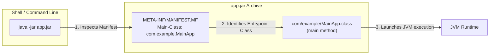
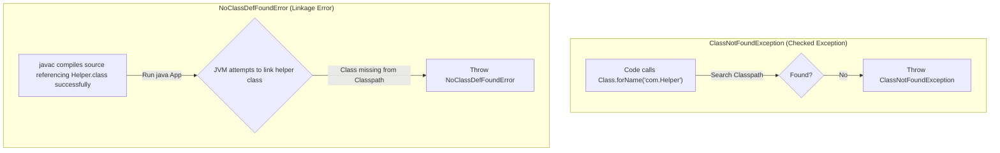
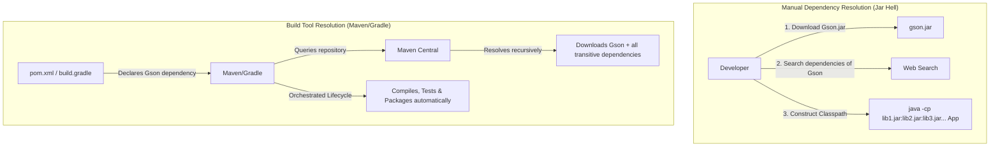

# Build, Compile, Run - Part 1

## Learning Goal

This file covers a focused slice of **Build, Compile, Run**. Study each concept as a practical Java rule, not as isolated vocabulary.

## Outline Coverage

| Concept | What to know |
| --- | --- |
| `javac` | The Java Compiler tool that translates source code (`.java`) into JVM bytecode (`.class`). |
| `java` | The Java Application Launcher tool that starts the JVM and runs the class's `main` method. |
| `jar` | The Java Archive format based on ZIP used to package classes, resources, and metadata. |
| `Create JAR file` | The process and commands used to bundle files into a single `.jar` archive. |
| `Executable JAR` | A packaged JAR containing a Manifest specifying the entry-point `Main-Class`. |
| `Classpath` | The lookup path parameter telling the compiler and runtime where user-defined classes and JARs are. |
| `Manifest file` | The metadata file (`MANIFEST.MF`) containing key-value config attributes for the JAR. |
| `Basic Maven` | An industry-standard build automation tool configured using a declarative `pom.xml`. |
| `Basic Gradle` | A flexible build automation tool utilizing Groovy/Kotlin DSL configuration scripts. |
| `Dependency management` | The system for resolving, downloading, and organizing library dependencies to prevent classpath conflicts. |

## Detailed Notes

### javac

The Java Compiler (`javac`) reads `.java` source files and translates them into platform-independent bytecode files (`.class`). 

- **Syntax & Flags**:
  - `javac [options] [sourcefiles]`
  - Common flag: `-d <directory>` specifies the destination folder for compiled `.class` files.
- **Runnable Example**:
  ```bash
  # Compile a single Java file, placing the resulting .class in the current directory
  javac HelloWorld.java

  # Compile specifying destination directory (creates packages subdirectory automatically if needed)
  javac -d bin src/com/example/HelloWorld.java
  ```

- **Common Mistake / Failure Mode**:
  - Passing the compiled class name or class file instead of the source file, or omitting the `.java` extension:
    ```bash
    javac HelloWorld     # ERROR: Class names, 'HelloWorld', are only accepted if annotation processing is explicitly requested
    javac HelloWorld.class # WRONG: Cannot compile a class file!
    ```
  - Compile errors occur if dependent classes are missing from the classpath. Use the `-cp` flag to supply them:
    ```bash
    javac -cp libs/gson.jar -d bin src/com/example/MyParser.java
    ```

---

### java

The Java Application Launcher (`java`) launches a Java Virtual Machine (JVM), loads the specified class, and executes its `public static void main(String[] args)` method.

- **Syntax & Flags**:
  - `java [options] mainclass [args]`
  - `java -cp <classpath> com.example.MainApp`
- **Runnable Example**:
  ```bash
  # Run HelloWorld class (loaded from the current folder)
  java HelloWorld

  # Run fully qualified class name using a specified classpath
  java -cp bin com.example.MainApp

  # Single-file source execution (Java 11+): directly compiles and runs in-memory without generating a .class file
  java HelloWorld.java
  ```

- **Common Mistake / Failure Mode**:
  - Specifying the `.class` extension when running:
    ```bash
    java HelloWorld.class
    # ERROR: Could not find or load main class HelloWorld.class
    ```
  - Specifying directory paths instead of the fully qualified dot-notation class name:
    ```bash
    java com/example/MainApp
    # ERROR: Could not find or load main class com/example/MainApp
    # Correct form: java -cp bin com.example.MainApp
    ```

---

### jar

The Java Archive (`jar`) tool is used to package multiple class files, resources (such as icons, properties, images), and metadata into a single compressed archive file (based on the ZIP format).

- **Mental Model**: A `.jar` is a ZIP file with a specialized `META-INF/MANIFEST.MF` folder/file inside. It simplifies deployment and distribution.
- **Runnable Example**:
  ```bash
  # List contents of an existing JAR file (t: list, f: file)
  jar -tf app.jar

  # Extract contents of a JAR file (x: extract, f: file)
  jar -xf app.jar
  ```

- **Common Mistake / Failure Mode**:
  - Assuming `.jar` files are secure compiled binaries. Because they are just ZIP files, they can be easily unpacked or decompiled using tools like CFR or JD-GUI. sensitive settings (e.g., credentials) should never be hardcoded inside them.

---

### Create JAR file

Bundles compiled files and resources into a `.jar` package using the `jar` CLI command.

- **Key Flags**:
  - `-c` (create): Create a new archive.
  - `-f` (file): Specify the archive file name.
  - `-v` (verbose): Output details of compressed files.
  - `-C <dir>` (change directory): Temporarily change directory to grab files, preserving relative paths.
- **Runnable Example**:
  ```bash
  # Packaging all classes in current folder
  jar -cvf myapp.jar *.class

  # Package classes from a 'bin' folder while stripping the 'bin/' prefix from packaged paths
  jar -cvf myapp.jar -C bin/ .
  ```

- **Common Mistake / Failure Mode**:
  - Failing to match packaged paths with package declarations:
    If your class is defined as `package com.example;`, its class file must be packaged inside `com/example/MyClass.class` within the JAR. If you package it from *inside* the `com/example` folder directly (so `MyClass.class` is at the root of the JAR), the JVM will fail to run it with a `NoClassDefFoundError` or `ClassNotFoundException`.

---

### Executable JAR

An executable JAR is packaged with a `META-INF/MANIFEST.MF` metadata file that declares the entry-point class via the `Main-Class` attribute. It can be run directly using the `java -jar` syntax.

- **Runnable Example**:
  ```bash
  # Run an executable JAR directly
  java -jar myapp.jar

  # Create an executable JAR specifying the entry-point class directly using the 'e' flag
  jar -cfe myapp.jar com.example.MainApp -C bin/ .
  ```

- **Common Mistake / Failure Mode**:
  - Attempting to run a non-executable JAR that doesn't define `Main-Class` in the manifest:
    ```bash
    java -jar library.jar
    # ERROR: no main manifest attribute, in library.jar
    ```
    To resolve, run it by adding the JAR to the classpath and specifying the class:
    ```bash
    java -cp library.jar com.example.MainApp
    ```

### Why Executable JARs Need MANIFEST.MF

When you run a JAR using `java -jar app.jar`, the Java Virtual Machine needs to know which class contains the application entry point (the `public static void main` method) to begin execution. Unlike standard class execution where you explicitly pass the class name, `java -jar` delegates this lookup entirely to the metadata inside the JAR archive. This metadata is stored in the `META-INF/MANIFEST.MF` file, specifically under the `Main-Class` attribute. If this attribute is missing, the JVM cannot resolve the starting point and aborts immediately. Additionally, the `Class-Path` attribute in the manifest tells the JVM where to find external dependencies relative to the JAR, preventing the need to specify long `-cp` commands at runtime.

#### Mental Model: Executable JAR Entry Point


#### Runnable Example
Suppose you have the following manifest named `custom-manifest.txt` with a trailing blank newline:
```text
Manifest-Version: 1.0
Main-Class: com.example.MainApp
Class-Path: libs/gson-2.10.1.jar

```
If you build the JAR without this manifest or fail to add a trailing newline:
```bash
# Attempting to run without manifest or with a malformed manifest:
java -jar myapp.jar
# Output: no main manifest attribute, in myapp.jar
```

#### Cause-Effect Chain
`java -jar app.jar` executed $\rightarrow$ JVM inspects `META-INF/MANIFEST.MF` inside the archive $\rightarrow$ JVM fails to find `Main-Class` header (due to missing attribute or missing trailing newline) $\rightarrow$ JVM does not know which class's `main` method to run $\rightarrow$ Startup aborts with `no main manifest attribute` error.

---


### Classpath

The Classpath defines the search path that the compiler (`javac`) and the JVM runtime (`java`) use to locate user-defined classes, packages, and third-party libraries.

- **Runnable Example**:
  ```bash
  # On Linux/macOS (classpath separator is ':')
  java -cp bin:libs/mysql-connector.jar com.example.MainApp

  # On Windows (classpath separator is ';')
  java -cp bin;libs\mysql-connector.jar com.example.MainApp
  ```

- **Common Mistake / Failure Mode**:
  - **Wrong Separator**: Using `;` on Linux/macOS or `:` on Windows will break path resolution.
  - **Implicit Current Directory Overridden**: When you specify `-cp` or `-classpath`, the default search path `.` (current directory) is automatically disabled. If your program relies on classes in the current folder, you must add `.` to the classpath explicitly (e.g., `-cp .:libs/helper.jar`).

### Why Classpath Resolution Fails: NoClassDefFoundError vs ClassNotFoundException

The JVM resolves classes dynamically during runtime as they are referenced by the executing code. When the JVM tries to load a class and fails, it throws one of two distinct issues: `ClassNotFoundException` or `NoClassDefFoundError`. A `ClassNotFoundException` is a checked exception that occurs when an application attempts to load a class dynamically by its string name (e.g., using `Class.forName()`, `ClassLoader.loadClass()`, or `ClassLoader.findSystemClass()`) but the class cannot be found on the classpath. On the other hand, `NoClassDefFoundError` is a runtime error (subclass of `LinkageError`) that occurs when the compiler successfully compiles a class reference, but at runtime, the JVM cannot find the definition of that class on the classpath when it is first instantiated or accessed. This usually happens because a library was present during compilation but is missing from the classpath during execution, or because static initialization failed.

#### Mental Model: Book on Shelf vs. Catalog Search
* **`ClassNotFoundException`**: You go to the librarian (dynamic lookup) and ask: "Please find me a book named 'SecretRecipes' by name." The librarian checks the catalog and says: "I don't have any book registered by that name." (Checked exception: your code must handle the possibility that the book doesn't exist).
* **`NoClassDefFoundError`**: You read a recipe book (compiled code) that says: "Now add 2 spoons of secret sauce from the yellow jar." You look at the shelf where the yellow jar is supposed to be, but it is missing! The recipe was written assuming the jar exists, but it's not physically there at runtime. (Fatal error: linkage has failed).



#### Runnable Example
```java
// Example causing ClassNotFoundException
try {
    Class<?> clazz = Class.forName("com.nonexistent.Helper");
} catch (ClassNotFoundException e) {
    e.printStackTrace();
    // Output: java.lang.ClassNotFoundException: com.nonexistent.Helper
}

// Example causing NoClassDefFoundError
// Compiled fine when LibClass was present:
public class Main {
    public static void main(String[] args) {
        LibClass lib = new LibClass(); // Throws NoClassDefFoundError if LibClass.class is deleted/missing at runtime
    }
}
// Output at runtime:
// Exception in thread "main" java.lang.NoClassDefFoundError: LibClass
```

#### Cause-Effect Chain
Compiler builds class reference successfully $\rightarrow$ Class definition is omitted from the runtime classpath flag (`-cp`) $\rightarrow$ JVM executes instruction calling class constructor $\rightarrow$ Class loader searches classpath and returns null $\rightarrow$ JVM linker throws `NoClassDefFoundError`.

---


### Manifest file

The Manifest file (`META-INF/MANIFEST.MF`) is a text file containing key-value configurations for a JAR.

- **Example Content**:
  ```manifest
  Manifest-Version: 1.0
  Created-By: 21.0.1 (Oracle Corporation)
  Main-Class: com.example.MainApp
  Class-Path: libs/gson-2.10.1.jar libs/utils.jar
  
  ```
- **Common Mistake / Failure Mode**:
  - **Missing Trailing Newline**: The manifest file **must** end with a blank line (trailing newline). If not present, the parser will ignore the last line, causing JVM startup failures or missing main class errors.
  - **Line Length limit**: Lines cannot exceed 72 bytes. Longer declarations must be wrapped to the next line starting with a single space.

---

### Basic Maven

Apache Maven is a declarative build automation and dependency management tool centered around a `pom.xml` (Project Object Model) file.

- **Build Lifecycle Phases**:
  - `clean`: Deletes the `target/` output directory.
  - `compile`: Compiles source code to `target/classes`.
  - `test`: Runs unit tests.
  - `package`: Bundles compiled code into a JAR/WAR file inside `target/`.
- **Runnable Example**:
  ```bash
  # Build and package a Maven project
  mvn clean package
  ```

- **Common Mistake**: Confusing build phases. If you run `mvn package`, it automatically executes all preceding phases in the default lifecycle (`validate`, `compile`, `test`). Running `mvn test` will not build the package, but will compile the code.

---

### Basic Gradle

Gradle is a flexible build automation tool using Groovy or Kotlin DSL scripts (`build.gradle` or `build.gradle.kts`) instead of XML.

- **Runnable Example**:
  ```groovy
  // Example build.gradle
  plugins {
      id 'java'
  }
  group = 'com.example'
  version = '1.0.0'
  repositories {
      mavenCentral()
  }
  dependencies {
      testImplementation 'org.junit.jupiter:junit-jupiter:5.10.0'
  }
  ```
  ```bash
  # Execute clean and build tasks
  gradle clean build
  ```

- **Common Mistake**: Omitting `plugins { id 'java' }`. Without the java plugin, Gradle does not register standard Java compilation, testing, and packaging tasks.

---

### Dependency management

Dependency management is the mechanism of resolving, fetching, and managing external jar libraries. Both Maven and Gradle download transitive dependencies (dependencies of dependencies) from remote repositories (e.g., Maven Central) and cache them locally.

- **Case study: Jar Hell (Dependency Conflicts)**:
  - If library A depends on library C (v1.0), and library B depends on library C (v2.0), this creates a conflict. The JVM classpath is ordered, so it will load whichever version of a class is found first. This can trigger runtime errors like `NoSuchMethodError` or `NoClassDefFoundError`.
  - **Resolution**: Both Maven and Gradle provide exclusion mechanisms.
    ```xml
    <!-- Excluding a transitive dependency in Maven pom.xml -->
    <dependency>
        <groupId>com.example</groupId>
        <artifactId>library-a</artifactId>
        <version>1.0.0</version>
        <exclusions>
            <exclusion>
                <groupId>org.conflict</groupId>
                <artifactId>library-c</artifactId>
            </exclusion>
        </exclusions>
    </dependency>
    ```

### Why Build Tools (Maven/Gradle) Are Essential

As Java projects grow in complexity, managing dependencies, compiling files, running tests, and packaging binaries manually using raw CLI commands becomes error-prone and unsustainable. Build automation tools like Maven and Gradle solve this by orchestrating the entire lifecycle of a project through declarative or programmatic configurations. They automatically resolve transitive dependencies—libraries that your direct dependencies require—by downloading them from central repositories like Maven Central and caching them locally. Without build tools, you would have to manually download every JAR, recursively find its dependencies, and construct massive, fragile classpath strings. Additionally, build tools provide standardized build lifecycles (such as `clean`, `compile`, `test`, and `package`) ensuring consistent, reproducible builds across development and production environments.

#### Mental Model: Manual vs Automated Dependency Management


#### Runnable Example
A developer specifies a single dependency in a Maven `pom.xml`:
```xml
<dependency>
    <groupId>org.apache.httpcomponents.client5</groupId>
    <artifactId>httpclient5</artifactId>
    <version>5.2.1</version>
</dependency>
```
Running `mvn dependency:tree` shows Maven resolving all transitive dependencies automatically:
```bash
mvn dependency:tree
# Output:
# [INFO] com.example:myapp:jar:1.0.0
# [INFO] \- org.apache.httpcomponents.client5:httpclient5:jar:5.2.1:compile
# [INFO]    +- org.apache.httpcomponents.client5:httpcore5:jar:5.2.1:compile
# [INFO]    \- org.slf4j:slf4j-api:jar:2.0.0:compile
```

#### Cause-Effect Chain
Declare direct dependency in `pom.xml`/`build.gradle` $\rightarrow$ Build tool reads POM/Gradle script $\rightarrow$ Build tool queries remote repository for dependency POM metadata $\rightarrow$ Build tool discovers transitive dependencies (e.g., `httpcore5`, `slf4j-api`) $\rightarrow$ Build tool resolves conflicts and constructs correct classpath automatically for compilation and execution.

---

## Common Review Prompts

- Which concepts here are compile-time rules? (`javac`, compiling syntax, classpath for compiler)
- Which concepts here affect runtime behavior? (`java`, classpath for JVM, manifest attributes, runtime jar dependencies)
- Which concepts here are likely interview traps? (Using wrong classpath separators on different OS, ignoring the trailing newline in manifest files, executing `java ClassName.class` instead of `java ClassName`).
