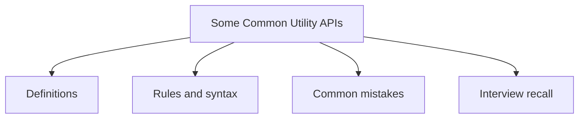

# 39 - Some Common Utility APIs

This topic follows the master outline in [outline.md](../outline.md). The goal is to understand each concept deeply enough to explain it, recognize it in code, and answer interview-style questions.

## Study Order

- [Math Concepts](theory/01-math-concepts.md)
- [Properties Concepts](theory/02-properties-concepts.md)
- [Key Terms](terms/01-key-terms.md)

## Outline Checklist

- Math
- Random
- BigInteger
- BigDecimal
- UUID
- Objects
- Optional
- System
- Runtime
- ProcessBuilder
- Properties
- ResourceBundle
- Locale
- Currency
- Formatter
- Scanner

## Anki Cards

- [Basic](anki/basic.tsv)
- [Basic Extra](anki/basic-extra.tsv)
- [Cloze](anki/cloze.tsv)
- [Code Question](anki/code-question.tsv)

## Self-Check

Before moving to the next topic, verify that you can answer these questions:
1. Why should we use `BigDecimal` instead of `double` for monetary calculations? Explain in terms of unscaled value and scale versus IEEE 754 floating-point representation.
2. Why does initializing a `BigDecimal` with a `double` literal (e.g., `new BigDecimal(0.1)`) introduce floating-point noise, and why is `new BigDecimal("0.1")` or `BigDecimal.valueOf(0.1)` preferred?
3. Why is `Math.random()` not cryptographically secure, and why does it suffer from thread contention in concurrent applications? What are the alternatives like `ThreadLocalRandom` or `SecureRandom`?
4. What is the fundamental difference in purpose and interaction style between the `System` and `Runtime` classes in Java?
5. Why can spawning an external process using `ProcessBuilder` cause the Java application to hang indefinitely, and how do we prevent this?
6. Why is using `Map` methods like `put()` on a `Properties` instance dangerous, and what is the proper way to set property values?

## Mermaid Overview

## Reference Links

- https://docs.oracle.com/en/java/javase/21/docs/api/java.base/java/util/package-summary.html
