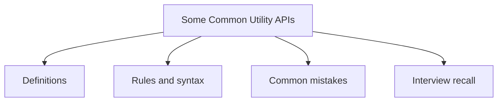

# 39 - Some Common Utility APIs

This topic follows the master outline in [outline.md](../outline.md). The goal is to understand each concept deeply enough to explain it, recognize it in code, and answer interview-style questions.

## Study Order

- [Math Concepts](theory/01-math-concepts.md)
- [Properties Concepts](theory/02-properties-concepts.md)
- [Key Terms](terms/01-key-terms.md)

## Outline Checklist

- Math
- Random
- BigInteger
- BigDecimal
- UUID
- Objects
- Optional
- System
- Runtime
- ProcessBuilder
- Properties
- ResourceBundle
- Locale
- Currency
- Formatter
- Scanner

## Anki Cards

- [Basic](anki/basic.tsv)
- [Basic Extra](anki/basic-extra.tsv)
- [Cloze](anki/cloze.tsv)
- [Code Question](anki/code-question.tsv)

## Mermaid Overview

## Reference Links

- https://docs.oracle.com/en/java/javase/21/docs/api/java.base/java/util/package-summary.html
