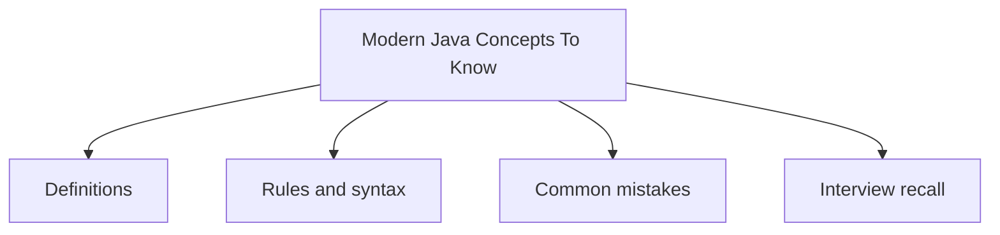

# 40 - Modern Java Concepts To Know

This topic follows the master outline in [outline.md](../outline.md). The goal is to understand each concept deeply enough to explain it, recognize it in code, and answer interview-style questions.

## Study Order

- [Var Concepts](theory/01-var-concepts.md)
- [Sequenced Collections Concepts](theory/02-sequenced-collections-concepts.md)
- [Key Terms](terms/01-key-terms.md)

## Outline Checklist

- var
- Records
- Sealed class
- Pattern matching for instanceof
- Switch expression
- Text blocks
- Enhanced NullPointerException message
- Virtual Threads
- Basic Structured Concurrency
- Pattern matching for switch
- Sequenced Collections
- String templates were once preview; currently they should not be used as a stable feature

## Anki Cards

- [Basic](anki/basic.tsv)
- [Basic Extra](anki/basic-extra.tsv)
- [Cloze](anki/cloze.tsv)
- [Code Question](anki/code-question.tsv)

## Self-Check

Before moving to the next topic, verify that you can answer these questions:
1. Why does `var` perform compile-time type inference rather than runtime dynamic typing, and what four locations where `var` is forbidden reveal how static typing is preserved?
   &rarr; See [Why var Is Compile-Time Inference Not Dynamic Typing](theory/01-var-concepts.md#why-var-is-compile-time-inference-not-dynamic-typing)
2. Why are Java Records immutable by design, and how does the compiler-generated canonical constructor enforce field finality?
   &rarr; See [Why Records Enforce Immutability Through Compiler-Generated Code](theory/01-var-concepts.md#why-records-enforce-immutability-through-compiler-generated-code)
3. Why do Sealed Classes enable exhaustive pattern matching in switch expressions, and what is the compiler safety guarantee they provide over open class hierarchies?
   &rarr; See [Why Sealed Classes Enable Safe Exhaustive Pattern Matching](theory/01-var-concepts.md#why-sealed-classes-enable-safe-exhaustive-pattern-matching)
4. Why does Pattern Matching for Switch require guarded patterns in order from most-specific to most-general, and what dominance rule prevents unreachable cases?
   &rarr; See [Why Pattern Matching for Switch Requires Ordering by Specificity](theory/01-var-concepts.md#why-pattern-matching-for-switch-requires-ordering-by-specificity)
5. Why do Virtual Threads pin their carrier OS thread when blocked inside `synchronized`, and why is `ReentrantLock` the fix?
   &rarr; See [Why Virtual Threads Pin Carrier Threads in Synchronized Blocks](theory/01-var-concepts.md#why-virtual-threads-pin-carrier-threads-in-synchronized-blocks)

## Mermaid Overview

## Reference Links

- https://dev.java/learn/
- https://openjdk.org/jeps/0
