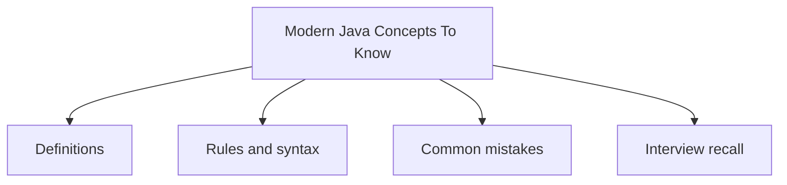

# 40 - Modern Java Concepts To Know

This topic follows the master outline in [outline.md](../outline.md). The goal is to understand each concept deeply enough to explain it, recognize it in code, and answer interview-style questions.

## Study Order

- [Var Concepts](theory/01-var-concepts.md)
- [Sequenced Collections Concepts](theory/02-sequenced-collections-concepts.md)
- [Key Terms](terms/01-key-terms.md)

## Outline Checklist

- var
- Records
- Sealed class
- Pattern matching for instanceof
- Switch expression
- Text blocks
- Enhanced NullPointerException message
- Virtual Threads
- Basic Structured Concurrency
- Pattern matching for switch
- Sequenced Collections
- String templates were once preview; currently they should not be used as a stable feature

## Anki Cards

- [Basic](anki/basic.tsv)
- [Basic Extra](anki/basic-extra.tsv)
- [Cloze](anki/cloze.tsv)
- [Code Question](anki/code-question.tsv)

## Mermaid Overview

## Reference Links

- https://dev.java/learn/
- https://openjdk.org/jeps/0
