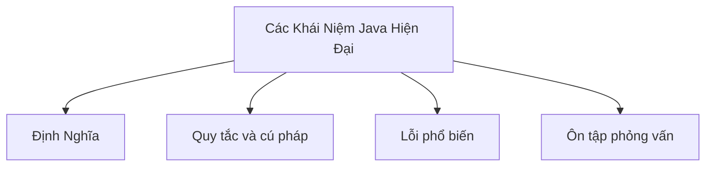

# 40 - Các Khái Niệm Java Hiện Đại Cần Biết

Chủ đề này theo dõi đề cương tổng thể trong [outline.md](../outline.md). Mục tiêu là hiểu sâu từng khái niệm để có thể giải thích, nhận ra trong code, và trả lời các câu hỏi phỏng vấn.

## Thứ Tự Học

- [Khái Niệm var](theory/01-var-concepts.md)
- [Khái Niệm Sequenced Collections](theory/02-sequenced-collections-concepts.md)
- [Thuật Ngữ Chính](terms/01-key-terms.md)

## Danh Sách Kiểm Tra Đề Cương

- var
- Records
- Sealed class
- Pattern matching for instanceof
- Switch expression
- Text blocks
- Thông báo lỗi NullPointerException được cải thiện
- Virtual Threads
- Cơ bản về Structured Concurrency
- Pattern matching for switch
- Sequenced Collections
- String templates từng là tính năng xem trước; hiện tại không nên dùng như một tính năng ổn định

## Thẻ Anki

- [Basic](anki/basic.tsv)
- [Basic Extra](anki/basic-extra.tsv)
- [Cloze](anki/cloze.tsv)
- [Code Question](anki/code-question.tsv)

## Tự Kiểm Tra

Trước khi chuyển sang chủ đề tiếp theo, hãy xác nhận bạn có thể trả lời các câu hỏi sau:
1. Tại sao `var` thực hiện suy luận kiểu tại thời điểm biên dịch (compile-time type inference) thay vì kiểu động (dynamic typing) tại runtime, và bốn vị trí mà `var` bị cấm tiết lộ điều gì về việc giữ nguyên kiểu tĩnh (static typing)?
   &rarr; Xem [Tại sao var là Suy Luận Tại Thời Điểm Biên Dịch Chứ Không Phải Kiểu Động](theory/01-var-concepts.md#why-var-is-compile-time-inference-not-dynamic-typing)
2. Tại sao Java Records bất biến (immutable) theo thiết kế, và constructor chính (canonical constructor) do trình biên dịch tự tạo thực thi tính bất biến của field như thế nào?
   &rarr; Xem [Tại sao Records Đảm Bảo Tính Bất Biến Thông Qua Code Do Trình Biên Dịch Tạo Ra](theory/01-var-concepts.md#why-records-enforce-immutability-through-compiler-generated-code)
3. Tại sao Sealed Classes (lớp kín) cho phép pattern matching toàn diện (exhaustive) trong switch expression, và đảm bảo an toàn của trình biên dịch so với hệ thống phân cấp lớp mở là gì?
   &rarr; Xem [Tại sao Sealed Classes Cho Phép Pattern Matching An Toàn Toàn Diện](theory/01-var-concepts.md#why-sealed-classes-enable-safe-exhaustive-pattern-matching)
4. Tại sao Pattern Matching for Switch yêu cầu sắp xếp các guarded pattern từ cụ thể nhất đến tổng quát nhất, và quy tắc dominance nào ngăn chặn các case không thể tiếp cận?
   &rarr; Xem [Tại sao Pattern Matching for Switch Yêu Cầu Sắp Xếp Theo Độ Cụ Thể](theory/01-var-concepts.md#why-pattern-matching-for-switch-requires-ordering-by-specificity)
5. Tại sao Virtual Threads ghim (pin) carrier thread hệ điều hành khi bị block bên trong `synchronized`, và tại sao `ReentrantLock` là giải pháp?
   &rarr; Xem [Tại sao Virtual Threads Ghim Carrier Threads trong Synchronized Blocks](theory/01-var-concepts.md#why-virtual-threads-pin-carrier-threads-in-synchronized-blocks)

## Tổng Quan Mermaid

## Liên Kết Tham Khảo

- https://dev.java/learn/
- https://openjdk.org/jeps/0
