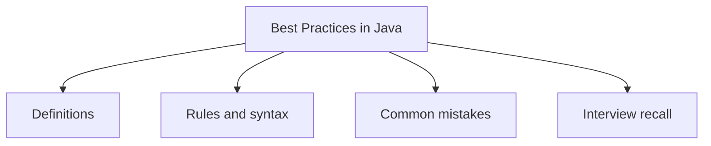

# 41 - Best Practices in Java

This topic follows the master outline in [outline.md](../outline.md). The goal is to understand each concept deeply enough to explain it, recognize it in code, and answer interview-style questions.

## Study Order

- [Name Variables Functions And Classes Clearly Concepts](theory/01-name-variables-functions-and-classes-clearly-concepts.md)
- [Do Not Swallow Exceptions Concepts](theory/02-do-not-swallow-exceptions-concepts.md)
- [Key Terms](terms/01-key-terms.md)

## Outline Checklist

- Name variables, functions, and classes clearly
- Code according to convention
- Do not overuse static
- Do not overuse inheritance
- Prefer composition over inheritance
- Override equals/hashCode correctly
- Use StringBuilder when concatenating strings many times
- Use BigDecimal for money
- Use try-with-resources
- Do not catch overly broad Exception if unnecessary
- Do not swallow exceptions
- Use interface type when declaring Collection:
- List<String> list = new ArrayList<>();
- Avoid raw type
- Avoid null when possible
- Write testable code
- Separate class/method responsibilities
- Immutability when appropriate

## Anki Cards

- [Basic](anki/basic.tsv)
- [Basic Extra](anki/basic-extra.tsv)
- [Cloze](anki/cloze.tsv)
- [Code Question](anki/code-question.tsv)

## Mermaid Overview

## Reference Links

- https://dev.java/learn/
- https://docs.oracle.com/javase/tutorial/
