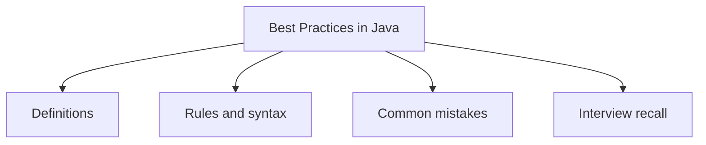

# 41 - Best Practices in Java

This topic follows the master outline in [outline.md](../outline.md). The goal is to understand each concept deeply enough to explain it, recognize it in code, and answer interview-style questions.

## Study Order

- [Name Variables Functions And Classes Clearly Concepts](theory/01-name-variables-functions-and-classes-clearly-concepts.md)
- [Do Not Swallow Exceptions Concepts](theory/02-do-not-swallow-exceptions-concepts.md)
- [Key Terms](terms/01-key-terms.md)

## Outline Checklist

- Name variables, functions, and classes clearly
- Code according to convention
- Do not overuse static
- Do not overuse inheritance
- Prefer composition over inheritance
- Override equals/hashCode correctly
- Use StringBuilder when concatenating strings many times
- Use BigDecimal for money
- Use try-with-resources
- Do not catch overly broad Exception if unnecessary
- Do not swallow exceptions
- Use interface type when declaring Collection:
- List<String> list = new ArrayList<>();
- Avoid raw type
- Avoid null when possible
- Write testable code
- Separate class/method responsibilities
- Immutability when appropriate

## Anki Cards

- [Basic](anki/basic.tsv)
- [Basic Extra](anki/basic-extra.tsv)
- [Cloze](anki/cloze.tsv)
- [Code Question](anki/code-question.tsv)

## Self-Check

Before moving to the next topic, verify that you can answer these questions:
1. Why does descriptive naming of variables, functions, and classes improve codebase maintainability, and what specific naming anti-patterns (like single-letter variables or encoded names) does it prevent?
   &rarr; See [Why Descriptive Naming Matters](theory/01-name-variables-functions-and-classes-clearly-concepts.md#why-descriptive-naming-matters)
2. Why is swallowing exceptions (e.g. empty catch blocks) considered a severe secure-coding and debugging hazard, and how does logging or propagating preserve diagnostic context?
   &rarr; See [Why Exception Swallowing Is Dangerous](theory/02-do-not-swallow-exceptions-concepts.md#why-exception-swallowing-is-dangerous)
3. Why does Java prefer custom checked exceptions for recoverable business conditions but unchecked exceptions for unrecoverable programmer errors?
   &rarr; See [Why Custom Exceptions Group by Recovery Rationale](theory/02-do-not-swallow-exceptions-concepts.md#why-custom-exceptions-group-by-recovery-rationale)
4. Why should magic numbers and hardcoded values be extracted into constants, and what is the compile-time optimization benefit of using `public static final` constants in Java?
   &rarr; See [Why Constants Prevent Magic Numbers](theory/01-name-variables-functions-and-classes-clearly-concepts.md#why-constants-prevent-magic-numbers)
5. Why is the "Return Early" or "Fail Fast" guard-clause pattern preferred over deeply nested `if-else` blocks, and how does it reduce cognitive load and stack tracking?
   &rarr; See [Why Guard Clauses Simplify Control Flow](theory/01-name-variables-functions-and-classes-clearly-concepts.md#why-guard-clauses-simplify-control-flow)

## Mermaid Overview

## Reference Links

- https://dev.java/learn/
- https://docs.oracle.com/javase/tutorial/
