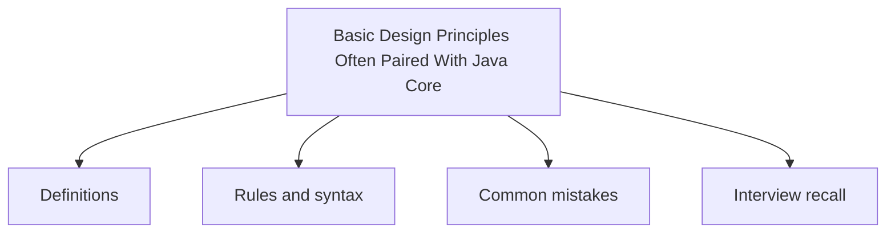

# 42 - Basic Design Principles Often Paired With Java Core

This topic follows the master outline in [outline.md](../outline.md). The goal is to understand each concept deeply enough to explain it, recognize it in code, and answer interview-style questions.

## Study Order

- [Solid Concepts](theory/01-solid-concepts.md)
- [Key Terms](terms/01-key-terms.md)

## Outline Checklist

- SOLID
- DRY
- KISS
- YAGNI
- Composition over inheritance
- Coupling
- Cohesion
- Basic Dependency Injection
- Defensive programming
- Basic Clean Code

## Anki Cards

- [Basic](anki/basic.tsv)
- [Basic Extra](anki/basic-extra.tsv)
- [Cloze](anki/cloze.tsv)
- [Code Question](anki/code-question.tsv)

## Mermaid Overview

## Self-Check

Before moving to the next topic, verify that you can answer these questions:
1. Why does the Single Responsibility Principle (SRP) dictate that a class should have "only one reason to change," and how does high cohesion reduce class coupling?
   &rarr; See [Why Single Responsibility Promotes High Cohesion](theory/01-solid-concepts.md#why-single-responsibility-promotes-high-cohesion)
2. Why does the Open/Closed Principle (OCP) advocate for extending behavior without modifying source code, and how do polymorphism and interfaces enable this design?
   &rarr; See [Why Open/Closed Principle Protects Existing Code](theory/01-solid-concepts.md#why-openclosed-principle-protects-existing-code)
3. Why does the Liskov Substitution Principle (LSP) forbid subclasses from violating the behavioral contracts of their parent classes (and how does a parent reference guarantee subtype substitutability)?
   &rarr; See [Why Liskov Substitution Principle Enforces Behavioral Contracts](theory/01-solid-concepts.md#why-liskov-substitution-principle-enforces-behavioral-contracts)
4. Why does the Interface Segregation Principle (ISP) prefer multiple small, client-specific interfaces over a single bloated interface, and how does it prevent fat interface coupling?
   &rarr; See [Why Interface Segregation Prevents Fat Interface Coupling](theory/01-solid-concepts.md#why-interface-segregation-prevents-fat-interface-coupling)
5. Why does the Dependency Inversion Principle (DIP) state that high-level modules should depend on abstractions rather than concrete implementations, and how does Dependency Injection realize this principle?
   &rarr; See [Why Dependency Inversion Decouples Modules](theory/01-solid-concepts.md#why-dependency-inversion-decouples-modules)

## Reference Links

- https://docs.oracle.com/javase/tutorial/java/concepts/
- https://docs.oracle.com/javase/tutorial/java/concepts/
