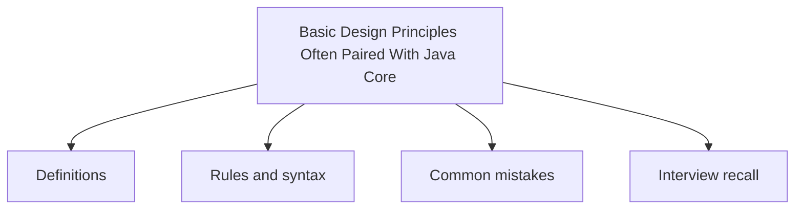

# 42 - Basic Design Principles Often Paired With Java Core

This topic follows the master outline in [outline.md](../outline.md). The goal is to understand each concept deeply enough to explain it, recognize it in code, and answer interview-style questions.

## Study Order

- [Solid Concepts](theory/01-solid-concepts.md)
- [Key Terms](terms/01-key-terms.md)

## Outline Checklist

- SOLID
- DRY
- KISS
- YAGNI
- Composition over inheritance
- Coupling
- Cohesion
- Basic Dependency Injection
- Defensive programming
- Basic Clean Code

## Anki Cards

- [Basic](anki/basic.tsv)
- [Basic Extra](anki/basic-extra.tsv)
- [Cloze](anki/cloze.tsv)
- [Code Question](anki/code-question.tsv)

## Mermaid Overview

## Reference Links

- https://docs.oracle.com/javase/tutorial/java/concepts/
- https://docs.oracle.com/javase/tutorial/java/concepts/
