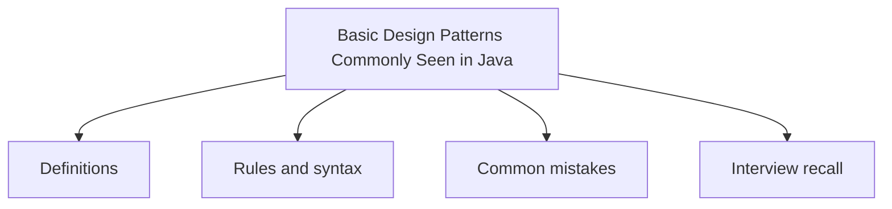

# 43 - Basic Design Patterns Commonly Seen in Java

This topic follows the master outline in [outline.md](../outline.md). The goal is to understand each concept deeply enough to explain it, recognize it in code, and answer interview-style questions.

## Study Order

- [Singleton Concepts](theory/01-singleton-concepts.md)
- [Observer Concepts](theory/02-observer-concepts.md)
- [Key Terms](terms/01-key-terms.md)

## Outline Checklist

- Singleton
- Factory Method
- Abstract Factory
- Builder
- Prototype
- Adapter
- Decorator
- Facade
- Proxy
- Strategy
- Observer
- Template Method
- Command
- Iterator
- State
- MVC
- DAO
- DTO
- Repository
- Service Layer

## Anki Cards

- [Basic](anki/basic.tsv)
- [Basic Extra](anki/basic-extra.tsv)
- [Cloze](anki/cloze.tsv)
- [Code Question](anki/code-question.tsv)

## Self-Check

Before moving to the next topic, verify that you can answer these questions:
1. Why is a Singleton pattern used to restrict a class to a single instance, and how does the double-checked locking mechanism (using `volatile`) ensure thread-safe lazy initialization?
   &rarr; See [Why Double-Checked Locking Ensures Thread-Safe Singleton](theory/01-singleton-concepts.md#why-double-checked-locking-ensures-thread-safe-singleton)
2. Why is the Bill Pugh Singleton implementation (using an inner static helper class) preferred over synchronized lazy instantiation, and how does JVM class loading guarantee thread safety?
   &rarr; See [Why Bill Pugh Singleton Achieves Thread-Safe Lazy Initialization](theory/01-singleton-concepts.md#why-bill-pugh-singleton-achieves-thread-safe-lazy-initialization)
3. Why does the Observer pattern define a one-to-many dependency between objects, and how does registering/notifying observers decouple the subject from concrete observers?
   &rarr; See [Why the Observer Pattern Decouples Subjects from Observers](theory/02-observer-concepts.md#why-the-observer-pattern-decouples-subjects-from-observers)
4. Why is the Factory Method pattern preferred over direct constructor instantiation (using `new`), and how does it defer instantiation decisions to subclasses?
   &rarr; See [Why Factory Method Defers Object Instantiation](theory/01-singleton-concepts.md#why-factory-method-defers-object-instantiation)
5. Why is the Builder pattern used to construct complex objects, and how does it solve the telescoping constructor anti-pattern?
   &rarr; See [Why the Builder Pattern Replaces Telescoping Constructors](theory/01-singleton-concepts.md#why-the-builder-pattern-replaces-telescoping-constructors)

## Mermaid Overview

## Reference Links

- https://refactoring.guru/design-patterns
- https://docs.oracle.com/javase/tutorial/java/concepts/
