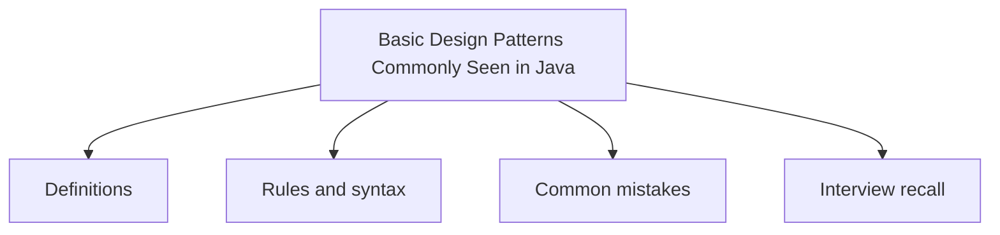

# 43 - Basic Design Patterns Commonly Seen in Java

This topic follows the master outline in [outline.md](../outline.md). The goal is to understand each concept deeply enough to explain it, recognize it in code, and answer interview-style questions.

## Study Order

- [Singleton Concepts](theory/01-singleton-concepts.md)
- [Observer Concepts](theory/02-observer-concepts.md)
- [Key Terms](terms/01-key-terms.md)

## Outline Checklist

- Singleton
- Factory Method
- Abstract Factory
- Builder
- Prototype
- Adapter
- Decorator
- Facade
- Proxy
- Strategy
- Observer
- Template Method
- Command
- Iterator
- State
- MVC
- DAO
- DTO
- Repository
- Service Layer

## Anki Cards

- [Basic](anki/basic.tsv)
- [Basic Extra](anki/basic-extra.tsv)
- [Cloze](anki/cloze.tsv)
- [Code Question](anki/code-question.tsv)

## Mermaid Overview

## Reference Links

- https://refactoring.guru/design-patterns
- https://docs.oracle.com/javase/tutorial/java/concepts/
