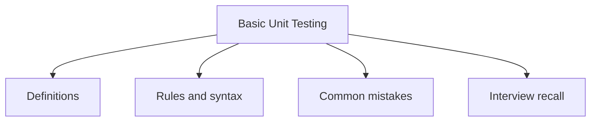

# 44 - Basic Unit Testing

This topic follows the master outline in [outline.md](../outline.md). The goal is to understand each concept deeply enough to explain it, recognize it in code, and answer interview-style questions.

## Study Order

- [Junit Concepts](theory/01-junit-concepts.md)
- [Test Exception Concepts](theory/02-test-exception-concepts.md)
- [Key Terms](terms/01-key-terms.md)

## Outline Checklist

- JUnit
- Test case
- Assertion
- @Test
- @BeforeEach
- @AfterEach
- @BeforeAll
- @AfterAll
- Basic Mockito
- Mock object
- Test exception
- Test private logic indirectly
- Basic code coverage

## Anki Cards

- [Basic](anki/basic.tsv)
- [Basic Extra](anki/basic-extra.tsv)
- [Cloze](anki/cloze.tsv)
- [Code Question](anki/code-question.tsv)

## Self-Check

Before moving to the next topic, verify that you can answer these questions:
1. Why does Mockito mock dependencies rather than instantiating them, and what test isolation problem does this solve?
   &rarr; See [Why Mocking Isolates the Unit Under Test](theory/01-junit-concepts.md#why-mocking-isolates-the-unit-under-test)
2. Why does JUnit 5 create a new test class instance per `@Test` method by default, and how does `@TestInstance(PER_CLASS)` change this?
   &rarr; See [Why JUnit Creates a New Instance Per Test Method](theory/01-junit-concepts.md#why-junit-creates-a-new-instance-per-test-method)
3. Why should private methods never be tested directly via reflection, and when does a private method that is "hard to test" signal a design problem?
   &rarr; See [Why Private Methods Should Be Tested Indirectly Through the Public API](theory/02-test-exception-concepts.md#why-private-methods-should-be-tested-indirectly-through-the-public-api)
4. Why does `assertThrows` return the thrown exception, and what specific assertion bug does the old try-catch pattern introduce?
   &rarr; See [Why assertThrows Is Safer Than Try-Catch for Exception Testing](theory/02-test-exception-concepts.md#why-assertthrows-is-safer-than-try-catch-for-exception-testing)
5. Why does 100% code coverage not guarantee test quality, and what specific assertion anti-pattern produces high coverage with zero bug-catching value?
   &rarr; See [Why Code Coverage Is a Necessary but Insufficient Quality Metric](theory/02-test-exception-concepts.md#why-code-coverage-is-a-necessary-but-insufficient-quality-metric)

## Mermaid Overview

## Reference Links

- https://junit.org/junit5/docs/current/user-guide/
