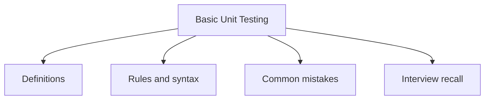

# 44 - Basic Unit Testing

This topic follows the master outline in [outline.md](../outline.md). The goal is to understand each concept deeply enough to explain it, recognize it in code, and answer interview-style questions.

## Study Order

- [Junit Concepts](theory/01-junit-concepts.md)
- [Test Exception Concepts](theory/02-test-exception-concepts.md)
- [Key Terms](terms/01-key-terms.md)

## Outline Checklist

- JUnit
- Test case
- Assertion
- @Test
- @BeforeEach
- @AfterEach
- @BeforeAll
- @AfterAll
- Basic Mockito
- Mock object
- Test exception
- Test private logic indirectly
- Basic code coverage

## Anki Cards

- [Basic](anki/basic.tsv)
- [Basic Extra](anki/basic-extra.tsv)
- [Cloze](anki/cloze.tsv)
- [Code Question](anki/code-question.tsv)

## Mermaid Overview

## Reference Links

- https://junit.org/junit5/docs/current/user-guide/
