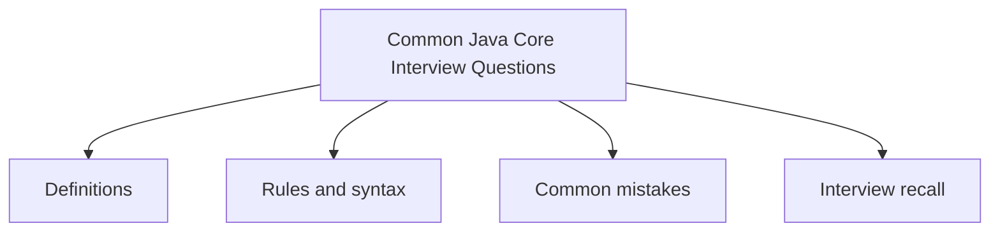

# 45 - Common Java Core Interview Questions

This topic follows the master outline in [outline.md](../outline.md). The goal is to understand each concept deeply enough to explain it, recognize it in code, and answer interview-style questions.

## Study Order

- [How Are Jvm Jdk And Jre Different Concepts](theory/01-how-are-jvm-jdk-and-jre-different-concepts.md)
- [How Does Hashset Remove Duplicates Concepts](theory/02-how-does-hashset-remove-duplicates-concepts.md)
- [How Are Comparable And Comparator Different Concepts](theory/03-how-are-comparable-and-comparator-different-concepts.md)
- [How Are Map And Flatmap Different Concepts](theory/04-how-are-map-and-flatmap-different-concepts.md)
- [Key Terms](terms/01-key-terms.md)

## Outline Checklist

- How are JVM, JDK, and JRE different?
- Does Java pass references?
- What is the difference between == and .equals()?
- Why is String immutable?
- How are String, StringBuilder, and StringBuffer different?
- How does HashMap work?
- What improvements did HashMap have in Java 8?
- How are ArrayList and LinkedList different?
- How does HashSet remove duplicates?
- How are final, finally, and finalize different?
- How are checked and unchecked exceptions different?
- How are abstract class and interface different?
- How are overload and override different?
- Can static methods be overridden?
- Are constructors inherited?
- How are this and super different?
- How are Comparable and Comparator different?
- How are fail-fast and fail-safe iterators different?
- How are volatile and synchronized different?
- What is deadlock?
- How are Thread start() and run() different?
- How are sleep() and wait() different?
- How are notify() and notifyAll() different?
- Is Stream API lazy?
- How are map and flatMap different?
- How are orElse and orElseGet different?
- How are HashMap, Hashtable, and ConcurrentHashMap different?
- Why must overriding equals() also override hashCode()?
- How does Garbage Collection work?
- How are Stack and Heap different?

## Anki Cards

- [Basic](anki/basic.tsv)
- [Basic Extra](anki/basic-extra.tsv)
- [Cloze](anki/cloze.tsv)
- [Code Question](anki/code-question.tsv)

## Mermaid Overview

## Reference Links

- https://docs.oracle.com/javase/tutorial/
- https://dev.java/learn/
