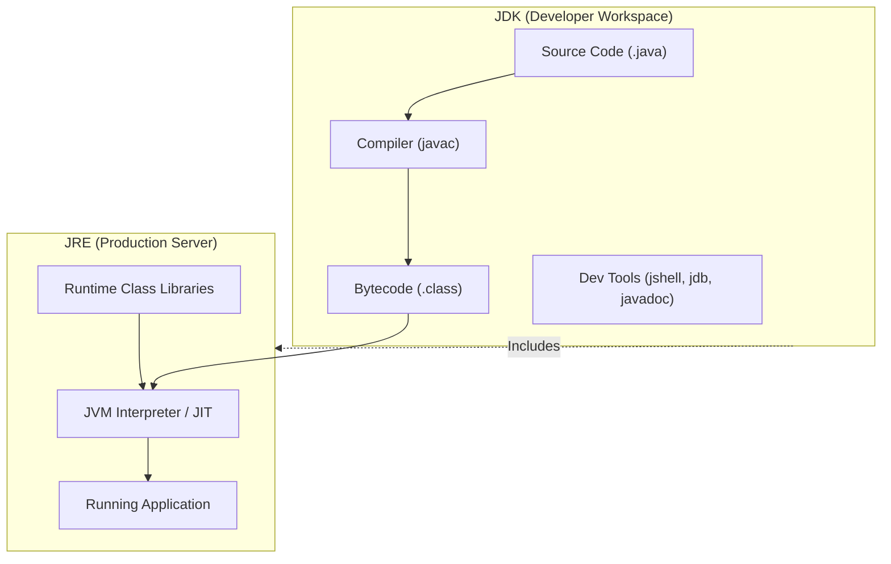
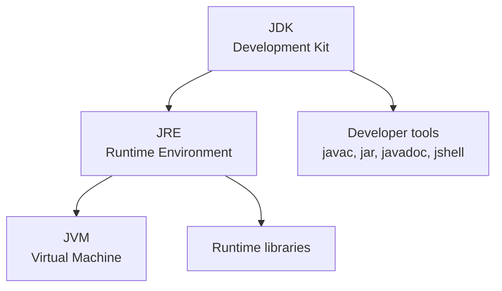

# JVM, JRE, And JDK

JVM, JRE, and JDK are three of the most important terms in Java. Many beginners memorize the names but do not understand the relationship. The simplest way to understand them is to ask:

```text
Who runs Java?
Who provides the runtime environment?
Who provides the developer tools?
```

## JVM

JVM means Java Virtual Machine.

The JVM is responsible for executing Java bytecode. It reads `.class` files and runs the instructions inside them.

The JVM also handles:

- Class loading.
- Bytecode verification.
- Runtime memory areas.
- Garbage Collection.
- JIT compilation.
- Thread management.

## JRE

JRE means Java Runtime Environment.

The JRE contains what is needed to run Java programs:

- A JVM.
- Runtime libraries.
- Supporting files.

If you only want to run a Java application, a JRE-like runtime may be enough.

## JDK

JDK means Java Development Kit.

The JDK contains what is needed to develop Java programs:

- The JRE/runtime components.
- The Java compiler `javac`.
- Tools such as `jar`, `javadoc`, and `jshell`.

If you want to write and compile Java code, you need a JDK.

## Why Development Needs the JDK But Production Needs Only JRE

Developing Java software requires transforming human-readable source code into binary bytecode, a process performed by the Java compiler (`javac`). The JDK provides this compilation toolchain, along with other development utilities (like `jar` for packaging, and `jdb` for debugging), which are not part of the standard runtime. In contrast, running an already-compiled application only requires loading and executing the bytecode, which is the job of the JRE's JVM and standard runtime libraries. Providing compiler tools in a production environment is unnecessary, increases the disk footprint, and exposes a security vulnerability by allowing potential attackers to compile and run arbitrary code on the server. Therefore, modern deployment best practices (such as Docker images) use thin runtime images containing only a JRE (or a custom runtime generated by `jlink`) to run bytecode safely and efficiently.

### Mental Model: The Kitchen vs. The Dining Table
Think of the **JDK** as a professional restaurant kitchen, containing the chef, ovens, stoves, and recipe books needed to prepare the meal (**build the application**). Think of the **JRE** as the restaurant dining table where the customer consumes the food (**runs the application**). To eat the meal, the customer does not need a stove or a chef's knife; they only need the plate and cutlery (**JVM and standard libraries**).



### Code Example: JRE vs. JDK Command Behaviors
If you attempt to compile a source file on a machine with only the JRE installed, the OS will fail to find `javac`, whereas running bytecode with `java` succeeds:

```bash
# On a machine with only the JRE installed:
$ javac HelloWorld.java
# Output: bash: javac: command not found (The compiler is missing)

# On a machine with the JDK installed:
$ javac HelloWorld.java
# Output: (Compiles successfully, producing HelloWorld.class)

$ java HelloWorld
# Output: Hello Java (Executes successfully using the JVM runtime)
```

### Cause-Effect Chain
Developer writes `.java` source code $\rightarrow$ JDK's `javac` compiles it into `.class` bytecode $\rightarrow$ Production server only receives `.class` bytecode $\rightarrow$ JRE's `java` launcher launches JVM to execute the bytecode $\rightarrow$ Server runs the application securely without compiler overhead.

## Relationship



Short memory rule:

```text
JVM runs bytecode.
JRE runs Java applications.
JDK builds Java applications.
```

## Example Commands

Check the installed Java runtime:

```bash
java -version
```

Check the compiler:

```bash
javac -version
```

Compile Java source:

```bash
javac HelloWorld.java
```

Run the compiled class:

```bash
java HelloWorld
```

## Interview-Style Explanation

If asked to explain JVM, JRE, and JDK:

> The JVM executes Java bytecode. The JRE provides the JVM and runtime libraries needed to run Java applications. The JDK includes the JRE plus development tools such as the Java compiler, so it is used to build Java applications.

## Common Mistakes

- Saying the JDK and JVM are the same thing.
- Thinking `javac` runs Java programs. It compiles source code.
- Thinking `java` compiles source code. It runs compiled classes.
- Installing only a runtime and then wondering why `javac` is missing.

## Reference Links

- https://docs.oracle.com/en/java/javase/21/docs/specs/man/javac.html (javac Command Reference)
- https://docs.oracle.com/en/java/javase/21/docs/specs/man/java.html (java Command Reference)
