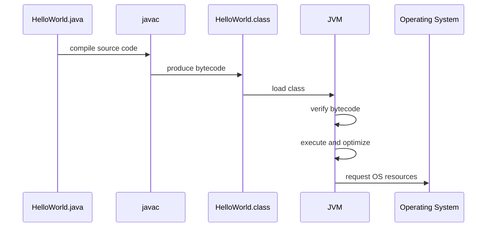
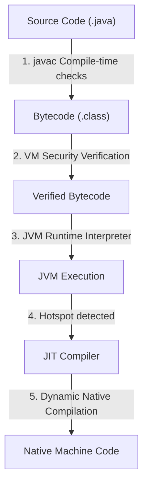
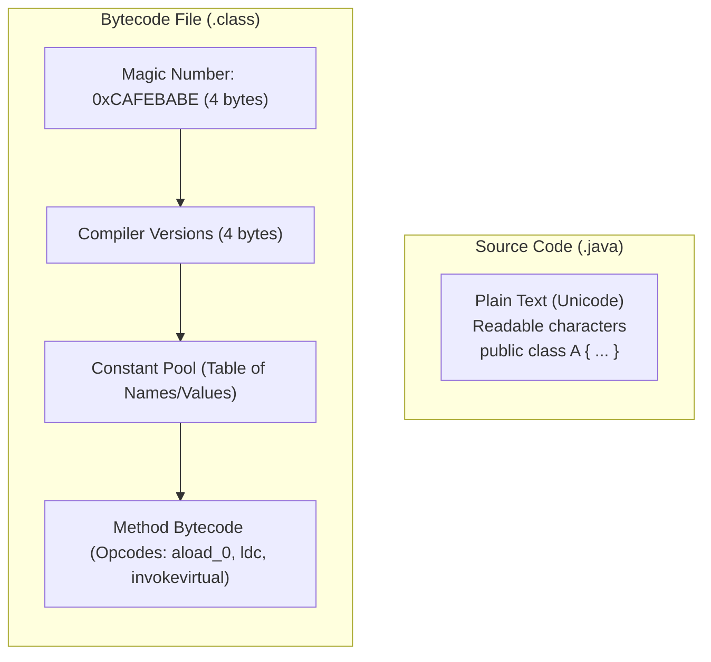
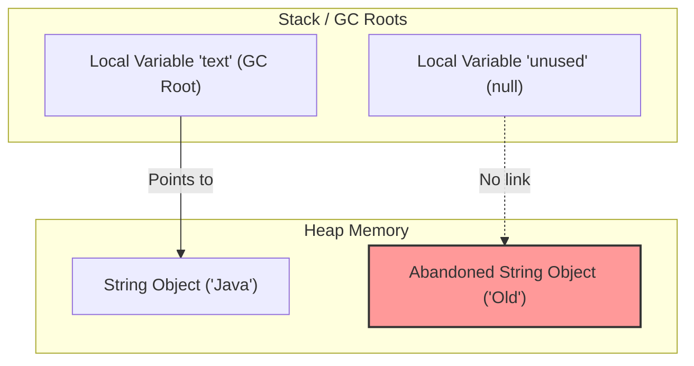

# Compile And Runtime Flow

Java has two major phases:

- Compile time.
- Runtime.

Understanding the difference helps you understand compiler errors, runtime exceptions, bytecode, and the role of the JVM.

## Compile Time

Compile time is when source code is checked and translated by the compiler.

Source file:

```java
public class HelloWorld {
    public static void main(String[] args) {
        System.out.println("Hello Java");
    }
}
```

Compile command:

```bash
javac HelloWorld.java
```

Output:

```text
HelloWorld.class
```

The `.class` file contains bytecode, not human-friendly Java source code.

## Runtime

Runtime is when the compiled program actually runs.

Run command:

```bash
java HelloWorld
```

At runtime, the JVM loads the class, verifies bytecode, executes instructions, manages memory, and may optimize code using JIT compilation.

## Detailed Flow



## Why Java Combines Compilation and Virtual Execution

A purely compiled language like C compiles directly to native, host-specific machine code. While fast, this lacks platform portability and makes run-time security verification very difficult. A purely interpreted language like JavaScript or Python reads and runs source code line-by-line. While highly portable and flexible, this is computationally slow because syntax analysis and type checking must happen at execution time. Java balances both approaches. The compiler (`javac`) handles parsing, syntax checks, type safety, and generation of a standardized bytecode. This compile-time phase ensures early bug detection and produces a compact format that is easy to distribute. The virtual machine (JVM) handles runtime translation from bytecode to the actual platform-specific CPU instructions (like x86 or ARM). Furthermore, because execution is virtualized, the JVM's JIT compiler can perform dynamic profile-guided optimization—analyzing execution hotspots and compiling them to native machine code on-the-fly, achieving near-native performance while preserving absolute platform independence.

### Mental Model: The Architect and the Construction Crew
Think of the compiler (`javac`) as the Architect who checks the drawings for structural integrity, translates the design into a standardized blueprint (**Bytecode**), and detects errors early. Think of the JVM as the local construction crew on site. They take the standard blueprint and build the structure using local materials and tools available in their specific region (**native OS instructions**), adjusting the construction methods dynamically to optimize performance.



### Code Example: Compile-Time Safety vs. Runtime Error
To demonstrate why compile-time verification is distinct from runtime execution, consider code that compiles perfectly but fails at runtime due to division by zero:

```java
public class DivDemo {
    public static void main(String[] args) {
        int a = 10;
        int b = 0; 
        
        // This line compiles without errors because types are valid.
        // However, the JVM throws an ArithmeticException at runtime.
        int result = a / b; 
        System.out.println(result);
    }
}
/* 
Compile command: javac DivDemo.java  (Compiles cleanly, exit code 0)
Run command: java DivDemo
Runtime Output:
Exception in thread "main" java.lang.ArithmeticException: / by zero
	at DivDemo.main(DivDemo.java:8)
*/
```

### Cause-Effect Chain
Compiler translates `.java` $\rightarrow$ statically verifies syntax and types $\rightarrow$ produces platform-independent bytecode $\rightarrow$ JVM loads bytecode and verifies memory safety $\rightarrow$ JIT compiler compiles hotspots to platform-dependent native machine code $\rightarrow$ Application achieves high speed with sandboxed safety.

## Bytecode

Bytecode is an intermediate representation of Java code. It is lower-level than source code but not the same as native machine code.

Why bytecode matters:

- It makes cross-platform execution possible.
- It allows the JVM to verify code before running it.
- It allows the JVM to optimize code at runtime.

## Source Code vs. Bytecode: Under the Hood

At the storage level, Java source code (`.java` files) is stored as human-readable plain text encoded in Unicode (specifically UTF-8 or UTF-16). In contrast, bytecode (`.class` files) is a highly structured binary format optimized for fast loading and execution by the virtual machine. Every valid `.class` file begins with the 4-byte magic number `0xCAFEBABE` (hexadecimal), which the JVM classloader uses to immediately verify that the file is a valid compiled class. Following this magic number are the major and minor version numbers, the Constant Pool (a structured table containing all literal strings, variable names, class names, and reference signatures), and finally the JVM instruction set (opcodes). While source code uses human-friendly syntax like `System.out.println("Hello")`, the compiled bytecode contains stack-based instructions (such as `ldc` for loading constants, `getstatic` to fetch static fields, and `invokevirtual` to invoke methods), making it extremely compact and easy for the JVM to interpret or compile to machine code.

### Mental Model: The Blueprint vs. The Barcoded Parts List
Source code is like a hand-drawn architectural blueprint with handwritten labels and footnotes. Bytecode is like a barcode-labeled manifest of pre-fabricated, standardized building blocks. The building construction engine (JVM) scans the barcodes and connects the components directly, without needing to parse the architect's handwriting.



### Code Example: Disassembling Source Code to Bytecode
To demonstrate the format difference, here is a simple Java statement alongside the stack-based JVM instructions produced when you disassemble the compiled class using the JDK utility `javap -c`:

```java
// Java Source Code statement inside main():
int sum = 5 + 10;
System.out.println(sum);

/* 
Corresponding JVM bytecode (obtained via javap -c ClassName):
 0: iconst_5       // Push integer constant 5 onto the operand stack
 1: istore_1       // Pop 5 and store it in local variable 1 (sum)
 2: bipush        10 // Push integer constant 10 onto the operand stack
 4: istore_1       // (Note: Compiler optimizes 5 + 10 to iconst_15 directly)
                   // The instruction below demonstrates static printing:
 5: getstatic     #2                  // Field java/lang/System.out:Ljava/io/PrintStream;
 8: iload_1                           // Load local variable 1 (sum) onto stack
 9: invokevirtual #3                  // Method java/io/PrintStream.println:(I)V
12: return
*/
```

### Cause-Effect Chain
Developer writes readable Unicode `.java` text $\rightarrow$ `javac` parses syntax and compiles it into structured binary `.class` $\rightarrow$ JVM classloader verifies the `0xCAFEBABE` header $\rightarrow$ JVM reads the compact stack-based instructions from the file $\rightarrow$ JVM executes instructions with high efficiency.

## JIT Compilation

JIT means Just-In-Time.

The JVM can observe which parts of the program are executed often. These frequently used sections can be compiled into native machine code while the program is running.

This is why Java performance can improve after warm-up in long-running applications.

## Garbage Collection

Java creates many objects on the heap. When objects are no longer reachable, Garbage Collection can reclaim their memory.

Example:

```java
String text = new String("Java");
text = null;
```

After `text = null`, the original `String` object may become unreachable if no other reference points to it. Eventually, the Garbage Collector may reclaim it.

## What Garbage Collection Reclaims and How it Detects Garbage

In Java, memory is divided into different regions, primarily the Stack and the Heap. Local primitive variables and object reference variables reside on the Stack, while all dynamically created objects are allocated on the Heap. The JVM's Garbage Collector (GC) only manages and reclaims memory allocated on the Heap; it does not collect primitives or references on the Stack, which are automatically deallocated when their containing method frame exits. 

To identify which objects can be safely reclaimed, the GC uses a mechanism called reachability analysis. It starts from a set of known active references called **GC Roots** (which include active local variables on the Stack, active threads, and static variables loaded in Metaspace). The GC traces references starting from these roots; any object on the Heap that cannot be reached through a chain of references starting from a GC Root is deemed unreachable. Unreachable objects are marked as garbage and their memory is reclaimed during subsequent GC cycles.

### Mental Model: The Balloon and the Anchor
Think of Heap objects as floating balloons. Think of reference variables on the Stack as hands holding strings tied to those balloons. A **GC Root** is like a heavy anchor firmly secured to the ground. As long as a balloon is held by a hand (stack reference) or tied to an anchor (GC Root), it is "reachable" and remains. If you set a reference to `null` (`text = null`), it is like letting go of the string. The balloon floats away. Any balloon that has no connection to the ground (unreachable heap objects) will be collected and swept away by the Garbage Collector.



### Code Example: Making Heap Objects Eligible for GC
Here is a demonstration of how reference updates break the reachability chain and make objects eligible for Garbage Collection:

```java
public class GCDemo {
    public static void main(String[] args) {
        // 1. Allocate string on heap. 'text' reference on Stack points to it.
        String text = new String("Java GC Demo"); 
        
        // 2. Set reference to null. The heap object becomes unreachable from GC Roots.
        text = null; 
        
        // 3. Request GC run (JVM does not guarantee immediate execution)
        System.gc(); 
        System.out.println("GC requested."); // Output: GC requested.
    }
}
```

### Cause-Effect Chain
Heap object loses all reference pathways back to active GC Roots $\rightarrow$ Reachability analysis marks the object as unreachable $\rightarrow$ Garbage Collector scans heap and identifies the unreachable object $\rightarrow$ Memory occupied by the object is reclaimed $\rightarrow$ Heap memory is freed for future allocations.

## Compile-Time Error vs Runtime Error

Compile-time error:

```java
int age = "eighteen";
```

The compiler rejects this because a `String` cannot be assigned to an `int`.

Runtime error:

```java
int result = 10 / 0;
```

This compiles, but it fails when the program runs.

## Common Mistakes

- Thinking `.class` files are source code.
- Thinking bytecode is the same as native machine code.
- Thinking all errors are compile-time errors.
- Forgetting that runtime behavior can depend on input.

## Reference Links

- https://docs.oracle.com/javase/specs/jvms/se21/html/jvms-2.html#jvms-2.5 (Run-Time Data Areas)
- https://docs.oracle.com/en/java/javase/21/gctuning/garbage-collector-implementation.html (Garbage Collector Implementation)
- https://docs.oracle.com/javase/specs/jvms/se21/html/jvms-4.html (The class File Format)
