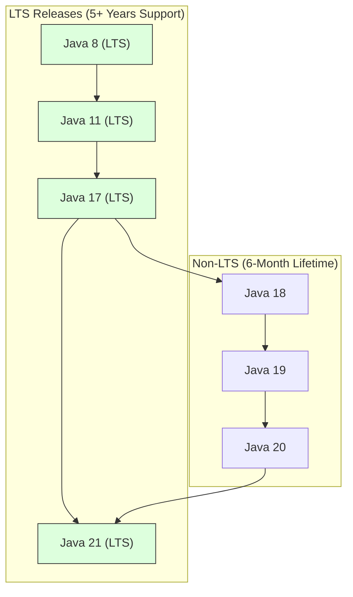

# Java Editions And Versions

Java has several editions and many versions. You do not need to memorize every release, but you should understand the names that appear often.

## Java SE

Java SE means Java Standard Edition.

It contains the core language and standard APIs:

- Basic syntax.
- Object-oriented programming.
- Collections.
- Exceptions.
- IO/NIO.
- Date and Time API.
- Concurrency utilities.

Java Core mostly means Java SE fundamentals.

## Jakarta EE

Jakarta EE is the enterprise edition ecosystem for building large server-side applications.

It includes APIs for:

- Web applications.
- Dependency injection.
- Persistence.
- Transactions.
- Messaging.

Older resources may call it Java EE. The name changed to Jakarta EE.

## Java ME

Java ME means Java Micro Edition.

It was designed for smaller or embedded devices. It is much less relevant for typical backend learning today.

## Important Versions

### Java 8

Java 8 is important because it introduced:

- Lambda expressions.
- Functional interfaces.
- Stream API.
- New Date and Time API.

Many older enterprise projects still contain Java 8-style code.

### Java 11

Java 11 is an LTS release. LTS means Long-Term Support.

It is common in production environments and introduced/standardized useful APIs such as the modern `HttpClient`.

### Java 17

Java 17 is another LTS release and is widely used in modern backend projects.

It includes many language and JVM improvements compared with Java 8 and Java 11.

### Java 21

Java 21 is an LTS release known for modern features such as virtual threads.

Virtual threads are important for scalable concurrent server applications.

## Why Backend Projects Standardize on LTS Versions Like Java 17 and 21

Enterprise backend applications prioritize stability, predictability, and long-term security maintenance. Oracle and the Java community address this through the Long-Term Support (LTS) release model, where designated versions (like Java 8, 11, 17, and 21) receive active security updates, bug fixes, and commercial support for many years. In contrast, non-LTS versions released every six months (such as Java 18, 19, or 20) reach end-of-life as soon as the next version is released, making them too risky for production use due to lack of security patches.

Backend projects prefer Java 17 and 21 because they introduce transformative developer features and runtime optimizations that directly improve performance and maintainability:
- **Java 17 features**: Introduced **Records** (concise immutable data-carrier classes), **Sealed Classes** (fine-grained inheritance control), and pattern matching improvements.
- **Java 21 features**: Introduced **Virtual Threads** (Project Loom, which drastically improve server concurrency by running millions of lightweight threads on a small pool of carrier threads), pattern matching for switch statements, and record patterns.
- **Performance**: Significant Garbage Collection optimizations (ZGC and G1GC improvements) allow backend systems to handle higher loads with lower memory overhead and reduced pause times.

### Mental Model: The Train Schedule vs. The Local Shuttle
Think of non-LTS releases as local shuttles operating on a temporary route; they run frequently, but you must keep changing buses (upgrading versions) every 6 months to stay on the path. Think of LTS releases as express trains running on main routes. Once you board (deploy Java 17 or 21), you can stay on that train safely for years without disrupting your journey.



### Code Example: Verbose Java 8 vs. Modern Java 17/21 Records & Text Blocks
Here is a comparison showing how modern Java features reduce boilerplate for typical data entities and multi-line strings:

```java
public class ModernJavaDemo {
    // 1. A Record (Java 14+) automatically generates constructor, getters, equals, hashCode, and toString.
    public record User(String username, int age) {}

    public static void main(String[] args) {
        User user = new User("Alice", 30);
        System.out.println(user.username()); // Output: Alice
        System.out.println(user); // Output: User[username=Alice, age=30]

        // 2. Text Blocks (Java 15+) simplify multi-line string definitions
        String json = """
                {
                    "user": "Alice",
                    "status": "active"
                }
                """;
        System.out.println(json.contains("active")); // Output: true
    }
}
```

### Cause-Effect Chain
Backend project migrates to LTS version (e.g. Java 21) $\rightarrow$ Project obtains long-term security patch guarantees and stability $\rightarrow$ Developers use modern language features (Records, Text Blocks, Virtual Threads) $\rightarrow$ Application achieves higher performance and concurrency with lower memory footprint and cleaner code.

## Version Selection For Learning

For learning Java Core today, Java 17 or Java 21 is a good default.

You should still recognize Java 8 features because many interviews and legacy projects mention them.

## Common Mistakes

- Thinking Java SE and Java EE/Jakarta EE are the same.
- Learning only Java 8 and ignoring modern Java.
- Learning only modern syntax without understanding Java Core fundamentals.

## Reference Links

- https://www.oracle.com/java/technologies/java-se-support-roadmap.html (Oracle Java SE Support Roadmap)
- https://openjdk.org/jeps/444 (JEP 444: Virtual Threads)
- https://openjdk.org/jeps/395 (JEP 395: Records)
