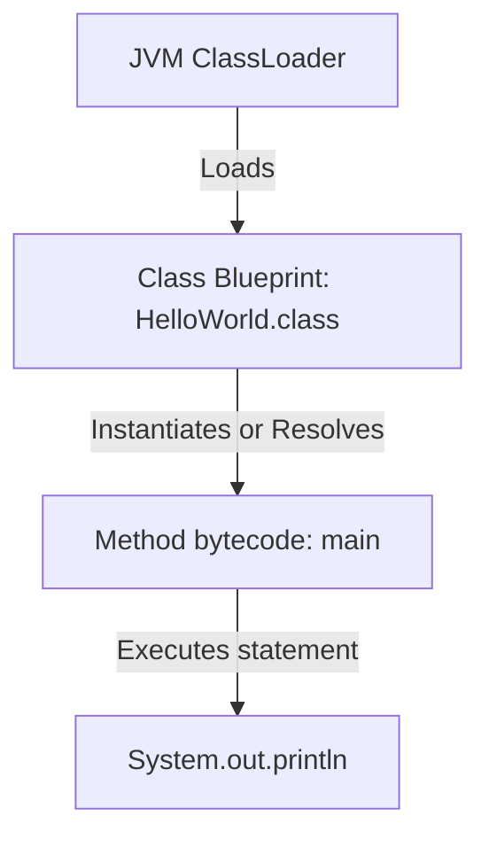
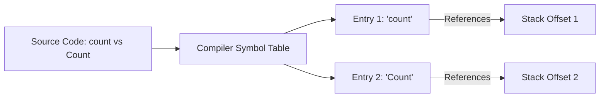

# Program Anatomy

A Java program is usually organized around classes. Even a very small program normally has at least one class.

## Minimal Example

```java
public class HelloWorld {
    public static void main(String[] args) {
        System.out.println("Hello Java");
    }
}
```

This program has:

- A class declaration: `public class HelloWorld`.
- A method declaration: `public static void main(String[] args)`.
- A statement: `System.out.println("Hello Java");`.
- Blocks marked by `{}`.

## Why All Code Resides in Classes

Java is designed from the ground up as an object-oriented programming language. In Java, classes serve as the fundamental unit of source code, modularity, and compilation. The Java Virtual Machine (JVM) loads and executes bytecode on a class-by-class basis. Because Java has no concept of global functions or free-floating statements outside class boundaries, all executable instructions must reside within a class definition. This design enforces encapsulation and provides a predictable structure for class loading.

### Mental Model: Class Blueprint
An analogy is a blueprint for a house: you cannot have a working electrical outlet (a statement/expression) floating in empty space; it must be installed inside a wall of a constructed building (a class).



### Code Example
```java
// HelloWorld.java
public class HelloWorld { // Enclosing class structure is mandatory
    public static void main(String[] args) {
        System.out.println("Hello from a class-bound method!");
        // Output: Hello from a class-bound method!
    }
}
```

### Cause-Effect Chain
`Code written inside class` &rarr; `Compiler creates structured .class files` &rarr; `JVM ClassLoader loads/verifies class types` &rarr; `Execution safely runs within OOP boundaries`.

## File Name And Public Class Name

If a top-level class is `public`, the file name must match the class name.

Correct:

```text
HelloWorld.java
public class HelloWorld
```

Incorrect:

```text
Main.java
public class HelloWorld
```

The incorrect version causes a compile-time error because the public class name and file name do not match.

## Statements

A statement is an instruction that the program executes.

Example:

```java
System.out.println("Hello Java");
```

Most Java statements end with a semicolon.

Common beginner error:

```java
System.out.println("Hello Java")
```

This fails because the semicolon is missing.

## Blocks

A block is a group of code between `{` and `}`.

```java
if (true) {
    System.out.println("Inside block");
}
```

Blocks matter because they define structure and often affect scope.

## Case Sensitivity

Java is case-sensitive.

These are different names:

```java
Student
student
STUDENT
```

This matters for class names, variable names, method names, and keywords.

## Why Java is Case-Sensitive

Case sensitivity in Java is a core language design decision that ensures absolute precision during compilation and execution. By treating identifiers with different capitalization as distinct, the compiler can maintain unambiguous symbolic references. At compile time, every identifier is stored in a case-sensitive symbol table. During code generation, these identifiers are written as UTF-8 string constants in the compiled `.class` file's constant pool, which the JVM resolves using exact, case-sensitive character-by-character comparisons.

### Mental Model: Symbol Table
Think of case-sensitive identifiers like passwords on a website: "P@ssword" and "p@ssword" represent entirely different credentials. In the same way, the compiler records distinct names on different pages of its symbol directory.



### Code Example
```java
public class CaseDemo {
    public static void main(String[] args) {
        int age = 21;
        int Age = 35;
        System.out.println(age); // 21
        System.out.println(Age); // 35
    }
}
```

### Cause-Effect Chain
`Different capitalization used` &rarr; `Compiler registers separate symbols in the symbol table` &rarr; `Bytecode contains distinct UTF-8 constant pool references` &rarr; `JVM runtime executes instructions on separate variables without shadowing or override errors`.

## Whitespace

Java usually ignores extra spaces and line breaks between tokens, but formatting still matters for readability.

These compile similarly:

```java
int x = 10;
```

```java
int
x
=
10
;
```

The second style is legal in many cases but terrible to read. Good formatting makes code maintainable.

## Common Mistakes

- Forgetting semicolons.
- Using the wrong capitalization.
- Putting code outside a class.
- Mismatching `{` and `}`.
- Naming the file differently from the public class.

### Common Mistake: Missing Semicolon

```java
// Compile error — semicolon missing
public class Bad {
    public static void main(String[] args) {
        System.out.println("Hello")   // ← error: ';' expected
    }
}
```

```java
// Correct
public class Good {
    public static void main(String[] args) {
        System.out.println("Hello");
    }
}
```

### Common Mistake: File Name Mismatch

```java
// File is named: Main.java
// Compile error: class HelloWorld is public, should be declared in a file named HelloWorld.java
public class HelloWorld {
    public static void main(String[] args) {
        System.out.println("Hi");
    }
}
```

Fix: rename the file to `HelloWorld.java`.

## `print` vs `println`

`System.out.print` prints without a trailing newline.
`System.out.println` prints and then moves to the next line.

```java
// print — no newline after each call
System.out.print("Hello");
System.out.print(" World");
// Output: Hello World    (on one line)

// println — newline appended after each call
System.out.println("A");
System.out.println("B");
// Output:
// A
// B
```

Mixing them is valid:

```java
System.out.print("Score: ");
System.out.println(42);
// Output: Score: 42
```

## Case Study: A Minimal But Complete Program

```java
// File: Greeter.java
package com.example;

/**
 * A minimal greeting program demonstrating all basic anatomy elements.
 */
public class Greeter {          // class name matches file name

    // Entry point
    public static void main(String[] args) {
        String name = "Java";   // variable with a meaningful name
        // Print greeting — no newline first, then println to finish the line
        System.out.print("Hello, ");
        System.out.println(name);
    }
}
// Output: Hello, Java
```

This program demonstrates: package declaration, doc comment, public class matching file name,
`main` method, meaningful variable name, mixed `print`/`println`, and block structure.

## Reference Links

- https://docs.oracle.com/javase/specs/jls/se21/html/jls-3.html#jls-3.8 (JLS Lexical Structure - Identifiers)
- https://docs.oracle.com/javase/specs/jls/se21/html/jls-8.html#jls-8.1 (JLS Classes - Class Declarations)
