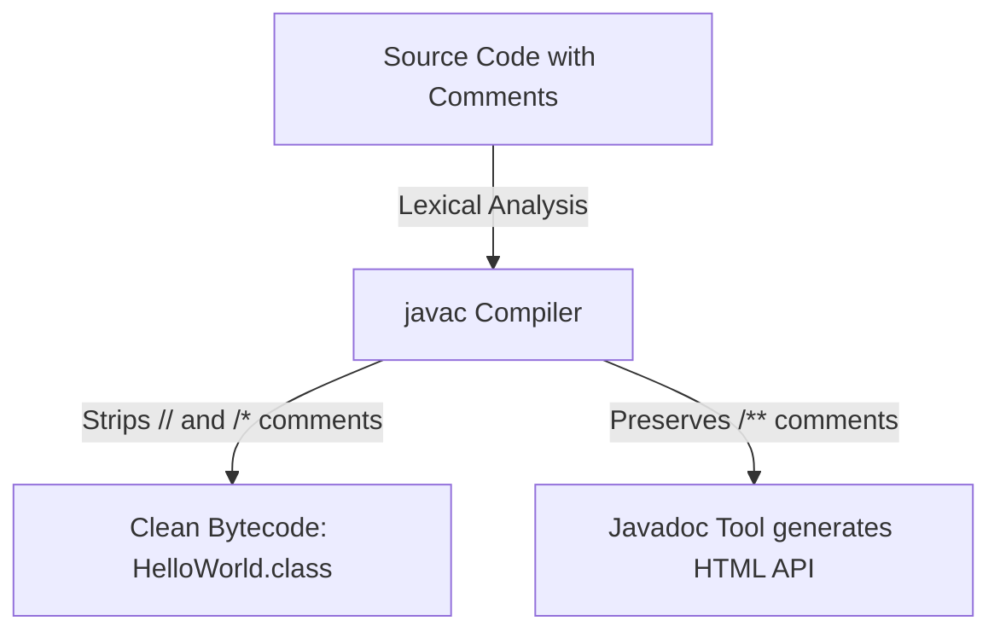
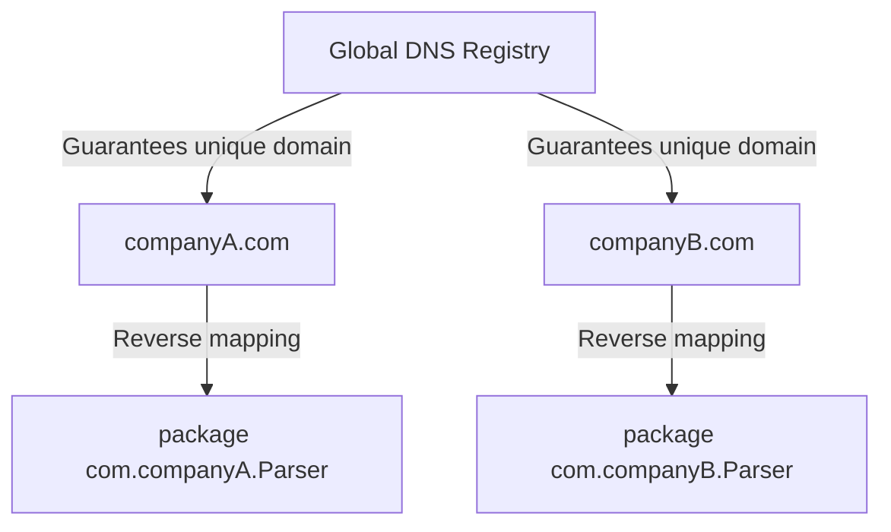

# Comments, Packages, And Imports

Comments, packages, and imports do not usually change business logic directly, but they make code understandable and organized.

## Comments

Java supports single-line and multi-line comments.

Single-line:

```java
// This prints a greeting.
System.out.println("Hello");
```

Multi-line:

```java
/*
 This is a longer explanation.
 It can span multiple lines.
*/
```

Documentation comment:

```java
/**
 * Calculates the total price.
 */
public double calculateTotal() {
    return 0;
}
```

Documentation comments can be used by tools such as `javadoc`.

## How Comments are Processed by the Compiler

During the compilation phase, the Java compiler handles comments differently depending on their syntax. When you run `javac`, the lexical analyzer parses the source file and strips out all single-line (`//`) and multi-line (`/* ... */`) comments, replacing them with whitespace. These comments are entirely omitted from the generated `.class` files, meaning they occupy no space in the JVM memory at runtime. In contrast, Javadoc documentation comments (`/** ... */`) are structured to hold meta-information and can be parsed by the compiler or doclet APIs to build HTML reference documentation. Unless compiler flags are set to retain specific metadata, compiled bytecode contains only executable instructions.

### Mental Model: Compiler Filter
Think of the compiler like a coffee filter: the coffee grounds (comments) are kept in the filter (the source code) to guide the barista, but only the pure liquid coffee (the bytecode) passes through into the cup (the `.class` file).



### Code Example
```java
public class CommentDemo {
    public static void main(String[] args) {
        // This single-line comment is stripped by the compiler.
        /* This multi-line comment is 
           also completely stripped. */
        System.out.println("No comments exist in bytecode!");
        // Output: No comments exist in bytecode!
    }
}
```

### Cause-Effect Chain
`Developer writes comments` &rarr; `Compiler parses source file tokens` &rarr; `Lexical analyzer replaces comment characters with whitespace` &rarr; `Generated class bytecode contains only executable instructions without comment text`.

## Good Comments

Good comments explain why code exists or clarify non-obvious decisions.

Useful:

```java
// Use BigDecimal because money calculations must avoid floating-point rounding issues.
```

Not useful:

```java
// Add 1 to count
count = count + 1;
```

The second comment only repeats the code.

## Packages

A package groups related classes and prevents name conflicts.

Example:

```java
package com.example.learning;
```

Package names are usually lowercase and often use a reversed domain name style:

```text
com.company.project.module
```

## Why Reverse DNS and Package Structure Prevent Collisions

The internet's Domain Name System (DNS) is guaranteed to be globally unique. Java leverages this uniqueness by recommending that developers name packages using their organization's domain name in reverse order (e.g., `com.google` or `org.apache`). This naming convention prevents naming conflicts when integrating third-party libraries into a project. If two organizations both write a class named `Parser`, the reverse DNS package ensures one class lives at `com.companyA.utils.Parser` while the other lives at `com.companyB.network.Parser`, allowing the JVM to safely resolve both types on the classpath without collision.

Furthermore, Java maps package names directly to directory structures on the filesystem. A class declared in package `com.example.learning` must reside in a folder path `com/example/learning/`. This guarantees that the operating system's filesystem and the JVM's class loader are aligned, keeping code files organized and unique.

### Mental Model: Post Office Addresses
Think of packages like postal addresses. If you write a letter to "John Smith", the post office cannot deliver it without a unique street address, city, and country. Similarly, the Fully Qualified Class Name (FQCN) acts as the complete postal address for your class.



### Code Example
```java
// Two classes with the same simple name resolved using Fully Qualified Class Names (FQCN)
package com.example.shop;

public class NamespaceDemo {
    public static void main(String[] args) {
        // Explicitly naming package paths prevents ambiguity
        com.companyA.utils.Parser localParser = new com.companyA.utils.Parser();
        com.companyB.network.Parser remoteParser = new com.companyB.network.Parser();
        System.out.println("Both Parser classes loaded without collision.");
        // Output: Both Parser classes loaded without collision.
    }
}
```

### Cause-Effect Chain
`Organizations register unique internet domains` &rarr; `Java packages use reversed domain structures` &rarr; `Class files reside in unique subdirectory paths on disk` &rarr; `JVM classpath loader resolves type names cleanly using Fully Qualified Class Names`.

## Imports

An import lets you use a class from another package without writing its full name every time.

Without import:

```java
java.util.Scanner scanner = new java.util.Scanner(System.in);
```

With import:

```java
import java.util.Scanner;

Scanner scanner = new Scanner(System.in);
```

## Wildcard Imports

Java allows wildcard imports:

```java
import java.util.*;
```

This imports classes from the `java.util` package, but not from subpackages. Beginners should prefer explicit imports because they are clearer.

## Import Does Not Copy Code

An import statement does not paste code into your file. It only tells the compiler where to find a type by its simple name.

## Common Mistakes

- Writing imports below the class declaration.
- Using package names with uppercase letters.
- Thinking `import java.util.*` imports subpackages.
- Adding comments that repeat obvious code.

### Common Mistake: Import Below Class Declaration

```java
// Compile error: import must appear before class declaration
public class Demo {
    import java.util.Scanner;   // ← wrong position
}
```

Correct order: `package` → `import` → `class`.

```java
package com.example;
import java.util.Scanner;

public class Demo {
    // ...
}
```

### Common Mistake: Uppercase Package Name

```java
package Com.Example.Learning;  // wrong — should be all lowercase
```

```java
package com.example.learning;  // correct
```

### Common Mistake: Expecting Wildcard to Cover Subpackages

```java
import java.util.*;  // imports ArrayList, HashMap, etc.
// Does NOT import java.util.concurrent.locks.Lock
// The line below still fails to compile:
Lock lock = new ReentrantLock();  // error: cannot find symbol
```

Fix: add `import java.util.concurrent.locks.Lock;` explicitly.

### Common Mistake: Comment That Repeats Code

```java
// Bad — just repeats what the code says
count = count + 1;  // increment count by 1

// Good — explains the business reason
count = count + 1;  // retry counter: max retries defined by MAX_RETRY in config
```

## Case Study: Correct File Structure

```java
// File: OrderService.java
package com.example.shop;          // 1. package — first non-comment line

import java.util.ArrayList;        // 2. imports — before class
import java.util.List;

/**
 * Manages customer orders.        // 3. javadoc comment on the class
 * Handles creation and retrieval.
 */
public class OrderService {        // 4. class — name matches file name

    /**
     * Returns all pending orders.
     * @return list of order IDs
     */
    public List<Integer> getPendingOrders() {
        // Use ArrayList — fast random access, acceptable for small order sets
        return new ArrayList<>();
    }
}
```

## Reference Links

- https://docs.oracle.com/javase/specs/jls/se21/html/jls-3.html#jls-3.7 (JLS Lexical Structure - Comments)
- https://docs.oracle.com/javase/specs/jls/se21/html/jls-7.html#jls-7.3 (JLS Packages - Compilation Units)
- https://docs.oracle.com/javase/specs/jls/se21/html/jls-7.html#jls-7.5 (JLS Packages - Import Declarations)
