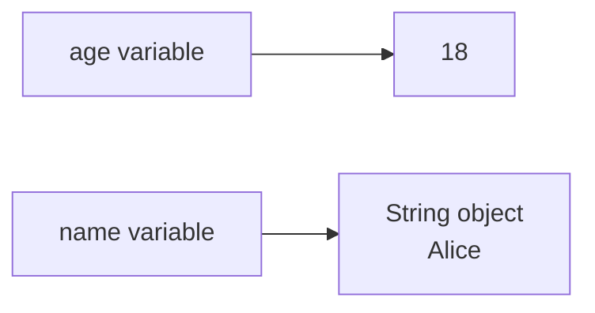
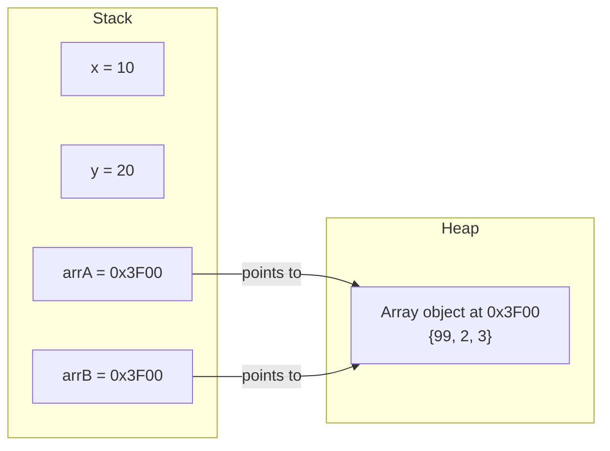

# Reference Types And Memory Model

Reference types do not store the object value directly in the variable. Instead, the variable stores a reference to an object.

Examples of reference types:

- Class types.
- Object types.
- Arrays.
- `String`.
- Interfaces.
- Enums.
- Wrapper classes such as `Integer`.

## Basic Example

```java
String name = "Alice";
int[] scores = {8, 9, 10};
Student student = new Student();
```

`name`, `scores`, and `student` are reference variables. They point to objects.

## Primitive vs Reference

```java
int age = 18;
String name = "Alice";
```

Conceptually:



`age` stores a primitive value directly. `name` stores a reference to a `String` object.

## Stack And Heap Memory Model

To understand **why** primitives and references behave differently, you need to know where Java stores data in memory. The JVM uses two main memory areas: the **Stack** and the **Heap**.

> **Note:** This is a simplified model. The JLS does not mandate Stack allocation for primitives, but HotSpot JVM typically does this. The conceptual model below is accurate enough for understanding Java behavior.

### Stack Memory

The **Stack** stores method call frames. Each time a method is called, a new frame is pushed onto the Stack. Each frame contains the method's local variables.

Key properties of the Stack:

- **Fixed-size frames** — the JVM knows exactly how many bytes each variable needs **at compile time**.
- **Fast allocation** — adding a variable is just moving a pointer, no searching required.
- **Automatic cleanup** — when a method returns, its entire frame is popped off instantly.
- **Stores**: primitive values (`int`, `double`, `boolean`, etc.) and reference addresses (pointers to Heap objects).

### Heap Memory

The **Heap** stores objects and arrays. When you write `new Student()` or `new String("Alice")`, the object is created on the Heap.

Key properties of the Heap:

- **Dynamic allocation** — objects can be any size, determined **at runtime**.
- **Slower allocation** — the JVM must find a suitable block of free memory.
- **Garbage collected** — objects remain on the Heap until the garbage collector determines they are no longer reachable.
- **Stores**: all objects (`String`, arrays, `Student`, wrapper classes, etc.).

### Why Primitives Go On The Stack And Objects Go On The Heap

The cause-effect chain is:

1. **Stack requires fixed, known sizes** → `int` is always 32 bits, `double` is always 64 bits → they fit perfectly on the Stack.
2. **Objects have variable, unpredictable sizes** → a `String` could be 5 characters or 5 million → they cannot fit in a fixed Stack frame.
3. **Solution** → put the object on the Heap (variable size allowed) and put a **fixed-size reference** (memory address) on the Stack.

### Memory Layout Diagram

```mermaid
flowchart LR
    subgraph Stack["Stack (fixed-size frames)"]
        direction TB
        AGE["age = 18\n(32 bits, value stored directly)"]
        NAME["name = 0x1A2B\n(64 bits, reference to Heap)"]
    end

    subgraph Heap["Heap (dynamic allocation)"]
        direction TB
        STR["String object at 0x1A2B\n\"Alice\"\n(~80 bytes)"]
    end

    NAME -->|"points to"| STR
```

Notice that `age` holds the actual value `18` directly on the Stack. But `name` holds a **memory address** `0x1A2B` on the Stack, which points to the actual `String` object on the Heap.

### Analogy: Mailboxes And A Warehouse

Think of the **Stack** as a row of **numbered mailboxes** at a post office. Each mailbox is the same fixed size. You can put a small letter (a primitive value like `18`) directly into a mailbox.

But what if you receive a large, heavy package (an object like a `String`)? It does not fit in the mailbox. So the post office stores the package in a **warehouse** (the Heap) and puts a **tracking slip** (a reference) in your mailbox. The tracking slip has the warehouse shelf number (the memory address) so you can find your package.

- **Mailbox** (Stack slot) = fixed size, fast access.
- **Warehouse** (Heap) = variable size, stores large items.
- **Tracking slip** (reference) = small, fixed-size, tells you where to find the item.

```java
int age = 18;           // Small letter → fits directly in the mailbox (Stack)
String name = "Alice";  // Large package → warehouse (Heap), tracking slip in mailbox (Stack)
```

> See also: This relates to how the JVM manages memory, covered in detail in [13 - Memory Management](../../no13_memory_management/README.md).

## Why String Is Not A Primitive

The existing section states that `String` is not a primitive type — but **why** is it not?

The answer comes directly from how the Stack works: **primitives must have a fixed, predictable size at compile time**. Every primitive type in Java has a guaranteed size:

| Type | Size | Always the same? |
|---|---|---|
| `byte` | 8 bits | ✅ Yes |
| `int` | 32 bits | ✅ Yes |
| `double` | 64 bits | ✅ Yes |
| `boolean` | JVM-dependent | ✅ Conceptually 1 bit |
| `String` | ??? | ❌ **No — depends on content** |

A `String` can be 1 character or 1 million characters. Its size is **variable and unpredictable at compile time**:

```java
String small = "Hi";                        // ~56 bytes in memory
String large = "A".repeat(1_000_000);       // ~2,000,056 bytes (~2 MB) in memory

System.out.println(small.length());          // 2
System.out.println(large.length());          // 1000000
```

The cause-effect chain:

1. **Primitives need fixed size** → `int` is always exactly 32 bits → can live on the Stack.
2. **String size is unpredictable** → `"Hi"` and `"A".repeat(1_000_000)` are wildly different sizes.
3. **Variable-size data cannot be a primitive** → it must be an **Object** allocated dynamically on the Heap.
4. **Therefore** → `String` is a class (`java.lang.String`), not a primitive type.

Additionally, `String` has **methods** like `.length()`, `.charAt()`, `.substring()` — primitives cannot have methods. The fact that `String` needs behavior (methods) is another reason it must be an Object.

> **Analogy:** Think of primitives as coins — every quarter is exactly the same size and weight. But a `String` is like a handwritten letter — it could be a postcard or a 500-page manuscript. You cannot design a fixed-size coin slot for something that varies so dramatically.

## Why Primitives Are Stored Directly But Objects Use References

Now that you understand Stack vs Heap, the question is: **why can `int` be stored directly in the variable, but `String` must be accessed through a reference?**

The core mechanism:

1. **Stack requires known size at compile time** → `int` is always 32 bits → the JVM allocates exactly 32 bits on the Stack → the value fits directly.
2. **Objects have variable size** → a `Student` object might be 48 bytes, a `String` might be 80 bytes or 2 MB → the JVM cannot allocate a "one size fits all" slot on the Stack.
3. **Solution: indirection** → put the actual object on the Heap (which handles variable sizes), and put a **fixed-size reference** (typically 32 or 64 bits) on the Stack.

A reference is like a **remote control** — it is small, fits in your hand (fixed size on Stack), and points to the actual TV (object on Heap). You interact with the TV through the remote, not by carrying the TV around.

### Code Example: Two References, One Object

```java
int x = 10;
int y = x;
y = 20;
System.out.println(x); // 10 — changing y does NOT affect x (independent copies)

int[] arrA = {1, 2, 3};
int[] arrB = arrA;
arrB[0] = 99;
System.out.println(arrA[0]); // 99 — changing arrB DOES affect arrA (same object!)
```

Why the different behavior?

- `int x = 10; int y = x;` → the **value** `10` is copied. `x` and `y` are independent.
- `int[] arrA = ...; int[] arrB = arrA;` → the **reference** (address) is copied. Both `arrA` and `arrB` point to the **same array object** on the Heap.



Notice: `x` and `y` hold independent values (10 and 20). But `arrA` and `arrB` hold the **same address** `0x3F00` — so modifying the array through either reference affects the same object.

> **Cause-effect:** Copy a primitive → copy the value → independent. Copy a reference → copy the address → both variables control the same object → changes through one are visible through the other.

## Object Identity

Two reference variables can point to the same object.

```java
Student a = new Student();
Student b = a;
```

Conceptually:

```mermaid
flowchart LR
    A[a] --> OBJ[Student object]
    B[b] --> OBJ
```

If the object is mutable and you change it through `a`, the change can be observed through `b` because both references point to the same object.

## Arrays Are Reference Types

Arrays are objects in Java.

```java
int[] numbers = {1, 2, 3};
```

`numbers` is a reference to an array object.

This is why arrays have properties such as:

```java
numbers.length
```

## String Is A Reference Type

`String` is not a primitive type.

```java
String text = "Java";
```

`text` is a reference variable. It refers to a `String` object.

However, `String` is special because Java has string literals and a string pool. That topic is explained more deeply in the String chapter.

## null

A reference variable can contain `null`.

```java
String name = null;
```

This means the variable does not currently refer to any object.

Calling a method on `null` causes `NullPointerException`.

```java
String name = null;
System.out.println(name.length()); // runtime error: NullPointerException
```

### Why null Causes NullPointerException

Remember the remote control analogy? A reference is a remote control that points to an object (the TV). When a reference is `null`, it is like holding a remote control that **is not paired with any TV**. The remote exists, but it points to nothing.

What happens when you press buttons on a remote that has no TV?

- **Nothing works.** You cannot change the channel, adjust the volume, or do anything useful.
- In Java, the JVM **throws a `NullPointerException`** because you tried to use a reference that points to no object.

The cause-effect chain:

1. `String name = null;` → the reference `name` is set to `null` → no `String` object exists on the Heap.
2. `name.length()` → the JVM tries to follow the reference to find the `String` object.
3. The reference is `null` → there is no object to find → **NullPointerException** is thrown at runtime.

```java
String greeting = null;

// This compiles fine — the compiler does not check for null
System.out.println(greeting.toUpperCase()); // NullPointerException at runtime!
```

### Why NullPointerException Is The Most Common Java Exception

`NullPointerException` (NPE) is the single most common runtime exception in Java because:

- **The compiler cannot detect it** — `null` is a valid value for any reference type, so the code compiles without error.
- **It only appears at runtime** — the crash happens only when the code actually executes the method call on `null`.
- **Any reference variable can be null** — method parameters, return values, fields — any of them could be `null` unexpectedly.

```java
public static String findUser(int id) {
    if (id == 1) return "Alice";
    return null; // no user found
}

String user = findUser(999);
System.out.println(user.toUpperCase()); // NullPointerException!
// user is null because findUser(999) returned null
```

> **Connection to wrapper types:** This is directly relevant to autoboxing. When you unbox a `null` wrapper (e.g., `Integer num = null; int x = num;`), Java calls `num.intValue()` on `null` → NullPointerException. See [Wrappers, null, and Equality](04-wrappers-null-equality.md) for details.

## Common Mistakes

- Thinking `String` is primitive because it is common and easy to write.
- Forgetting that arrays are objects.
- Assuming two references always mean two different objects.
- Calling methods on variables that may be `null`.
