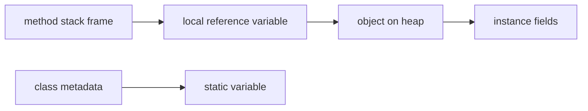
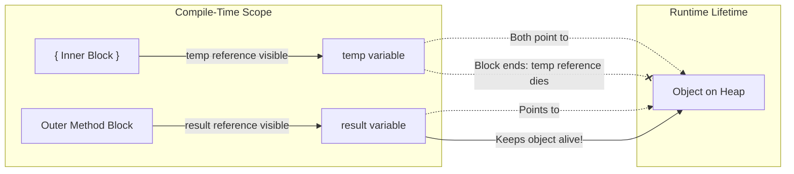

# Default Values, Scope, And Lifetime

Variables are affected by where they are declared. Location influences default values, visibility, and lifetime.

## Default Values

Fields get default values if not initialized.

```java
class Student {
    int age;        // default 0
    boolean active; // default false
    String name;    // default null
}
```

Local variables do not get usable default values.

```java
public void demo() {
    int count;
    // System.out.println(count); // does not compile
}
```

This rule prevents accidental use of uninitialized local data.

## Why Local Variables Must Be Initialized But Fields Get Default Values

In Java, instance and static fields are allocated on the Heap and Metaspace, respectively. When these memory areas are allocated, the JVM automatically zero-initializes the allocated memory blocks for security and system stability, ensuring that an object doesn't read stale data previously stored in that memory location. In contrast, local variables are stored on the Stack inside transient stack frames. Pushing and popping stack frames occurs extremely frequently; zero-initializing every slot on the stack automatically at runtime would introduce significant performance overhead. Instead, Java relies on the compiler's compile-time **definite assignment analysis** to guarantee that local variables are initialized before use, achieving absolute safety without a runtime performance penalty.

### Heap Zero-Initialization vs. Stack Verification

```text
┌────────────────────────────────────────────────────────┐
│ Heap / Metaspace Allocation                            │
│ [New Object / Class Metadata] ──> [JVM writes zeros]   │
│   (Always Safe & Zeroed at Runtime)                    │
└────────────────────────────────────────────────────────┘
┌────────────────────────────────────────────────────────┐
│ Stack Frame Allocation (High-frequency method calls)  │
│ [Stack Frame Push] ──> [Left uninitialized in RAM]     │
│   (Compiler enforces initialization at Compile-time)   │
└────────────────────────────────────────────────────────┘
```

### Automatic Initialization Code Demo

```java
public class InitializationDemo {
    int instanceField; // Field: allocated on Heap, initialized to 0 automatically by JVM

    public void calculate() {
        int localVal;  // Local: allocated on Stack, JVM does not initialize it
        
        // System.out.println(localVal); // Compile Error: localVal might not have been initialized
        System.out.println(instanceField); // Prints 0 (safe default)
    }
}
```

### Safety and Performance Cause-Effect Chain

JVM allocates object on heap $\rightarrow$ Memory range is zero-filled to prevent memory leaks from old objects $\rightarrow$ Fields read 0, false, or null by default.
Method is invoked $\rightarrow$ Stack frame is pushed without zeroing memory to preserve performance $\rightarrow$ Java Compiler checks all code branches for definite assignment $\rightarrow$ Compiler rejects uninitialized local variable reads $\rightarrow$ Local memory remains safe without runtime zeroing overhead.

## Scope

Scope is the region of code where a variable can be accessed.

```java
public void demo() {
    int outer = 10;

    if (outer > 5) {
        int inner = 20;
        System.out.println(inner);
    }

    System.out.println(outer);
    // System.out.println(inner); // not visible here
}
```

`inner` is visible only inside the `if` block.

## Lifetime

Lifetime is how long a variable exists.

- A local variable exists while its method/block is executing.
- An instance variable exists as long as its object exists.
- A static variable exists as long as the class is loaded.

## Stack And Heap Mental Model

For beginners, use this simplified model:

- Local variables are associated with method execution and stack frames.
- Objects are stored on the heap.
- Reference variables can point to heap objects.
- Instance variables live inside objects.
- Static variables are associated with the class.



This is a learning model, not a complete JVM memory specification.

## Default Values Reference Table

| Type           | Default value |
|----------------|---------------|
| `byte`         | `0`           |
| `short`        | `0`           |
| `int`          | `0`           |
| `long`         | `0L`          |
| `float`        | `0.0f`        |
| `double`       | `0.0d`        |
| `char`         | `'\u0000'` (null char) |
| `boolean`      | `false`       |
| Any reference  | `null`        |

These defaults apply only to **fields** (instance and static), never to local variables.

```java
class Demo {
    int count;       // field → default 0
    String label;    // field → default null
    boolean active;  // field → default false

    void show() {
        System.out.println(count);   // 0
        System.out.println(label);   // null
        System.out.println(active);  // false
    }
}
```

## Case Study: Loop Variable Scope Surprise

A developer wants to read a loop counter after the loop finishes.

```java
// Does NOT compile
public void run() {
    for (int i = 0; i < 5; i++) {
        System.out.println(i);
    }
    System.out.println(i); // compile error: cannot find symbol — i is out of scope
}
```

`i` is scoped to the `for` loop block. It ceases to exist once the loop ends.

**Fix — declare outside if you need access after the loop:**

```java
public void run() {
    int i;                          // declared in method scope
    for (i = 0; i < 5; i++) {
        System.out.println(i);
    }
    System.out.println(i);          // 5 — accessible here
}
```

This also shows that scope and initialization are separate concerns: `i` is in scope after the loop, and because the loop always assigns it, Java accepts its use.

## Understanding Scope vs Lifetime

**Scope** is a compile-time concept representing the region of the source code text where a variable's identifier is legally recognized by the compiler. **Lifetime** is a runtime concept representing the duration of time that the variable's value or object instance occupies memory storage in the JVM. It is crucial to distinguish between a reference variable's scope and the lifetime of the object it references: a reference variable can exit its compile-time scope and cease to exist, while the object on the heap that it pointed to continues to live because it is still reachable through other active references.

### Reference Scope vs. Object Lifetime Diagram



### Scope vs. Lifetime Code Demo

```java
public class ScopeLifetimeDemo {
    public void execute() {
        // 'result' starts its scope and lifetime here
        String result;
        {
            // 'temp' starts its scope and lifetime here
            String temp = new String("Heap Object"); 
            result = temp; 
        } // 'temp' scope and lifetime end here.
          // The heap object "Heap Object" survives because 'result' still references it.
          
        System.out.println(result); // In scope, prints "Heap Object"
    } // 'result' scope and lifetime end here.
}
```

### Reference and Object Lifecycle Cause-Effect Chain

Execution enters an inner code block $\rightarrow$ Local reference variable is pushed onto the stack frame $\rightarrow$ Reference points to a newly allocated Heap object $\rightarrow$ Execution exits the inner code block $\rightarrow$ Local reference variable is popped off the stack (its scope and lifetime end) $\rightarrow$ JVM checks if other active references point to the heap object $\rightarrow$ Active reference exists (e.g., `result`) $\rightarrow$ Heap object remains alive $\rightarrow$ Garbage Collector bypasses the object.

## Case Study: Scope vs Lifetime

```java
public void demo() {
    StringBuilder result = null;     // reference is in scope

    {
        StringBuilder temp = new StringBuilder("work");
        temp.append(" data");
        result = temp;               // result now points to the StringBuilder
    }
    // temp is out of scope here — but the StringBuilder object is still alive
    // because result still references it
    System.out.println(result);      // prints "work data"
}
```

`temp` (the reference) is dead after its block ends. The `StringBuilder` object on the heap survives as long as `result` is alive.

## Common Mistakes

- Assuming local variables have default values.
- Trying to use a block variable outside its scope (compile error, not runtime error).
- Confusing scope with lifetime — an object can outlive a reference variable.
- Thinking stack/heap is only about primitive vs reference types.
- Trying to read a `for` loop counter variable after the loop ends.

## Reference Links

- [Java Language Specification: Initial Values of Variables](https://docs.oracle.com/javase/specs/jls/se21/html/jls-4.html#jls-4.12.5)
- [Java Language Specification: Definite Assignment](https://docs.oracle.com/javase/specs/jls/se21/html/jls-16.html)
- [Oracle Java Tutorials: Variables (Naming and Types)](https://docs.oracle.com/javase/tutorial/java/nutsandbolts/variables.html)

