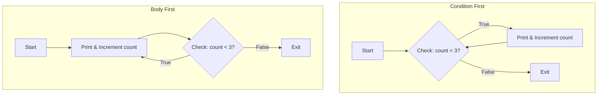
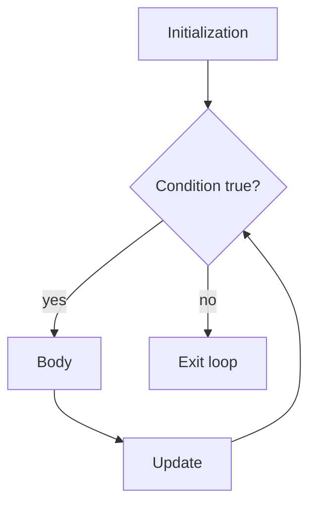
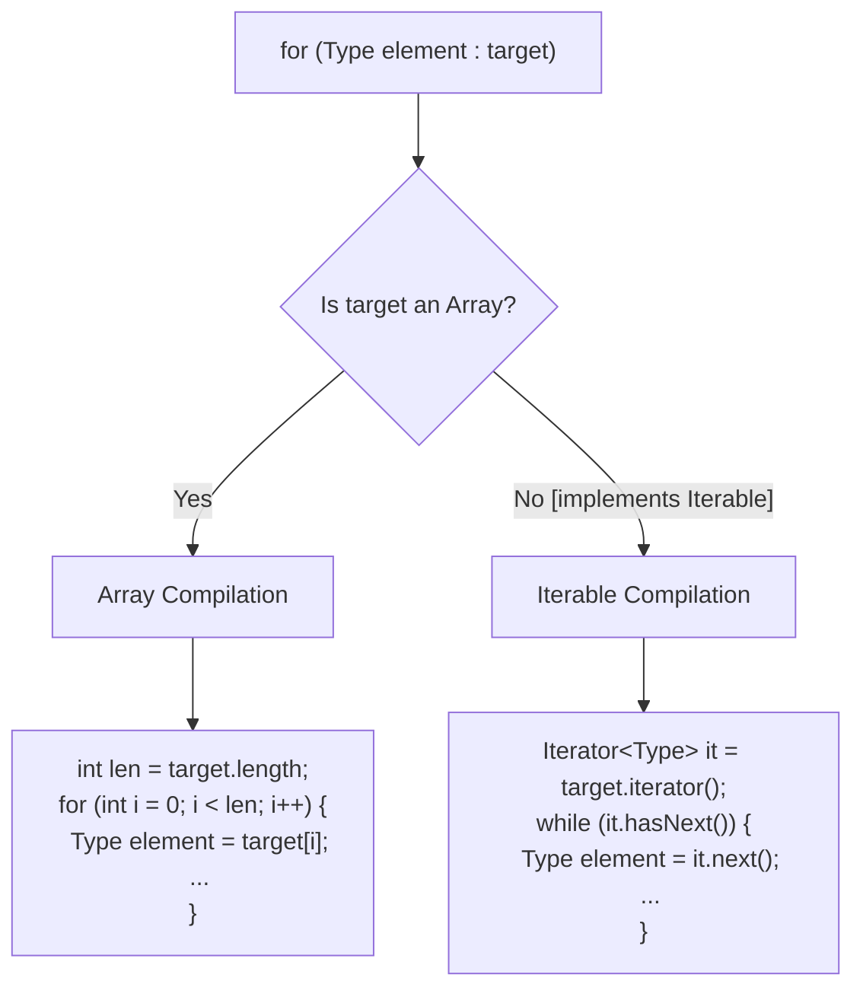

# Loops

Loops repeat code. The key to understanding any loop is knowing its initialization, condition, body, update, and stopping point.

## `while`

A `while` loop checks the condition before each iteration.

```java
int count = 0;

while (count < 3) {
    System.out.println(count);
    count++;
}
```

If the condition is false at the beginning, the loop body never runs.

## `do-while`

A `do-while` loop checks the condition after each iteration.

```java
int count = 0;

do {
    System.out.println(count);
    count++;
} while (count < 3);
```

The body always runs at least once.

## Under the Hood: How while and do-while Differ in Bytecode

At the syntax level, `while` and `do-while` loops differ solely in when they evaluate their loop condition. Beneath the surface, this difference dramatically alters how the Java compiler (`javac`) maps each loop into JVM instruction sequences (bytecode). A `while` loop requires a guard condition at the entry point of the loop body, compiling into a conditional jump or an unconditional jump to the check at the bottom. A `do-while` loop executes its body unconditionally on the first pass, placing its condition check entirely at the bottom, which maps to a single conditional branch instruction that jumps backward if the condition remains true.



### Concept Compilation Comparison

Below is the conceptual JVM bytecode comparison showing how each loop evaluates the condition.

```java
// while Loop Java Code
int i = 0;
while (i < 3) {
    i++;
}
// Conceptual bytecode generated by javac:
//   iconst_0
//   istore_1          (i = 0)
// Loop_Start:
//   iload_1
//   iconst_3
//   if_icmpge Loop_End (if i >= 3, jump to Loop_End)
//   iinc 1, 1         (i++)
//   goto Loop_Start
// Loop_End:
```

```java
// do-while Loop Java Code
int j = 0;
do {
    j++;
} while (j < 3);
// Conceptual bytecode generated by javac:
//   iconst_0
//   istore_1          (j = 0)
// Loop_Start:
//   iinc 1, 1         (j++)
//   iload_1
//   iconst_3
//   if_icmplt Loop_Start (if j < 3, jump to Loop_Start)
```

### Cause-Effect Chain
Evaluation boundary placed after loop body in `do-while` $\rightarrow$ Compiler omits initial jump instruction at loop entry $\rightarrow$ JVM runs body instructions straight through during initial pass $\rightarrow$ Loop execution path is optimized by one branch operation per loop entry, but risks calling operations on uninitialized or null variables if guard conditions are not manually established.

## `for`

A classic `for` loop puts initialization, condition, and update in one header.

```java
for (int i = 0; i < 3; i++) {
    System.out.println(i);
}
```

It is usually best when you know the loop counter pattern.

The structure is:

```java
for (initialization; condition; update) {
    body
}
```

Execution order:



## Enhanced `for`

The enhanced `for` loop reads each element from an array or iterable.

```java
for (String name : names) {
    System.out.println(name);
}
```

It is good when you need each element but do not need the index.

If you need to modify elements by index, remove elements safely, or compare neighboring elements, a classic `for` loop may be better.

## Under the Hood: Array vs. Iterable Mechanics in Enhanced for Loops

The enhanced `for` loop (also known as the for-each loop) is a syntactic convenience. During compilation, the Java compiler (`javac`) transforms this clean syntax into one of two lower-level traversal patterns, depending on the target expression's type. If the target is a standard Java array, the compiler compiles it down to a classic index-based loop using an integer counter and array length boundaries. If the target is an object that implements the `java.lang.Iterable` interface (such as `ArrayList`, `HashSet`, or `LinkedList`), the compiler translates it to use a `java.util.Iterator` object. Understanding this difference explains why arrays can be iterated without object overhead, whereas iterating collections creates an iterator instance that checks for structural changes via a modification counter (`modCount`), throwing a `ConcurrentModificationException` if elements are added or removed during traversal.



### Compilation Expansion Examples

#### 1. Traversal Over Arrays
```java
String[] fruits = {"Apple", "Banana"};
for (String fruit : fruits) {
    System.out.println(fruit);
}
// Under the hood, javac produces:
// String[] $arr = fruits;
// int $len = $arr.length;
// for (int $i = 0; $i < $len; $i++) {
//     String fruit = $arr[$i];
//     System.out.println(fruit);
// }
// Output:
// Apple
// Banana
```

#### 2. Traversal Over Collections (Iterable)
When looping over collections, structural modification causes the hidden iterator to detect that its state is out of sync.
```java
java.util.List<String> list = new java.util.ArrayList<>(java.util.List.of("A", "B"));
try {
    for (String val : list) {
        if (val.equals("A")) {
            list.remove(val); // Modifies the collection directly
        }
    }
} catch (java.util.ConcurrentModificationException e) {
    System.out.println("ConcurrentModificationException caught!");
}
// Under the hood, javac produces:
// java.util.Iterator<String> $it = list.iterator();
// while ($it.hasNext()) {
//     String val = $it.next(); // Checks modCount mismatch internally and throws!
//     if (val.equals("A")) {
//         list.remove(val);
//     }
// }
// Output:
// ConcurrentModificationException caught!
```

### Cause-Effect Chain
Direct modification of collection structure during for-each iteration $\rightarrow$ Collection increases its internal `modCount` structure $\rightarrow$ Subsequent call to hidden iterator's `.next()` checks if its own `expectedModCount` matches current `modCount` $\rightarrow$ Mismatch detected $\rightarrow$ Iterator throws `ConcurrentModificationException` to prevent iterator corruption.

## Infinite Loops

An infinite loop never reaches a false condition or exit statement.

```java
while (true) {
    readNextCommand();
}
```

Some infinite loops are intentional, especially in servers, games, and command processors. They still need a controlled exit such as `break`, `return`, or external shutdown logic.

Accidental infinite loops often happen when the loop update is missing.

```java
int i = 0;
while (i < 3) {
    System.out.println(i);
    // missing i++
}
```

## Choosing A Loop

Use a classic `for` loop when:

- You need an index.
- You know the counter range.
- You need to update by a predictable step.

Use enhanced `for` when:

- You only need each element.
- You do not need the index.

Use `while` when:

- The number of iterations is not known in advance.
- The loop depends on an external condition.

Use `do-while` when:

- The body must run at least once before checking the condition.

---

## Common Mistakes

### Mistake 1 — Semicolon after loop header
Putting a semicolon immediately after a loop header creates an empty statement as the loop body, causing the intended block to run only once (for `for`/`while` loops that terminate) or creating an accidental infinite loop.

```java
// BUG: Infinite loop because "i++" is outside the loop body
int i = 0;
while (i < 3); { // Note the semicolon!
    System.out.println(i);
    i++;
}

// BUG: Intended loop body runs only once after loop finishes
for (int j = 0; j < 3; j++); { // Note the semicolon!
    System.out.println("Hello"); // Prints "Hello" only once
}
```

**Fix**: Remove the semicolon after the loop header.
```java
for (int j = 0; j < 3; j++) {
    System.out.println("Hello"); // Prints "Hello" three times
}
```

### Mistake 2 — Off-by-one array index
Using `<=` instead of `<` when looping through array indices.

```java
int[] numbers = {1, 2, 3};
// BUG: Throws ArrayIndexOutOfBoundsException at index 3
for (int i = 0; i <= numbers.length; i++) {
    System.out.println(numbers[i]);
}

// FIX: Use strict inequality '<'
for (int i = 0; i < numbers.length; i++) {
    System.out.println(numbers[i]);
}
```

### Mistake 3 — Modifying a collection during enhanced `for` (for-each)
Adding or removing elements from a collection during a for-each loop triggers a runtime exception.

```java
List<String> list = new ArrayList<>(List.of("A", "B", "C"));
// BUG: Throws ConcurrentModificationException
for (String item : list) {
    if (item.equals("B")) {
        list.remove(item);
    }
}

// FIX: Use an explicit Iterator or Collection.removeIf() (requires java.util)
list.removeIf(item -> item.equals("B"));
```

---

## Case Study — Infinite Loop Pitfalls and Loop Comparisons

### Case Study 1: The Float Precision Infinite Loop
A common mistake when designing loop conditions is using floating-point types (`float` or `double`) for loop counters. Because floating-point math cannot precisely represent all decimal values, the counter may never exactly equal the stopping value, leading to an infinite loop.

```java
// BUG: Infinite loop due to floating-point imprecision
// 0.1 cannot be represented exactly in binary floating-point.
// x will never be exactly equal to 1.0.
for (double x = 0.0; x != 1.0; x += 0.1) {
    System.out.println(x);
}

// FIX: Use integer counters for loop control
for (int count = 0; count < 10; count++) {
    double x = count * 0.1;
    System.out.println(x);
}
```

### Case Study 2: Classic `for` vs. Enhanced `for` (for-each)
Choosing between `for` and enhanced `for` is about intent, safety, and capabilities.

| Feature | Classic `for` | Enhanced `for` (for-each) |
| :--- | :--- | :--- |
| **Index Access** | Has access to `i` (index). | No index access. |
| **Modification** | Can modify elements (`arr[i] = val`) or change the loop index. | Cannot modify array elements directly or reassign loop variables. |
| **Collection Modification** | Safe to modify list size if index is adjusted manually (though tricky). | Throws `ConcurrentModificationException` if elements are added/removed. |
| **Supported Types** | Arrays, Lists, or any indexable structure. | Arrays and any class implementing `java.lang.Iterable`. |
| **Readability** | Verbose; requires tracking boundary conditions (`i < size`, `i++`). | Extremely clean; eliminates index management bugs entirely. |

#### Example: Modifying array elements
When you need to modify elements in-place, the enhanced `for` loop fails because the loop variable is just a copy of the reference or value.

```java
int[] values = {1, 2, 3};

// Does NOT change the array elements
for (int val : values) {
    val *= 2; // Only modifies local variable 'val'
}
// values is still {1, 2, 3}

// FIX: Use classic for-loop to modify in-place
for (int i = 0; i < values.length; i++) {
    values[i] *= 2;
}
// values is now {2, 4, 6}
```

## Reference Links

- https://docs.oracle.com/javase/specs/jls/se21/html/jls-14.html#jls-14.12 (The while Statement in the Java Language Specification)
- https://docs.oracle.com/javase/specs/jls/se21/html/jls-14.html#jls-14.13 (The do Statement in the Java Language Specification)
- https://docs.oracle.com/javase/specs/jls/se21/html/jls-14.html#jls-14.14.2 (The Enhanced for Statement in the Java Language Specification)
- https://docs.oracle.com/javase/tutorial/java/nutsandbolts/flow.html (Oracle Java Control Flow Statements Tutorial)
