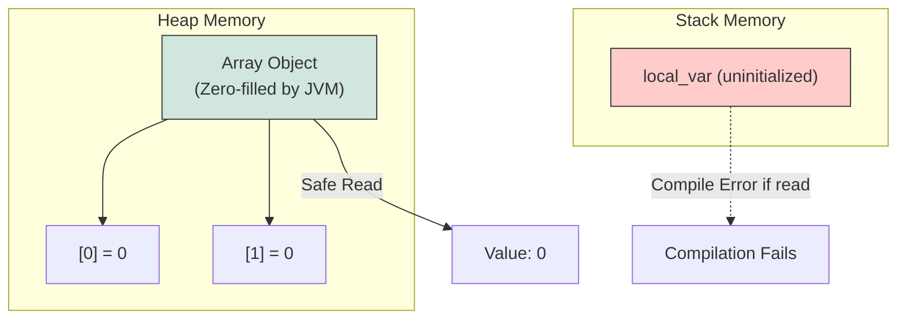
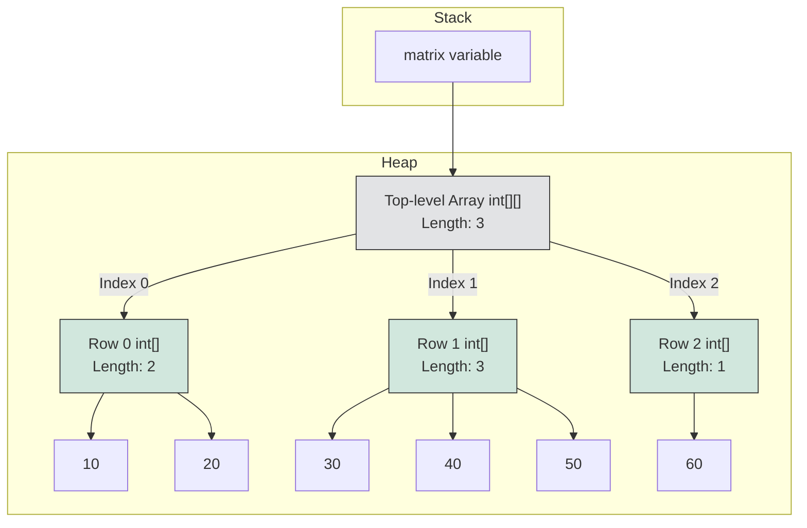
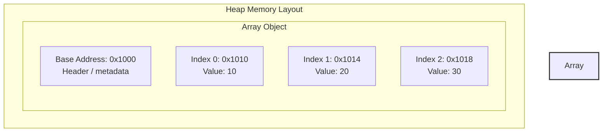

# Array Basics

An array in Java is a container object that holds a fixed number of values of a single type. The length of an array is established when the array is created, and after creation, its length is fixed.

---

## Declaration and Initialization

An array must be declared, allocated, and optionally initialized before it can be used.

### Declaration Syntax
There are two syntaxes for declaring an array variable:
1. **Type-first (Preferred):** Placing the brackets after the type.
   ```java
   int[] numbers;
   ```
2. **Variable-first (C/C++ Style):** Placing the brackets after the variable name.
   ```java
   int scores[];
   ```
   *Note:* The type-first syntax is highly preferred because it clearly keeps the type information (`int[]` meaning "integer array") separate from the variable name.

### Allocation and Default Values
Arrays are objects, which means they are created in the **Heap** memory using the `new` keyword. You must specify the size (length) of the array upon allocation:

```java
numbers = new int[5]; // Allocates space for 5 integers
```

When an array is allocated, the JVM automatically initializes all of its elements to their default values:

| Type | Default Value |
| :--- | :--- |
| `byte`, `short`, `int`, `long` | `0` |
| `float`, `double` | `0.0` |
| `char` | `\u0000` (null character) |
| `boolean` | `false` |
| Reference Types (Objects, Strings) | `null` |

### Why Array Elements are Automatically Zero-Initialized

Unlike local variables which reside on the stack and must be explicitly initialized, heap-allocated array elements are automatically zero-initialized by the JVM upon creation. When the JVM allocates memory on the heap for a new array, it zero-fills the allocated memory block before returning the array reference to the program. This automatic initialization is a fundamental safety feature of the Java language to guarantee type safety and prevent security vulnerabilities. If Java allowed access to uninitialized heap memory, a program could potentially read leftover binary data from previously deallocated objects, leading to undefined behavior or security leaks. By ensuring that every slot in the array contains a predictable default value, Java prevents garbage reads and maintains its strict memory-safety contracts.



**Runnable Code Example:**
```java
public class ArrayZeroInitDemo {
    public static void main(String[] args) {
        int[] rawArray = new int[3];
        System.out.println(rawArray[0]); // Output: 0
        System.out.println(rawArray[1]); // Output: 0
    }
}
```

**Cause-Effect Chain:**
`Array allocation on heap` &rarr; `JVM zero-fills the contiguous memory block` &rarr; `Elements get default type-specific values` &rarr; `Read operations return predictable defaults instead of raw memory garbage` &rarr; `Strict memory safety and security guaranteed`

### Runnable Example: Declaration, Allocation, and Default Values
```java
public class ArrayInitExample {
    public static void main(String[] args) {
        // Declaration and allocation
        int[] intArray = new int[3];
        boolean[] boolArray = new boolean[2];
        String[] strArray = new String[2];

        // Print default values
        System.out.println("int default: " + intArray[0]); // Output: 0
        System.out.println("boolean default: " + boolArray[0]); // Output: false
        System.out.println("String default: " + strArray[0]); // Output: null

        // Explicit initialization
        intArray[0] = 42;
        intArray[1] = 84;
        intArray[2] = 126;
        
        System.out.println("Modified int array: " + java.util.Arrays.toString(intArray)); // Output: [42, 84, 126]
    }
}
```

---

## Initialization Options

You can initialize arrays using three main patterns:

### 1. Allocation with Default Values
```java
int[] arr = new int[3]; // Elements are {0, 0, 0}
arr[0] = 10;
arr[1] = 20;
```

### 2. Array Initializer (Shortcut Syntax)
Used when the values are known at the time of declaration:
```java
int[] arr = {10, 20, 30}; // Size is automatically inferred as 3
```
> [!WARNING]
> This shortcut syntax is only valid in the variable declaration statement. You cannot use it for re-assignment:
> ```java
> int[] arr;
> // arr = {10, 20, 30}; // Compilation Error!
> arr = new int[]{10, 20, 30}; // Valid re-assignment
> ```

### 3. Anonymous Array Syntax
Used to declare, allocate, and initialize an array on the fly (often when passing an array to a method):
```java
printScores(new int[]{90, 85, 95});
```

---

## One-Dimensional Arrays and Traversing

Elements of a 1D array are accessed using index positions from `0` to `length - 1`. The size of the array is read-only and accessed via the `length` property:

```java
int size = arr.length; // Property (no parenthesis)
```

### Traversing Methods

#### 1. Standard `for` Loop
Allows modifying elements, traversing backwards, or stepping through indices.
```java
for (int i = 0; i < arr.length; i++) {
    arr[i] = arr[i] * 2; // Modification is possible
}
```

#### 2. Enhanced `for` (foreach) Loop
Read-only, sequential access from start to finish. You **cannot** use it to modify the elements of primitive arrays, nor can you access index numbers.
```java
for (int val : arr) {
    System.out.println(val); // Cannot modify elements or get current index
}
```

##### Runnable Example: Read-only Nature of Enhanced `for` Loop
```java
public class EnhancedForExample {
    public static void main(String[] args) {
        int[] numbers = {1, 2, 3, 4, 5};

        // 1. Attempting to modify primitive elements in enhanced for loop
        for (int num : numbers) {
            num = num * 10; // Modifying local variable num, NOT the array slot!
        }
        System.out.println("After enhanced for loop: " + java.util.Arrays.toString(numbers));
        // Output: [1, 2, 3, 4, 5] (Unmodified!)

        // 2. Correct modification using standard for loop
        for (int i = 0; i < numbers.length; i++) {
            numbers[i] = numbers[i] * 10;
        }
        System.out.println("After standard for loop: " + java.util.Arrays.toString(numbers));
        // Output: [10, 20, 30, 40, 50]
    }
}
```

### ArrayIndexOutOfBoundsException (AIOOBE)
An `ArrayIndexOutOfBoundsException` is a runtime exception thrown to indicate that an array has been accessed with an illegal index. The index is either negative or greater than or equal to the size of the array.

##### Runnable Example: Triggering AIOOBE
```java
public class AioobeExample {
    public static void main(String[] args) {
        int[] numbers = {10, 20, 30};

        // Valid indices: 0, 1, 2
        System.out.println("Valid access at index 1: " + numbers[1]); // Prints 20

        try {
            // Illegal access (index >= length)
            int val = numbers[3];
        } catch (ArrayIndexOutOfBoundsException e) {
            System.out.println("Exception caught: " + e.toString());
            // Expected Output: Exception caught: java.lang.ArrayIndexOutOfBoundsException: Index 3 out of bounds for length 3
        }

        try {
            // Illegal access (negative index)
            int val = numbers[-1];
        } catch (ArrayIndexOutOfBoundsException e) {
            System.out.println("Exception caught: " + e.toString());
            // Expected Output: Exception caught: java.lang.ArrayIndexOutOfBoundsException: Index -1 out of bounds for length 3
        }
    }
}
```
> [!IMPORTANT]
> Since array indices in Java are calculated using 32-bit signed integers, the maximum index is `Integer.MAX_VALUE - 8` (exact value depends on JVM/heap constraints). Attempting to use a `long` value directly as an index results in a compile-time error.

---

## Multidimensional Arrays (Arrays of Arrays)

Java does not have true multi-dimensional contiguous arrays. Instead, a multi-dimensional array is an **array of arrays**.

### Two-Dimensional Arrays
A 2D array can be visualized as a grid of rows and columns.

```java
int[][] matrix = new int[3][4]; // 3 rows, 4 columns
```

You can initialize a 2D array inline:
```java
int[][] matrix = {
    {1, 2, 3},
    {4, 5, 6},
    {7, 8, 9}
};
```

### Ragged (Jagged) Arrays
Because multidimensional arrays are arrays of arrays, each row can point to an array of a different length.

```java
int[][] ragged = new int[3][]; // Allocate 3 rows, columns are left unallocated (null)
ragged[0] = new int[2];        // Row 0 has 2 columns
ragged[1] = new int[4];        // Row 1 has 4 columns
ragged[2] = new int[1];        // Row 2 has 1 column
```

### Why Multidimensional Arrays are Arrays of Arrays

Java does not support true multi-dimensional contiguous arrays in memory; instead, it implements them as nested single-dimensional arrays, commonly referred to as "arrays of arrays". In this model, the top-level array does not hold the actual primitive values or objects directly, but rather stores reference addresses pointing to other independent array objects. This architecture provides great flexibility, as it allows for the creation of jagged (or ragged) arrays where each sub-array can have a different length. Each sub-array is treated as a fully independent object on the heap, meaning they do not need to be allocated contiguously with respect to each other. By adopting this uniform design, the JVM simplifies its internal memory representation because it only needs to support single-dimensional arrays of primitives and single-dimensional arrays of object references.



**Runnable Code Example:**
```java
public class JaggedArrayMemoryDemo {
    public static void main(String[] args) {
        int[][] matrix = new int[3][];
        matrix[0] = new int[]{10, 20};
        matrix[1] = new int[]{30, 40, 50};
        matrix[2] = new int[]{60};
        
        System.out.println("Top-level array size: " + matrix.length); // Output: 3
        System.out.println("Row 0 array size: " + matrix[0].length);   // Output: 2
        System.out.println("Row 1 array size: " + matrix[1].length);   // Output: 3
    }
}
```

**Cause-Effect Chain:**
`Multidimensional array declared` &rarr; `Top-level reference array allocated on heap` &rarr; `Inner dimensions allocated as separate array objects` &rarr; `References to sub-arrays stored in top-level array` &rarr; `Jagged array structure with independent row lengths achieved`

### Traversing a 2D Array
```java
for (int i = 0; i < matrix.length; i++) { // matrix.length returns number of rows
    for (int j = 0; j < matrix[i].length; j++) { // matrix[i].length returns columns in row i
        System.out.print(matrix[i][j] + " ");
    }
}
```

### Runnable Example: Accessing and Modifying a Jagged Array
```java
public class JaggedArrayExample {
    public static void main(String[] args) {
        // Allocate a jagged array (3 rows, varying columns)
        int[][] jagged = new int[3][];
        jagged[0] = new int[] {1, 2};
        jagged[1] = new int[] {3, 4, 5};
        jagged[2] = new int[] {6};

        // Traverse and print the jagged structure
        for (int i = 0; i < jagged.length; i++) {
            System.out.print("Row " + i + " (length " + jagged[i].length + "): ");
            for (int j = 0; j < jagged[i].length; j++) {
                System.out.print(jagged[i][j] + " ");
            }
            System.out.println();
        }
        // Output:
        // Row 0 (length 2): 1 2 
        // Row 1 (length 3): 3 4 5 
        // Row 2 (length 1): 6 
    }
}
```

---

## Array of Objects

An array of objects stores **references** to objects, not the objects themselves.

```java
String[] names = new String[3]; // Allocates 3 references in heap, all initialized to null
// names[0].toLowerCase();      // Throws NullPointerException!

names[0] = new String("Alice");
names[1] = "Bob";
names[2] = "Charlie";
```

### Memory Layout Comparison
*   **Primitive Array (`int[]`):** The array object in the heap contains the raw values (`10`, `20`, etc.) directly inside the contiguous memory block.
*   **Object Array (`String[]`):** The array object in the heap contains memory addresses (pointers) to the actual objects stored elsewhere in the heap.

---

## Utility Operations: Printing and Cloning

### Printing Arrays
Calling `System.out.println(arr)` on an array prints its class name hashcode representation (e.g., `[I@1a2b3c4d`). To print readable contents:
*   **1D Array:** Use `Arrays.toString(arr)`
*   **2D Array:** Use `Arrays.deepToString(matrix)`

```java
int[] arr = {1, 2, 3};
System.out.println(Arrays.toString(arr)); // Output: [1, 2, 3]

int[][] matrix = {{1, 2}, {3, 4}};
System.out.println(Arrays.deepToString(matrix)); // Output: [[1, 2], [3, 4]]
```

### Cloning Arrays
Calling `clone()` on a 1D array creates a copy of the array:
```java
int[] copy = arr.clone();
```
*   **For Primitive Arrays:** Performs a deep copy of elements (independent arrays).
*   **For Object/Multidimensional Arrays:** Performs a **shallow copy**. It copies the references, meaning changes to objects inside the cloned array will be visible in the original array.

---

## Passing Arrays to Methods

In Java, arguments are passed by value. When passing an array to a method, you are passing **the value of the reference** (the memory pointer):
*   Reassigning the array variable inside the method does **not** affect the caller's reference.
*   Modifying elements inside the array **does** affect the caller's array because both point to the same heap object.

```java
void modifyArray(int[] arr) {
    arr[0] = 99; // Caller will see this change!
    arr = new int[]{5, 6, 7}; // Caller will NOT see this reassignment!
}
```

### Runnable Example: Passing Array references to Methods
```java
public class PassArrayExample {
    public static void main(String[] args) {
        int[] original = {1, 2, 3};

        // 1. Modify elements inside method
        modifyElements(original);
        System.out.println("After modifyElements: " + java.util.Arrays.toString(original));
        // Output: [99, 2, 3] (Original array was modified!)

        // 2. Reassign array reference inside method
        tryReassignment(original);
        System.out.println("After tryReassignment: " + java.util.Arrays.toString(original));
        // Output: [99, 2, 3] (Original array reference did not change!)
    }

    static void modifyElements(int[] arr) {
        arr[0] = 99; // Modifies the object stored on the heap
    }

    static void tryReassignment(int[] arr) {
        arr = new int[]{100, 200, 300}; // Reassigns the local parameter copy of reference
    }
}
```

---

## Common Mistakes

### 1. Confusing Array `length` Property with String `length()` Method
Arrays expose size via a read-only field `length`, while `String` exposes it via a method call `length()`.
```java
int[] arr = new int[5];
int size = arr.length; // Correct!
// int size = arr.length(); // Compile-time error!

String str = "Hello";
int len = str.length(); // Correct!
// int len = str.length; // Compile-time error!
```

### 2. Off-by-One Errors in Array Indexing
Because arrays are 0-indexed, the last element is located at `arr.length - 1`. A common mistake is using `<= arr.length` in a loop condition:
```java
int[] arr = {10, 20, 30};
for (int i = 0; i <= arr.length; i++) { // Throws AIOOBE at i = 3
    System.out.println(arr[i]);
}
```

### 3. Attempting to Modify Primitive Elements via Enhanced For Loop
Assigning a new value to the loop variable in an enhanced `for` loop only modifies a temporary stack copy, leaving the actual array element unchanged.

### 4. Direct Printing of Arrays
Passing an array directly to `System.out.println(arr)` prints `[I@hashcode` (for `int[]`), not the elements. Always use `Arrays.toString()` or `Arrays.deepToString()`.

---

### Why Arrays Have Fixed Size and Contiguous Memory Layout

In Java, an array is allocated as a contiguous block of memory on the heap, which means all its elements are stored physically adjacent to one another. When an array is instantiated, the JVM must request a block of memory of a specific, unchanging size from the operating system or the heap allocator. Because the JVM knows the exact memory offset for each element based on its index and data type, it can access any element in constant time $O(1)$ without traversing the preceding elements. Allowing an array to resize dynamically would require the memory block to expand, which is impossible if the adjacent memory addresses are already occupied by other objects on the heap. Therefore, to ensure memory safety, fast performance, and predictable execution, arrays are designed to have a strictly fixed size at the time of allocation.



**Runnable Code Example:**
```java
public class ArrayMemoryLayoutDemo {
    public static void main(String[] args) {
        int[] numbers = new int[3];
        numbers[0] = 10;
        numbers[1] = 20;
        numbers[2] = 30;
        System.out.println("Value at index 1: " + numbers[1]); // Output: 20
    }
}
```

**Cause-Effect Chain:**
`Heap allocation request` &rarr; `Contiguous memory block reserved` &rarr; `Index calculation formula (Base + Index * Size) used` &rarr; `Direct physical address computed` &rarr; `O(1) constant-time access achieved`

### When to Use Arrays vs. ArrayList
While arrays are highly efficient, `ArrayList` is a dynamic wrapper class built on top of a backing array.

| Feature | Array (`T[]`) | `ArrayList<T>` |
| :--- | :--- | :--- |
| **Resizability** | Fixed size at allocation | Dynamically resizable (automatically grows by 50% when full) |
| **Type Support** | Primitives and Objects | Object references only (primitives must be autoboxed to wrappers) |
| **Performance** | Faster access, no wrapper overhead, lower memory footprint | Slightly slower due to object wrapping and overhead of dynamic resizing |
| **Generics** | Covariant (not type-safe with generics) | Invariant (fully integrated with Java's generic type system) |

#### Dynamic Resizing Mechanics of `ArrayList`
When an `ArrayList` exceeds its capacity, it internally:
1. Allocates a new array of $1.5 \times$ the current size.
2. Copies all elements from the old array using `System.arraycopy()`.
3. Discards the old array.

```java
import java.util.ArrayList;

public class ArrayVsArrayListExample {
    public static void main(String[] args) {
        // Use an array when size is fixed and known beforehand (e.g., coordinates, RGB)
        int[] rgb = {255, 128, 0};

        // Use an ArrayList when size is dynamic and elements are added/removed frequently
        ArrayList<String> namesList = new ArrayList<>();
        namesList.add("Alice");
        namesList.add("Bob");
        namesList.add("Charlie"); // Grows automatically
        
        System.out.println("ArrayList content: " + namesList);
    }
}
```

---

## Reference Links

- https://docs.oracle.com/javase/specs/jls/se21/html/jls-10.html (Arrays in Java Language Specification)
- https://docs.oracle.com/javase/tutorial/java/nutsandbolts/arrays.html (Official Java Arrays Tutorial)
