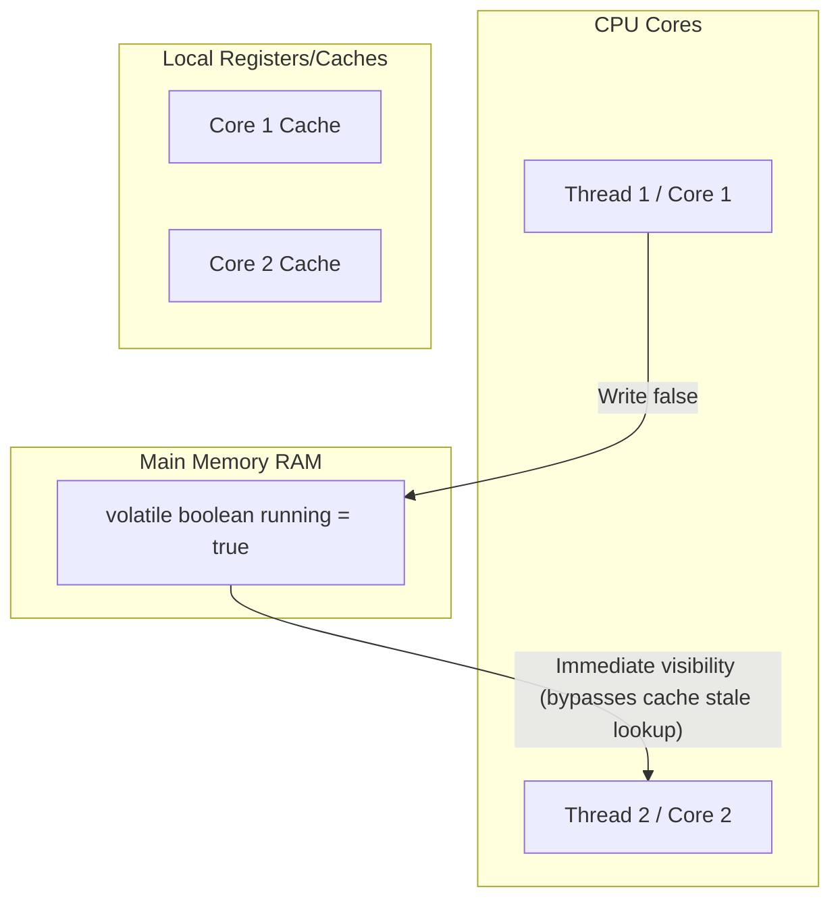

# Modifiers in Java - Part 2

| Concept | What to know |
| --- | --- |
| `abstract` | Abstract means incomplete by design: subclasses or implementations must provide missing behavior. |
| `synchronized` | Synchronized protects a critical section by using a monitor lock. |
| `volatile` | Volatile gives visibility guarantees for a variable shared between threads, but it does not make compound operations atomic. |
| `transient` | Transient marks a field that should be skipped during Java serialization. |
| `native` |`native` — native modifier indicates that a method is implemented in platform-dependent native code (C/C++) via JNI. |
| `strictfp` |`strictfp` — strictfp restricts floating-point calculations to ensure exact IEEE 754 portability across platforms. |
| `Static variable` | Static means the member belongs to the class rather than to one particular object. |
| `Static method` | Static means the member belongs to the class rather than to one particular object. |

## Detailed Notes

### abstract

Abstract means incomplete by design: subclasses or implementations must provide missing behavior.

Use it to predict the exact Java rule, the allowed form, and the failure mode. Review it with a tiny example instead of memorizing only the label.

#### abstract Class Code Example
```java
// Abstract Class definition
public abstract class GraphicObject {
    int x, y;

    // Concrete method in abstract class
    void moveTo(int newX, int newY) {
        this.x = newX;
        this.y = newY;
    }

    // Abstract method (no body, ends with semicolon)
    abstract void draw();
}

// Subclass implementing abstract method
class Circle extends GraphicObject {
    void draw() {
        System.out.println("Drawing a circle at " + x + ", " + y);
    }
}
```

#### Common Mistake - Declaring an abstract method with a body or inside a concrete class
Any class that declares one or more `abstract` methods must also be declared `abstract`. Furthermore, `abstract` methods cannot have a body (no braces, just a semicolon at the end). Writing `abstract void draw() {}` is a compile error because the empty braces `{}` constitute a method body.

Practical check:

- Define `abstract` in one sentence.
- Recognize `abstract` in code, commands, documentation, or interview prompts.
- Explain one bug, limitation, or tradeoff related to `abstract`.

Tiny example or mental model:

- When reading code, ask: what does `abstract` change, allow, reject, or clarify?

### synchronized

Synchronized protects a critical section by using a monitor lock.

It matters because concurrent code can look correct in single-thread tests but fail under timing pressure. A common confusion is assuming visibility, ordering, and atomicity are the same guarantee.

#### synchronized Code Example
```java
public class ThreadSafeCounter {
    private int count = 0;

    // Instance synchronized method locks on the 'this' object
    public synchronized void increment() {
        count++;
    }

    // Static synchronized method locks on ThreadSafeCounter.class
    public static synchronized void printHeader() {
        System.out.println("--- Counters Report ---");
    }

    public int getCount() {
        return count;
    }
}
```

#### Common Mistake - Static and instance synchronized methods blocking each other
Static synchronized methods and instance synchronized methods acquire DIFFERENT locks. A static synchronized method locks on the `Class` object, while an instance synchronized method locks on the individual object instance (`this`). Therefore, they will NOT block each other from running concurrently on different threads.

Practical check:

- Define `synchronized` in one sentence.
- Recognize `synchronized` in code, commands, documentation, or interview prompts.
- Explain one bug, limitation, or tradeoff related to `synchronized`.

Tiny example or mental model:

- When reading code, ask: what does `synchronized` change, allow, reject, or clarify?

## Why Synchronized Methods Use Monitor Locks and Reentrancy

In Java, every object is implicitly associated with an internal data structure called a **monitor lock** (or intrinsic lock). When a thread invokes an instance `synchronized` method, it must acquire the monitor lock of the calling instance (`this`) before executing the method body; if the lock is held by another thread, the invoking thread is blocked. To prevent a thread from deadlocking itself when calling another synchronized method on the same object, Java locks are **reentrant**. This means that the JVM tracks the lock's owner thread and an acquisition count; if the thread already holds the monitor lock, it is allowed to acquire it again, incrementing the count, and decrements the count upon exiting each synchronized block until the count reaches zero and the lock is fully released.

### Lock Reentrancy Execution Model

```text
Thread A tries to enter synchronized method1() -> Acquires Monitor Lock (Count = 1)
   |
   +---> Inside method1(), Thread A calls synchronized method2() on same object
            |
            +---> Lock is reentrant -> JVM sees Thread A already owns the lock
            |     Increments Lock Count (Count = 2)
            |     Thread A enters method2() without blocking!
            |
            +---> Thread A exits method2() -> Decrements Lock Count (Count = 1)
   |
Thread A exits method1() -> Decrements Lock Count (Count = 0) -> Lock Released
```

### Code Example: Demonstrating Lock Reentrancy
```java
public class ReentrantDemo {
    public synchronized void outerMethod() {
        System.out.println("Entering outerMethod");
        innerMethod(); // Reentrant call: succeeds without deadlocking on 'this'
        System.out.println("Exiting outerMethod");
    }

    public synchronized void innerMethod() {
        System.out.println("Executing innerMethod"); // Locked on same monitor
    }

    public static void main(String[] args) {
        ReentrantDemo demo = new ReentrantDemo();
        demo.outerMethod();
        // Output:
        // Entering outerMethod
        // Executing innerMethod
        // Exiting outerMethod
    }
}
```

### Cause-Effect Chain of Reentrant Synchronization
- **Trigger**: Thread requests access to a synchronized block/method of an object.
- **Immediate Effect**: The JVM checks the monitor lock owner; if it matches the current thread, the lock count is incremented, and access is immediately granted without blocking.
- **Secondary Effect**: Nested synchronized calls on the same object proceed safely without self-deadlock.
- **Ultimate Outcome**: Thread-safe execution is achieved while avoiding recursive blocking states.

### volatile

Volatile gives visibility guarantees for a variable shared between threads, but it does not make compound operations atomic.

It matters because concurrent code can look correct in single-thread tests but fail under timing pressure. A common confusion is assuming visibility, ordering, and atomicity are the same guarantee.

#### volatile Code Example
```java
public class SharedFlagDemo {
    // volatile ensures write by one thread is immediately visible to others
    private volatile boolean running = true;

    public void stop() {
        running = false;
    }

    public void work() {
        while (running) {
            // Do some background processing
        }
        System.out.println("Stopped gracefully.");
    }
}
```

#### Common Mistake - Assuming volatile guarantees atomicity for compound operations
The `volatile` keyword only guarantees visibility and ordering (preventing instruction reordering). It does NOT guarantee atomicity for compound operations like incrementing a number (`count++`). If multiple threads execute `count++` on a volatile variable, updates can still be lost. For atomic operations, use `synchronized` or classes from `java.util.concurrent.atomic`.

Practical check:

- Define `volatile` in one sentence.
- Recognize `volatile` in code, commands, documentation, or interview prompts.
- Explain one bug, limitation, or tradeoff related to `volatile`.

Tiny example or mental model:

- When reading code, ask: what does `volatile` change, allow, reject, or clarify?

## Why Volatile Guarantees Visibility and Ordering, but Not Atomicity

To optimize performance, modern processors use multi-level caches (L1, L2, L3) and compiler optimization techniques like instruction reordering, which can cause threads to see stale variable values. Marking a field as `volatile` forces the JVM to read and write the variable directly from/to main memory (RAM) instead of CPU caches, ensuring that any write to a volatile variable is immediately visible to all other threads. Additionally, the compiler and processor are prevented from reordering reads and writes around the volatile variable due to the insertion of memory barriers. However, `volatile` does not guarantee atomicity because it does not acquire a lock; compound operations like `count++` require a read, modify, and write cycle, during which another thread can modify the value, resulting in lost updates.

### Memory Visibility Model (Cache vs Main Memory)



### Code Example: Non-Atomicity of Volatile Increment
```java
public class VolatileCounter implements Runnable {
    private volatile int count = 0;

    @Override
    public void run() {
        for (int i = 0; i < 1000; i++) {
            count++; // Non-atomic compound operation: read, modify, write
        }
    }

    public static void main(String[] args) throws InterruptedException {
        VolatileCounter vc = new VolatileCounter();
        Thread t1 = new Thread(vc);
        Thread t2 = new Thread(vc);
        t1.start(); t2.start();
        t1.join(); t2.join();
        System.out.println("Final count: " + vc.count); 
        // Output will frequently be less than 2000 due to lost updates (e.g., 1852)
    }
}
```

### Cause-Effect Chain of Volatile Variables
- **Trigger**: Field marked with `volatile` modifier.
- **Immediate Effect**: The compiler inserts memory barriers, preventing CPU local caching and instruction reordering across the boundary.
- **Secondary Effect**: Reads and writes sync directly with main memory, guaranteeing visibility of updates.
- **Ultimate Outcome**: Thread visibility is achieved, but multi-step operations remain non-atomic without synchronization.

### transient

Transient marks a field that should be skipped during Java serialization.

### native

### strictfp

### Static variable

Static means the member belongs to the class rather than to one particular object.

Use it to predict the exact Java rule, the allowed form, and the failure mode. Review it with a tiny example instead of memorizing only the label.

Practical check:

- Define `Static variable` in one sentence.
- Recognize `Static variable` in code, commands, documentation, or interview prompts.
- Explain one bug, limitation, or tradeoff related to `Static variable`.

Tiny example or mental model:

- `ClassName.member` accesses a class-level member.

## Why Static Members are Allocated in Metaspace and Shared

In Java, `static` members (variables and methods) belong to the class blueprint itself rather than to any individual object instance. When the JVM loads a class, class metadata—including `static` variables and references to `static` methods—is allocated in a special memory region called **Metaspace** (which replaced the PermGen space in Java 8). Because Metaspace is a class-level storage area separate from the Garbage-Collected Heap where instances reside, static fields exist as a single copy shared by all instances of that class. Modifying a static variable through one instance immediately affects what all other instances see, since they all point to the same memory location in Metaspace.

### Memory Allocation Model: Metaspace vs Heap

```text
+-------------------------------------------------------------+
|                        JVM Memory                           |
+-----------------------------+-------------------------------+
|   Metaspace (Class Metadata) |      Heap (Object Instances)   |
|                             |                               |
|  +-----------------------+  |    +-----------------------+  |
|  | Class: Counter        |  |    | Counter Instance 1    |  |
|  | - static count = 2    |<------| - (points to class)   |  |
|  +-----------------------+  |    +-----------------------+  |
|                             |    +-----------------------+  |
|                             |    | Counter Instance 2    |  |
|                             |----| - (points to class)   |  |
|                             |    +-----------------------+  |
+-----------------------------+-------------------------------+
```

### Code Example: Shared Static Variable
```java
public class Counter {
    public static int count = 0; // Allocated in Metaspace

    public Counter() {
        count++; // Increments the single class-level counter
    }

    public static void main(String[] args) {
        Counter c1 = new Counter();
        Counter c2 = new Counter();
        System.out.println(Counter.count); // Output: 2
        System.out.println(c1.count);      // Output: 2
        System.out.println(c2.count);      // Output: 2
    }
}
```

### Cause-Effect Chain of Static Members
- **Trigger**: Field or method declared with the `static` keyword.
- **Immediate Effect**: Memory is allocated within Metaspace during class loading, before object instantiation.
- **Secondary Effect**: Only a single copy of the variable exists, accessible via the class name or any instance reference.
- **Ultimate Outcome**: All instances share access to the same memory address, facilitating shared class-level state.

### Static method

Static means the member belongs to the class rather than to one particular object.

Use it to predict the exact Java rule, the allowed form, and the failure mode. Review it with a tiny example instead of memorizing only the label.

#### Static Method vs Instance Method Comparison
```java
public class MethodComparisonDemo {
    private int instanceValue = 42;
    private static int classValue = 100;

    // Instance method: requires an object instance, can access static & instance variables
    public void printInstance() {
        System.out.println("Instance value: " + this.instanceValue);
        System.out.println("Static value: " + classValue); // OK
    }

    // Static method: belongs to the class blueprint, can ONLY access static variables
    public static void printStatic() {
        System.out.println("Static value: " + classValue);
        // System.out.println(instanceValue); // COMPILE ERROR! Cannot access instance variable
    }
}
```

#### Common Mistake - Calling non-static members from static context
Static methods belong to the class blueprint, not to any individual instance. Hence, they cannot access instance fields or call non-static methods directly without an explicit instance reference. They also cannot use the `this` or `super` keywords.

Practical check:

- Define `Static method` in one sentence.
- Recognize `Static method` in code, commands, documentation, or interview prompts.
- Explain one bug, limitation, or tradeoff related to `Static method`.

Tiny example or mental model:

- `ClassName.member` accesses a class-level member.
