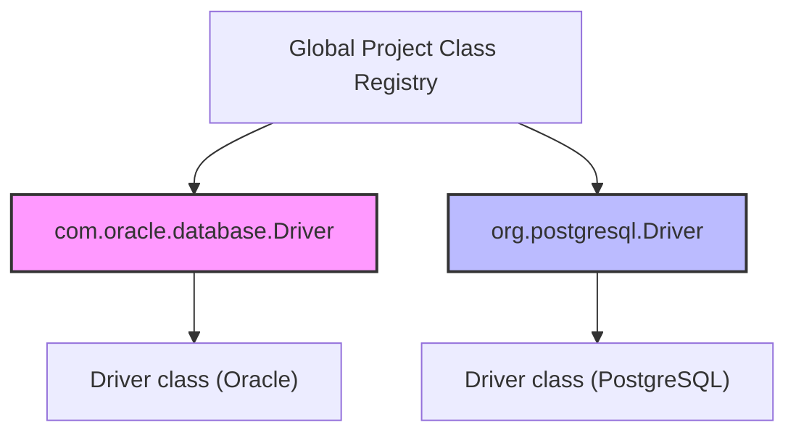
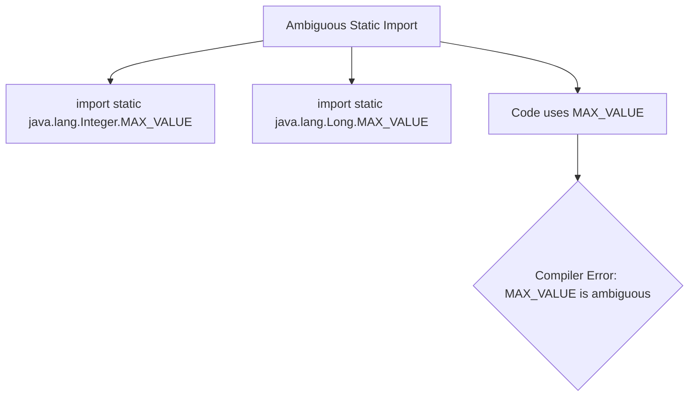
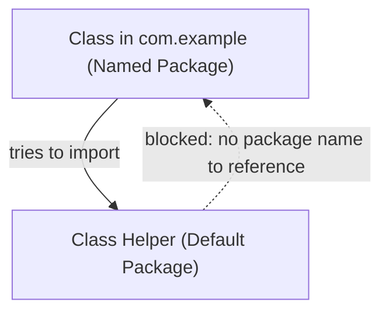
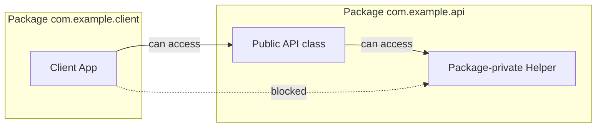
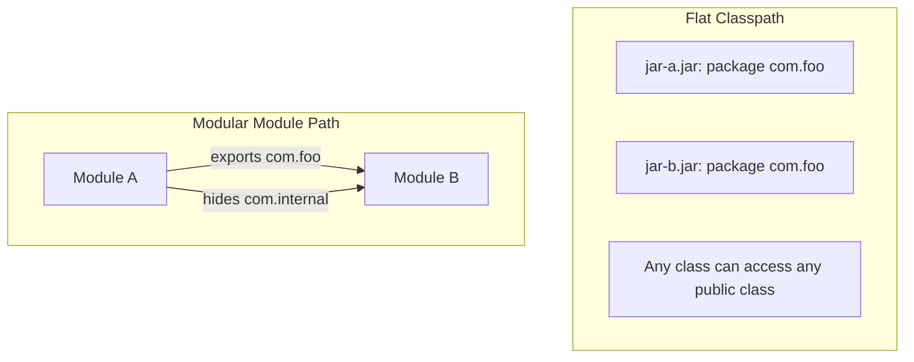

# Package and Access Control - Part 1

| Concept | What to know |
| --- | --- |
| `What is a package?` | A package groups related classes and gives them a namespace. |
| `Create package` | A package groups related classes and gives them a namespace. |
| `Import package` | A package groups related classes and gives them a namespace. |
| `import static` | Static means the member belongs to the class rather than to one particular object. |
| `Default package` | A package groups related classes and gives them a namespace. |
| `Package naming convention` | A package groups related classes and gives them a namespace. |
| `Access between packages` | A package groups related classes and gives them a namespace. |
| `Classpath` | Classpath tells the JVM and compiler where to find classes and JARs. |
| `Basic module path` | Module path is the module-system-aware alternative to classpath for named modules. |

## Detailed Notes

### What is a package?

A package groups related classes and gives them a namespace.

#### Enriched Details & Code Example
A package is a grouping of related types (classes, interfaces, enums, annotations) providing access protection and namespace management. It solves naming conflicts by prefixing class names with package names.

```java
package com.example.geometry;

public class Point {
    private int x, y;
    public Point(int x, int y) {
        this.x = x;
        this.y = y;
    }
}
```

#### Why Java Uses Packages for Namespace Isolation and Reverse DNS

In large-scale software development, naming collisions are inevitable when multiple independent libraries or developers define classes with identical simple names (e.g., `Date`, `Parser`, `Buffer`). Java resolves this by using hierarchical packages to create distinct namespaces, partitioning the global class namespace into isolated scopes. To guarantee that these package names are globally unique across different organizations without requiring a central authority to validate name registrations, Java adopts the reverse Domain Name System (DNS) naming convention (e.g., `com.company.project`). This convention leverages the pre-existing, legally unique ownership of internet domains as a natural naming registry, ensuring that no two organizations publish packages with the same fully qualified names.



```java
// Demonstrating resolution of a naming conflict using Fully Qualified Class Names (FQCN)
public class NamespaceDemo {
    public static void main(String[] args) {
        // java.util.Date and java.sql.Date coexist because they inhabit distinct package namespaces
        java.util.Date utilDate = new java.util.Date();
        java.sql.Date sqlDate = new java.sql.Date(System.currentTimeMillis());
        
        System.out.println(utilDate.getClass().getName()); // java.util.Date
        System.out.println(sqlDate.getClass().getName());  // java.sql.Date
    }
}
```

* **Cause-Effect Chain:**
  Multiple organizations write code $\rightarrow$ they independently choose identical class names (e.g., `Driver`) $\rightarrow$ compilation fails due to class name ambiguity $\rightarrow$ adopting reverse DNS namespaces partitions classes into unique folders/qualifiers $\rightarrow$ class names are uniquely resolved at compile and run time.

### Create package

A package groups related classes and gives them a namespace.

#### Enriched Details & Code Example
A package is declared using the `package` statement. It must be the very first non-whitespace, non-comment statement in the Java source file. The physical directory path of the source and class files must mirror the package namespace structure.

```java
// Must be the first statement in the file (excluding comments/whitespace)
package com.example.util;

public class MathUtils {
    public static int add(int a, int b) {
        return a + b;
    }
}
```
**Common Mistake:** Placing the `package` declaration after `import` statements or class declarations. This causes a compile-time error: `class, interface, enum, or record expected`.

#### Why Directory Structures Must Mirror Package Declarations

The Java compiler (`javac`) and the Java Virtual Machine (`JVM`) do not search the entire filesystem dynamically to resolve class references, as doing so would lead to extremely slow compilation and startup times. Instead, they rely on a strict mapping where dot-separated package name components correspond directly to nested directory paths. For example, a class declared as `package com.example.util.MathUtils` must be located in a directory hierarchy ending in `com/example/util/MathUtils.class` relative to the classpath root. This physical mapping allows the classloader to convert the fully qualified class name directly into a file path (by replacing `.` with `/` and appending `.class`), enabling immediate, predictable, and high-performance filesystem lookups.


```java
// File structure: src/com/example/util/MathUtils.java
package com.example.util;

public class MathUtils {
    public static int add(int a, int b) {
        return a + b;
    }
}
// If this file were moved to src/com/MathUtils.java, compiling it with:
// javac -d bin src/com/MathUtils.java
// and running a dependent class would fail with:
// NoClassDefFoundError: com/example/util/MathUtils (wrong name: MathUtils)
```

* **Cause-Effect Chain:**
  A class is declared with `package A.B` $\rightarrow$ the compiler maps `A.B.Class` to `A/B/Class.class` $\rightarrow$ the ClassLoader replaces dots with slashes during runtime lookup $\rightarrow$ it checks directory `A/B` under classpath entries $\rightarrow$ it loads the class without searching the entire disk.

### Import package

A package groups related classes and gives them a namespace.

#### Enriched Details & Code Example
To use a class from another package without its fully qualified name, use the `import` statement.
- **Specific Import:** Imports a single class.
- **Wildcard Import:** Imports all classes in a package using `*`. It is NOT recursive (does not import sub-packages).
- **Fully Qualified Class Name (FQCN):** Directly referencing a class by its absolute package path (e.g. `java.util.List`).

```java
package com.example.app;

// Specific Import
import java.util.ArrayList;
// Wildcard Import (imports java.util.List, java.util.Map, etc. but NOT java.util.concurrent.*)
import java.util.*; 

public class ImportDemo {
    public static void main(String[] args) {
        // Specific import used
        ArrayList<String> list = new ArrayList<>();
        
        // Fully Qualified Class Name (FQCN) used to bypass import
        java.time.LocalDate today = java.time.LocalDate.now();
    }
}
```
**Common Mistake:** Believing wildcard imports like `import java.util.*;` import sub-packages (like `java.util.concurrent.*`). They do not; sub-packages must be imported separately.

### import static

Static means the member belongs to the class rather than to one particular object.

Use it to predict the exact Java rule, the allowed form, and the failure mode. Review it with a tiny example instead of memorizing only the label.

Practical check:

- Define `import static` in one sentence.
- Recognize `import static` in code, commands, documentation, or interview prompts.
- Explain one bug, limitation, or tradeoff related to `import static`.

Tiny example or mental model:

- `ClassName.member` accesses a class-level member.

#### Enriched Details & Code Example
The `import static` statement allows access to static members (fields and methods) of a class without prefixing them with the class name.

```java
package com.example.math;

// Import a specific static member
import static java.lang.Math.PI;
// Import all static members of java.lang.Math
import static java.lang.Math.*;

public class StaticImportDemo {
    public double getArea(double radius) {
        // PI and pow are accessed directly
        return PI * pow(radius, 2);
    }
}
```
**Common Mistake:** Writing `static import` instead of `import static`. This is a compile error: `syntax error on token "static", import expected`.

#### Why Static Imports Balance Readability and Naming Collision Risks

Static imports allow developers to access static constants or methods of a class directly without qualifying them with the class name, which reduces visual noise and boilerplate in mathematical, testing, or domain-specific language code. However, this convenience introduces a significant risk of naming collisions and readability degradation when multiple classes containing identical static member names are imported. When a static import brings in two static fields or methods of the same name from different classes (such as `MAX_VALUE` from both `Integer` and `Long`), the compiler cannot determine which one is referenced. This results in a compile-time ambiguity error, forcing developers to explicitly qualify the member or remove the wildcard static import.



```java
// File: StaticCollision.java
import static java.lang.Integer.MAX_VALUE;
import static java.lang.Long.MAX_VALUE; // Importing both causes no error itself

public class StaticCollision {
    public static void main(String[] args) {
        // System.out.println(MAX_VALUE); // COMPILE ERROR: reference to MAX_VALUE is ambiguous
        
        // Must resolve by using fully qualified or class-qualified access:
        System.out.println(java.lang.Integer.MAX_VALUE); // 2147483647
        System.out.println(java.lang.Long.MAX_VALUE);    // 9223372036854775807
    }
}
```

* **Cause-Effect Chain:**
  Static imports are used to remove class qualifiers $\rightarrow$ compiler imports names directly into the local namespace $\rightarrow$ two static imports share the same simple name $\rightarrow$ local usage of the simple name becomes ambiguous $\rightarrow$ the compiler throws a compile-time lookup error.

### Default package

A package groups related classes and gives them a namespace.

#### Enriched Details & Code Example
If a source file does not have a `package` statement, it belongs to the unnamed **default package**.

```java
// No package statement means this class is in the default package
public class Helper {
    public void printMessage() {
        System.out.println("Helper in default package");
    }
}
```
**Common Mistake:** Attempting to import a class from the default package into a named package. Classes in named packages cannot import classes in the default package. Doing so results in a compilation error.

#### Why the Default Package Should Be Avoided in Production

The default (unnamed) package serves as a quick scratchpad for beginners or short script files, but it presents severe limitations for real-world projects. Specifically, Java does not allow classes residing in a named package to import classes from the default package, creating a strict architectural barrier. This constraint prevents libraries or core components written in the default package from being integrated into structured, packaged applications. Additionally, classes in the default package cannot be modularized under the Java Platform Module System (JPMS), because modular descriptors (`module-info.java`) require explicit, named packages to export APIs to other modules.



```java
// File 1: Helper.java (default package, no package statement)
public class Helper {
    public void sayHello() { System.out.println("Hello"); }
}

// File 2: com/example/App.java (named package)
package com.example;
// import Helper; // COMPILE ERROR: Cannot import class from default package

public class App {
    public static void main(String[] args) {
        // Helper h = new Helper(); // COMPILE ERROR: Cannot resolve symbol 'Helper'
    }
}
```

* **Cause-Effect Chain:**
  No package statement is defined in a class $\rightarrow$ the compiler assigns it to the unnamed package $\rightarrow$ a class in a named package tries to import it $\rightarrow$ there is no namespace path to locate the target class $\rightarrow$ compilation fails.

### Package naming convention

A package groups related classes and gives them a namespace.

#### Enriched Details & Code Example
Package names are always written in lowercase to avoid naming conflicts with classes. They use reversed internet domain names as a prefix to ensure uniqueness across different organizations.

```java
package com.mycompany.projectname.modulename;

public class Controller {
    // lowercase package names are readable and avoid class name collisions
}
```

### Access between packages

A package groups related classes and gives them a namespace.

#### Enriched Details & Code Example
Java has four access levels:
- `public`: Accessible anywhere.
- `protected`: Accessible within the same package, and by subclasses in other packages.
- package-private (default): Accessible only within the same package.
- `private`: Accessible only within the same class.

```java
// File: pack1/Parent.java
package pack1;

public class Parent {
    public int publicVar = 1;
    protected int protectedVar = 2;
    int defaultVar = 3; // package-private
    private int privateVar = 4;
}

// File: pack2/Child.java
package pack2;

import pack1.Parent;

public class Child extends Parent {
    public void testAccess() {
        System.out.println(publicVar);      // OK: public
        System.out.println(protectedVar);   // OK: protected accessed via inheritance
        // System.out.println(defaultVar);  // COMPILE ERROR: default is package-private
        // System.out.println(privateVar);  // COMPILE ERROR: private is restricted
    }
}
```
**Common Mistake:** Subclasses in another package can access protected members *only* on instances of the subclass or its sub-types. They cannot access them on an instance of the superclass.

#### Why Default (Package-Private) Access Controls Internal Package Access

Java's package-private (default) access level lacks any keyword and is active when no modifier is specified on a class, method, or field. This access control level serves as a crucial boundary to enforce the Principle of Least Privilege by restricting visibility strictly to classes defined within the same package. It allows a set of co-operating classes in a package to collaborate and share internal implementation details (such as helper classes, package-private constructors, or state management methods) without exposing these details as public API. This keeps the public surface area of a library small, making the library easier to maintain and modify without breaking external consumer code.



```java
// File 1: com/example/api/Service.java
package com.example.api;
public class Service {
    // Package-private helper method
    void internalExecute() {
        System.out.println("Executing internal task...");
    }
}

// File 2: com/example/client/App.java
package com.example.client;
import com.example.api.Service;
public class App {
    public static void main(String[] args) {
        Service s = new Service();
        // s.internalExecute(); // COMPILE ERROR: internalExecute() is not public in Service; cannot be accessed from outside package
    }
}
```

* **Cause-Effect Chain:**
  A member is declared without any access modifier $\rightarrow$ it is assigned package-private access $\rightarrow$ external classes outside the package attempt to access it $\rightarrow$ the compiler checks package boundaries and blocks the reference $\rightarrow$ package-internal implementation remains encapsulated.

### Classpath

Classpath tells the JVM and compiler where to find classes and JARs.

#### Enriched Details & Code Example
The classpath tells the compiler (`javac`) and the JVM (`java`) where to find user-defined classes and packages. It can be specified via the `CLASSPATH` environment variable or the `-cp` / `-classpath` command line flags.

```bash
# Compilation using classpath
javac -cp "lib/*:src" src/com/example/Main.java

# Running the application using classpath
java -cp "lib/*:bin" com.example.Main
```

### Basic module path

Module path is the module-system-aware alternative to classpath for named modules.

#### Enriched Details & Code Example
Introduced in Java 9, the module path (`--module-path` or `-p`) is the modular alternative to the classpath. It specifies the location of application and library modules. Unlike the classpath, it enforces strong encapsulation and checks module dependencies at startup.

```bash
# Compiling a module
javac -d mods/com.example.app --module-source-path src src/com.example.app/module-info.java src/com.example.app/com/example/app/Main.java

# Running a modular application using module-path
java --module-path mods --module com.example.app/com.example.app.Main
```

#### Why Classpath and Module Path Differ in Package Access Constraints

The traditional classpath resolves classes by performing a sequential search through a flat list of directories and JAR files, loading the first matching class it encounters. This mechanism has no concept of module boundaries and fails to enforce package access constraints at runtime: any class on the classpath can access public members of any other class on the classpath, and duplicate packages in different JARs can lead to silent shadowing. In contrast, the module path introduced in Java 9 enforces strict encapsulation and reliable dependencies at start-up. Classes on the module path must be part of named modules declared in `module-info.java`, which explicitly specifies which packages are exported to other modules, blocking access to unexported packages even if they contain public classes.



```java
// module-info.java in com.example.provider module
module com.example.provider {
    exports com.example.api;
    // com.example.internal package is NOT exported, even if its classes are public
}

// A class in another module trying to access com.example.internal.Helper:
// import com.example.internal.Helper; // COMPILE ERROR: Package com.example.internal is not visible
```

* **Cause-Effect Chain:**
  Java 9+ module path checks module descriptors at boot time $\rightarrow$ it identifies which packages are exported $\rightarrow$ a consumer attempts to import a public class in an unexported package $\rightarrow$ the runtime and compiler enforce strong encapsulation $\rightarrow$ the access is blocked, preventing dependency on internals.

## Case Study: Naming Collisions

When two different packages define classes with the same name, importing both packages will lead to compilation errors if the class name is used without qualification.

Suppose we want to use the class `Date` from both `java.util` and `java.sql`.

```java
import java.util.Date;
import java.sql.Date; // COMPILE ERROR: Date is already defined in a single-type import

public class CollisionDemo {
    public static void main(String[] args) {
        Date date = new Date(); // Ambiguity if we try to import both
    }
}
```

### Resolution 1: Use Fully Qualified Class Names (FQCN)
Instead of importing both, use their full package prefixes inside the code:
```java
public class CollisionDemo {
    public static void main(String[] args) {
        java.util.Date utilDate = new java.util.Date();
        java.sql.Date sqlDate = new java.sql.Date(System.currentTimeMillis());
    }
}
```

### Resolution 2: Import One, Qualify the Other
Import the most frequently used class, and use the FQCN for the other:
```java
import java.util.Date; // Specific import

public class CollisionDemo {
    public static void main(String[] args) {
        Date utilDate = new Date(); // java.util.Date
        java.sql.Date sqlDate = new java.sql.Date(System.currentTimeMillis()); // java.sql.Date
    }
}
```

---

## Common Mistakes Summary

1. **Sub-package Import Misconception**: Writing `import java.util.*;` does not import `java.util.concurrent.ConcurrentHashMap`. Imports are flat, not recursive.
2. **Incorrect Directory Structure**: Placing `package com.example;` inside a directory like `src/com/` instead of `src/com/example/`. The folder hierarchy must match the package declaration exactly.
3. **Importing from Default Package**: Attempting to import or use a class from the default (unnamed) package inside a named package class. Java does not allow this.
4. **Incorrect Order of import static**: Writing `static import` instead of `import static`.
5. **Accessing Protected Members of Superclass Instance in Different Package**: A subclass in package `B` inheriting from a class in package `A` can access the protected field of its superclass *only* via references of its own subclass type. It cannot access it using a parent/superclass reference.

## Reference Links

- [JLS Chapter 7 - Packages](https://docs.oracle.com/javase/specs/jls/se21/html/jls-7.html)
- [JLS Section 6.6 - Access Control](https://docs.oracle.com/javase/specs/jls/se21/html/jls-6.html#jls-6.6)
- [JLS Section 7.5 - Import Declarations](https://docs.oracle.com/javase/specs/jls/se21/html/jls-7.html#jls-7.5)
- [Oracle Java Tutorial - Creating and Using Packages](https://docs.oracle.com/javase/tutorial/java/package/packages.html)
- [Oracle Java Tutorial - Using Package Members](https://docs.oracle.com/javase/tutorial/java/package/usepkgs.html)
