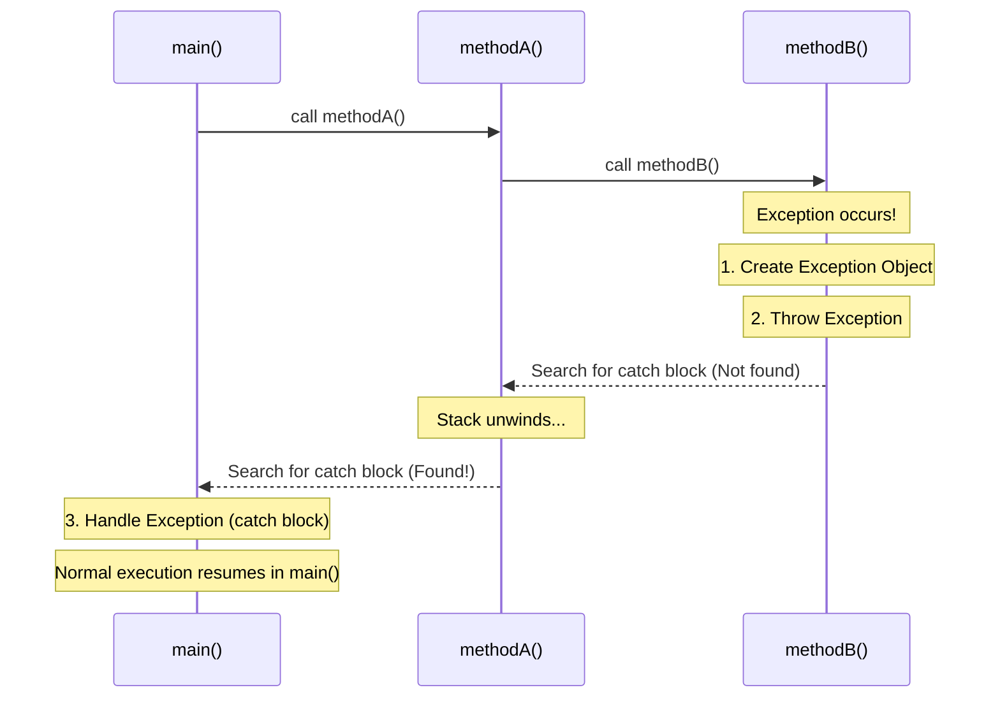
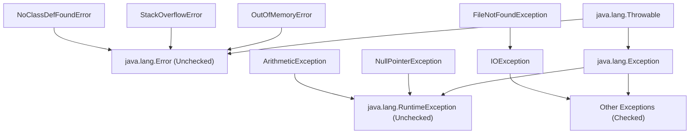

# Exception Handling - Part 1

## Detailed Notes

### What is an exception?

An exception (ngoại lệ) is an event that occurs during the execution of a program, disrupting the normal flow of instructions. When an error occurs within a method, the method creates an object—the **exception object**—and hands it off to the runtime system (JVM). This object contains information about the error, including its type and the state of the program when the error occurred. Creating an exception object and handing it to the runtime system is called **throwing an exception**.

Understanding exceptions is crucial because they separate error-handling code from regular program logic. Instead of polluting every method with nested conditional checks to detect failures, Java uses exceptions to propagate errors up the call stack until an appropriate handler is found. A common confusion is treating exceptions as fatal crashes; in reality, they are structured signals designed to help programs degrade gracefully or recover from unexpected runtime conditions.

#### Technical Mechanism: Stack Unwinding
When an exception is thrown, the JVM searches the call stack for a method containing a compatible exception handler (a `catch` block matching the exception type). This search starts from the method where the error occurred and proceeds backward through the call stack (the sequence of method calls) in reverse order of invocation. This process of searching and traversing back through the stack is called **stack unwinding**. If the JVM finds a matching handler, it passes the exception object to that handler. If no handler is found after searching the entire stack (including the `main` method), the JVM's default exception handler takes over, prints the stack trace, and terminates the thread.

#### Mental Model: The Control Flow Deviation


#### Runnable Code Example: Exception Life Cycle
Below is a runnable example demonstrating how an exception is thrown, how normal execution is interrupted, and how control flows to the matching catch block.

```java
public class ExceptionLifeCycleDemo {
    public static void performDivision() {
        System.out.println("  [performDivision] About to divide by zero...");
        int result = 10 / 0; // Throws ArithmeticException
        System.out.println("  [performDivision] This line will never execute!");
    }

    public static void main(String[] args) {
        System.out.println("[main] Starting program");
        try {
            System.out.println("[main] Entering try block");
            performDivision();
            System.out.println("[main] Leaving try block (will not print)");
        } catch (ArithmeticException e) {
            System.out.println("[main] Caught exception: " + e.getClass().getSimpleName() + " - " + e.getMessage());
        }
        System.out.println("[main] Program continues normally after try-catch");
    }
}
/*
Expected Output:
[main] Starting program
[main] Entering try block
  [performDivision] About to divide by zero...
[main] Caught exception: ArithmeticException - / by zero
[main] Program continues normally after try-catch
*/
```

#### Cause-Effect Chain
Error in code (e.g., dividing by zero) &rarr; JVM detects invalid operation &rarr; Exception object (`ArithmeticException`) created and populated with stack trace &rarr; Current execution path halted &rarr; JVM traverses back through call stack &rarr; Matches catch block in `main` &rarr; Control transferred to catch block &rarr; Program avoids crashing and resumes normal flow.

---

### Error vs Exception

The root class of all exception-related classes in Java is `java.lang.Throwable`. Beneath `Throwable`, the hierarchy splits into two primary, distinct branches: `java.lang.Error` and `java.lang.Exception`.

#### Detailed Definitions

*   **Error (`java.lang.Error`)**: Represents serious, catastrophic runtime failures that are external to the application itself. These are typically resource exhaustion at the JVM level, hardware limitations, or library loading failures. Under normal conditions, an application **should not attempt to catch an Error** or try to recover from it. When an `Error` occurs, the JVM itself is often unstable, and attempting to continue execution can lead to corrupt states or silent failures.
*   **Exception (`java.lang.Exception`)**: Represents exceptional conditions that a well-written application should anticipate and handle. These are logic errors, resource unavailability (like missing files or database offline), or bad input. Exceptions are meant to be caught, logged, and recovered from, allowing the application to continue running or shut down clean.

#### Key Differences: Error vs Exception

**Error (`java.lang.Error`)** has the following key characteristics:
- **Origin**: JVM, system resources, or compiler-linker mismatches.
- **Recoverability**: Unrecoverable. The program should be allowed to crash.
- **Compiler Enforced**: Unchecked. The compiler never requires catching or declaring.
- **Common Examples**: `OutOfMemoryError`, `StackOverflowError`, `NoClassDefFoundError`.

**Exception (`java.lang.Exception`)** has the following key characteristics:
- **Origin**: Application code logic, input data, or external resources.
- **Recoverability**: Recoverable. The application can handle, fallback, or retry.
- **Compiler Enforced**: Can be Checked (required) or Unchecked (subclasses of RuntimeException).
- **Common Examples**: `NullPointerException`, `IOException`, `FileNotFoundException`.

#### Deep-Dive: Common Errors Explained
1.  **`OutOfMemoryError`**:
    *   *Cause*: The JVM runs out of Java heap space and the Garbage Collector (GC) cannot reclaim enough memory to allocate a new object.
    *   *Why catching it is bad*: If memory is completely exhausted, the code inside a catch block (e.g., logging, clean-up) will also fail to allocate memory, resulting in cascading allocation failures.
2.  **`StackOverflowError`**:
    *   *Cause*: The call stack frame allocation exceeds the configured stack size limit, typically due to deep or infinite recursion.
    *   *Why catching it is bad*: The thread has run out of stack space. Trying to execute a catch block or any subsequent method requires pushing a new stack frame, which immediately triggers another stack overflow.
3.  **`NoClassDefFoundError`**:
    *   *Cause*: The JVM's ClassLoader tries to load the definition of a class at runtime but cannot find the corresponding `.class` file, even though the class was present during compilation. This usually indicates classpath configuration issues or missing runtime dependency JARs.

#### Deep-Dive: Common Exceptions Explained
Java exceptions are split into two categories depending on when they are checked (at compile-time or runtime).
*   **Checked Exceptions**: Inherit directly from `Exception` but *not* `RuntimeException`. They represent predictable errors in external resources (e.g., `IOException`, `SQLException`).
*   **Unchecked Exceptions**: Inherit from `RuntimeException`. They represent programming bugs or invalid states (e.g., `NullPointerException`, `IndexOutOfBoundsException`).

#### Mental Model: The Throwable Hierarchy


#### Runnable Code Example: Sapping Resources (Error) vs Handling Business Logic (Exception)
Below is a program that shows the destructive nature of a `StackOverflowError` compared to an `ArithmeticException`. Note that while we catch the `StackOverflowError` here for demonstration purposes, this is **highly discouraged** in production code.

```java
public class ThrowableHierarchyDemo {
    // 1. Error: Stack Overflow via infinite recursion
    public static void recursiveCall(int depth) {
        // Will exhaust stack space and throw StackOverflowError
        recursiveCall(depth + 1);
    }

    // 2. Exception: Division by zero (recoverable arithmetic issue)
    public static int divideNumbers(int a, int b) {
        return a / b;
    }

    public static void main(String[] args) {
        // Recovering from Exception: Normal application flow
        try {
            int result = divideNumbers(10, 0);
        } catch (ArithmeticException e) {
            System.out.println("[Exception] Recovered from division error: " + e.getMessage());
        }

        // JVM Disaster: Caught only to show it happened
        try {
            recursiveCall(1);
        } catch (StackOverflowError err) {
            System.err.println("[Error] Stack overflow occurred! JVM stack frames exhausted.");
        }
    }
}
/*
Expected Output:
[Exception] Recovered from division error: / by zero
[Error] Stack overflow occurred! JVM stack frames exhausted.
*/
```

#### Cause-Effect Chain
Deep recursive call &rarr; Call stack allocates a new stack frame for each call &rarr; Thread's stack limit exceeded &rarr; JVM throws `StackOverflowError` &rarr; Current thread halts immediately &rarr; Resources are too depleted for normal processing &rarr; Thread terminates (JVM may exit if it's the main thread).

---

### Checked exception

A **checked exception** is an exception that is checked by the compiler at compile-time. Java mandates that you must acknowledge and handle these exceptions explicitly before your code will compile.

#### Technical Mechanism: The Compiler's Catch-or-Specify Requirement
When a method contains code that could throw a checked exception (e.g., calling a method that declares `throws IOException`), the compiler enforces the **Catch-or-Specify Requirement**. You must do one of two things:
1.  **Catch**: Wrap the risky code in a `try` block and catch the exception in a corresponding `catch` block.
2.  **Specify**: Declare that the method itself throws the checked exception by appending `throws ExceptionType` to the method signature, passing the responsibility to handle the exception up to the caller.

Checked exceptions represent issues with external resources (file system, network, database) that are out of the application's control but are highly predictable. For example, when reading a file, the compiler knows the file might not exist. By forcing the developer to handle this possibility upfront, Java attempts to make production code robust against environmental failures.

#### Common Checked Exceptions Analyzed
*   **`IOException` / `FileNotFoundException`**:
    *   *Trigger*: A file path is invalid, a disk is full, or a network stream terminates abruptly during read/write.
    *   *Why checked*: External I/O is notoriously unstable. Java forces you to define a fallback plan (e.g., asking the user for a different path, logging the error, or failing cleanly) instead of letting the application crash unexpectedly.
*   **`ClassNotFoundException`**:
    *   *Trigger*: Code attempts to load a class dynamically using its string name (e.g., `Class.forName("com.mysql.jdbc.Driver")`), but the class loader cannot find the class in the current classpath.
    *   *Why checked*: Dynamic loading is prone to runtime typos or missing library JARs. Java forces the developer to handle this configuration failure.

#### Runnable Code Example: Handling Checked Exceptions
```java
import java.io.FileReader;
import java.io.FileNotFoundException;

public class CheckedExceptionDemo {
    // Option 1: Specify the checked exception in the method signature
    public static void openFile(String path) throws FileNotFoundException {
        // If file does not exist, FileReader constructor throws FileNotFoundException (checked)
        FileReader fr = new FileReader(path);
    }

    // Option 2: Catch the checked exception in a try-catch block
    public static void readConfiguration() {
        try {
            openFile("config.json");
        } catch (FileNotFoundException e) {
            System.out.println("[Handled] Configuration file config.json not found. Loading default settings.");
        }
    }

    public static void main(String[] args) {
        readConfiguration();
    }
}
/*
Expected Output:
[Handled] Configuration file config.json not found. Loading default settings.
*/
```

#### Cause-Effect Chain
Code attempts to instantiate `FileReader` with a non-existent file path &rarr; Constructor checks file existence &rarr; File is missing &rarr; Constructor throws `FileNotFoundException` &rarr; Compiler checks if the calling code handles or declares the exception &rarr; If not handled/declared: compile-time error occurs &rarr; If handled: normal program execution resumes in the catch block.

---

### Unchecked exception

An **unchecked exception** (also known as a runtime exception) is an exception that is **not** checked by the compiler. The compiler does not require you to catch or declare unchecked exceptions in method signatures.

#### Technical Mechanism: Runtime Failures
Unchecked exceptions represent **programming bugs**—mistakes made by the developer that could have been avoided by writing better code. Examples include accessing elements beyond array bounds, dereferencing a null pointer, or performing invalid division. Because these bugs can theoretically happen in almost any method call, forcing the developer to declare them everywhere would lead to excessive boilerplate code. Unchecked exceptions bypass compile-time checks and propagate up the stack at runtime until they are either caught or terminate the thread.

#### Common Unchecked Exceptions Analyzed
1.  **`NullPointerException` (NPE)**:
    *   *Trigger*: Attempting to invoke an instance method, access an instance field, or modify an array element on a reference variable that points to `null`.
    *   *Prevention*: Use explicit null checks (`if (obj != null)`) or Java's `Optional` class instead of catching NPEs.
2.  **`ArrayIndexOutOfBoundsException`**:
    *   *Trigger*: Accessing an array with an index that is negative, or greater than or equal to the array's length.
    *   *Prevention*: Verify indices against `array.length` before accessing elements.
3.  **`ArithmeticException`**:
    *   *Trigger*: An exceptional arithmetic condition occurs (e.g., dividing an integer by zero).
    *   *Prevention*: Ensure the denominator is not zero before executing integer division.
4.  **`ClassCastException`**:
    *   *Trigger*: Attempting to cast an object to a subclass of which it is not an instance (e.g., casting a `String` to an `Integer`).
    *   *Prevention*: Use `instanceof` check (or pattern matching) before casting.
5.  **`IllegalArgumentException` / `NumberFormatException`**:
    *   *Trigger*: Passing an illegal or inappropriate argument to a method, or trying to convert a string of invalid format into a numeric type.
    *   *Prevention*: Validate arguments or use helper validation libraries (like `Objects.requireNonNull`).

#### Runnable Code Example: Unchecked Exceptions in Action
```java
public class UncheckedExceptionDemo {
    public static void main(String[] args) {
        String data = null;

        // Code compiles perfectly without try-catch or throws
        try {
            int length = data.length(); // Throws NullPointerException
        } catch (NullPointerException e) {
            System.out.println("[Unchecked] Caught NullPointerException! (Variable was null)");
        }

        try {
            int number = Integer.parseInt("invalid_number"); // Throws NumberFormatException
        } catch (NumberFormatException e) {
            System.out.println("[Unchecked] Caught NumberFormatException! (String could not be parsed)");
        }
    }
}
/*
Expected Output:
[Unchecked] Caught NullPointerException! (Variable was null)
[Unchecked] Caught NumberFormatException! (String could not be parsed)
*/
```

#### Cause-Effect Chain
Code invokes `.length()` on reference pointing to null &rarr; JVM attempts to dereference memory address &rarr; JVM detects null reference &rarr; JVM throws `NullPointerException` &rarr; Call stack unwinds looking for catch block &rarr; Match found in `main` &rarr; Exception caught and message printed.

---

### Runtime exception

`java.lang.RuntimeException` is the parent class of all unchecked exceptions in Java. It is itself a subclass of `java.lang.Exception`.

#### Technical Mechanism: Inheriting Runtime Behavior
The Java language rules define that any exception class that is a subclass of `RuntimeException` is unchecked. Conversely, any exception class that inherits from `Exception` but is *not* a subclass of `RuntimeException` is a checked exception.

When designing custom exceptions:
*   Extend `RuntimeException` if the error represents a **programming bug** or a **business logic violation** from which recovery is unlikely (e.g., `InvalidUserCredentialsException`).
*   Extend `Exception` if the error represents a **legitimate external failure** that the calling code can and should recover from (e.g., `PaymentGatewayOfflineException`).

#### Mental Model: Checked vs Unchecked Inheritance Path
```
java.lang.Throwable
   │
   ├── java.lang.Error (Unchecked)
   │
   └── java.lang.Exception
         │
         ├── java.lang.RuntimeException (Unchecked - and all its subclasses)
         │     ├── NullPointerException
         │     ├── ArithmeticException
         │     └── IllegalArgumentException
         │
         └── [Checked Exceptions] (Inherit Exception but NOT RuntimeException)
               ├── IOException
               ├── SQLException
               └── ClassNotFoundException
```

#### Runnable Code Example: Custom Runtime Exception
```java
class InvalidAgeException extends RuntimeException {
    public InvalidAgeException(String message) {
        super(message);
    }
}

public class RuntimeExceptionDemo {
    public static void registerUser(int age) {
        if (age < 18) {
            // Throwing an unchecked custom exception
            throw new InvalidAgeException("User must be at least 18 years old.");
        }
        System.out.println("Registration successful for age: " + age);
    }

    public static void main(String[] args) {
        try {
            registerUser(15);
        } catch (InvalidAgeException e) {
            System.out.println("[RuntimeException] Registration failed: " + e.getMessage());
        }
    }
}
/*
Expected Output:
[RuntimeException] Registration failed: User must be at least 18 years old.
*/
```

---

### try

The `try` block is used to enclose a block of code that might throw one or more exceptions.

#### Technical Mechanism: Scope and Control Flow
A `try` block cannot stand alone. It must be followed by either one or more `catch` blocks, a `finally` block, or both.
*   **Scope**: Variables declared inside a `try` block are local to that block. They cannot be accessed in the `catch` or `finally` blocks, or anywhere else in the method.
*   **Execution Flow**: If an exception occurs inside the `try` block, execution of the block is suspended immediately, and control jumps directly to the matching `catch` block. If no exception occurs, the `try` block completes normally, any matching `catch` blocks are skipped, and the program executes the `finally` block (if present) before continuing.

#### Runnable Code Example: Try Block Scope
```java
public class TryScopeDemo {
    public static void main(String[] args) {
        try {
            int computedValue = 42; // Declared within try block scope
            System.out.println("[Scope] computedValue inside try: " + computedValue);
        } catch (Exception e) {
            // System.out.println(computedValue); // COMPILE ERROR: computedValue is out of scope here!
        }
        // System.out.println(computedValue); // COMPILE ERROR: computedValue is out of scope here!
    }
}
/*
Expected Output:
[Scope] computedValue inside try: 42
*/
```

---

### catch

The `catch` block is an exception handler that contains code to handle a specific type of exception thrown from the preceding `try` block.

#### Technical Mechanism: Type Matching and Exception Binding
When an exception is thrown inside the `try` block, the JVM searches the subsequent `catch` blocks in order from top to bottom.
*   **Type Matching**: The JVM checks if the thrown exception object is an instance of the parameter class declared in the `catch` block (e.g., `catch (IOException e)` matches `IOException` and all its subclasses like `FileNotFoundException`).
*   **Exception Binding**: Once a match is found, the exception object is bound to the parameter variable (typically named `e`), and the code inside the `catch` block executes. Only **one** catch block will execute per exception thrown.

#### Runnable Code Example: Catching Specific Exception Type
```java
public class CatchDemo {
    public static void main(String[] args) {
        try {
            String value = "123a";
            int number = Integer.parseInt(value); // Throws NumberFormatException
        } catch (NumberFormatException e) {
            System.out.println("[Catch] Caught NumberFormatException: Failed to parse input string.");
        }
    }
}
/*
Expected Output:
[Catch] Caught NumberFormatException: Failed to parse input string.
*/
```

---

### multiple catch

Java allows you to specify **multiple catch blocks** for a single `try` block to handle different exceptions differently.

#### Technical Mechanism: Specific to Broad Ordering
Because the JVM matches catch blocks in sequential order from top to bottom, **more specific exception classes (subclasses) must be declared before more general exception classes (superclasses)**. If you place a superclass handler (e.g., `catch (Exception e)`) before a subclass handler (e.g., `catch (IOException e)`), the subclass handler is unreachable, and the compiler will throw a compilation error.

#### Union Catch Block (Multi-Catch)
Since Java 7, if multiple exceptions require the exact same handling logic, you can combine them into a single `catch` block using the pipe (`|`) operator:
```java
catch (NullPointerException | ArithmeticException e) { ... }
```
*Rules of Multi-Catch*:
*   The exceptions combined with `|` cannot have a parent-child relationship (e.g., `catch (IOException | FileNotFoundException e)` is a compiler error because `FileNotFoundException` is already covered by `IOException`).
*   The exception variable `e` in a multi-catch block is implicitly `final`. You cannot assign a new value to it within the catch block.

#### Runnable Code Example: Multiple Catch and Multi-Catch
```java
public class MultipleCatchDemo {
    public static void main(String[] args) {
        // Scenario 1: Multiple catch blocks (ordered specific to general)
        try {
            int[] numbers = new int[3];
            numbers[5] = 42; // Throws ArrayIndexOutOfBoundsException
        } catch (ArrayIndexOutOfBoundsException e) {
            System.out.println("[Multiple] Caught specific: Index out of bounds!");
        } catch (RuntimeException e) {
            System.out.println("[Multiple] Caught general: RuntimeException");
        }

        // Scenario 2: Multi-catch (Union catch block)
        try {
            String text = null;
            text.trim(); // Throws NullPointerException
        } catch (NullPointerException | ArithmeticException e) {
            System.out.println("[Multi-Catch] Caught exception of type: " + e.getClass().getSimpleName());
            // e = new NullPointerException(); // COMPILE ERROR: variable e is implicitly final!
        }
    }
}
/*
Expected Output:
[Multiple] Caught specific: Index out of bounds!
[Multi-Catch] Caught exception of type: NullPointerException
*/
```

---

## Common Mistakes

### 1. Catching a Superclass Exception Before a Subclass Exception
Since exception matching is resolved in order from top to bottom, catching a broader exception type (like `Exception`) before a more specific exception type (like `IOException`) results in a compile-time error.
```java
// COMPILE ERROR: exception java.io.IOException has already been caught
try {
    throw new java.io.IOException("File missing");
} catch (Exception e) {
    System.out.println("Caught Exception");
} catch (java.io.IOException e) { // Compile Error!
    System.out.println("Caught IOException");
}
```

### 2. Catching Checked Exceptions That Cannot Be Thrown in Try Block
If you write a catch block for a specific **checked** exception, but the code in the corresponding `try` block has no possibility of throwing that exception, the compiler will fail with an error. (Note: This rule does not apply to unchecked exceptions or broad exceptions like `Exception` or `Throwable`).
```java
// COMPILE ERROR: exception java.io.IOException is never thrown in body of corresponding try statement
try {
    int x = 10 / 2;
} catch (java.io.IOException e) { // Compile Error!
    System.out.println("Caught IOException");
}
```

### 3. Reassigning the Exception Variable in Multi-Catch Blocks
The exception variable `e` in a multi-catch block (e.g., `catch (ArithmeticException | NullPointerException e)`) is implicitly `final`. Any attempt to reassign it results in a compile error.
```java
try {
    int x = 10 / 0;
} catch (ArithmeticException | NullPointerException e) {
    // e = new ArithmeticException("new message"); // Compile Error!
}
```

---

## Why Java Has Checked and Unchecked Exceptions

Java's designers made a deliberate philosophical distinction when categorizing exceptions. **Checked exceptions** represent failures in external resources or conditions entirely outside the program's control — file system I/O, network connections, database access. These failures are expected, possible, and recoverable: a file might not exist, a network might be unavailable. The compiler enforces handling because the designer believes callers must be explicitly informed about these failure modes and must make a decision about them.

**Unchecked exceptions** (`RuntimeException` and its subclasses) represent programming bugs — null dereferences, array index errors, division by zero, illegal arguments. These are caused by errors in the code itself, not by external conditions. Since they can theoretically occur anywhere in any code, requiring the compiler to enforce `try-catch` for every unchecked exception would make Java code unreadably verbose. The design decision is: programmers are expected to fix bugs, not catch them.

The distinction maps to the question: "Is this failure mode something the caller can reasonably be expected to handle at the call site?" For `FileNotFoundException` — yes, a caller can handle a missing file. For `NullPointerException` — no, the correct response is to fix the null dereference in the code, not to catch it.

### Mental Model: Checked vs Unchecked split
```
External Environment Failures (Checked — compiler enforces handling):
  FileNotFoundException → network: IOException → database: SQLException
  Caller MUST decide: catch it here, or declare throws to propagate it upward

Programming Bugs (Unchecked — compiler does NOT enforce handling):
  NullPointerException → ArrayIndexOutOfBoundsException → NumberFormatException
  Programmer should FIX the bug, not catch it
  Theoretically possible in any method → forcing catch everywhere = unreadable code
```

### Code Example: Checked vs Unchecked in method signatures
```java
import java.io.*;

// CHECKED — compiler enforces caller to handle or declare throws
public void readFile(String path) throws FileNotFoundException {
    FileReader fr = new FileReader(path);  // compiler mandates this is handled
}

// UNCHECKED — no compiler requirement to declare or handle
public int divide(int a, int b) {
    return a / b;  // ArithmeticException if b=0 — compiler doesn't care
}

// Caller of readFile MUST handle
try {
    readFile("config.txt");       // must catch FileNotFoundException
} catch (FileNotFoundException e) {
    System.out.println("Config missing: " + e.getMessage());
}

// Caller of divide has no compiler requirement
int result = divide(10, 0);  // throws ArithmeticException at runtime — fix the code
```

### Cause-Effect Chain
File I/O fails &rarr; `FileNotFoundException` thrown (checked) &rarr; Compiler detects uncaught checked exception &rarr; Compile error unless try-catch or throws declaration added &rarr; Caller is forced to make a conscious decision about the failure &rarr; Program handles or propagates — never silently ignores. Programming bug: null dereference &rarr; `NullPointerException` thrown (unchecked) &rarr; Compiler imposes no requirement &rarr; Exception propagates up the call stack &rarr; Program crashes with stack trace &rarr; Developer fixes the null check in code.

---

## Why Catching Broad Exception Types Is Dangerous

When you catch `Exception` or `Throwable` broadly, you catch not only the exceptions you expected, but also every other exception that could possibly be thrown — including `InterruptedException`, `OutOfMemoryError`, `StackOverflowError`, `ThreadDeath`, and future exceptions added by refactoring. This introduces three serious problems.

First, **exception masking**: an unanticipated exception is caught and treated as if it was the expected one, hiding the real failure. Code that catches `Exception` and logs "file not found" may be masking a database timeout, a null pointer bug, or a network issue — all silently misclassified as "file not found."

Second, **swallowed errors**: if `Error` subclasses are caught via `Throwable`, JVM-level catastrophes like `OutOfMemoryError` are silently absorbed, leaving the application in an undefined state.

Third, **loss of exception type information**: catch blocks often react differently depending on exception type. A broad catch with a single response forces all exceptions into one behavior, preventing the correct, type-specific response.

### Mental Model: Narrow vs Broad catch scope
```
[Narrow — correct]
try { readFile("data.csv"); }
catch (FileNotFoundException e) {
    // Handles ONLY file-not-found
    // All other exceptions propagate to their proper handlers
}

[Broad — dangerous]
try { readFile("data.csv"); }
catch (Exception e) {
    // Catches FileNotFoundException ← intended
    // Also catches NullPointerException ← bug masking!
    // Also catches OutOfMemoryError (via Throwable) ← dangerous!
    // Also catches SQLException ← unrelated, different behavior needed
    log("Error: " + e.getMessage()); // one response for all — wrong!
}
```

### Code Example: Bug masking via broad exception catch
```java
public void processFile(String path) {
    try {
        FileReader fr = new FileReader(path);    // May throw FileNotFoundException
        String content = null;
        content.length();                         // NullPointerException bug in code!
    } catch (Exception e) {
        // BUG MASKED: Both exceptions caught here as if they were the same
        System.out.println("File error: " + e.getMessage());
        // Developer thinks file is missing — actually there's a NPE in the code
    }
}

// CORRECT:
public void processFileCorrect(String path) throws FileNotFoundException {
    FileReader fr = new FileReader(path);    // Compiler enforces handling
    String content = null;
    content.length();                         // NullPointerException propagates — visible bug!
}
```

### Cause-Effect Chain
Catch `Exception` broadly &rarr; `NullPointerException` thrown inside try &rarr; Caught by broad `catch (Exception e)` &rarr; Application logs "file error" &rarr; Bug is misclassified as an expected failure &rarr; Developer investigates file path, not null dereference &rarr; Real bug hidden for days or weeks. Catch narrowly (`FileNotFoundException`) &rarr; `NullPointerException` not caught here &rarr; Propagates up call stack &rarr; Crash with clear stack trace &rarr; Developer sees the null dereference immediately.
