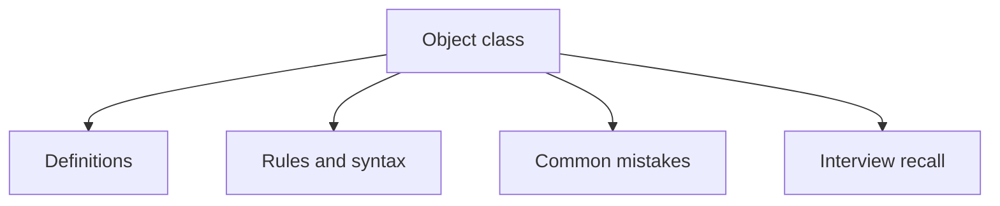

# 14 - Object class

This topic follows the master outline in [outline.md](../outline.md). The goal is to understand each concept deeply enough to explain it, recognize it in code, and answer interview-style questions.

## Study Order

- [Tostring Concepts](theory/01-tostring-concepts.md)
- [Contract Of Equals Concepts](theory/02-contract-of-equals-concepts.md)
- [Key Terms](terms/01-key-terms.md)

## Outline Checklist

- toString()
- equals()
- hashCode()
- getClass()
- clone()
- finalize() deprecated
- wait()
- notify()
- notifyAll()
- Why overriding equals() means you should also override hashCode()
- Contract of equals()
- Contract of hashCode()
- Comparing objects by reference and by value

## Anki Cards

- [Basic](anki/basic.tsv)
- [Basic Extra](anki/basic-extra.tsv)
- [Cloze](anki/cloze.tsv)
- [Code Question](anki/code-question.tsv)

## Self-Check

1. Why does failing to override `hashCode()` alongside `equals()` break `HashMap` lookup?
2. Why does adding a value field to a subclass make it impossible to write a perfect `equals()` method while preserving transitivity?
3. Why does the default `identityHashCode` not represent physical memory addresses in modern JVMs?
4. Why is `toString()` automatically invoked in string concatenation and system output, and how does this lead to stack overflow in circular references?
5. Why does overloading `equals(MyClass)` instead of overriding `equals(Object)` compile fine but fail silently in collections?

## Mermaid Overview

## Reference Links

- https://docs.oracle.com/en/java/javase/21/docs/api/java.base/java/lang/Object.html
