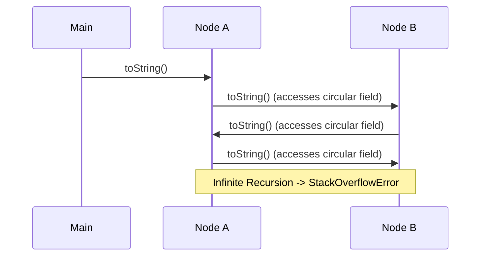
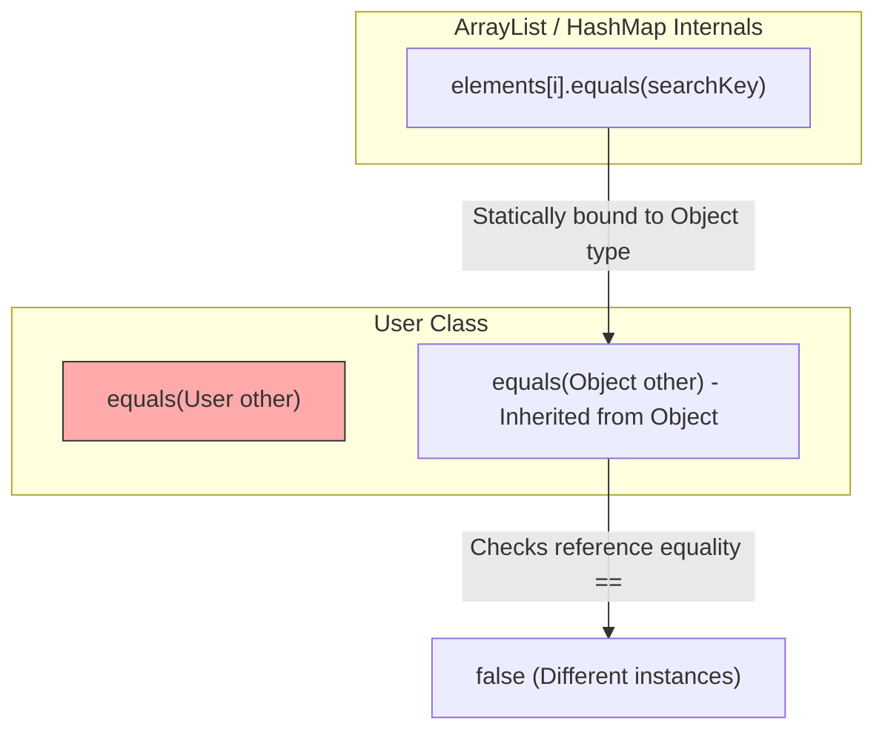

# Object class - Part 1

| Concept | What to know |
| --- | --- |
| `toString()` |toString() returns a human-readable text representation of an object. |
| `equals()` | equals() defines logical equality between objects. |
| `hashCode()` | hashCode() returns an integer hash used by hash-based collections. |
| `getClass()` |getClass() returns the runtime Class object for an instance. |
| `clone()` |clone() creates a field-by-field copy when cloning is supported, but it is often avoided in modern Java design. |
| `finalize() deprecated` | Final means the variable, method, class, or parameter is restricted from later change in a specific way. |
| `wait()` |wait() releases an object monitor and pauses the current thread until notification or timeout. |
| `notify()` |notify() wakes one thread waiting on the same object monitor. |
| `notifyAll()` |notifyAll() wakes all threads waiting on the same object monitor. |
| `Why overriding equals() means you should also override hashCode()` | equals() defines logical equality between objects. |

## Detailed Notes

### toString()

`toString()` returns a human-readable text representation of an object. By default, `Object.toString()` returns the class name, followed by an `@` character, and the unsigned hexadecimal representation of the hash code of the object:
```java
public String toString() {
    return getClass().getName() + "@" + Integer.toHexString(hashCode());
}
```
It is best practice to override `toString()` to return a concise, informative representation of the object's state, which is extremely helpful for logging and debugging.

#### Example: Overriding `toString()`
```java
public class User {
    private final int id;
    private final String username;

    public User(int id, String username) {
        this.id = id;
        this.username = username;
    }

    @Override
    public String toString() {
        return "User{id=" + id + ", username='" + username + "'}";
    }
}
```

## Why toString is Auto-Invoked and How Circular References Cause Stack Overflow

In Java, the `toString()` method is implicitly called by the compiler during string concatenation and by standard output streams like `System.out.println()`. When compiling code like `"User: " + user`, the compiler generates bytecode that calls `String.valueOf(user)`, which internally checks if the object reference is `null` and, if not, invokes `user.toString()`. A severe runtime vulnerability occurs when two objects contain circular references to each other and their `toString()` implementations print each other's state. When `toString()` is called on the first object, it invokes the `toString()` on the second object, which in turn calls `toString()` on the first, leading to infinite recursion. This recursion rapidly consumes the thread's execution stack frame capacity, eventually throwing a `StackOverflowError` and crashing the application.



### Code Example: Circular Reference Stack Overflow

```java
public class CircularNode {
    private final String name;
    private CircularNode next;

    public CircularNode(String name) {
        this.name = name;
    }

    public void setNext(CircularNode next) {
        this.next = next;
    }

    @Override
    public String toString() {
        // Accessing 'next' implicitly calls next.toString(), causing recursion
        return "CircularNode{name='" + name + "', next=" + next + "}";
    }

    public static void main(String[] args) {
        CircularNode nodeA = new CircularNode("Node-A");
        CircularNode nodeB = new CircularNode("Node-B");
        nodeA.setNext(nodeB);
        nodeB.setNext(nodeA); // Circular link

        // This will attempt to concatenate and print nodeA, triggering StackOverflowError
        System.out.println(nodeA); // Output: Exception in thread "main" java.lang.StackOverflowError
    }
}
```

### Cause-Effect Chain of Circular toString()

```text
String concatenation / print triggers implicit String.valueOf() 
  ↳ valueOf() invokes user-defined toString() 
  ↳ toString() recursively calls toString() on the circularly linked object 
  ↳ Execution stack frame capacity is exceeded 
  ↳ JVM throws StackOverflowError and terminates the execution thread
```

### equals()

`equals()` defines logical equality between objects. By default, the `Object.equals(Object obj)` implementation checks reference equality (`this == obj`). If you want to compare objects based on their state (logical equality), you must override `equals()`.

#### Example: Overriding `equals()`
```java
@Override
public boolean equals(Object obj) {
    if (this == obj) return true;
    if (obj == null || getClass() != obj.getClass()) return false;
    User user = (User) obj;
    return id == user.id && Objects.equals(username, user.username);
}
```

## Why Overloading equals Instead of Overriding It Fails Silently

A common and dangerous mistake in Java is overloading `equals()` by declaring a method like `public boolean equals(User other)` instead of overriding `public boolean equals(Object other)`. The compiler views the overloaded method as a completely separate method signature and compiles it successfully without any warnings. However, Java's method resolution binds parameters statically at compile time for overloaded methods, whereas it binds them dynamically at runtime for overridden methods. Standard Java collections like `HashMap` and `ArrayList` are generic and operate on the `Object` type, meaning they compile calls to `equals(Object)`. Consequently, when collections attempt to check equality, they will bypass the overloaded `equals(User)` method and run the default `Object.equals(Object)` instead, leading to silent failures where equal keys are not recognized.



### Code Example: Silent Collection Failure

```java
import java.util.ArrayList;
import java.util.List;

public class OverloadedUser {
    private final String name;

    public OverloadedUser(String name) {
        this.name = name;
    }

    // WRONG: Overloads equals(OverloadedUser) instead of overriding equals(Object)
    public boolean equals(OverloadedUser other) {
        if (other == null) return false;
        return this.name.equals(other.name);
    }

    public static void main(String[] args) {
        List<OverloadedUser> list = new ArrayList<>();
        list.add(new OverloadedUser("Alice"));

        // Searching with a logically identical instance
        boolean found = list.contains(new OverloadedUser("Alice"));
        System.out.println("User found: " + found); // Output: User found: false
    }
}
```

### Cause-Effect Chain of Overloaded equals()

```text
Declaring equals(User other) overloads instead of overriding equals(Object)
  ↳ Collection classes call equals(Object) on the element
  ↳ Java matches signature to Object.equals(Object) statically
  ↳ Default reference equality (==) is executed instead of custom value comparison
  ↳ Collection search fails silently (returns false)
```

### hashCode()

`hashCode()` returns an integer hash value for the object, used by hash-based collections like `HashMap`, `HashSet`, and `Hashtable` to determine the bucket location for storing and retrieving keys.

#### Example: Overriding `hashCode()`
```java
@Override
public int hashCode() {
    return Objects.hash(id, username);
}
```

### getClass()

`getClass()` is a final method in the `Object` class that returns the runtime `java.lang.Class` object representing the class of the instance.

#### `getClass()` vs `instanceof`
- `instanceof` evaluates to `true` if the object is of the specified type or any of its subtypes. It allows polymorphic checks.
- `getClass()` allows an exact type match. For example, `obj.getClass() == User.class` checks if the object is exactly a `User` (and not a subclass).

```java
class AdminUser extends User {
    public AdminUser(int id, String username) { super(id, username); }
}

User user = new AdminUser(1, "admin");
boolean isInstance = user instanceof User; // true (polymorphic)
boolean isExact = user.getClass() == User.class; // false (runtime class is AdminUser)
```

### clone()

`clone()` creates and returns a field-by-field copy of the object. 
- The class must implement the `java.lang.Cloneable` marker interface, otherwise `super.clone()` throws a `CloneNotSupportedException` at runtime.
- By default, `Object.clone()` performs a **shallow copy**. It copies all primitive fields and references of object fields. It does not clone referenced objects.
- A **deep copy** requires manually cloning mutable objects referenced by the fields.

#### Example: Shallow vs Deep Cloning
```java
class Address implements Cloneable {
    String city;
    public Address(String city) { this.city = city; }
    
    @Override
    protected Object clone() throws CloneNotSupportedException {
        return super.clone();
    }
}

class Person implements Cloneable {
    String name;
    Address address;

    public Person(String name, Address address) {
        this.name = name;
        this.address = address;
    }

    // Shallow Copy: Shares the same Address object
    @Override
    protected Object clone() throws CloneNotSupportedException {
        return super.clone();
    }

    // Deep Copy: Clones the Address object as well
    public Person deepClone() throws CloneNotSupportedException {
        Person cloned = (Person) super.clone();
        cloned.address = (Address) this.address.clone();
        return cloned;
    }
}
```

### finalize() deprecated

Historically, `finalize()` was invoked by the garbage collector on an object when GC determined that there were no more references to the object. It was intended for cleaning up non-Java resources (like file handles or database connections) before the object got reclaimed.

**Why it is deprecated (since Java 9):**
1. **No Guarantees**: There is no guarantee when (or even if) `finalize()` will run, which can lead to resource leaks.
2. **Performance Impact**: Overriding `finalize()` slows down garbage collection because objects must be queued and processed in a finalization queue.
3. **Resurrection & Finalizer Attacks**: An object can "resurrect" itself inside `finalize()` by assigning `this` to a static reference. Also, if a constructor throws an exception, the partially initialized object is still eligible for finalization, allowing malicious code to run `finalize()` and access its uninitialized state.
4. **Modern Alternatives**: Use the `AutoCloseable` interface with `try-with-resources`, or use `java.lang.ref.Cleaner` / `PhantomReference` for cleanup actions.

### wait(), notify(), and notifyAll()

These methods are final methods of the `Object` class used for thread synchronization. They allow threads to coordinate activities on a shared resource monitor (lock).

- `wait()`: Releases the lock on the object's monitor and causes the current thread to wait until another thread notifies it or it is interrupted.
- `notify()`: Wakes up a single thread waiting on the object's monitor.
- `notifyAll()`: Wakes up all threads waiting on the object's monitor.

#### Rules:
1. Must be called from a **synchronized** context (owning the object's monitor), otherwise they throw `IllegalMonitorStateException`.
2. `wait()` should always be called in a loop that checks the condition being waited on, to protect against **spurious wakeups**.

```java
public class QueueMonitor {
    private final Queue<String> queue = new LinkedList<>();
    private final int MAX_SIZE = 10;

    public synchronized void enqueue(String item) throws InterruptedException {
        while (queue.size() == MAX_SIZE) { // Always wait in a loop
            wait();
        }
        queue.add(item);
        notifyAll(); // Wake up consumers
    }

    public synchronized String dequeue() throws InterruptedException {
        while (queue.isEmpty()) { // Always wait in a loop
            wait();
        }
        String item = queue.poll();
        notifyAll(); // Wake up producers
        return item;
    }
}
```

### Why overriding equals() means you should also override hashCode()

This is one of the most critical contracts in Java. If you override `equals(Object)`, you **must** override `hashCode()`.
- If two objects are equal according to `equals(Object)`, they must return the same integer from `hashCode()`.
- If you override `equals()` but not `hashCode()`, two logically equal objects will inherit the default `Object.hashCode()`, which returns different integers (based on memory location).
- When these objects are used as keys in a `HashMap` or elements in a `HashSet`, the collection will store them in different buckets. Consequently, retrieving an object using an equal key will return `null` because `HashMap` looks in the wrong bucket.

---

## Common Mistakes

### 1. Overloading instead of Overriding `equals()`
A common mistake is declaring `equals(MyClass other)` instead of `equals(Object other)`. Because Java matches method signatures statically at compile time, calls from framework code or collection APIs (which expect `equals(Object)`) will bypass your custom method and run the default `Object.equals(Object)`.
```java
// WRONG: Overloads equals()
public boolean equals(User other) {
    return this.id == other.id;
}

// CORRECT: Overrides equals()
@Override
public boolean equals(Object obj) {
    if (this == obj) return true;
    if (obj instanceof User other) {
        return this.id == other.id;
    }
    return false;
}
```

### 2. Modifying state inside `equals()`, `hashCode()`, or `toString()`
These methods should be side-effect-free (pure functions). Modifying instance variables inside them leads to unpredictable bugs.

### 3. Calling monitor methods outside synchronized blocks
Calling `wait()`, `notify()`, or `notifyAll()` without holding the object monitor (e.g. outside a `synchronized` block/method matching the object) throws `IllegalMonitorStateException`.

### 4. Relying on `finalize()` for resource cleanup
Because GC execution is non-deterministic, using `finalize()` to close files or sockets leads to resource exhaustion. Use `try-with-resources` instead.

## Reference Links

- https://docs.oracle.com/en/java/javase/21/docs/api/java.base/java/lang/Object.html#equals(java.lang.Object) (Java SE 21 Object.equals Contract)
- https://docs.oracle.com/en/java/javase/21/docs/api/java.base/java/lang/Object.html#toString() (Java SE 21 Object.toString Contract)
- https://docs.oracle.com/javase/specs/jls/se21/html/jls-15.html#jls-15.18.1 (JLS 21 String Concatenation Operator +)
