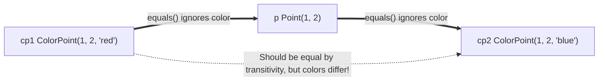
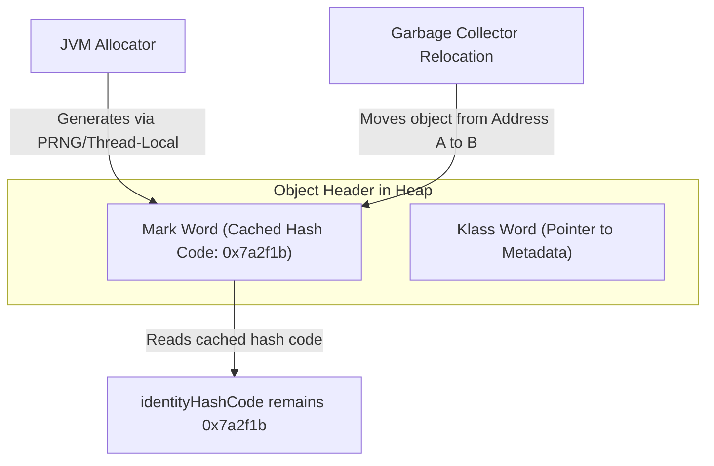
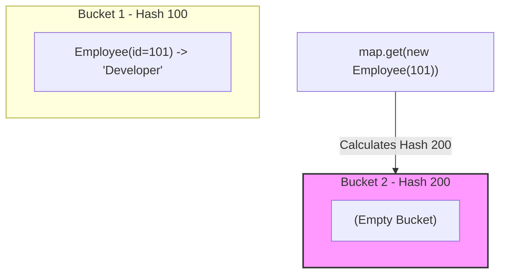

# Object class - Part 2

| Concept | What to know |
| --- | --- |
| `Contract of equals()` | equals() defines logical equality between objects. |
| `Contract of hashCode()` | hashCode() returns an integer hash used by hash-based collections. |
| `Comparing objects by reference and by value` |`Comparing objects by reference and by value` — Reference equality (==) checks memory addresses; value equality (.equals()) compares logical content. |

## Detailed Notes

### Contract of equals()

The `equals(Object)` method defines logical equality. According to the Java SE specification, the implementation of `equals()` must define an equivalence relation with the following properties (for any non-null references `x`, `y`, and `z`):

1. **Reflexive**: `x.equals(x)` must return `true`.
2. **Symmetric**: `x.equals(y)` must return `true` if and only if `y.equals(x)` returns `true`.
3. **Transitive**: If `x.equals(y)` returns `true` and `y.equals(z)` returns `true`, then `x.equals(z)` must return `true`.
4. **Consistent**: Multiple invocations of `x.equals(y)` must consistently return `true` or consistently return `false`, provided no information used in `equals` comparisons on the objects is modified.
5. **Null-Hostile**: `x.equals(null)` must return `false`.

#### Symmetry Violation in Inheritance
A classic problem arises when trying to extend a class and add a new value field.
```java
public class Point {
    protected final int x, y;
    public Point(int x, int y) { this.x = x; this.y = y; }
    
    @Override
    public boolean equals(Object o) {
        if (!(o instanceof Point)) return false;
        Point p = (Point) o;
        return p.x == x && p.y == y;
    }
}

public class ColorPoint extends Point {
    private final String color;
    public ColorPoint(int x, int y, String color) {
        super(x, y);
        this.color = color;
    }

    // WRONG: Violates Symmetry
    @Override
    public boolean equals(Object o) {
        if (!(o instanceof ColorPoint)) return false;
        return super.equals(o) && ((ColorPoint) o).color.equals(color);
    }
}
```
*Issue:*
`Point p = new Point(1, 2);`
`ColorPoint cp = new ColorPoint(1, 2, "red");`
`p.equals(cp)` is `true` (since `cp` is an instance of `Point`).
`cp.equals(p)` is `false` (since `p` is not an instance of `ColorPoint`).
*Solution:* To support exact equality, use `getClass()` comparison instead of `instanceof`, or favor composition over inheritance.

## Why Adding Value Fields to Subclasses Breaks Transitivity

In Java, attempting to extend an instantiable class and add a new value field while retaining a perfect `equals` method faces a fundamental mathematical limitation. If we allow a base class and a subclass to be equal by ignoring the subclass field in `equals()`, we satisfy symmetry but break transitivity. Conversely, if we check the subclass field in `equals()`, we must reject equality when comparing a base instance to a subclass instance, which violates symmetry because the base class `equals()` evaluates to `true`. If we try to fix this by making the comparison asymmetric, we violate symmetry directly. Therefore, there is simply no way to extend an instantiable class and add a value field while preserving the `equals` contract unless composition is favored over inheritance.



### Code Example: Transitivity Violation

```java
public class Point {
    protected final int x, y;
    public Point(int x, int y) { this.x = x; this.y = y; }
    
    @Override
    public boolean equals(Object o) {
        if (!(o instanceof Point)) return false;
        Point p = (Point) o;
        return p.x == x && p.y == y;
    }
}

public class ColorPoint extends Point {
    private final String color;
    public ColorPoint(int x, int y, String color) {
        super(x, y);
        this.color = color;
    }

    @Override
    public boolean equals(Object o) {
        if (!(o instanceof Point)) return false;
        // If o is a normal Point, do color-blind comparison (satisfies symmetry)
        if (!(o instanceof ColorPoint)) return o.equals(this);
        // If o is a ColorPoint, do full comparison
        return super.equals(o) && ((ColorPoint) o).color.equals(color);
    }

    public static void main(String[] args) {
        Point p = new Point(1, 2);
        ColorPoint cp1 = new ColorPoint(1, 2, "red");
        ColorPoint cp2 = new ColorPoint(1, 2, "blue");

        System.out.println("cp1.equals(p): " + cp1.equals(p));   // Output: true
        System.out.println("p.equals(cp2): " + p.equals(cp2));   // Output: true
        System.out.println("cp1.equals(cp2): " + cp1.equals(cp2)); // Output: false (Transitivity Broken!)
    }
}
```

### Cause-Effect Chain of Transitivity Failure

```text
ColorPoint compares ignoring color with a Point (cp1 == p)
  ↳ Point compares ignoring color with another ColorPoint (p == cp2)
  ↳ Transitivity requires cp1 == cp2
  ↳ Direct comparison cp1.equals(cp2) compares color and returns false
  ↳ Equivalence relation is broken, causing collections like HashSet to fail
```

---

### Contract of hashCode()

The `hashCode()` method returns an integer hash value. The contract states:

1. **Consistency**: Whenever it is invoked on the same object more than once during an execution of a Java application, `hashCode()` must consistently return the same integer, provided no information used in `equals` comparisons on the object is modified.
2. **Equal Objects → Equal Hash Codes**: If two objects are equal according to the `equals(Object)` method, then calling `hashCode()` on each of the two objects must produce the same integer result.
3. **Unequal Objects → Collisions Allowed**: If two objects are unequal according to the `equals(Object)` method, they are **not** required to produce distinct integer results. However, producing distinct integer results for unequal objects improves the performance of hash tables.

## Why identityHashCode Does Not Represent Physical Memory Addresses

A common misconception is that the default identity hash code returns the physical memory address of an object directly. In modern JVMs (such as HotSpot), physical memory addresses are highly dynamic because the Garbage Collector relocates objects during compacting cycles to prevent fragmentation. If identity hash codes were direct memory addresses, the hash code of an object would change after GC relocation, violating the consistency contract of `hashCode`. To avoid this, modern JVMs generate identity hash codes using pseudorandom number generators or thread-local states, caching the generated value in the object's Mark Word header. This guarantees that the hash code remains stable and unique for the lifetime of the object, regardless of where it is moved in physical memory.



### Code Example: Stable identityHashCode Under GC

```java
public class IdentityHashStability {
    public static void main(String[] args) {
        Object obj = new Object();
        int initialHash = System.identityHashCode(obj);

        // Explicitly suggest garbage collection to relocate the object
        System.gc(); 

        int postGcHash = System.identityHashCode(obj);
        System.out.println("Hashes match: " + (initialHash == postGcHash)); 
        // Output: Hashes match: true
    }
}
```

### Cause-Effect Chain of Hash Stability

```text
Garbage Collector relocates objects in heap memory
  ↳ Physical memory address of the object changes dynamically
  ↳ JVM reads cached hash code from the object's Mark Word header
  ↳ identityHashCode remains consistent and unchanged
  ↳ Contract of hashCode consistency is preserved under object motion
```

---

### Comparing objects by reference and by value

- **Reference Equality (`==`)**: Checks if two references point to the exact same memory address (identity).
- **Logical Equality (`equals()`)**: Checks if two objects are logically equivalent in state (value).

```java
String s1 = new String("hello");
String s2 = new String("hello");

System.out.println(s1 == s2);      // false (different objects in memory)
System.out.println(s1.equals(s2)); // true (logical contents are identical)
```

---

### Case Study: Breaking HashMap when hashCode is inconsistent with equals

When a class overrides `equals()` but fails to override `hashCode()`, it breaks the fundamental contract of hash-based collections (`HashMap`, `HashSet`, `LinkedHashMap`).

Let's look at this broken class:
```java
public class Employee {
    private final int id;
    private final String name;

    public Employee(int id, String name) {
        this.id = id;
        this.name = name;
    }

    @Override
    public boolean equals(Object o) {
        if (this == o) return true;
        if (o == null || getClass() != o.getClass()) return false;
        Employee employee = (Employee) o;
        return id == employee.id && Objects.equals(name, employee.name);
    }
    
    // hashCode() is NOT overridden! Inherited from Object.
}
```

Now let's use it in a `HashMap`:
```java
import java.util.HashMap;

public class Main {
    public static void main(String[] args) {
        HashMap<Employee, String> map = new HashMap<>();
        Employee e1 = new Employee(101, "Alice");
        
        map.put(e1, "Developer");
        
        // e2 is logically equal to e1 according to equals()
        Employee e2 = new Employee(101, "Alice");
        
        System.out.println("e1.equals(e2): " + e1.equals(e2)); // true
        System.out.println("map.get(e2): " + map.get(e2));     // prints null!
    }
}
```

#### Why does this happen?
1. `map.put(e1, "Developer")` calculates `e1.hashCode()`, which is derived from the default identity hash code of `e1`. It places the entry in a specific bucket.
2. `map.get(e2)` calculates `e2.hashCode()`. Because `hashCode()` is not overridden, `e2.hashCode()` generates a completely different identity hash value from `e1.hashCode()`.
3. `HashMap` looks for `e2` in a different bucket and finds nothing, returning `null`.
4. Even if both keys hashed to the same bucket by chance, `HashMap` checks equality only if the hash codes match first. If `hashCode()` values are not identical, it assumes the objects are unequal without calling `equals()`.

## Why Failing to Override hashCode Breaks Hash Collections

Hash-based collections like `HashMap` and `HashSet` use the `hashCode` of an object to determine which bucket stores that object. When looking up an object, the collection first calculates the search key's `hashCode` to locate the correct bucket. If `hashCode` is not overridden, the default JVM implementation generates a hash code based on the object's identity, meaning two logically equal objects will hash to different buckets. Consequently, even if two objects are equal according to `equals()`, `HashMap` will search in a different bucket and fail to retrieve the entry, returning `null` instead. This violates the Map API contract and causes silent data retrieval bugs.



### Code Example: Collection Lookup Failure

```java
import java.util.HashMap;
import java.util.Map;

public class BrokenHashLookup {
    static class Employee {
        private final int id;
        public Employee(int id) { this.id = id; }
        
        @Override
        public boolean equals(Object o) {
            if (this == o) return true;
            if (o == null || getClass() != o.getClass()) return false;
            Employee employee = (Employee) o;
            return id == employee.id;
        }
        // hashCode() is NOT overridden
    }

    public static void main(String[] args) {
        Map<Employee, String> map = new HashMap<>();
        map.put(new Employee(101), "Developer");
        
        // Searching with a logically identical instance
        System.out.println("Retrieved: " + map.get(new Employee(101)));
        // Output: Retrieved: null
    }
}
```

### Cause-Effect Chain of Broken Hash Contract

```text
Failing to override hashCode() alongside equals()
  ↳ Logically equal objects return different identity hash codes
  ↳ HashMap routes lookup to a different bucket index
  ↳ No match found in the target bucket
  ↳ Map returns null despite equals() evaluating to true
```

---

## Common Mistakes

### 1. Transitivity Violation with inheritance
Trying to make `Point` and `ColorPoint` comparable by writing a custom `equals()` that ignores color when comparing with a plain `Point` violates the **transitivity** rule of `equals()`.
```java
// If p.equals(cp1) is true (color ignored)
// and p.equals(cp2) is true (color ignored)
// then cp1.equals(cp2) must be true, but it evaluates to false if their colors differ.
```

### 2. Assuming `hashCode()` returns the memory address directly
In modern JVMs, the default identity hash code is not a direct memory address; it is generated using pseudorandom number generators or internal thread-state registers to prevent performance issues if GC moves objects. Never write logic assuming `hashCode()` relates to physical memory address.

### 3. Throwing `NullPointerException` in `equals()`
When comparing string fields, use `Objects.equals(a, b)` instead of `a.equals(b)` to avoid NPE when `a` is null.
```java
// WRONG
return name.equals(other.name); 

// CORRECT
return Objects.equals(name, other.name);
```

## Reference Links

- https://docs.oracle.com/en/java/javase/21/docs/api/java.base/java/lang/Object.html#equals(java.lang.Object) (Java SE 21 Object.equals Contract)
- https://docs.oracle.com/en/java/javase/21/docs/api/java.base/java/lang/Object.html#hashCode() (Java SE 21 Object.hashCode Contract)
- https://docs.oracle.com/en/java/javase/21/docs/api/java.base/java/lang/System.html#identityHashCode(java.lang.Object) (Java SE 21 System.identityHashCode)
