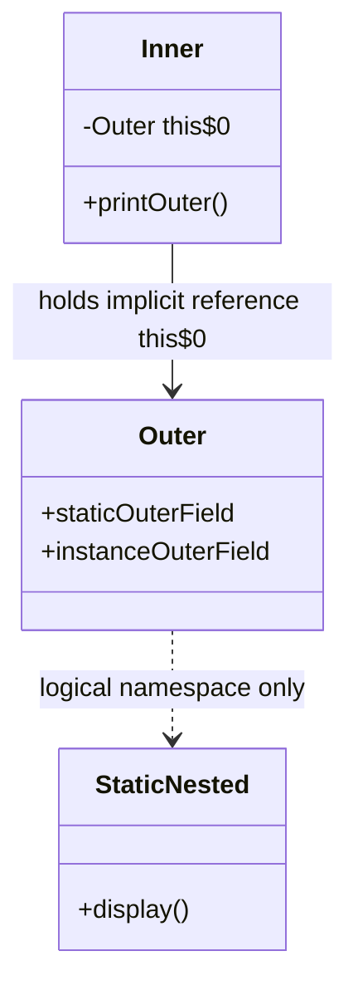
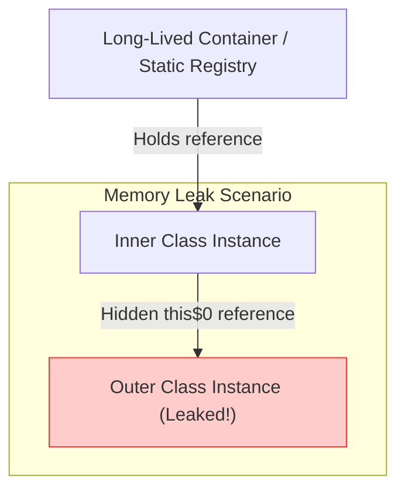
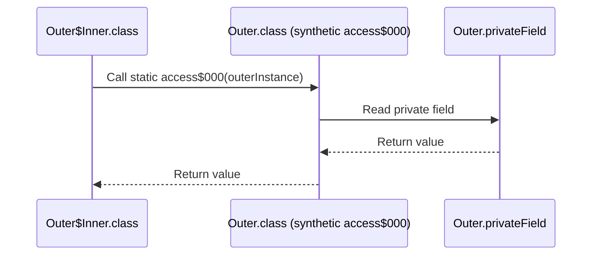

# Inner Class and Nested Class - Part 1

## Learning Goal

This file covers a focused slice of **Inner Class and Nested Class**. Study each concept as a practical Java rule, not as isolated vocabulary.

## Outline Coverage

| Concept | What to know |
| --- | --- |
| `Nested class` | A class defined within another class. Divided into static nested classes and non-static nested classes (inner classes). |
| `Static nested class` | A nested class declared static; it behaves like any other top-level class package-wise but is nested for grouping, and doesn't require an outer instance. |
| `Inner class` | A non-static nested class associated with a specific instance of the outer class. |
| `Local inner class` | A class defined within a method block; it can only access final or effectively final local variables. |
| `Anonymous inner class` | An inner class without a name declared and instantiated in a single expression to extend a class or implement an interface. |
| `Access variables outside the class` | Rules governing how nested, inner, local, and anonymous classes access enclosing instance members or method-local variables. |
| `Use case of inner class` | Logical grouping of helper classes, encapsulation (e.g. Iterators), and maintaining clean top-level namespaces. |
| `Anonymous class in event handler, thread, comparator` | Implementing quick one-off behaviors before lambdas; understanding why `this` scope and compilation differs from lambdas. |

---

## Detailed Notes

### Nested class

A **nested class** is any class defined within the body of another enclosing class. In Java, nested classes are divided into two main categories:
1. **Static nested classes**: Declared with the `static` modifier. They do not have access to the instance of the enclosing class.
2. **Inner classes** (Non-static nested classes): Declared without the `static` modifier. They are bound to an instance of the outer class.

```
                  Nested Class
                     /    \
                    /      \
      Static Nested Class  Inner Class (Non-static)
                            /     \
                           /       \
                 Local Inner Class  Anonymous Inner Class
```

---

### Static nested class

A **static nested class** behaves like a top-level class that has been nested inside another class for packaging convenience. It does not have an implicit reference to an instance of the outer class.

#### Access Rules
- **Can access**: All static members (variables and methods) of the outer class, including `private` ones.
- **Cannot access**: Instance members (fields or methods) of the outer class directly. It must create an instance of the outer class to access them.
- **Static members**: Static nested classes can define static variables, static methods, and non-static members.

#### Instantiation Syntax
Because it does not require an outer instance, you instantiate it using the outer class name:
```java
Outer.StaticNested nestedInstance = new Outer.StaticNested();
```

#### Code Example
```java
public class Outer {
    private static String staticOuterField = "Private Static Outer Field";
    private String instanceOuterField = "Private Instance Outer Field";

    public static class StaticNested {
        public void display() {
            // Can access static members directly (even private)
            System.out.println("Accessing: " + staticOuterField);

            // Cannot access instanceOuterField directly:
            // System.out.println(instanceOuterField); // Compile error!

            // Must instantiate Outer to access instance members
            Outer outer = new Outer();
            System.out.println("Accessing via instance: " + outer.instanceOuterField);
        }
    }
}
```

---

### Inner class (Non-static nested class)

An **inner class** is a non-static nested class. Every instance of an inner class is implicitly bound to a specific instance of the outer class.

#### Access Rules
- **Can access**: All members of the outer class (instance and static), including `private` ones.
- **Cannot define**: Prior to Java 16, inner classes could not define static members (except for static final constant variables). From Java 16 onwards, inner classes can declare static members.
- **Implicit reference**: Keeps a hidden reference to the outer instance (`Outer.this`), which prevents the outer instance from being garbage collected as long as the inner instance exists.

#### Instantiation Syntax
You must have an instance of the outer class to instantiate an inner class:
```java
Outer outer = new Outer();
Outer.Inner inner = outer.new Inner();
```

#### Code Example
```java
public class Outer {
    private String outerField = "Outer Instance Field";

    public class Inner {
        public void printOuter() {
            // Direct access to the enclosing instance's field
            System.out.println("Enclosing field: " + outerField);
            // Explicit reference syntax:
            System.out.println("Enclosing field (explicit): " + Outer.this.outerField);
        }
    }
}
```

## Why Static Nested and Non-Static Inner Classes Differ in Initialization and Memory

Static nested classes are independent of any outer instance, behaving like a static member of the outer class. When the JVM loads the outer class, it can load the static nested class independently, and instantiating it does not require an instance of the outer class. In contrast, a non-static inner class is tied directly to the instance state of the enclosing outer class. Because of this coupling, every instance of an inner class contains an implicit hidden field storing a reference to the enclosing outer instance, increasing the memory footprint of each inner class instance by the size of a reference pointer (typically 4 or 8 bytes). Therefore, they must be initialized via an active outer instance, establishing a parent-child object relationship in memory.

### Memory Layout and Instantiation Model


### Instantiation and Memory Comparison
```java
public class MemoryFootprintDemo {
    static class StaticHelper {
        int value;
    }
    class InnerHelper {
        int value;
    }
    public static void main(String[] args) {
        // Static nested class is instantiated independently
        MemoryFootprintDemo.StaticHelper sh = new MemoryFootprintDemo.StaticHelper();
        
        // Non-static inner class requires an enclosing instance
        MemoryFootprintDemo outer = new MemoryFootprintDemo();
        MemoryFootprintDemo.InnerHelper ih = outer.new InnerHelper();
        
        System.out.println("Initialized sh and ih successfully."); // Output: Initialized sh and ih successfully.
    }
}
```

### Cause-Effect Chain
`static` modifier absent in inner class declaration -> compiler generates hidden final field `this$0` referencing the enclosing class instance -> inner class instance cannot exist without an outer class instance -> instantiation syntax requires `outerInstance.new Inner()` -> inner class instances have larger memory footprint due to reference pointer overhead.

---

## Why Non-Static Inner Classes Can Cause Memory Leaks

Because non-static inner class instances maintain a hidden reference (compiler-generated field `this$0`) to their enclosing outer class instance, the lifecycle of the outer object is bound to the inner object. If a long-lived object (like a background thread, static collection, or graphical UI listener) holds a reference to an inner class instance, the enclosing outer class instance cannot be garbage collected. This occurs even if the outer class instance is no longer referenced anywhere else in the application code. This hidden coupling is a common source of memory leaks in Android (e.g., handlers holding onto Activities) and desktop UI development. Converting the inner class to a static nested class breaks this implicit reference chain, allowing the outer instance to be reclaimed by the garbage collector when its direct references are cleared.

### Memory Leak Reference Chain


### Code Example: Long-Lived Registry Leak
```java
import java.util.ArrayList;
import java.util.List;

public class LeakDemo {
    // Long-lived registry that persists throughout the application lifecycle
    public static final List<Object> registry = new ArrayList<>();

    public void doWork() {
        // An instance of LeakDemo is created, and it spawns an inner class instance
        registry.add(new LeakyInner()); 
    }

    public class LeakyInner {
        public void execute() {
            System.out.println("Executing task.");
        }
    }

    public static void main(String[] args) {
        LeakDemo demo = new LeakDemo();
        demo.doWork();
        // The demo object reference is cleared in main:
        demo = null; 
        // However, the LeakDemo instance remains in heap because:
        // registry -> LeakyInner -> LeakDemo (via implicit reference)
        System.out.println("LeakDemo instance is leaked in memory!"); // Output: LeakDemo instance is leaked in memory!
    }
}
```

### Cause-Effect Chain
Long-lived reference holds inner class instance -> inner class instance retains hidden `this$0` reference -> enclosing outer instance remains reachable in GC root reachability graph -> garbage collector cannot reclaim outer instance memory -> memory leak / OutOfMemoryError.

---

### Local inner class

A **local inner class** is defined within a block of code, typically inside a method body. Its scope is restricted entirely to that block.

#### Access Rules
- **Scope**: Local to the block. Cannot be declared with access modifiers (`public`, `protected`, `private`) or `static`.
- **Can access**: Outer class members, plus local variables of the enclosing block **only if** they are `final` or **effectively final** (variables whose value is never changed after initialization).
- **Modification**: Cannot modify local variables of the outer method inside the local class.

#### Instantiation Syntax
You can only instantiate a local class within the enclosing method, after the class has been defined.

#### Code Example
```java
public class Outer {
    private String outerField = "Outer Field";

    public void processData(final String inputParam) {
        String localVal = "Local Temp Value"; // Effectively final
        String nonFinalVal = "Initial Value";
        nonFinalVal = "Changed Value"; // Not effectively final anymore

        class LocalInner {
            public void run() {
                System.out.println(outerField);  // Accesses outer instance field
                System.out.println(inputParam);  // Accesses final parameter
                System.out.println(localVal);    // Accesses effectively final local variable
                // System.out.println(nonFinalVal); // Compile error! Not effectively final
            }
        }

        LocalInner inner = new LocalInner();
        inner.run();
    }
}
```

## Why Local and Anonymous Inner Classes Only Access Final or Effectively Final Variables

Local and anonymous classes declared within a method can access the method's local variables, but these variables must be `final` or effectively final. The reason lies in the mismatch between the lifecycles of method local variables and class instances. Local variables live on the Stack and are destroyed as soon as the enclosing method finishes execution, whereas local/anonymous class instances are allocated on the Heap and can survive long after the method returns (e.g., as callbacks or running in another thread). To resolve this mismatch, the compiler copies the values of the accessed local variables and stores them as hidden instance fields within the inner class instance. If the outer method or the inner class could modify these variables, the copied field and the original local variable would become out of sync, leading to unpredictable behavior; forcing variables to be final ensures semantic consistency.

### Stack/Heap Lifecycle and Variable Capture
```
Method execution (Stack frame)              Heap Memory
┌─────────────────────────────┐             ┌──────────────────────────────────────────────┐
│ void process() {            │             │ AnonymousClass$1 instance                    │
│   int x = 10;               │             ├──────────────────────────────────────────────┤
│   Runnable r = new R() {    │────────────>│ - final int val$x = 10                       │
│     // accesses x           │             │   (Hidden copy of local x)                   │
│   };                        │             └──────────────────────────────────────────────┘
│ }                           │
└─────────────────────────────┘
[Stack Frame Popped (x is destroyed)] ----> (AnonymousClass$1 still active on heap, using val$x)
```

### Code Example: Variable Capture and Mismatch
```java
public class VariableCaptureDemo {
    public Runnable createCallback() {
        int count = 42; // Effectively final local variable
        
        Runnable r = new Runnable() {
            @Override
            public void run() {
                // accesses copy of count
                System.out.println("Captured count value: " + count); 
            }
        };
        
        // If we did 'count = 99;' here, it would trigger a compile error.
        return r;
    }

    public static void main(String[] args) {
        VariableCaptureDemo demo = new VariableCaptureDemo();
        Runnable callback = demo.createCallback();
        callback.run(); // Output: Captured count value: 42
    }
}
```

### Cause-Effect Chain
Method execution completes -> local variables stack frame is popped and variables are destroyed -> inner class object survives on the heap -> inner class relies on compiler-generated copy fields (`val$varName`) -> variable must be final or effectively final to guarantee copy consistency between stack and heap.

---

### Anonymous inner class

An **anonymous inner class** is a local class without a name. It is declared and instantiated at the same time using the `new` operator. It must either extend an existing class or implement an interface.

#### Access Rules
- **Structure**: Cannot define constructors (has no name), but can use instance initializers `{ ... }`.
- **Variables**: Same final/effectively final rules as local classes apply to accessed method-local variables.
- **Usage**: Used for quick, one-off overrides of class behavior or interface implementations.

#### Instantiation Syntax
```java
InterfaceName obj = new InterfaceName() {
    @Override
    public void method() {
        // Implementation
    }
};
```

#### Code Example
```java
public class Button {
    interface ClickListener {
        void onClick();
    }

    public void setListener(ClickListener listener) {
        listener.onClick();
    }
}

class Test {
    public void setup() {
        Button btn = new Button();
        
        // Implementing ClickListener using Anonymous Inner Class
        btn.setListener(new Button.ClickListener() {
            private int clickCount = 0; // Can define instance fields

            @Override
            public void onClick() {
                clickCount++;
                System.out.println("Clicked! Count: " + clickCount);
            }
        });
    }
}
```

---

### Summary Access Rules Table

| Class Type | Inner/Nested | Can Access Outer Instance? | Can Access Method Locals? | Instantiation Syntax | Can Define Static Members? |
| --- | --- | --- | --- | --- | --- |
| **Static Nested** | Nested | No | N/A | `new Outer.StaticNested()` | Yes |
| **Inner Class** | Inner | Yes | N/A | `outerInstance.new Inner()` | Yes (Java 16+), No (Pre-Java 16 except constant variables) |
| **Local Class** | Inner | Yes | Yes (if final/effectively final) | Inside method body only | Yes (Java 16+), No (Pre-Java 16 except constant variables) |
| **Anonymous Class**| Inner | Yes | Yes (if final/effectively final) | Inline declaration & creation | Yes (Java 16+), No (Pre-Java 16 except constant variables) |

---

## Why JVM Generates Synthetic Accessors for Private Nested Access

Although the Java compiler allows nested classes and their outer classes to access each other's `private` fields and methods, the Java Virtual Machine (JVM) does not natively support nested classes. At the bytecode level, nested and enclosing classes compile into completely separate classes (e.g., `Outer.class` and `Outer$Inner.class`). Because the JVM strictly enforces access control rules based on class boundaries, it would reject direct access to private members of another class. To bridge this gap, the Java compiler automatically generates package-private static helper methods called **synthetic accessor methods** (named like `access$000`, `access$100`) inside the target class containing the private member. These accessors act as bridge methods that read or write the private field on behalf of the nested class, introducing a minor invocation overhead and widening access to package-private level, which tools like reflection can exploit.

### Synthetic Accessor Sequence Flow


### Code Example: Compiler-Generated Bridging
```java
public class OuterClass {
    private String secret = "Top Secret Info";

    public class InnerClass {
        public void revealSecret() {
            // Compiler rewrites this to: System.out.println(OuterClass.access$000(OuterClass.this));
            System.out.println(secret); 
        }
    }

    // Automatically generated by the compiler under the hood:
    /*
    static String access$000(OuterClass outer) {
        return outer.secret;
    }
    */

    public static void main(String[] args) {
        OuterClass outer = new OuterClass();
        OuterClass.InnerClass inner = outer.new InnerClass();
        inner.revealSecret(); // Output: Top Secret Info
    }
}
```

### Cause-Effect Chain
Nested class accesses private enclosing member -> JVM strictly enforces private boundary at class file level -> compiler generates package-private static synthetic accessor `access$000` in the target class -> nested class calls the synthetic method to read/write the value -> private visibility is weakened to package-private at bytecode level.

---

### Use cases of inner classes

1. **Logical Grouping**: If class B is only useful to class A, B can be nested within A to keep packages clean.
2. **Enhanced Encapsulation**: Inner classes can access private members of the outer class. If B needs to manipulate private fields of A without exposing them to the rest of the application (e.g. `java.util.HashMap.KeyIterator`), B should be an inner class of A.
3. **Namespace Management**: Prevents cluttering the top-level namespace with small, specialized classes that are only used in one place.

---

## Common Mistakes

### 1. Direct Instantiation of Inner Class without Enclosing Instance
A common mistake is trying to instantiate a non-static inner class as if it were a static nested class.
```java
// WRONG:
Outer.Inner inner = new Outer.Inner(); // Compile error!

// CORRECT:
Outer outer = new Outer();
Outer.Inner inner = outer.new Inner();
```

### 2. Accessing Instance Members from Static Nested Class
Static nested classes cannot access outer non-static fields directly because they do not have a reference to an outer object.
```java
public class Outer {
    int x = 10;
    static class StaticNested {
        void run() {
            // System.out.println(x); // Compile error!
            System.out.println(new Outer().x); // Correct
        }
    }
}
```

### 3. Modifying Method-Local Variables (Effectively Final Violation)
Attempting to modify a local variable inside a local or anonymous class, or modifying it later in the enclosing method, will trigger a compiler error.
```java
public void doSomething() {
    int counter = 0;
    Runnable r = new Runnable() {
        @Override
        public void run() {
            // counter++; // Compile error: local variables referenced from an inner class must be final or effectively final
        }
    };
}
```

### 4. Shadowing and the `this` Reference Trap
Inside an inner or anonymous class, `this` refers to the inner class itself, not the outer class. To refer to the outer class instance, use `Outer.this`.
```java
public class Outer {
    String name = "Outer";

    public class Inner {
        String name = "Inner";
        
        public void print() {
            System.out.println(this.name);       // Prints "Inner"
            System.out.println(Outer.this.name); // Prints "Outer"
        }
    }
}
```

---

## Case Study: Anonymous Class vs Lambda for Runnable/Comparator

Java 8 introduced lambda expressions as a cleaner alternative to anonymous classes. However, they are not completely identical.

### 1. Functional Interfaces vs Classes/Multiple Methods
- **Lambdas** can *only* be used for Functional Interfaces (interfaces with a single abstract method, or SAM).
- **Anonymous Classes** can implement interfaces with multiple methods, implement interfaces with zero methods (marker interfaces), or extend concrete/abstract classes.

```java
// Anonymous Class extending an abstract class
abstract class Worker { abstract void work(); }
Worker w = new Worker() {
    void work() { System.out.println("Working..."); }
}; // Cannot use lambda here because Worker is a class, not an interface!
```

### 2. Scope of `this` and Variable Shadowing
- **Anonymous Class**: Introduces a new scope. `this` refers to the anonymous class instance itself. It can also declare local fields that shadow outer fields.
- **Lambda**: Lexical scope. `this` refers to the enclosing outer class instance where the lambda is defined. It does not introduce a new scope level; declaring a variable with the same name as a local variable in the enclosing method is a compilation error.

```java
public class ScopeTest {
    private String name = "Outer";

    public void runTest() {
        // 1. Anonymous Class
        Runnable r1 = new Runnable() {
            private String name = "Anonymous";
            @Override
            public void run() {
                System.out.println(this.name); // Prints "Anonymous"
            }
        };

        // 2. Lambda
        Runnable r2 = () -> {
            // String name = "Lambda"; // Compile Error: Variable 'name' is already defined in scope
            System.out.println(this.name); // Prints "Outer" (lexical 'this')
        };
        
        r1.run();
        r2.run();
    }
}
```

### 3. Compilation and Performance (Bytecode Differences)
- **Anonymous Class**: Compiles to a separate physical `.class` file (e.g. `Outer$1.class`). This requires the JVM to load a separate class at runtime, increasing startup overhead and memory footprint.
- **Lambda**: Uses the `invokedynamic` (indy) opcode introduced in Java 7. Instead of generating a class file at compile time, the compiler generates a bootstrap method. The runtime JVM uses `LambdaMetafactory` to generate the call site dynamically, avoiding classloader overhead and enabling JVM-level inlining optimizations.

---

## Why Anonymous Classes Compile to Separate Class Files vs Lambdas

Every anonymous inner class declaration compiles into its own physical `.class` file on disk, named after the enclosing class followed by `$` and an autoincremented integer (e.g., `Outer$1.class`). This occurs because anonymous classes are full-fledged Java classes that can define custom instance fields, override multiple methods, and hold state. Loading these additional class files at runtime causes disk I/O, consumes metaspace memory, and slows JVM startup due to class validation and classloading overhead. In contrast, lambdas (introduced in Java 8) do not generate separate `.class` files at compile time. Instead, the Java compiler emits the `invokedynamic` (indy) opcode, instructing the JVM to generate a call site dynamically on first execution using `LambdaMetafactory`, which significantly reduces startup overhead and allows runtime optimizations such as inlining.

### Compilation Artifact Models
```
Anonymous Class Compilation:
[Outer.java] ---> Compile ---> [Outer.class], [Outer$1.class] (Disk I/O, Metaspace overhead)

Lambda Compilation:
[Outer.java] ---> Compile ---> [Outer.class] (containing invokedynamic instruction)
                                     |
                                     v (Runtime)
                               [LambdaMetafactory] ---> Dynamic Call Site generated in memory
```

### Code Example: Bytecode Comparison Context
```java
public class LambdaVSAnonymous {
    public static void main(String[] args) {
        // Anonymous Inner Class: generates LambdaVSAnonymous$1.class
        Runnable r1 = new Runnable() {
            @Override
            public void run() {
                System.out.println("Running anonymous class.");
            }
        };

        // Lambda: compiled into invokedynamic call site (no new class file generated)
        Runnable r2 = () -> System.out.println("Running lambda.");

        r1.run(); // Output: Running anonymous class.
        r2.run(); // Output: Running lambda.
    }
}
```

### Cause-Effect Chain
Anonymous inner class compiled -> compiler writes separate physical `Outer$1.class` file -> JVM classloader performs class-loading, verification, and Metaspace allocation for each file -> higher memory usage and startup latency compared to `invokedynamic` lambda generation.

---

## Reference Links
- [Oracle Java Tutorials: Nested Classes](https://docs.oracle.com/javase/tutorial/java/javaOO/nested.html)
- [Oracle Java Tutorials: Inner Class Classes](https://docs.oracle.com/javase/tutorial/java/javaOO/innerclasses.html)
- [Oracle Java Tutorials: Local Classes](https://docs.oracle.com/javase/tutorial/java/javaOO/localclasses.html)
- [Oracle Java Tutorials: Anonymous Classes](https://docs.oracle.com/javase/tutorial/java/javaOO/anonymousclasses.html)
- [JLS §8.1.3: Inner Classes and Enclosing Instances](https://docs.oracle.com/javase/specs/jls/se21/html/jls-8.html#jls-8.1.3)
- [JLS §15.9.5.1: Anonymous Constructors](https://docs.oracle.com/javase/specs/jls/se21/html/jls-15.html#jls-15.9.5.1)
- [JVMS §4.7.6: The InnerClasses Attribute](https://docs.oracle.com/javase/specs/jvms/se21/html/jvms-4.html#jvms-4.7.6)
- [JVMS §6.5.invokedynamic: Instruction Reference](https://docs.oracle.com/javase/specs/jvms/se21/html/jvms-6.html#jvms-6.5.invokedynamic)

