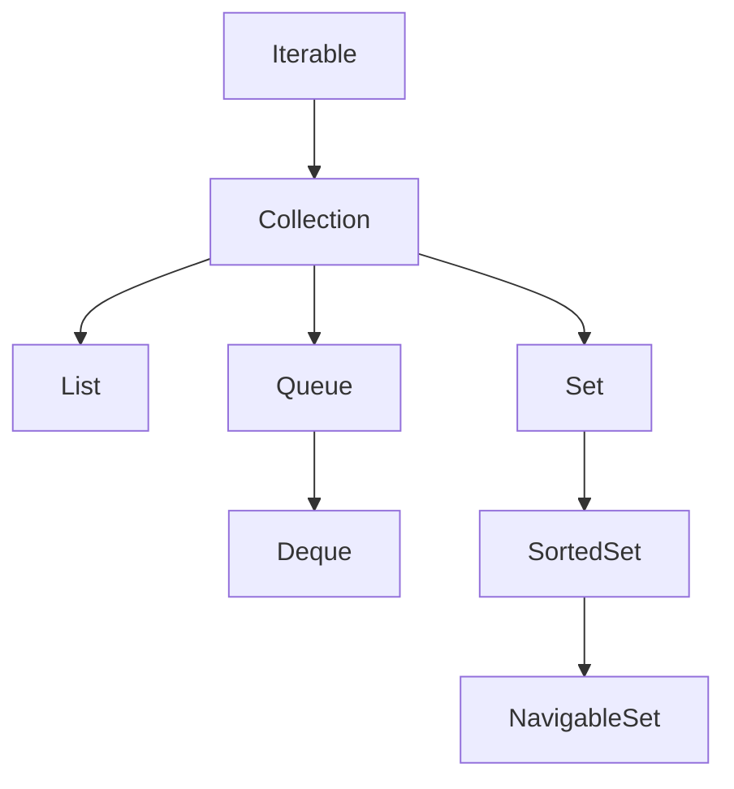

# Collections Framework - Overview & Core Architecture

## Architectural Motivation

Prior to Java 1.2, managing data collections in Java relied on raw arrays and ad-hoc utility classes such as `Vector`, `Hashtable`, or `Dictionary`. These legacy abstractions suffered from severe structural limitations:
- **Lack of Uniformity**: Each container exposed completely different API signatures and iteration mechanics (`Vector` used `Enumeration`, arrays used `array[i]`).
- **Low Reusability**: Passing a `Vector` into a method expecting a general list required custom adapters or conversion loops.
- **Forced Synchronization Overhead**: `Vector` and `Hashtable` synchronized every public method, incurring a massive performance penalty in single-threaded or modern concurrent applications.

To resolve these architectural flaws, Java 1.2 introduced the **Java Collections Framework (JCF)** — a unified architecture for representing and manipulating collections independently of underlying implementation details. The JCF is structured around three foundational pillars:
1. **Core Interfaces**: Abstract representations of collections (e.g., `Collection`, `List`, `Set`, `Queue`, `Map`).
2. **Implementations**: Concrete data structure implementations (e.g., `ArrayList`, `LinkedList`, `HashSet`, `HashMap`, `TreeMap`).
3. **Polymorphic Algorithms**: Static utility methods providing searching, sorting, and shuffling operations (e.g., `Collections.sort`).

---

## Core Interface Hierarchy

The hierarchy diagram below illustrates the relationship between the core interfaces in the Java Collections Framework:



> [!NOTE]
> The `Map<K, V>` interface exists outside the `Collection` interface hierarchy because maps represent key-value associations rather than collections of individual elements. However, `Map` remains a core component of the framework.

---

## Interface Contracts & Operational Semantics

### 1. `Iterable<T>` Interface
`Iterable<T>` is the root interface for all collection types except `Map`. Any class implementing `Iterable<T>` guarantees the ability to produce an `Iterator<T>` for sequential traversal.

- **Compiler Syntactic Translation**: When writing an enhanced `for-each` loop, the Java compiler (`javac`) automatically translates the code into equivalent `Iterator` invocations:
  ```java
  // User code:
  for (String item : collection) {
      System.out.println(item);
  }

  // Compiler-generated bytecode equivalent:
  Iterator<String> iterator = collection.iterator();
  while (iterator.hasNext()) {
      String item = iterator.next();
      System.out.println(item);
  }
  ```

### 2. `Collection<T>` Interface
`Collection<T>` extends `Iterable<T>` and defines fundamental bulk and element operations shared across containers:
- Insertion: `add(E e)`, `addAll(Collection<? extends E> c)`
- Deletion: `remove(Object o)`, `removeIf(Predicate<? super E> filter)`
- Inspection: `size()`, `isEmpty()`, `contains(Object o)`
- Transformation: `toArray()`, `stream()`

### 3. `List<E>` Interface
A `List` represents an **ordered sequence** that **permits duplicate elements**.
- **Positional Access**: Supports direct index-based element access via `get(int index)`, `set(int index, E element)`, and `remove(int index)`.
- **Common Implementations**: `ArrayList`, `LinkedList`, `Vector`.

### 4. `Set<E>` Interface
A `Set` represents an abstraction that **prohibits duplicate elements**, modeling the mathematical set abstraction.
- **Uniqueness Contract**: Element uniqueness relies on `equals()` and `hashCode()` contracts (for `HashSet`, `LinkedHashSet`) or `compareTo()` / `compare()` (for `TreeSet`).
- **Common Implementations**: `HashSet` (unordered, $O(1)$), `LinkedHashSet` (insertion-ordered), `TreeSet` (sorted, $O(\log N)$).

### 5. `Queue<E>` & `Deque<E>` Interfaces
- **`Queue`**: Holds elements prior to processing. Typically orders elements in FIFO (First-In-First-Out) order, but can also order by priority (`PriorityQueue`).
- **Queue Method Operations Matrix**:

| Operation | Throws Exception on Failure | Returns Special Value (null/false) |
| :--- | :--- | :--- |
| **Insert** | `add(e)` | `offer(e)` |
| **Remove** | `remove()` | `poll()` |
| **Examine** | `element()` | `peek()` |

- **`Deque` (Double-Ended Queue)**: Linear collection supporting insertion and removal at both ends. Can function as a FIFO Queue or a LIFO Stack.

### 6. `Map<K, V>` Interface
`Map` associates unique keys with values.
- **Rules**: Keys are unique; each key maps to at most one value.
- **Collection Views**: Exposes 3 collection views:
  1. `keySet()`: Returns `Set<K>`.
  2. `values()`: Returns `Collection<V>`.
  3. `entrySet()`: Returns `Set<Map.Entry<K, V>>`.

---

## Executable Code Examples

### 1. Traversing Collections via Iterable & Iterator
```java
import java.util.ArrayList;
import java.util.Iterator;
import java.util.List;

public class IterableArchitectureDemo {
    public static void main(String[] args) {
        List<String> frameworks = new ArrayList<>(List.of("Spring", "Hibernate", "Quarkus"));

        // 1. Safe removal during iteration using explicit Iterator
        Iterator<String> iterator = frameworks.iterator();
        while (iterator.hasNext()) {
            String item = iterator.next();
            if (item.startsWith("H")) {
                iterator.remove(); // Prevents ConcurrentModificationException
            }
        }
        System.out.println("After Iterator removal: " + frameworks);

        // 2. Removal using removeIf (Java 8+ Predicate)
        frameworks.removeIf(name -> name.endsWith("us"));
        System.out.println("After removeIf: " + frameworks);
    }
}
```

### 2. Map Collection Views Manipulation
```java
import java.util.HashMap;
import java.util.Map;

public class MapCollectionViewDemo {
    public static void main(String[] args) {
        Map<String, Integer> inventory = new HashMap<>();
        inventory.put("Laptop", 15);
        inventory.put("Monitor", 8);
        inventory.put("Keyboard", 25);

        // Iterating over entrySet
        for (Map.Entry<String, Integer> entry : inventory.entrySet()) {
            System.out.println("Item: " + entry.getKey() + " | Qty: " + entry.getValue());
        }

        // Modifying keySet view directly alters underlying Map
        inventory.keySet().removeIf(key -> key.equals("Keyboard"));
        System.out.println("Map after keySet removal: " + inventory);
    }
}
```

---

## Common Pitfalls & Interview Traps

1. **Treating `Map` as a `Collection`**:
   - *Trap*: Stating in an interview that `Map` extends `Collection`.
   - *Fact*: `Map` does not inherit from `Collection`. You cannot call `map.add()` or `map.iterator()` directly. Access must be via `entrySet()`, `keySet()`, or `values()`.

2. **Misusing Queue Method Exceptions**:
   - *Trap*: Using `add()` or `remove()` on capacity-restricted queues.
   - *Fact*: `add()` throws `IllegalStateException` when full. Production code should use `offer()`, `poll()`, and `peek()` for graceful error handling.

3. **Modifying Collection in Enhanced For Loop**:
   - *Trap*: Calling `list.remove(item)` inside `for (String item : list)`.
   - *Fact*: Throws `ConcurrentModificationException`. Use `Iterator.remove()` or `removeIf()`.
