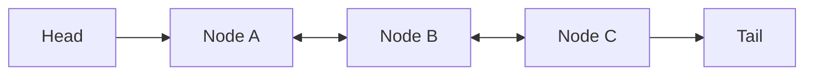

# ArrayList, LinkedList & Core List Implementations

## List Interface & Implementation Overview

The `List<E>` interface in the Java Collections Framework models an **ordered sequence** that **permits duplicate elements**. Although all concrete `List` implementations adhere to the same API contract, their underlying data structures and memory layout strategies produce significant differences in runtime execution efficiency and memory footprint.

---

## Deep Architectural Analysis

### 1. Mechanics of `ArrayList`
`ArrayList` is backed by a standard dynamic Java array (`Object[] elementData`).

- **Resizing Mechanism**:
  - When an element is added to a full `ArrayList` (`size == capacity`), it automatically allocates a larger array:
    $$\text{New Capacity} = \text{Old Capacity} + (\text{Old Capacity} \gg 1) = 1.5 \times \text{Old Capacity}$$
  - The elements from the old array are copied into the new array using system-level `System.arraycopy()`.
- **Algorithmic Complexity**:
  - Index-based lookup `get(index)` / `set(index)`: $O(1)$ time complexity due to direct pointer offset calculation:
    $$\text{Address}(i) = \text{Base Address} + i \times \text{Element Size}$$
  - Appending elements `add(element)`: **Amortized $O(1)$**. The $O(N)$ reallocation overhead is distributed across $N$ successful insertions.
  - Insertion/Deletion at the start or middle: $O(N)$ due to element array shifting.

- **CPU Cache Locality**:
  `ArrayList` stores elements contiguously in memory. Loading an element into L1/L2/L3 cache loads adjacent elements simultaneously (Spatial Locality), drastically reducing CPU cache misses compared to linked structures.

---

### 2. Mechanics of `LinkedList`
`LinkedList` is a doubly-linked list implementation of the `List` and `Deque` interfaces, wrapping each element inside a dedicated `Node<E>` object.



- **Node Overhead**:
  Each `Node<E>` contains 3 fields: `E item`, `Node<E> next`, and `Node<E> prev`. On a 64-bit JVM with Compressed OOPs, a node object adds approximately **24 - 32 bytes** of overhead per element purely for pointer references.
- **Algorithmic Complexity**:
  - Positional lookup `get(index)`: $O(N)$ time complexity. `LinkedList` checks if `index < (size >> 1)` to traverse forward from head or backward from tail.
  - Insert/Remove at ends (`addFirst`, `removeFirst`, `addLast`, `removeLast`): $O(1)$ pointer update.
  - Insert/Remove at arbitrary position given a valid Iterator: $O(1)$.

---

### 3. Legacy Classes: `Vector` & `Stack`

- **`Vector`**:
  - Dynamic array similar to `ArrayList` with all public methods marked `synchronized`.
  - Doubles capacity ($2\times$) when full.
  - *Status*: Obsolete. Coarse-grained synchronization causes severe thread contention penalties. Use `Collections.synchronizedList()` or `CopyOnWriteArrayList` for thread safety.

- **`Stack`**:
  - Extends `Vector` to model a LIFO (Last-In-First-Out) stack.
  - *Design Flaw*: Inheritance from `Vector` permits arbitrary positional insertion/deletion (`add(index, element)`), violating LIFO abstraction invariants.
  - *Replacement*: Use `ArrayDeque` for stack or queue operations.

---

### 4. Related Set Implementations: `HashSet` & `LinkedHashSet`

- **`HashSet`**:
  - Uses an internal `HashMap` for storage, storing elements as keys mapped to a dummy object constant (`PRESENT`).
  - $O(1)$ for `add`, `remove`, `contains`. Unordered.
- **`LinkedHashSet`**:
  - Extends `HashSet` with a doubly-linked list running through all entries.
  - Preserves exact **insertion order** during iteration.

---

## Comparative Performance Matrix

| Metric | `ArrayList` | `LinkedList` | `Vector` | `ArrayDeque` (LIFO/FIFO) |
| :--- | :--- | :--- | :--- | :--- |
| **Data Structure** | Dynamic Array (`Object[]`) | Doubly-Linked List | Synchronized Array | Circular Array |
| **Random Access `get(i)`** | $O(1)$ | $O(N)$ | $O(1)$ | $O(1)$ (Ends) |
| **Add/Remove Tail** | $O(1)$ (Amortized) | $O(1)$ | $O(1)$ (Amortized) | $O(1)$ |
| **Add/Remove Head** | $O(N)$ | $O(1)$ | $O(N)$ | $O(1)$ |
| **CPU Cache Locality** | High | Low (Cache Misses) | High | High |
| **Memory Overhead/Element** | Low | High (Node Objects) | Low | Low |
| **Thread Safety** | No | No | Yes (`synchronized`) | No |

---

## Executable Code Example

```java
import java.util.ArrayDeque;
import java.util.ArrayList;
import java.util.Deque;
import java.util.HashSet;
import java.util.LinkedHashSet;
import java.util.LinkedList;
import java.util.List;
import java.util.Set;

public class ListImplementationsDemo {
    public static void main(String[] args) {
        // 1. ArrayList: Fast indexed access
        List<String> arrayList = new ArrayList<>();
        arrayList.add("Java");
        arrayList.add("Kotlin");
        System.out.println("ArrayList element at index 1: " + arrayList.get(1));

        // 2. ArrayDeque: Modern Stack replacement
        Deque<String> stack = new ArrayDeque<>();
        stack.push("Layer 1");
        stack.push("Layer 2");
        System.out.println("Stack Pop (LIFO): " + stack.pop());

        // 3. HashSet vs LinkedHashSet ordering
        Set<String> hashSet = new HashSet<>(List.of("C", "A", "B"));
        Set<String> linkedHashSet = new LinkedHashSet<>(List.of("C", "A", "B"));

        System.out.println("HashSet (Arbitrary order): " + hashSet);
        System.out.println("LinkedHashSet (Insertion order C->A->B): " + linkedHashSet);
    }
}
```

---

## Common Pitfalls & Interview Traps

1. **Assuming `LinkedList` is Always Faster for Insertions**:
   - *Fact*: Inserting into the middle of a `LinkedList` requires traversing $O(N)$ nodes first. Pointer chasing on the Heap causes `LinkedList` to be slower than `ArrayList` in practice.

2. **Omitting Initial Capacity for `ArrayList`**:
   - *Fact*: When total elements are known beforehand (e.g. 100,000 items), instantiate `new ArrayList<>(100000)` to avoid repeated array allocations and memory copy calls.
