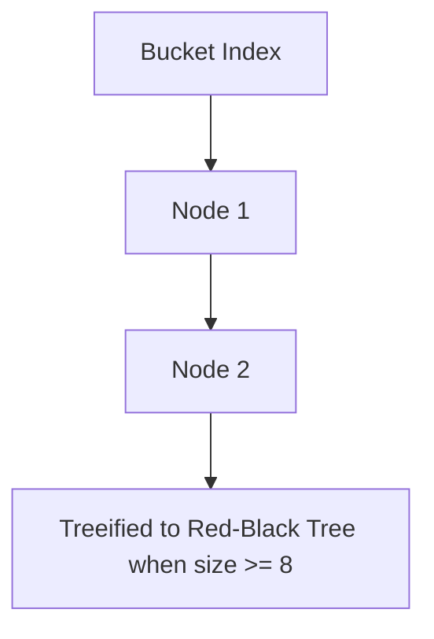

# Core Map Implementations: HashMap, LinkedHashMap, TreeMap & Hashtable

## Structural Classification of Map Implementations

The `Map<K, V>` interface represents a data structure that maps unique Keys to Values. Although it does not inherit from `Collection`, `Map` is a fundamental pillar of the Java Collections Framework. Selecting the appropriate `Map` implementation directly dictates query latency ($O(1)$ vs $O(\log N)$) and in-memory key ordering.

---

## Deep Architectural Analysis of `HashMap` Internals

`HashMap` is the most widely used Map implementation in Java, operating on a **Hash Table** data structure.

### 1. Hashing Function & Hash Spreading
When inserting a `(key, value)` pair into a `HashMap`:
1. The key's hash code is obtained via `key.hashCode()`.
2. To minimize collision rates when table bucket size is small, `HashMap` applies a bit-spreading function that XORs higher 16 bits into lower 16 bits:
   ```java
   static final int hash(Object key) {
       int h;
       return (key == null) ? 0 : (h = key.hashCode()) ^ (h >>> 16);
   }
   ```
3. The target bucket index is computed using a bitwise AND instead of expensive modulus operations:
   $$\text{Bucket Index} = (n - 1) \ \& \ \text{hash}$$
   *(where $n$ is table capacity, enforced to always be a power of two).*

### 2. Collision Resolution & Treeification
When two keys evaluate to the same bucket index:
- **Prior to Java 8**: `HashMap` utilized a Singly-Linked List per bucket. Under high hash collisions, lookup degraded from $O(1)$ to $O(N)$.
- **Java 8+ Treeification Optimization**:
  - Elements initially chain in a singly-linked list.
  - When bucket collision count reaches **`TREEIFY_THRESHOLD = 8`** AND total map capacity reaches at least **`MIN_TREEIFY_CAPACITY = 64`**, the bucket converts automatically into a **Red-Black Tree**.
  - Worst-case lookup latency drops from $O(N)$ to **$O(\log N)$**.
  - If node count in a treeified bucket decreases to **`UNTREEIFY_THRESHOLD = 6`**, it reverts back to a singly-linked list to reduce memory overhead.



### 3. Load Factor & Rehashing Dynamics
- **Default Load Factor (`DEFAULT_LOAD_FACTOR = 0.75`)**: Balances memory utilization vs hash collision likelihood.
- **Rehash Threshold**:
  $$\text{Threshold} = \text{Capacity} \times \text{Load Factor}$$
- When total entries exceed `Threshold`, capacity doubles ($n \to 2n$) and a full rehash distributes elements across the new array.

---

## Alternative Map Implementations

### 1. `LinkedHashMap`
- Extends `HashMap` with a **doubly-linked list** traversing all entries.
- Preserves **Insertion Order** or **Access Order**.
- **LRU Cache Building**: When instantiated with `accessOrder = true`, calling `get(key)` moves the entry to the tail. Overriding `removeEldestEntry()` creates a functional **LRU (Least Recently Used) Cache** in a few lines.

### 2. `TreeMap`
- Implements `NavigableMap` using a Red-Black Tree.
- Orders keys according to natural ordering (`Comparable`) or a custom `Comparator`.
- $O(\log N)$ operations for `get`, `put`, `remove`. **Prohibits `null` keys**.

### 3. `Hashtable` (Legacy Class)
- Synchronizes all public methods (`synchronized`).
- **Prohibits `null` keys and `null` values** (throws `NullPointerException`).
- *Status*: Obsolete. Replaced by `ConcurrentHashMap`.

---

## Comprehensive Map Implementations Comparison

| Feature | `HashMap` | `LinkedHashMap` | `TreeMap` | `Hashtable` |
| :--- | :--- | :--- | :--- | :--- |
| **Data Structure** | Hash Table + Red-Black Tree | Hash Table + Doubly-Linked List | Red-Black Tree | Synchronized Hash Table |
| **`get/put` Complexity** | $O(1)$ | $O(1)$ | $O(\log N)$ | $O(1)$ |
| **Key Ordering** | Unordered | Insertion Order / Access Order | Sorted Order | Unordered |
| **`null` Keys / Values** | 1 `null` key, multiple `null` values | 1 `null` key, multiple `null` values | **Prohibits `null` keys** | **Prohibits both `null` keys & values** |
| **Thread Safety** | No | No | No | Yes (`synchronized`) |

---

## Executable Code Example: LRU Cache via LinkedHashMap

```java
import java.util.LinkedHashMap;
import java.util.Map;

// LRU Cache capping at 3 elements
class LRUCache<K, V> extends LinkedHashMap<K, V> {
    private final int maxCapacity;

    public LRUCache(int maxCapacity) {
        super(maxCapacity, 0.75f, true); // accessOrder=true
        this.maxCapacity = maxCapacity;
    }

    @Override
    protected boolean removeEldestEntry(Map.Entry<K, V> eldest) {
        return size() > maxCapacity;
    }
}

public class MapImplementationsDemo {
    public static void main(String[] args) {
        LRUCache<String, Integer> cache = new LRUCache<>(3);
        cache.put("UserA", 101);
        cache.put("UserB", 102);
        cache.put("UserC", 103);

        // Access UserA -> moves to most recently used
        cache.get("UserA");

        // Put 4th item -> UserB (least recently used) is evicted!
        cache.put("UserD", 104);

        System.out.println("LRU Cache Contents: " + cache);
        // Prints: {UserC=103, UserA=101, UserD=104}
    }
}
```

---

## Common Pitfalls & Interview Traps

1. **Mutating Key Attributes After Insertion**:
   - *Trap*: Using a Mutable Object as a Key (e.g. `List` or custom class) and modifying field values that affect `hashCode()`.
   - *Fact*: `map.get(key)` calculates the new hash code, searching the wrong bucket $\implies$ Returns `null` causing memory leaks. **Always use Immutable Objects (e.g. `String`, `Integer`, `Record`) as Map keys**.

2. **Null Key Prohibition Distinction**:
   - *Fact*: `HashMap` accepts `key == null` (stored at bucket index 0). `Hashtable` calls `key.hashCode()` directly, throwing `NullPointerException`.
