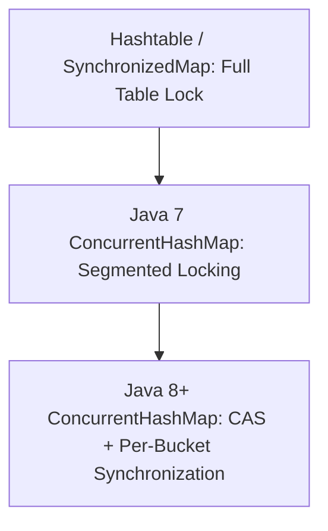

# ConcurrentHashMap & Multithreading in Collections

## Thread-Safety Challenges

In multithreaded execution environments, concurrent writes to non-thread-safe containers like `HashMap` or `ArrayList` lead to severe issues:
- **Data Races**: Overwriting elements, causing silent data loss.
- **Infinite Loops in Legacy HashMap**: In Java 7 and earlier, concurrent `resize()` invocations corrupted linked list pointers, forming closed cycles that caused 100% CPU utilization hangs.
- **`ConcurrentModificationException`**: Thrown when a thread structurally modifies a collection during active iteration by another thread.

---

## Evolution of Multithreaded Maps in Java



### 1. `Hashtable` & `Collections.synchronizedMap()`
- **Mechanism**: Table-Level Locking. Every read and write thread must contend for a single global lock (`synchronized(this)` or `synchronized(mutex)`).
- **Limitation**: Creates severe performance bottlenecks as thread counts scale.

### 2. Java 7 `ConcurrentHashMap` (Segmented Locking)
- Divided hash buckets into 16 independent `Segment` objects, each acting as a distinct `ReentrantLock`.
- Allowed up to 16 concurrent writer threads across different segments without lock contention.

### 3. Java 8+ `ConcurrentHashMap` (CAS + Bucket Synchronization)
Java 8 eliminated `Segment` instances in favor of fine-grained bucket-level synchronization:
- **Lock-free CAS (Compare-And-Swap)**: If a target bucket is empty (`node == null`), `ConcurrentHashMap` uses native CPU instructions (`Unsafe.compareAndSwapObject`) to insert the node **without acquisition of a monitor lock**.
- **Fine-Grained `synchronized` Head Node Locking**: If a collision exists in a bucket, it locks only the first node (`synchronized (f)`). Surrounding buckets remain unblocked.
- **Lock-Free Reads**: Read operations (`get()`) are completely lock-free via `volatile` memory barrier semantics on array cells and node next pointers (`volatile Node<K,V> next`).

---

## Atomic Compound Operations

To avoid Check-Then-Act race conditions, `ConcurrentHashMap` exposes atomic operation methods:

- `putIfAbsent(K key, V value)`: Inserts pair if key is not present.
- `computeIfAbsent(K key, Function mappingFunction)`: Computes value atomically if key is absent.
- `merge(K key, V value, BiFunction remappingFunction)`: Atomically merges existing and new values.

---

## Multithreaded Map Solutions Matrix

| Feature | `HashMap` | `Collections.synchronizedMap()` | `ConcurrentHashMap` |
| :--- | :--- | :--- | :--- |
| **Thread Safety** | No | Yes | **Yes** |
| **Locking Mechanism** | None | Full Map Mutex Lock | **CAS for empty buckets + Per-bucket head lock** |
| **Concurrency Scale** | 0 | 1 thread at a time | **High (Concurrent across distinct buckets)** |
| **Read Operations `get()`** | Non-locked | Requires Mutex | **Lock-Free ($O(1)$)** |
| **Permits `null` Key/Value** | Yes | Yes | **Prohibits both `null` Keys & Values** |

> [!CAUTION]
> `ConcurrentHashMap` strictly prohibits `null` keys and values. This design prevents ambiguity in multithreaded environments: if `get(key)` returns `null`, calling `containsKey(key)` cannot reliably distinguish "key absent" from "key mapped to null" because another thread may mutate the map state between the two calls.

---

## Executable Code Example

```java
import java.util.Map;
import java.util.concurrent.ConcurrentHashMap;
import java.util.concurrent.ExecutorService;
import java.util.concurrent.Executors;
import java.util.concurrent.TimeUnit;

public class ConcurrentHashMapDemo {
    public static void main(String[] args) throws InterruptedException {
        Map<String, Integer> wordCounts = new ConcurrentHashMap<>();

        // Simulate 10 threads updating counter concurrently
        ExecutorService executor = Executors.newFixedThreadPool(10);

        for (int i = 0; i < 1000; i++) {
            executor.submit(() -> {
                // Atomic merge operation prevents lost updates
                wordCounts.merge("Java", 1, Integer::sum);
            });
        }

        executor.shutdown();
        executor.awaitTermination(5, TimeUnit.SECONDS);

        System.out.println("Word count total (Expected 1000): " + wordCounts.get("Java"));
    }
}
```

---

## Common Pitfalls & Interview Traps

1. **Compounding Thread-Safe Calls to Create Race Conditions**:
   - *Trap*: 
     ```java
     if (!map.containsKey(key)) {
         map.put(key, value); // RACE CONDITION! Another thread can insert between these calls
     }
     ```
   - *Fact*: Individual method thread-safety does not guarantee composite atomicity. Use `map.putIfAbsent(key, value)`.

2. **Iterating `ConcurrentHashMap`**:
   - *Fact*: `ConcurrentHashMap` iterators are **Weakly-Consistent**. They never throw `ConcurrentModificationException` and reflect state at or after iterator instantiation.
