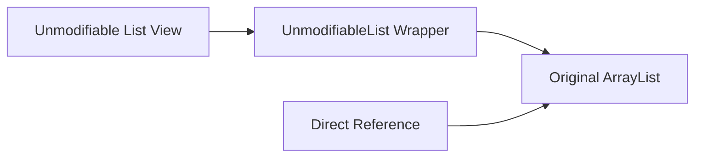

# Collections.unmodifiableList vs List.of() (Unmodifiable vs Immutable Collections)

## Unmodifiable Views vs True Immutability

In software design with Java, immutability is a key architectural principle that promotes thread-safe design, simplified reasoning, and side-effect prevention.

Java provides two distinct mechanisms for constructing read-only lists:
1. **Unmodifiable View Wrappers**: Exposed via static utility methods such as `Collections.unmodifiableList()`, `Collections.unmodifiableSet()`, and `Collections.unmodifiableMap()`.
2. **True Immutable Collection Factory Methods (Java 9+)**: Exposed via `List.of()`, `Set.of()`, `Map.of()`, and `List.copyOf()`.

Although both mechanisms throw `UnsupportedOperationException` upon mutation attempts (`add`, `remove`, `set`), **their underlying implementation mechanics and immutability guarantees differ fundamentally**.

---

## Architectural Deep Dive

### 1. `Collections.unmodifiableList()` Mechanics (View Wrapper Pattern)
`Collections.unmodifiableList(existingList)` **DOES NOT construct a new collection**.



- **Decorator Pattern**: It constructs a lightweight wrapper object implementing `List`. This wrapper intercepts all write operations (`add`, `remove`, `set`) and throws `UnsupportedOperationException`. Read operations (`get`, `size`, `contains`) are directly delegated to the underlying backing list.
- **Reference Leak & Live Updates**:
  - If the underlying backing list is mutated via another reference, **the changes immediately reflect in the Unmodifiable View**!
  - *Conclusion*: `Collections.unmodifiableList()` is a **Read-Only View**, NOT a True Immutable Collection.

---

### 2. Java 9+ Factory Methods (`List.of()` & `List.copyOf()`)
Introduced in Java 9, `List.of(...)` and `List.copyOf(...)` construct true immutable collections.

- **True Immutability**:
  - Completely encapsulated data. No external reference can mutate the contents of an immutable list after creation.
  - `List.copyOf(collection)` automatically performs a **Defensive Copy** if the passed collection is not already a Java 9 immutable list.
- **Compact Memory Layout**:
  - For lists with 1 or 2 elements, Java instantiates ultra-compact implementations: `List12<E>` (stores elements directly as 2 fields inside the object, eliminating internal array object allocation $\implies$ minimal RAM usage).
  - For lists with 3 or more elements, Java utilizes `ListN<E>`.
- **Strict `null` Prohibition**:
  - `List.of()` and `Set.of()` throw `NullPointerException` if any element is `null` (during creation or when calling `contains(null)`).

---

## Comprehensive Comparison Matrix

| Feature | `Collections.unmodifiableList(list)` | `List.of(e1, e2)` / `List.copyOf(list)` |
| :--- | :--- | :--- |
| **Java Version** | Java 1.2+ | Java 9+ |
| **Nature** | **Read-Only View Wrapper** over backing List | **True Immutable Collection** |
| **Backing List Mutation Effect** | **Reflects changes** (Live view wrapper) | **Completely independent** (Defensive copy) |
| **Permits `null` Elements** | Yes (If backing list permits `null`) | **Prohibits `null`** (throws `NullPointerException`) |
| **Internal Storage** | Wraps an intermediate `List` instance | Uses lightweight `List12` / `ListN` classes |
| **Mutation Operations** | Throws `UnsupportedOperationException` | Throws `UnsupportedOperationException` |

---

## Executable Code Example

```java
import java.util.ArrayList;
import java.util.Collections;
import java.util.List;

public class UnmodifiableVsImmutableDemo {
    public static void main(String[] args) {
        // 1. Demo Collections.unmodifiableList (Read-only View)
        List<String> originalList = new ArrayList<>();
        originalList.add("Alpha");
        originalList.add("Beta");

        List<String> unmodifiableView = Collections.unmodifiableList(originalList);
        System.out.println("Initial Unmodifiable View: " + unmodifiableView);

        // Mutating backing list reflects in unmodifiable view!
        originalList.add("Gamma");
        System.out.println("Unmodifiable View after backing mutation: " + unmodifiableView);

        // 2. Demo List.of() & List.copyOf() (True Immutable)
        List<String> immutableList = List.copyOf(originalList);
        originalList.add("Delta");

        System.out.println("Immutable List (Unaffected): " + immutableList);

        // Mutation throws UnsupportedOperationException
        try {
            immutableList.add("Epsilon");
        } catch (UnsupportedOperationException e) {
            System.out.println("Blocked! Cannot mutate List.of / List.copyOf");
        }
    }
}
```

---

## Common Pitfalls & Interview Traps

1. **Assuming `Collections.unmodifiableList()` Guarantees Data Security**:
   - *Trap*: Returning `Collections.unmodifiableList(internalList)` in a DTO/Entity Getter assuming complete data protection.
   - *Fact*: If internal code or caller retains a reference to `internalList`, the returned view updates unexpectedly. **Always use `List.copyOf()` to guarantee true immutability**.

2. **Passing `null` to `List.of()` or Calling `contains(null)`**:
   - *Fact*: `List.of("A", null)` throws `NullPointerException`. Even invoking `List.of("A", "B").contains(null)` throws `NullPointerException` rather than returning `false`.
