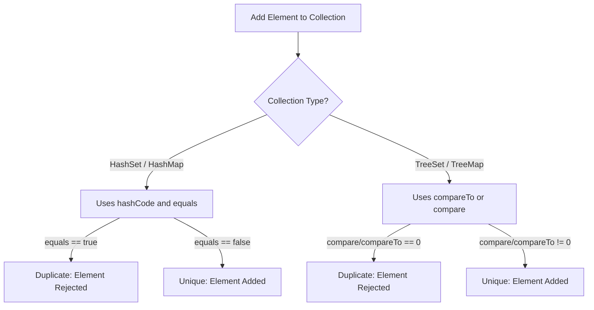
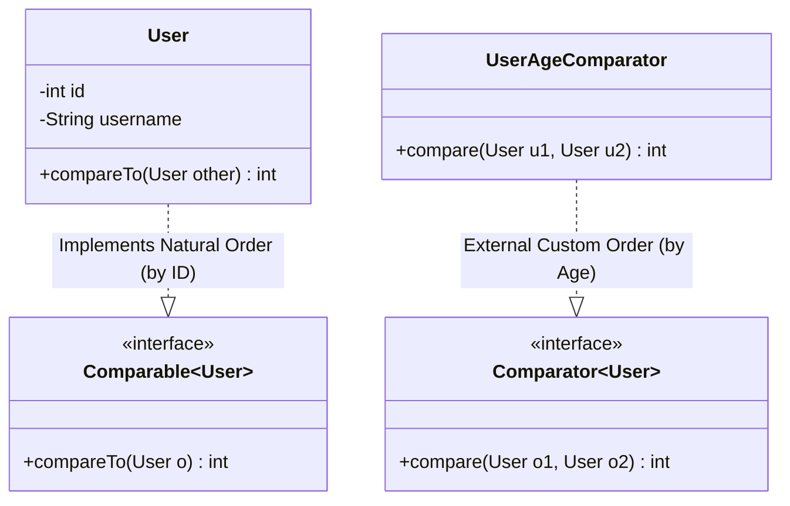

# Comparable and Comparator - Part 1

## Learning Goal

This file covers a focused slice of **Comparable and Comparator**. Study each concept as a practical Java rule, not as isolated vocabulary.

## Outline Coverage

| Concept | What to know |
| --- | --- |
| `Comparable` | Comparable defines natural ordering inside the class being compared. |
| `compareTo` |`compareTo` — Compares this object with specified object, returning negative, zero, or positive int. |
| `Comparator` | Comparator defines external custom ordering for objects. |
| `compare` |`compare` — Compares two arguments for order using a custom Comparator. |
| `Natural ordering` |`Natural ordering` — The default sort order defined by a class implementing Comparable<T>. |
| `Custom ordering` |`Custom ordering` — An explicit sort order defined separately using a Comparator<T>. |
| `Sort List object` | A List is an ordered collection that can contain duplicates and supports positional access. |
| `Sort by multiple criteria` |`Sort by multiple criteria` — Chaining multiple Comparators using thenComparing to sort by primary, secondary, etc. fields. |
| `Comparator.comparing` | Comparator defines external custom ordering for objects. |
| `thenComparing` |`thenComparing` — thenComparing provides specific functionality and rules in Java development. |

## Detailed Notes

### Comparable

Comparable defines natural ordering inside the class being compared.

#### Enriched Explanation
`Comparable<T>` is a generic interface (`java.lang.Comparable`) implemented by a class to define its **natural ordering**. When a class implements `Comparable`, objects of that class can be sorted automatically by collections utilities like `Collections.sort()` or `Arrays.sort()`, and can be used as keys in sorted maps (`TreeMap`) or elements in sorted sets (`TreeSet`) without providing an explicit comparator.

#### Code Example
```java
public class User implements Comparable<User> {
    private final String username;
    private final int id;

    public User(String username, int id) {
        this.username = username;
        this.id = id;
    }

    @Override
    public int compareTo(User other) {
        // Natural ordering based on ID ascending
        return Integer.compare(this.id, other.id);
    }
}
```

#### Gotchas & Failure Modes
- **ClassCastException**: If you attempt to sort a list of objects that do not implement `Comparable` (and do not provide a `Comparator`), Java will throw a `ClassCastException` at runtime (if using raw types) or fail to compile (with generic types).
- **Consistency with Equals**: It is strongly recommended (though not strictly required) that natural ordering be consistent with `equals`. That is, `(x.compareTo(y) == 0) == (x.equals(y))`. Collections like `TreeSet` and `TreeMap` use `compareTo` (not `equals`) to determine uniqueness; if they are inconsistent, the set/map will violate the general contract of `Set`/`Map` and behave unexpectedly.

## Why TreeSet and TreeMap Require Consistency with Equals

Sorted collections such as `TreeSet` and `TreeMap` behave differently from general collections. Unlike `HashSet` or `HashMap`, which determine uniqueness using `Object.hashCode()` and `Object.equals()`, sorted collections depend exclusively on the comparison method (`compareTo` or `compare`) to identify duplicates. If `compareTo` returns `0` for two elements, they are considered identical, regardless of what `equals()` returns. If the natural ordering is inconsistent with `equals()`, elements that are distinct under `equals()` will be silently ignored when added to a `TreeSet` or `TreeMap`. This breaks the formal contract of the `Set` and `Map` interfaces, which are defined in terms of `equals()`, leading to unexpected data loss or retrieval bugs in collections-based code.

### Mental Model: Uniqueness Resolution in Java Collections


### Code Example: BigDecimal Inconsistency
```java
import java.math.BigDecimal;
import java.util.HashSet;
import java.util.Set;
import java.util.TreeSet;

public class ConsistencyExample {
    public static void main(String[] args) {
        BigDecimal d1 = new BigDecimal("1.0");
        BigDecimal d2 = new BigDecimal("1.00");

        // 1. HashSet uses hashCode() and equals()
        // d1.equals(d2) is false because scale differs (1 vs 2 decimal places)
        Set<BigDecimal> hashSet = new HashSet<>();
        hashSet.add(d1);
        hashSet.add(d2);
        System.out.println("HashSet size: " + hashSet.size()); // Output: HashSet size: 2

        // 2. TreeSet uses compareTo()
        // d1.compareTo(d2) is 0 because the numerical values are equal
        Set<BigDecimal> treeSet = new TreeSet<>();
        treeSet.add(d1);
        treeSet.add(d2); // Rejected as duplicate!
        System.out.println("TreeSet size: " + treeSet.size()); // Output: TreeSet size: 1
    }
}
```

### Cause-Effect Chain
`(x.compareTo(y) == 0) == (x.equals(y))` is false $\rightarrow$ `TreeSet`/`TreeMap` rely solely on `compareTo` for uniqueness checks $\rightarrow$ Distinct objects under `equals` that return `0` from `compareTo` are treated as duplicate elements $\rightarrow$ The duplicate elements are rejected during insertion $\rightarrow$ Data loss occurs and the collection violates the standard Java Collections Set/Map contract.

### compareTo

compareTo is a specific method in Comparable used to define natural ordering rules.

#### Enriched Explanation
The `compareTo(T o)` method is the single abstract method of the `Comparable` interface. It compares the current object (`this`) with the specified object `o`.
- Returns a **negative integer** if `this` is less than `o`.
- Returns **zero** if `this` is equal to `o`.
- Returns a **positive integer** if `this` is greater than `o`.

#### Code Example
```java
// String's compareTo implementation compares characters lexicographically
int result = "apple".compareTo("banana"); // returns a negative number (< 0)
```

#### Gotchas & Failure Modes
- **Integer Subtraction Overflow Bug**: A classic mistake is implementing `compareTo` using subtraction:
  ```java
  public int compareTo(User other) {
      return this.id - other.id; // DANGER: can overflow!
  }
  ```
  If `this.id` is `Integer.MIN_VALUE` and `other.id` is `1`, the subtraction results in `Integer.MAX_VALUE` (a positive number), incorrectly indicating that `this` is greater than `other`. Always use `Integer.compare(a, b)` instead.
- **NullPointerException**: `x.compareTo(null)` should always throw a `NullPointerException`.

## Why Subtraction-Based Comparison Leads to Overflow Bugs

Using subtraction (e.g., `this.id - other.id`) to implement comparison is a dangerous anti-pattern in Java. The subtraction formula assumes that if `x > y`, then `x - y` will be positive; however, this assumption is broken by the boundaries of finite-precision binary arithmetic. In two's complement representation, subtracting a positive number from a large negative number (or vice-versa) can cause the result to exceed the type's minimum or maximum value, wrapping the value around and flipping the sign of the result. When this sign flip occurs, the sorting algorithm receives the exact opposite result of the true comparison, leading to unsorted collections, incorrect sorting orders, or contract violation exceptions at runtime.

### Mental Model: Subtraction Overflow Under Two's Complement
Let us compare two values: `x = Integer.MIN_VALUE` ($-2147483648$) and `y = 1`.
Mathematically, $x < y$, so a comparison must return a negative number.
Using subtraction:
```text
  10000000 00000000 00000000 00000000   (Integer.MIN_VALUE)
- 00000000 00000000 00000000 00000001   (1)
=====================================
  01111111 11111111 11111111 11111111   (Integer.MAX_VALUE / +2147483647)
```
The sign bit changes from `1` (negative) to `0` (positive). Java now incorrectly concludes that $x > y$.

### Code Example: Subtraction Bug Demonstrating Overflow
```java
public class SubtractionOverflowDemo {
    public static void main(String[] args) {
        int x = Integer.MIN_VALUE;
        int y = 1;

        // Subtraction method (BUGGY)
        int buggyResult = x - y;
        System.out.println("Buggy Result: " + buggyResult); // Output: Buggy Result: 2147483647 (> 0, indicating x > y!)

        // Proper comparison method (SAFE)
        int safeResult = Integer.compare(x, y);
        System.out.println("Safe Result: " + safeResult);   // Output: Safe Result: -1 (< 0, indicating x < y)
    }
}
```

### Cause-Effect Chain
Opposing sign values compared via subtraction $\rightarrow$ Difference exceeds the minimum or maximum bounds of the primitive type $\rightarrow$ Binary representation under two's complement arithmetic overflows or underflows $\rightarrow$ The sign bit of the subtraction result flips $\rightarrow$ The comparator returns a positive number for a less-than relation $\rightarrow$ The sorting algorithm orders the elements incorrectly or throws a contract exception.

### Comparator

Comparator defines external custom ordering for objects.

#### Enriched Explanation
`Comparator<T>` is a functional interface (`java.util.Comparator`) used to define an **external, custom ordering** for a class. Unlike `Comparable`, which is embedded in the class itself, a `Comparator` can be defined as separate classes, anonymous classes, or lambda expressions. This allows multiple different sorting strategies for the same class (e.g., sorting employees by salary, then by department).

#### Code Example
```java
import java.util.Comparator;

public class EmployeeSalaryComparator implements Comparator<Employee> {
    @Override
    public int compare(Employee e1, Employee e2) {
        return Double.compare(e1.getSalary(), e2.getSalary());
    }
}
```

#### Gotchas & Failure Modes
- **Concurrent Modification / Mutable Fields**: If you sort a collection and then modify the fields of an object that the `Comparator` uses to sort, the sorting state becomes inconsistent. The collection (like `TreeSet` or `TreeMap`) will fail to retrieve, delete, or correctly order the modified elements.

## Why Java Separates Comparable and Comparator

Java segregates sorting capabilities into `Comparable` and `Comparator` to support the single-responsibility principle and facilitate multiple sorting strategies. The `Comparable` interface defines a class's *natural ordering*, meaning it represents the default, intrinsic sorting logic that is hardcoded directly into the class itself. However, embedding comparison logic inside the class is impossible when dealing with third-party classes, or when a class needs to be sorted dynamically in different contexts (such as sorting employees by salary in one view and by name in another). The `Comparator` interface resolves this by acting as an external strategy object, allowing developers to define an arbitrary number of custom sorting rules separate from the class definition itself.

### Mental Model: Intrinsic (Comparable) vs Extrinsic (Comparator) Ordering


### Code Example: Natural Ordering vs Custom Comparator
```java
import java.util.ArrayList;
import java.util.Collections;
import java.util.Comparator;
import java.util.List;

public class SortingComparison {
    public static class User implements Comparable<User> {
        final String name;
        final int id;

        public User(String name, int id) {
            this.name = name;
            this.id = id;
        }

        // Comparable defines the single, default natural order (by ID)
        @Override
        public int compareTo(User other) {
            return Integer.compare(this.id, other.id);
        }

        @Override
        public String toString() {
            return name + "(ID:" + id + ")";
        }
    }

    public static void main(String[] args) {
        List<User> users = new ArrayList<>(List.of(
            new User("Charlie", 3),
            new User("Alice", 1),
            new User("Bob", 2)
        ));

        // 1. Natural Sort using Comparable (by ID)
        Collections.sort(users);
        System.out.println("Natural order: " + users); // Output: Natural order: [Alice(ID:1), Bob(ID:2), Charlie(ID:3)]

        // 2. Custom Sort using an external Comparator (by Name lexicographically)
        users.sort(Comparator.comparing(u -> u.name));
        System.out.println("Custom order:  " + users); // Output: Custom order:  [Alice(ID:1), Bob(ID:2), Charlie(ID:3)]
    }
}
```

### Cause-Effect Chain
Class requires a single, universal default order $\rightarrow$ Implement `Comparable` in the class itself $\rightarrow$ Call `Collections.sort(list)` without passing arguments.
Class requires multiple context-specific orders or is unmodifiable $\rightarrow$ Define external `Comparator` instances $\rightarrow$ Pass comparator to `list.sort(comparator)` to dynamically execute the chosen strategy.

### compare

compare is the abstract method in Comparator used to evaluate two objects.

#### Enriched Explanation
The `compare(T o1, T o2)` method is the primary abstract method of `Comparator`.
- Returns a **negative integer** if `o1` is less than `o2`.
- Returns **zero** if `o1` is equal to `o2`.
- Returns a **positive integer** if `o1` is greater than `o2`.

#### Code Example
```java
Comparator<String> lengthComparator = (s1, s2) -> Integer.compare(s1.length(), s2.length());
int result = lengthComparator.compare("short", "extremelyLong"); // negative
```

#### Gotchas & Failure Modes
- **Null Safety**: Unlike `compareTo` (where `x.compareTo(null)` throws NPE by contract), `compare(o1, o2)` may receive `null` for either or both parameters. Implementations must decide how to handle `null` (e.g., using `Comparator.nullsFirst()`) to avoid throwing unexpected `NullPointerException`s.
- **Asymmetry Bug**: The implementation must satisfy asymmetry: `signum(compare(x, y)) == -signum(compare(y, x))`. If not met, sorting algorithms can loop infinitely or produce wrong results.

## Why the Transitivity Contract is Critical for Sorting

The mathematical contracts for `Comparable.compareTo` and `Comparator.compare` dictate three properties: reflexivity, symmetry, and transitivity. Among these, the **transitivity contract** is the most crucial for correctness: if element $A$ is greater than element $B$ ($compare(A, B) > 0$), and element $B$ is greater than element $C$ ($compare(B, C) > 0$), then element $A$ must be greater than element $C$ ($compare(A, C) > 0$). Transitivity guarantees that a set of elements can be mapped to a linear, logically consistent sequence. If a comparator violates transitivity (creating cyclic preferences like Rock-Paper-Scissors), modern sorting algorithms like TimSort will detect the logical contradiction during the merge phase, throwing a runtime `IllegalArgumentException`. In older JDKs or other algorithms, violating transitivity can result in silent data corruption, infinite loops, or elements being entirely lost during the sorting process.

### Mental Model: Linear Transitive Order vs Cyclic Contradiction
```mermaid
graph TD
    subgraph Non-Transitive Cycle (Rock-Paper-Scissors - BUG)
        Rock -->|beats| Scissors
        Scissors -->|beats| Paper
        Paper -->|beats| Rock
    end
    subgraph Transitive Order (Linear - CORRECT)
        A[A: 3] -->|greater than| B[B: 2]
        B -->|greater than| C[C: 1]
        A -->|greater than| C
    end
```

### Code Example: Non-Transitive Comparator Triggering Exception
```java
import java.util.ArrayList;
import java.util.Collections;
import java.util.List;

public class TransitivityViolationDemo {
    public static void main(String[] args) {
        // Create a list representing a rock-paper-scissors game
        List<String> rps = new ArrayList<>();
        for (int i = 0; i < 15; i++) {
            rps.add("Rock");
            rps.add("Paper");
            rps.add("Scissors");
        }

        try {
            // A cyclic, non-transitive comparator
            rps.sort((a, b) -> {
                if (a.equals(b)) return 0;
                if (a.equals("Rock") && b.equals("Scissors")) return 1;
                if (a.equals("Scissors") && b.equals("Paper")) return 1;
                if (a.equals("Paper") && b.equals("Rock")) return 1;
                return -1; // Reverse relationships
            });
            System.out.println("Sorted: " + rps);
        } catch (IllegalArgumentException e) {
            System.out.println("Caught Expected Error: " + e.getMessage());
            // Output: Caught Expected Error: Comparison method violates its general contract!
        }
    }
}
```

### Cause-Effect Chain
Comparison method exhibits non-transitive cyclic relationships $\rightarrow$ Sorting algorithm (TimSort) processes elements by merging runs $\rightarrow$ Merging logic encounters contradiction (e.g., $A > B$ and $B > C$ but $C > A$) $\rightarrow$ Run-time validation check fails $\rightarrow$ JVM aborts execution and throws `IllegalArgumentException: Comparison method violates its general contract!`.

### Natural ordering

Natural ordering is the default order defined by the class's compareTo implementation.

#### Enriched Explanation
**Natural ordering** refers to the default sort order defined within a class by implementing `Comparable`. For built-in Java classes, natural ordering is pre-defined:
- `String` uses lexicographic order (Unicode value comparisons).
- Numeric wrappers (`Integer`, `Double`, etc.) use ascending numerical order.
- `LocalDate` and `LocalDateTime` use chronological order.

#### Code Example
```java
List<String> fruits = new ArrayList<>(List.of("Orange", "Apple", "Banana"));
Collections.sort(fruits); // Uses String's natural ordering
System.out.println(fruits); // [Apple, Banana, Orange]
```

#### Gotchas & Failure Modes
- **Case Sensitivity**: The natural ordering of `String` is case-sensitive (lexicographical), meaning uppercase letters come before lowercase letters (e.g., `"Zebra"` comes before `"apple"` because `'Z'` has ASCII value 90 and `'a'` has 97).

### Custom ordering

Custom ordering is an alternative order provided externally by a Comparator.

#### Enriched Explanation
**Custom ordering** allows sorting objects in a sequence different from their natural ordering, or sorting objects of a class that does not implement `Comparable`. It is achieved by providing a `Comparator`.

#### Code Example
```java
List<String> fruits = new ArrayList<>(List.of("Orange", "Apple", "Banana"));
// Case-insensitive custom ordering
fruits.sort(String.CASE_INSENSITIVE_ORDER);
System.out.println(fruits); // [Apple, Banana, Orange]
```

#### Gotchas & Failure Modes
- **Contract Violation**: In Java 7 and later, sorting algorithms use TimSort, which strictly enforces the `Comparator` mathematical contract (reflexivity, transitivity, and symmetry). If a custom comparator violates these rules, the JVM will throw a runtime `IllegalArgumentException: Comparison method violates its general contract!`.

### Sort List object

Sorting list objects via Collections.sort or List.sort.

#### Enriched Explanation
Sorting a list can be done using:
1. `Collections.sort(List<T> list)`: Sorts based on natural ordering.
2. `Collections.sort(List<T> list, Comparator<? super T> c)`: Sorts using the specified comparator.
3. `List.sort(Comparator<? super T> c)`: (Java 8+) Instance method on the `List` interface. To sort a list using natural ordering, pass `null` or `Comparator.naturalOrder()`.

`List.sort()` is generally preferred over `Collections.sort()` as it is an instance method and can be overridden by specific list implementations for optimal performance.

#### Code Example
```java
List<Integer> numbers = new ArrayList<>(List.of(3, 1, 4, 1, 5));
// Using List.sort with natural ordering
numbers.sort(Comparator.naturalOrder()); // [1, 1, 3, 4, 5]
// Using Collections.sort
Collections.sort(numbers, Comparator.reverseOrder()); // [5, 4, 3, 1, 1]
```

#### Gotchas & Failure Modes
- **Immutable/Fixed-Size Lists**: Attempting to sort an unmodifiable list (e.g., created via `List.of()`, `List.copyOf()`, or `Collections.unmodifiableList()`) throws `UnsupportedOperationException` at runtime. Note that `Arrays.asList()` returns a fixed-size but mutable list, so sorting it is allowed, but it directly mutates the underlying array.

### Sort by multiple criteria

Sorting objects by a chain of keys using thenComparing.

#### Enriched Explanation
Sorting by multiple criteria involves ordering objects by a primary key, and then resolving ties using secondary, tertiary keys, etc. This is easily achieved in Java 8+ by chaining `Comparator` instances using static methods like `Comparator.comparing` and default methods like `thenComparing`.

#### Code Example
```java
List<Employee> list = getEmployees();
// Sort by department, then by salary (ascending)
list.sort(Comparator.comparing(Employee::getDepartment)
                    .thenComparingDouble(Employee::getSalary));
```

#### Gotchas & Failure Modes
- **Type Inference Issues**: Sometimes the compiler fails to infer types when chaining comparator methods if the types are not explicitly declared or if method references are overloaded. Providing explicit types in generic arguments (e.g., `Comparator.<Employee, String>comparing(...)`) resolves this.
- **NPE on Chained Methods**: If any of the intermediate key extractors return `null`, the chained comparator will throw a `NullPointerException`.

### Comparator.comparing

Static helper method to create a Comparator from a key extractor function.

#### Enriched Explanation
`Comparator.comparing` is a static factory method introduced in Java 8. It takes a key extractor function and returns a `Comparator` that compares objects based on that extracted key. Overloaded versions allow specifying a custom comparator for the extracted key. There are also primitive-specialized versions: `comparingInt`, `comparingLong`, and `comparingDouble` to avoid autoboxing overhead.

#### Code Example
```java
// Avoids boxing from double to Double:
Comparator<Employee> salaryComp = Comparator.comparingDouble(Employee::getSalary);
```

#### Gotchas & Failure Modes
- **Null Values**: If the key extractor function returns `null`, calling `compare` will result in a `NullPointerException`. To handle null keys, wrap the extractor or the key comparator with `Comparator.nullsFirst` or `Comparator.nullsLast`.

### thenComparing

Default method on Comparator to chain a secondary comparison criteria.

#### Enriched Explanation
`thenComparing` is a default method in the `Comparator` interface. It returns a lexicographic-order comparator with another comparator. If the first comparator considers two elements equal (returns 0), the second comparator is invoked to break the tie.

#### Code Example
```java
Comparator<Employee> comp = Comparator.comparing(Employee::getLastName)
                                      .thenComparing(Employee::getFirstName);
```

#### Gotchas & Failure Modes
- **Performance**: Chaining too many object-based `thenComparing` calls can cause excessive object allocation (lambda instances) and method invocation overhead. For high-performance sorting, consider custom primitive comparison in a single block rather than chaining multiple functional extractors.

## Case Study: Sorting a List of Employees by Department then Salary

In real-world applications, sorting records by multiple criteria is extremely common. Below is a complete case study showing how to sort a list of `Employee` objects first by department (lexicographically) and then by salary (descending) in case of department ties.

### Step 1: Define the Employee Class
```java
public class Employee {
    private final String name;
    private final String department;
    private final double salary;

    public Employee(String name, String department, double salary) {
        this.name = name;
        this.department = department;
        this.salary = salary;
    }

    public String getName() { return name; }
    public String getDepartment() { return department; }
    public double getSalary() { return salary; }

    @Override
    public String toString() {
        return String.format("%s (%s: $%.2f)", name, department, salary);
    }
}
```

### Step 2: Sorting Logic (Java 8 Chaining)
```java
import java.util.ArrayList;
import java.util.Comparator;
import java.util.List;

public class EmployeeSorter {
    public static void main(String[] args) {
        List<Employee> employees = new ArrayList<>();
        employees.add(new Employee("Alice", "HR", 50000));
        employees.add(new Employee("Bob", "IT", 80000));
        employees.add(new Employee("Charlie", "IT", 90000));
        employees.add(new Employee("David", "HR", 60000));

        // Comparator chaining: 
        // 1. Sort by department ascending (natural order of String)
        // 2. Sort by salary descending (using reversed() on double comparing)
        Comparator<Employee> deptThenSalaryComp = Comparator
            .comparing(Employee::getDepartment)
            .thenComparing(Comparator.comparingDouble(Employee::getSalary).reversed());

        employees.sort(deptThenSalaryComp);

        // Output:
        // David (HR: $60000.00)
        // Alice (HR: $50000.00)
        // Charlie (IT: $90000.00)
        // Bob (IT: $80000.00)
        employees.forEach(System.out::println);
    }
}
```

## Common Mistakes

Here are critical traps and errors developers make with Comparable and Comparator:

### 1. Subtraction Overflow Bug (Integer.compare vs Subtraction)
Using subtraction to implement comparison is a dangerous anti-pattern:
```java
// BUGGY: Do not do this!
public int compareTo(Product other) {
    return this.id - other.id; 
}
```
If `this.id = Integer.MIN_VALUE` (-2147483648) and `other.id = 1`, `-2147483648 - 1` overflows to `2147483647` (a positive number). Java will incorrectly treat `this` as greater than `other`.
**Fix:** Always use primitive helper methods:
```java
public int compareTo(Product other) {
    return Integer.compare(this.id, other.id);
}
```

### 2. Sorting Immutable Collections
`Collections.sort()` and `List.sort()` mutate the collection in place. If the collection is immutable, they throw a runtime exception.
```java
List<Integer> list = List.of(3, 1, 2); // Immutable
list.sort(Comparator.naturalOrder()); // Throws UnsupportedOperationException!
```
**Fix:** Create a mutable copy first, or use streams:
```java
List<Integer> mutableList = new ArrayList<>(list);
mutableList.sort(Comparator.naturalOrder()); // Works!

// Or using Stream API (returns a new list):
List<Integer> sortedList = list.stream().sorted().toList();
```

### 3. Inconsistency between compareTo and equals
If `x.compareTo(y) == 0` but `x.equals(y)` returns `false`, inserting both into a `TreeSet` or `TreeMap` will treat them as duplicate elements, and only the first one will be stored.
```java
import java.math.BigDecimal;
import java.util.HashSet;
import java.util.TreeSet;

BigDecimal d1 = new BigDecimal("1.0");
BigDecimal d2 = new BigDecimal("1.00");

// HashSet uses equals() -> d1 and d2 are NOT equal, so size is 2
HashSet<BigDecimal> hashSet = new HashSet<>();
hashSet.add(d1);
hashSet.add(d2); // size = 2

// TreeSet uses compareTo() -> d1.compareTo(d2) is 0, so size is 1
TreeSet<BigDecimal> treeSet = new TreeSet<>();
treeSet.add(d1);
treeSet.add(d2); // size = 1 (d2 is rejected as a duplicate!)
```

### 4. NullPointerException with default comparators
Passing lists with `null` elements to standard sorting functions results in `NullPointerException`:
```java
List<String> names = Arrays.asList("Alice", null, "Bob");
Collections.sort(names); // Throws NullPointerException!
```
**Fix:** Wrap the comparison with `nullsFirst` or `nullsLast`:
```java
names.sort(Comparator.nullsFirst(Comparator.naturalOrder())); // [null, Alice, Bob]
```

## Common Review Prompts

- Which concepts here are compile-time rules?
- Which concepts here affect runtime behavior?
- Which concepts here are likely interview traps?

## Reference Links

- https://docs.oracle.com/en/java/javase/21/docs/api/java.base/java/lang/Comparable.html (Comparable Interface Specification)
- https://docs.oracle.com/en/java/javase/21/docs/api/java.base/java/util/Comparator.html (Comparator Interface Specification)
- https://docs.oracle.com/en/java/javase/21/docs/api/java.base/java/util/Collections.html#sort(java.util.List) (Collections.sort contract)
