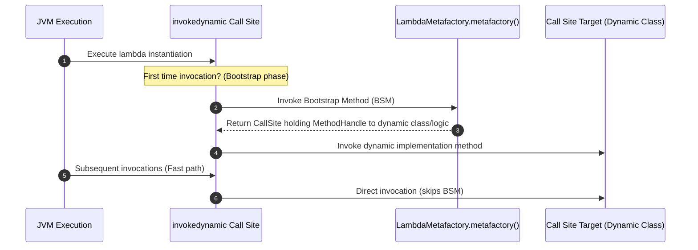
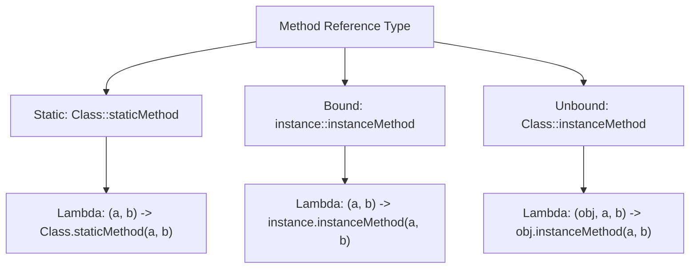

# Lambda Expression - Part 1

| Concept | What to know |
| --- | --- |
| `What is a lambda?` | A lambda expression is a compact function-like block used where a functional interface is expected. |
| `Lambda syntax` | A lambda expression is a compact function-like block used where a functional interface is expected. |
| `Functional interface` | A functional interface has exactly one abstract method and can be implemented by a lambda. |
| `@FunctionalInterface` |`@FunctionalInterface` — Enforces that an interface contains exactly one abstract method. |
| `Method reference:` | Method reference is a group of related rules in Lambda Expression that groups several related details. |
| `static method reference` | Static means the member belongs to the class rather than to one particular object. |
| `instance method reference` |`instance method reference` — Refers to an instance method of a particular object or arbitrary object of a type. |
| `constructor reference` |`constructor reference` — Shorthand syntax (Class::new) for a lambda that instantiates a new object. |
| `Variable capture` |`Variable capture` — Inner/local classes capturing local variables from enclosing scope if they are effectively final. |
| `Effectively final` | Final means the variable, method, class, or parameter is restricted from later change in a specific way. |

## Detailed Notes

### What is a lambda?

A lambda expression is a compact function-like block used where a functional interface is expected.

It matters because modern Java APIs use function-style pipelines heavily. A common confusion is forgetting which operations are lazy and which operation actually triggers execution.

Practical check:

- Define `What is a lambda?` in one sentence.
- Recognize `What is a lambda?` in code, commands, documentation, or interview prompts.
- Explain one bug, limitation, or tradeoff related to `What is a lambda?`.

Tiny example or mental model:

- `n -> n > 0` is a lambda used as a predicate.

#### Functional Interface Target Typing
A lambda has no explicit type of its own. It is bound to a type at compile time by looking at the context (called **target typing**). The target type must be a functional interface.
```java
// Target type is Runnable
Runnable runTask = () -> System.out.println("Executing...");

// Target type is Predicate<Integer>
java.util.function.Predicate<Integer> isPositive = n -> n > 0;
```

### Why Lambdas Use invokedynamic and Bootstrap Methods

Traditional anonymous inner classes compile to separate class files (e.g., `EnclosingClass$1.class`). Creating and loading these class files consumes disk space, increases the JAR package footprint, and incurs class loader IO overhead at startup. Instead of translating lambda expressions into inner classes, the Java compiler uses the `invokedynamic` (Indy) instruction introduced in Java 7, along with dynamic bootstrap methods. When a lambda is compiled, the compiler generates a recipe to construct the functional interface instance, emitting an `invokedynamic` call site and a private helper method that holds the lambda body logic. At runtime, the first time this instruction is hit, a bootstrap method (specifically `LambdaMetafactory.metafactory`) is invoked to dynamically link the call site to a call site target (e.g., a dynamically generated class or a direct method handle). This avoids creating separate static `.class` files on disk, reduces class loading overhead, and leaves optimizations to the JVM's JIT compiler.

#### Mental Model: Lambda Bootstrapping Lifecycle


#### Code Example: Dynamic Class Generation Output
```java
public class LambdaCompilationDemo {
    public static void main(String[] args) {
        Runnable r = () -> System.out.println("Hello from Lambda!");
        r.run();
        // Output:
        // Hello from Lambda!
        
        System.out.println(r.getClass().getName());
        // Output:
        // LambdaCompilationDemo$$Lambda$1/0x0000000801000840 (dynamically generated class name)
    }
}
```

#### Cause-Effect Chain
```
Lambda written in source
  │
  ▼
Compiler compiles body into a private class method and emits invokedynamic at call site
  │
  ▼
Runtime hits call site for the first time
  │
  ▼
LambdaMetafactory generates runtime class/wrapper in memory
  │
  ▼
JVM binds MethodHandle to the call site
  │
  ▼
Future calls skip runtime class generation and execute fast-path direct invocation
```

### Lambda syntax

A lambda expression is a compact function-like block used where a functional interface is expected.

It matters because modern Java APIs use function-style pipelines heavily. A common confusion is forgetting which operations are lazy and which operation actually triggers execution.

Practical check:

- Define `Lambda syntax` in one sentence.
- Recognize `Lambda syntax` in code, commands, documentation, or interview prompts.
- Explain one bug, limitation, or tradeoff related to `Lambda syntax`.

Tiny example or mental model:

- `n -> n > 0` is a lambda used as a predicate.

#### Code Example: Syntax Variations
```java
// 1. Zero parameters
Runnable r = () -> System.out.println("Zero params");

// 2. Single parameter (parentheses and types are optional)
java.util.function.Consumer<String> c1 = s -> System.out.println(s);
java.util.function.Consumer<String> c2 = (s) -> System.out.println(s);
java.util.function.Consumer<String> c3 = (String s) -> System.out.println(s);

// 3. Multiple parameters (parentheses required)
java.util.function.BinaryOperator<Integer> add = (a, b) -> a + b;

// 4. Block body (curly braces, statements, semicolons, and return keyword required)
java.util.function.BinaryOperator<Integer> calc = (a, b) -> {
    int sum = a + b;
    return sum;
};
```

#### Common Mistake: Incorrect Braces and return Keywords
- A lambda body with a single expression can implicitly return a value without curly braces or the `return` keyword.
- If curly braces `{}` are used, you must write a block of statements, which requires a `return` keyword if the method returns a value.
```java
// Compile error: return keyword cannot be used without curly braces
java.util.function.BinaryOperator<Integer> bad1 = (a, b) -> return a + b;

// Compile error: curly braces are used but return keyword is missing
java.util.function.BinaryOperator<Integer> bad2 = (a, b) -> { a + b; };
```

### Functional interface

A functional interface has exactly one abstract method and can be implemented by a lambda.

It matters because modern Java APIs use function-style pipelines heavily. A common confusion is forgetting which operations are lazy and which operation actually triggers execution.

Practical check:

- Define `Functional interface` in one sentence.
- Recognize `Functional interface` in code, commands, documentation, or interview prompts.
- Explain one bug, limitation, or tradeoff related to `Functional interface`.

Tiny example or mental model:

- When reading code, ask: what does `Functional interface` change, allow, reject, or clarify?

#### Code Example: Defining custom Functional Interfaces
```java
interface SimpleCalculator {
    int calculate(int x, int y); // exactly one abstract method
}

// Inherited Object methods do not count towards the abstract method limit
interface ObjectOverride {
    void process();
    boolean equals(Object obj); // abstract override of Object method, does not count
}
```

### @FunctionalInterface

`@FunctionalInterface` — Enforces that an interface contains exactly one abstract method.

It matters because modern Java APIs use function-style pipelines heavily. A common confusion is forgetting which operations are lazy and which operation actually triggers execution.

Practical check:

- Define `@FunctionalInterface` in one sentence.
- Recognize `@FunctionalInterface` in code, commands, documentation, or interview prompts.
- Explain one bug, limitation, or tradeoff related to `@FunctionalInterface`.

Tiny example or mental model:

- When reading code, ask: what does `@FunctionalInterface` change, allow, reject, or clarify?

#### Code Example: Compile-time check
```java
@FunctionalInterface
interface Valid {
    void execute();
}

// Compile Error: InvalidFunctionalInterfaceException (multiple non-overriding abstract methods)
@FunctionalInterface
interface Invalid {
    void execute();
    void clean();
}
```

### Why Lambdas Cannot Throw Checked Exceptions and How to Bypass It

Java's type system requires checked exceptions to be either handled in a `try-catch` block or declared in the method signature using the `throws` clause. When writing lambda expressions, the target functional interface's abstract method defines the type signature, including what exceptions it is permitted to throw. Standard functional interfaces in `java.util.function` (like `Function`, `Consumer`, `Predicate`) do not declare any checked exceptions in their method signatures. Consequently, a lambda implementing these interfaces is prohibited from throwing checked exceptions, as doing so would violate the interface's contract and cause compilation failures. To bypass this, developers must either wrap the throwing call in a try-catch block inside the lambda, design custom functional interfaces that declare `throws Exception`, or use sneaky throwing techniques to trick the compiler.

#### Mental Model: Checked Exception Signature Verification
```
[Lambda Expression] ──(Tries to throw checked Exception)──► [Compiler Validation]
                                                                   │
                                               Is it declared in Functional Interface?
                                                /                         \
                                              (No)                        (Yes)
                                              /                             \
                                    [Compile Error]                 [Compilation Succeeds]
```

#### Code Example: Catching vs Propagating Checked Exceptions
```java
import java.io.IOException;
import java.util.function.Consumer;

public class LambdaExceptionHandling {
    @FunctionalInterface
    interface ThrowingConsumer<T> {
        void accept(T t) throws Exception;
    }

    public static void main(String[] args) {
        // Standard Consumer: Compile error if we throw checked exception directly
        // Consumer<String> bad = s -> { throw new IOException(); }; 

        // Fix 1: Try-catch block inside lambda
        Consumer<String> consumerWithCatch = s -> {
            try {
                throwChecked(s);
            } catch (IOException e) {
                System.out.println("Caught inside lambda: " + e.getMessage());
            }
        };
        consumerWithCatch.accept("test");
        // Output:
        // Caught inside lambda: Test Exception

        // Fix 2: Custom functional interface
        ThrowingConsumer<String> customConsumer = s -> throwChecked(s);
        try {
            customConsumer.accept("test");
        } catch (Exception e) {
            System.out.println("Caught from custom interface: " + e.getMessage());
        }
        // Output:
        // Caught from custom interface: Test Exception
    }

    private static void throwChecked(String s) throws IOException {
        throw new IOException("Test Exception");
    }
}
```

#### Cause-Effect Chain
```
Lambda throws checked exception
  │
  ▼
Compiler checks signature of the target Functional Interface method
  │
  ▼
Method lacks throws declaration for that exception
  │
  ▼
Compiler rejects the code as compile error
  │
  ▼
Wrapper try-catch or custom functional interface with throws resolves the signature mismatch
```

### Method reference:

Method reference is a group of related rules in Lambda Expression that groups several related details.

#### Classification of Method References
There are 4 main kinds of method references:
1. Static method reference: `ContainingClass::staticMethodName`
2. Bound instance method reference: `containingObject::instanceMethodName`
3. Unbound instance method reference: `ContainingClass::instanceMethodName`
4. Constructor reference: `ClassName::new`

### static method reference

Static means the member belongs to the class rather than to one particular object.

Use it to predict the exact Java rule, the allowed form, and the failure mode. Review it with a tiny example instead of memorizing only the label.

Practical check:

- Define `static method reference` in one sentence.
- Recognize `static method reference` in code, commands, documentation, or interview prompts.
- Explain one bug, limitation, or tradeoff related to `static method reference`.

Tiny example or mental model:

- `ClassName.member` accesses a class-level member.

#### Code Example: Static method references
```java
// Lambda form:
java.util.function.Function<String, Integer> parserLambda = s -> Integer.parseInt(s);

// Method reference equivalent:
java.util.function.Function<String, Integer> parserRef = Integer::parseInt;
```

### instance method reference

#### Bound vs Unbound Instance Method References
- **Bound Method Reference**: Refers to an instance method of an existing object. The receiver of the method call is fixed at compile time.
- **Unbound Method Reference**: Refers to an instance method of an arbitrary object of a particular type. The first parameter of the lambda is used as the receiver of the call.
```java
// 1. Bound instance method reference
String prefix = "DEBUG: ";
java.util.function.Consumer<String> boundPrinter = prefix::concat; 
// Equivalent lambda: msg -> prefix.concat(msg);

// 2. Unbound instance method reference
java.util.function.BiFunction<String, String, String> unboundConcat = String::concat;
// Equivalent lambda: (str, suffix) -> str.concat(suffix);
```

### constructor reference

#### Code Example: Constructor References
```java
// Matches no-arg constructor ArrayList()
java.util.function.Supplier<java.util.List<String>> listSupplier = java.util.ArrayList::new;

// Matches constructor ArrayList(int initialCapacity)
java.util.function.Function<Integer, java.util.List<String>> sizeSupplier = java.util.ArrayList::new;
```

### How Method References Resolve Receivers and Signatures Under the Hood

Method references (`Class::method` or `instance::method`) are compact syntactic sugar for lambdas, but they map to the underlying functional interface method signature differently depending on their category. In a static method reference, all arguments of the functional interface method are passed directly as parameters to the static method. In a bound instance method reference, the receiver instance is predetermined at compile-time, and all interface parameters are mapped as parameters to the instance method. In contrast, an unbound instance method reference requires the first parameter of the functional interface method to act as the target receiver (the object on which the method is called), and any remaining parameters are mapped as arguments.

#### Mental Model: Method Reference Mapping


#### Code Example: Parameter Mapping Differences
```java
import java.util.function.*;

public class MethodRefResolution {
    public static void main(String[] args) {
        // 1. Static method reference
        Function<String, Integer> parser = Integer::parseInt;
        System.out.println(parser.apply("123")); // Output: 123
        
        // 2. Bound instance method reference
        String prefix = "Java";
        Predicate<String> boundRef = prefix::startsWith;
        System.out.println(boundRef.test("J")); // Output: true (Equivalent to prefix.startsWith("J"))

        // 3. Unbound instance method reference
        BiPredicate<String, String> unboundRef = String::startsWith;
        System.out.println(unboundRef.test("Java", "J")); // Output: true (Equivalent to "Java".startsWith("J"))
    }
}
```

#### Cause-Effect Chain
```
Method reference category determined at compile time
  │
  ▼
Static method maps parameters 1..N
  │
  ▼
Bound method fixes receiver instance and maps parameters 1..N
  │
  ▼
Unbound method treats parameter 1 as the receiver object and parameters 2..N as the arguments
  │
  ▼
Functional interface method matches signature and executes successfully
```

### Variable capture

#### Code Example: Capturing Variables from Enclosing Scope
Lambdas can read static variables, instance variables, and local variables. However, local variables must be final or effectively final.
```java
class VariableCaptureDemo {
    private int instanceVar = 10;
    private static int staticVar = 20;

    public void demo() {
        int localVar = 30; // effectively final local variable

        Runnable r = () -> {
            instanceVar++; // OK: instance variables are not restricted
            staticVar++;   // OK: static variables are not restricted
            System.out.println(localVar); // OK: reading effectively final local variable
        };
        r.run();
    }
}
```

### Effectively final

Final means the variable, method, class, or parameter is restricted from later change in a specific way.

Use it to predict the exact Java rule, the allowed form, and the failure mode. Review it with a tiny example instead of memorizing only the label.

Practical check:

- Define `Effectively final` in one sentence.
- Recognize `Effectively final` in code, commands, documentation, or interview prompts.
- Explain one bug, limitation, or tradeoff related to `Effectively final`.

Tiny example or mental model:

- `final int limit = 10;` cannot be reassigned.

#### Code Example: Effectively Final Compilation Errors
If a local variable is re-assigned anywhere in the method (either inside the lambda or outside it), it ceases to be effectively final. Attempting to capture it in a lambda will cause a compile-time error.
```java
public void testEffectivelyFinal() {
    int val = 42; 
    
    // Compile Error: local variables referenced from a lambda expression must be final or effectively final
    Runnable r1 = () -> System.out.println(val); 
    
    val = 100; // reassigning makes it NOT effectively final
}

public void testReassignmentInLambda() {
    int count = 0;
    
    // Compile Error: local variables referenced from a lambda expression must be final or effectively final
    Runnable r2 = () -> {
        count = count + 1; // attempting to modify the variable inside lambda
    };
}
```

### Why Local Variables Captured by Lambdas Must Be Final or Effectively Final

Local variables reside on the execution stack and are destroyed immediately when the enclosing method exits. However, a lambda expression is represented by an object on the heap that can outlive the method execution (e.g., if it is passed to a background thread or stored in an instance variable). To prevent the lambda from accessing a deallocated stack variable, Java uses "variable capture," copying the variable's value into the lambda instance's fields at creation time. If the original local variable or the copy inside the lambda could be modified, their values would drift out of sync, creating confusing concurrency issues and violating JVM stack safety guarantees. By enforcing the final or effectively final constraint, Java ensures that the copied value remains identical to the original variable, maintaining consistency across stack and heap boundaries.

#### Mental Model: Variable Capture stack vs heap Lifecycle
```
STACK (Method Frame)             HEAP (Lambda Instance)
┌────────────────────────┐      ┌──────────────────────────────┐
│ localVar = 42          │      │ LambdaInstance               │
│ (destroyed on exit)    │      │ ┌──────────────────────────┐ │
│                        │      │ │ capturedLocalVarCopy = 42│ │
└───────────┬────────────┘      │ └──────────────────────────┘ │
            │                   │                              │
            │ (Capture: Copy)   │                              │
            └──────────────────►│ Value cannot change!         │
                                └──────────────────────────────┘
```

#### Code Example: Accessing Captured Variables
```java
public class VariableCaptureWhy {
    public static void main(String[] args) {
        int nonMutable = 100; // Effectively final local variable
        
        Runnable r = () -> {
            System.out.println(nonMutable);
        };
        r.run();
        // Output:
        // 100
        
        // If we uncommented the next line, compilation would fail:
        // nonMutable = 200; 
        // error: local variables referenced from a lambda expression must be final or effectively final
    }
}
```

#### Cause-Effect Chain
```
Local variables stored on stack frame
  │
  ▼
Enclosing method exits and stack frame is popped
  │
  ▼
Lambda on the heap attempts to read variable
  │
  ▼
Stack variable no longer exists
  │
  ▼
Memory corruption/desync potential
  │
  ▼
Compiler mandates final/effectively final to guarantee captured copies never drift
```

## Case Study: Refactoring Anonymous Class Callbacks to Lambdas and Method References

In legacy Java code, asynchronous or callback-driven interfaces were implemented using verbose anonymous inner classes. Refactoring these to lambda expressions and method references improves readability, reduces boilerplate, and avoids the overhead of creating a separate class file.

### Legacy Implementation (Anonymous Inner Class)
```java
import java.util.ArrayList;
import java.util.Collections;
import java.util.Comparator;
import java.util.List;

public class RefactoringDemo {
    public static void main(String[] args) {
        List<String> names = new ArrayList<>();
        names.add("Charles");
        names.add("Alice");
        names.add("Bob");

        // Verbose sorting callback using anonymous class
        Collections.sort(names, new Comparator<String>() {
            @Override
            public int compare(String s1, String s2) {
                return s1.compareTo(s2);
            }
        });
    }
}
```

### Refactored to Lambda Expression
Since `Comparator` is a functional interface with a single abstract method `compare`, we can replace the anonymous class with a lambda expression:
```java
// Refactoring 1: Standard Lambda
Collections.sort(names, (s1, s2) -> s1.compareTo(s2));
```

### Refactored to Method Reference
Because the lambda simply takes the arguments and forwards them to `s1.compareTo(s2)`, we can use an unbound instance method reference `String::compareTo`:
```java
// Refactoring 2: Unbound Instance Method Reference
Collections.sort(names, String::compareTo);

// Modern list sort syntax:
names.sort(String::compareTo);
```

### Key Differences and Gotchas
1. **`this` reference scope**: Inside an anonymous class, `this` refers to the anonymous class instance itself. Inside a lambda, `this` refers to the enclosing class instance where the lambda is defined.
2. **Class Files**: Anonymous classes generate an extra `.class` file at compile time (e.g., `RefactoringDemo$1.class`). Lambdas are compiled into private methods in the host class using `invokedynamic` instructions, improving memory footprint and startup time.

### Scope and Scoping Semantics: Lambdas vs Anonymous Inner Classes

An anonymous inner class introduces a completely new lexical scope, creating a new class context where `this` refers to the generated inner class instance itself. This requires developers to use `EnclosingClass.this` if they need to reference the surrounding outer class instance from inside the anonymous class. In contrast, a lambda expression does not introduce a new scope level and is lexically scoped to the enclosing class instance. Within a lambda body, the `this` keyword refers exclusively to the instance of the enclosing class, just as it does in the surrounding block. Additionally, because lambdas share the method's scope, declaring a lambda parameter with the same name as a local variable in the method causes a compile-time variable shadowing conflict.

#### Mental Model: Lexical vs Class Scoping Boundaries
```
Lexical Scoping in Enclosing Method:
┌────────────────────────────────────────────────────────┐
│ Outer Class Instance (this = OuterClassInstance)       │
│  ┌──────────────────────────────────────────────────┐  │
│  │ Enclosing Method                                 │  │
│  │  ┌────────────────────────────────────────────┐  │  │
│  │  │ Lambda Expression (this = OuterClassInstance)│  │  │
│  │  └────────────────────────────────────────────┘  │  │
│  │  ┌────────────────────────────────────────────┐  │  │
│  │  │ Anonymous Inner Class (this = InnerClass)  │  │  │
│  │  └────────────────────────────────────────────┘  │  │
│  └──────────────────────────────────────────────────┘  │
└────────────────────────────────────────────────────────┘
```

#### Code Example: Lexical Scoping and 'this' Resolution
```java
public class ScopingDemo {
    private final String name = "Outer";

    public void run() {
        // 1. Anonymous Inner Class
        Runnable r1 = new Runnable() {
            private final String name = "Inner";
            @Override
            public void run() {
                System.out.println("Anonymous inner class 'this': " + this.name);
                System.out.println("Enclosing class 'this': " + ScopingDemo.this.name);
            }
        };
        r1.run();
        // Output:
        // Anonymous inner class 'this': Inner
        // Enclosing class 'this': Outer

        // 2. Lambda Expression
        Runnable r2 = () -> {
            // 'this' refers to ScopingDemo instance
            System.out.println("Lambda 'this': " + this.name);
        };
        r2.run();
        // Output:
        // Lambda 'this': Outer
    }

    public static void main(String[] args) {
        new ScopingDemo().run();
    }
}
```

#### Cause-Effect Chain
```
Lambda uses lexical scoping
  │
  ▼
Scope is inherited from enclosing environment
  │
  ▼
'this' references enclosing object rather than any dynamic subclass
  │
  ▼
Compiler prevents local variable declaration collisions (no shadowing allowed)
```

## Common Mistakes

### 1. Reassigning variables inside or outside a lambda (Effectively Final rule)
A very common mistake is attempting to update a counter or boolean flag inside a lambda.
```java
public void badCounter() {
    int count = 0;
    // Compile error: local variables referenced from a lambda expression must be final or effectively final
    java.util.List.of("a", "b").forEach(item -> count++); 
}
```
**Fix**: Use an object wrapper, a single-element array, or thread-safe atomic variables (like `AtomicInteger`) if synchronization is needed.
```java
public void goodCounter() {
    java.util.concurrent.atomic.AtomicInteger count = new java.util.concurrent.atomic.AtomicInteger(0);
    java.util.List.of("a", "b").forEach(item -> count.incrementAndGet()); // OK
}
```

### 2. Variable Shadowing Conflicts
Lambdas do not introduce a new scope level. They share the scope of the enclosing block. Therefore, you cannot declare a lambda parameter with the same name as a local variable in the enclosing method.
```java
public void shadowingDemo() {
    String message = "Hello";
    
    // Compile error: Variable 'message' is already defined in the scope
    java.util.function.Consumer<String> printer = message -> System.out.println(message);
}
```

### 3. Confusing Bound and Unbound Method Reference Parameter Counts
When using `Class::methodName` for an instance method (unbound method reference), the functional interface's method signature must accept the receiver object as its first parameter.
```java
// BiFunction<String, String, Boolean> requires two parameters
// String::startsWith requires one parameter. 
// Since it's unbound, parameter 1 becomes the receiver, parameter 2 is the argument. 
// String::startsWith is equivalent to: (str, prefix) -> str.startsWith(prefix)
java.util.function.BiFunction<String, String, Boolean> checker = String::startsWith; // OK

// Function<String, Boolean> requires only one parameter.
// If unbound (String::startsWith), it resolves to: (str) -> str.startsWith()
// But String has no startsWith() method without arguments, so this fails.
java.util.function.Function<String, Boolean> badChecker = String::startsWith; // Compile Error!
```

## Reference Links

- https://docs.oracle.com/javase/specs/jls/se21/html/jls-15.html#jls-15.27 (Lambda Expressions JLS)
- https://docs.oracle.com/javase/8/docs/api/java/lang/invoke/LambdaMetafactory.html (LambdaMetafactory API)
- https://docs.oracle.com/javase/tutorial/java/javaOO/lambdaexpressions.html (Oracle Java Tutorials: Lambda Expressions)
