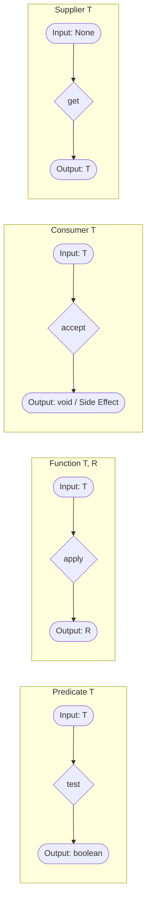

# Functional Interface - Part 2

| Concept | What to know |
| --- | --- |
| `What is the output?` | What is the output is a key question for understanding Functional Interface. |
| `When to use which interface?` |`When to use which interface?` — When to use which interface? provides specific functionality and rules in Java development. |

## Detailed Notes

### What is the output?

What is the output is a key question for understanding Functional Interface.

#### Detailed Explanation and Code Examples
The return type (output) of a functional interface's abstract method determines how it can be utilized in code.
- `void`: Used for side effects (e.g. `Consumer`).
- `boolean`: Used for filtering and checking conditions (e.g. `Predicate`).
- A generic/primitive type: Used for mappings and computations (e.g. `Function`, `Supplier`).

```java
import java.util.function.*;

public class OutputExample {
    public static void main(String[] args) {
        // Output is void: side effects only
        Consumer<String> consumer = s -> System.out.println("Processing " + s);
        
        // Output is boolean: checks conditions
        Predicate<Integer> isPositive = n -> n > 0;
        
        // Output is a type: returns a value
        Supplier<String> supplier = () -> "Hello World";
        Function<String, Integer> lengthMapper = String::length;
    }
}
```

---

### When to use which interface?

#### Decision Matrix
Use this guide to pick the appropriate functional interface based on input count and output type:

| Inputs | Output | Standard Interface | Primitive Example | Bi-Variant |
|--------|--------|--------------------|-------------------|------------|
| 0 | Type `T` | `Supplier<T>` | `IntSupplier` | N/A |
| 1 (`T`) | `void` | `Consumer<T>` | `DoubleConsumer` | `BiConsumer<T, U>` |
| 1 (`T`) | `boolean`| `Predicate<T>` | `LongPredicate` | `BiPredicate<T, U>`|
| 1 (`T`) | Type `R` | `Function<T, R>` | `ToIntFunction<T>` | `BiFunction<T, U, R>`|
| 1 (`T`) | Type `T` | `UnaryOperator<T>`| `IntUnaryOperator` | N/A |
| 2 (`T`, `T`)| Type `T` | `BinaryOperator<T>`| `IntBinaryOperator`| N/A |

---

## Why Functional Contract Styles Differ

The JDK standard functional interfaces in the `java.util.function` package are structured into distinct contract styles based on their mathematical inputs and outputs. `Predicate` is designed for condition checking and filtering, accepting an argument and returning a boolean. `Function` acts as a transformer, mapping an input of one type to an output of another. `Consumer` acts as a terminal sink or action performer, taking an input and returning nothing (void), which typically triggers a side effect like logging or database updates. Finally, `Supplier` represents a factory or source, taking no inputs and producing a value lazily when requested. These explicit contracts allow developers to declare clear semantic intent for methods, enabling clean pipelines like those in the Stream API.



### Code Example: Functional Contracts

```java
import java.util.function.*;

public class ContractDemo {
    public static void main(String[] args) {
        // Predicate: Input T, Output boolean
        Predicate<String> isShort = s -> s.length() < 5;
        
        // Function: Input T, Output R
        Function<String, Integer> parseToInt = Integer::parseInt;
        
        // Consumer: Input T, Output void
        Consumer<String> logger = msg -> System.out.println("LOG: " + msg);
        
        // Supplier: Input void, Output T
        Supplier<Double> randomNum = Math::random;
        
        System.out.println(isShort.test("Java"));   // Output: true
        System.out.println(parseToInt.apply("123")); // Output: 123
        logger.accept("Testing pipeline");           // Output: LOG: Testing pipeline
        System.out.println(randomNum.get() != null); // Output: true
    }
}
```

### Cause-Effect Chain
- **Distinct functional contracts defined** $\rightarrow$ APIs specify precise interface arguments (e.g. Stream.filter requires Predicate, Stream.map requires Function) $\rightarrow$ Compiler enforces lambda shapes matching these contracts $\rightarrow$ Ensures type-safe, readable, declarative processing pipelines.

---

### Case Study: Designing a custom functional interface for a processing pipeline with default chaining methods

In real-world applications, you may need a custom processing pipeline that goes beyond the standard JDK functional interfaces. Below is a complete implementation of a custom `DataProcessor<T>` functional interface featuring default chaining methods (`andThen` and `compose`).

```java
import java.util.Objects;

@FunctionalInterface
public interface DataProcessor<T> {
    
    /**
     * Processes the input data and returns the processed result.
     */
    T process(T data);

    /**
     * Returns a chained DataProcessor that first applies this processor,
     * and then applies the 'after' processor to the result.
     */
    default DataProcessor<T> andThen(DataProcessor<T> after) {
        Objects.requireNonNull(after);
        return (T data) -> after.process(this.process(data));
    }

    /**
     * Returns a chained DataProcessor that first applies the 'before' processor,
     * and then applies this processor to the result.
     */
    default DataProcessor<T> compose(DataProcessor<T> before) {
        Objects.requireNonNull(before);
        return (T data) -> this.process(before.process(data));
    }
}
```

#### Pipeline Demonstration
Here is how we use the custom `DataProcessor` to clean, normalize, and format a raw text input:

```java
public class PipelineDemo {
    public static void main(String[] args) {
        // Define individual stages of the processing pipeline
        DataProcessor<String> stripWhitespace = String::strip;
        DataProcessor<String> toLowerCase = String::toLowerCase;
        DataProcessor<String> sanitize = s -> s.replaceAll("[^a-zA-Z0-9 ]", "");
        DataProcessor<String> formatOutput = s -> "[" + s.replace(" ", "_") + "]";

        // Chain the processors together using andThen
        DataProcessor<String> textPipeline = stripWhitespace
                .andThen(toLowerCase)
                .andThen(sanitize)
                .andThen(formatOutput);

        String rawInput = "   Hello, World! Java 21 is great.   ";
        String processed = textPipeline.process(rawInput);
        
        System.out.println("Raw: '" + rawInput + "'");
        System.out.println("Processed: " + processed);
        // Output -> Processed: [hello_world_java_21_is_great]
    }
}
```

---

## Why Functional Interfaces Leverage Default Methods for Chaining

Functional interfaces are permitted to contain `default` and `static` methods in addition to their single abstract method without violating the functional contract. This JLS feature is leveraged by Java to implement functional composition, allowing developers to chain operations together dynamically at runtime. For example, `Predicate` contains default methods like `and()`, `or()`, and `negate()`, which return a new composed `Predicate` representing the logical combination of the original predicates. Similarly, `Function` includes `andThen()` and `compose()` to run transformation steps sequentially. Because default methods provide concrete implementations, they do not count as abstract, enabling functional interfaces to remain targets for lambda expressions while offering powerful declarative APIs.

```mermaid
flowchart LR
    Input([Input x]) --> P1[Predicate A: test x]
    P1 -->|true| P2[Predicate B: test x]
    P1 -->|false| False([false])
    P2 -->|true| True([true])
    P2 -->|false| False
    style P1 fill:#f9f,stroke:#333,stroke-width:2px
    style P2 fill:#bbf,stroke:#333,stroke-width:2px
    subgraph ComposedPredicate [a.and(b)]
    P1
    P2
    end
```

### Code Example: Composed Predicates

```java
import java.util.function.Predicate;

public class ChainingDemo {
    public static void main(String[] args) {
        Predicate<String> hasLetterA = s -> s.contains("a");
        Predicate<String> isLongerThan3 = s -> s.length() > 3;
        
        // Compose using default method and()
        Predicate<String> composed = hasLetterA.and(isLongerThan3);
        
        // Compose using default method negate()
        Predicate<String> negated = composed.negate();
        
        System.out.println(composed.test("apple")); // Output: true
        System.out.println(composed.test("art"));   // Output: false (length <= 3)
        System.out.println(negated.test("art"));    // Output: true
    }
}
```

### Cause-Effect Chain
- **Concrete default method declared in interface** $\rightarrow$ Compiler allows implementation without requiring subclassing or breaking SAM status $\rightarrow$ Lambdas can call default methods directly $\rightarrow$ Composed functions can be constructed dynamically at runtime.

---

## Common Mistakes

### 1. Ambiguity in Chaining Order
Confusing `andThen` with `compose` can lead to processing pipelines executing in the wrong sequence, resulting in corrupted or unexpected data output. Always remember:
- `a.andThen(b)` executes `a` first, then `b`.
- `a.compose(b)` executes `b` first, then `a`.

### 2. Passing null into default chaining methods
Chaining methods in both custom and JDK functional interfaces (like `Function.andThen`) will throw a `NullPointerException` at composition time (not execution time) if `null` is passed as the chained argument.

---
