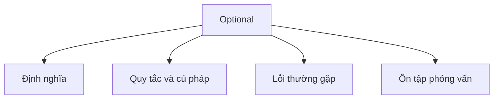

# 24 - Optional

Chủ đề này tuân theo đề cương chính trong [outline.md](../outline.md). Mục tiêu là hiểu từng khái niệm đủ sâu để có thể giải thích, nhận diện trong code và trả lời các câu hỏi phỏng vấn.

## Thứ Tự Học

- [Khái Niệm về Optional T](theory/01-what-is-optional-t-concepts.md)
- [Khái Niệm về Map](theory/02-map-concepts.md)
- [Thuật Ngữ Chính](terms/01-key-terms.md)

## Danh Sách Kiểm Tra Theo Đề Cương

- Optional<T> là gì?
- Tránh NullPointerException
- Optional.of
- Optional.ofNullable
- Optional.empty
- isPresent
- ifPresent
- orElse
- orElseGet
- orElseThrow
- map
- flatMap
- filter
- Không lạm dụng Optional
- Optional trong kiểu trả về

## Tự Kiểm Tra

1. Tại sao `Optional` được thiết kế như một lớp bao bọc thay vì là phương án thay thế hoàn toàn cho `null` trong các trường và tham số?
2. Chi phí hiệu năng khi sử dụng `Optional` trong vòng lặp hoặc các trường là gì?
3. Sự khác biệt giữa `orElse()` và `orElseGet()` về mặt đánh giá tức thì (eager) và lười biếng (lazy) là gì?
4. Tại sao việc trả về `null` từ một phương thức khai báo kiểu trả về `Optional` lại vi phạm hợp đồng thiết kế API?
5. Sự khác biệt then chốt giữa `map()` và `flatMap()` của `Optional` về chữ ký và hành vi bao bọc là gì?
6. Tại sao `flatMap()` có thể ném `NullPointerException` khi hàm ánh xạ trả về `null`, trong khi `map()` thì không?
7. Tại sao `Optional` không triển khai `Serializable`, và điều này ảnh hưởng như thế nào đến thiết kế lớp Java?

## Thẻ Anki

- [Basic](anki/basic.tsv)
- [Basic Extra](anki/basic-extra.tsv)
- [Cloze](anki/cloze.tsv)
- [Code Question](anki/code-question.tsv)

## Tổng Quan Mermaid

## Liên Kết Tham Khảo

- https://docs.oracle.com/en/java/javase/21/docs/api/java.base/java/util/Optional.html
