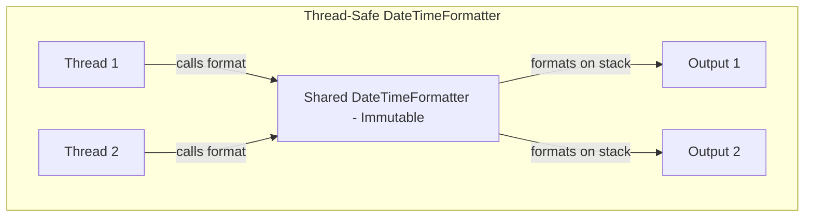
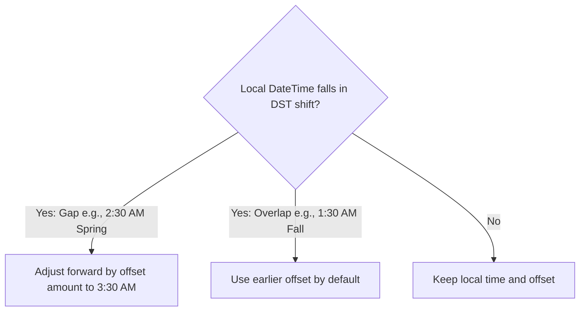

# Date and Time API - Part 2

| Concept | What to know |
| --- | --- |
| `Period` | Immutable, thread-safe representation of a date-based amount of time in years, months, and days. |
| `DateTimeFormatter` | Modern, immutable, thread-safe class for formatting and parsing date-time values. |
| `ZoneId` | Time zone identifier (e.g. `Asia/Tokyo`) used to resolve daylight saving time rules and regional transitions. |
| `Parse date/time` | Converting a string to a temporal object using a formatter; throws runtime `DateTimeParseException` on failure. |
| `Format date/time` | Converting a temporal object to a formatted string; throws `UnsupportedTemporalTypeException` if formatting fields not supported. |
| `Compare date/time` | Chronological comparison using `isBefore()`, `isAfter()`, `isEqual()`, and `compareTo()`. |
| `Add/subtract date/time` | Performing arithmetic using immutable methods (plus/minus) or adjustments (with/TemporalAdjusters). |
| `Timezone` | Standardized geographical time offset; resolved using `ZoneId` and `ZoneOffset`. |

## Detailed Notes

### Period
`java.time.Period` represents a date-based amount of time (in years, months, and days), such as "2 years, 3 months, and 6 days". It operates on date-based temporal types like `LocalDate`.

#### Formatting & String Representation:
* Format follows the ISO-8601 duration format for periods: `PnYnMnD` (where `P` stands for period, `Y` for years, `M` for months, and `D` for days). E.g., `P2Y3M6D`.

#### Warning about factory methods chaining:
* `Period` methods do not chain cumulatively. Calling `Period.ofYears(2).ofMonths(3)` returns a period of *3 months* only (the static methods overwrite rather than combine). Use `Period.of(2, 3, 0)` instead.

```java
// Correct Period instantiation
Period period = Period.of(1, 2, 3); // 1 year, 2 months, 3 days
System.out.println(period); // P1Y2M3D

// Static factory chaining trap:
Period badPeriod = Period.ofYears(1).ofDays(5); // Only represents 5 days!
System.out.println(badPeriod); // P5D
```

### Why Period and Duration Behave Differently (Daylight Saving Time Transitions)

A `Period` represents a date-based amount of time (e.g., 1 day) in calendar units, whereas a `Duration` represents a time-based amount of time measured in exact physical seconds (e.g., 86,400 seconds). When adding these quantities to a timezone-aware `ZonedDateTime`, they can yield different results if the transition spans a Daylight Saving Time (DST) change. For example, during a spring-forward transition, a day is only 23 hours long; adding a `Period` of 1 day updates the calendar date and keeps the local time digits the same (resulting in 23 physical hours passing), whereas adding a `Duration` of 24 hours results in a time that is one hour later in local time (24 physical hours passing).

#### Mental Model: Period vs Duration under DST
```text
Timeline of Spring Forward (2:00 AM becomes 3:00 AM):

Base Time: 2026-03-08T01:30-05:00[America/New_York]

Adding Period.ofDays(1):
[01:30] ---------------- (Date increments by 1) ---------------> [01:30 next day] (23 hours elapsed)

Adding Duration.ofDays(1) / Duration.ofHours(24):
[01:30] ---------------- (Exactly 24 hours elapse) -------------> [02:30 next day] (Time shifted by +1h)
```

#### Code Example: DST Arithmetic
```java
ZonedDateTime zdt = ZonedDateTime.of(2026, 3, 8, 1, 30, 0, 0, ZoneId.of("America/New_York"));

ZonedDateTime plusPeriod = zdt.plus(Period.ofDays(1));
ZonedDateTime plusDuration = zdt.plus(Duration.ofDays(1));

System.out.println("Base:     " + zdt);          // 2026-03-08T01:30-05:00[America/New_York]
System.out.println("Period:   " + plusPeriod);   // 2026-03-09T01:30-04:00[America/New_York]
System.out.println("Duration: " + plusDuration); // 2026-03-09T02:30-04:00[America/New_York]
```

#### Cause-Effect Chain
`Spring forward DST transition occurs` → `Local clock skips from 02:00 to 03:00` → `Adding Period of 1 day preserves local time (01:30 → 01:30 next day, 23 real hours)` → `Adding Duration of 1 day adds exactly 24 real hours (01:30 → 02:30 next day)`

### DateTimeFormatter
`java.time.format.DateTimeFormatter` is the modern, immutable, and thread-safe class for formatting and parsing date-time objects. It replaces `SimpleDateFormat`.

#### Usage:
* It has pre-defined constants like `ISO_LOCAL_DATE` (`2026-06-12`) and allows custom patterns using pattern letters like `yyyy`, `MM`, `dd`, `HH`, `mm`, `ss`.

```java
DateTimeFormatter formatter = DateTimeFormatter.ofPattern("dd/MM/yyyy");
LocalDate date = LocalDate.of(2026, 6, 12);
String formatted = date.format(formatter);
System.out.println(formatted); // 12/06/2026
```

### Why DateTimeFormatter Is Completely Thread-Safe

Unlike legacy `java.text.SimpleDateFormat`, `java.time.format.DateTimeFormatter` is designed to be immutable and stateless. It does not maintain any mutable state fields (like the internal calendar in `SimpleDateFormat`) during parsing or formatting operations. Instead, all transient parsing and formatting state is maintained entirely on the execution stack of the calling thread, in local variables. Consequently, a single static instance of `DateTimeFormatter` can be shared globally across all threads in a multi-threaded system without any lock contention, data race, or overhead.

#### Mental Model: Stateless Stack Execution


#### Code Example: Safe Concurrent Usage
```java
// Completely safe to share static formatter across multiple threads
public static final DateTimeFormatter FORMATTER = DateTimeFormatter.ofPattern("yyyy-MM-dd");

Runnable task = () -> {
    String result = FORMATTER.format(LocalDate.now());
    System.out.println(result);
};
new Thread(task).start();
new Thread(task).start();
```

#### Cause-Effect Chain
`DateTimeFormatter is stateless and immutable` → `Transient state is kept on thread-specific call stacks` → `No thread-shared mutable variables exist` → `Zero race conditions or lock contention during format/parse`

### ZoneId
`java.time.ZoneId` represents a time zone identifier (e.g., `Europe/Paris`, `Asia/Tokyo`, `America/New_York`). It provides rules for converting instants to local date-times and dynamically handles daylight saving time transitions.

```java
ZoneId tokyo = ZoneId.of("Asia/Tokyo");
ZoneId ny = ZoneId.of("America/New_York");
System.out.println("Tokyo Zone Rules: " + tokyo.getRules());
```

### Parse date/time
Parsing converts a text string into a temporal object. If the string does not match the expected pattern, it throws a runtime `DateTimeParseException`.

#### Compile vs Runtime Formatter Errors:
* Using invalid pattern letters (like `Y` instead of `y` for year, or `m` instead of `M` for month, or calling `.parse()` on a formatter expecting time fields with only date string) will fail.
* E.g., `LocalDate.parse("2026-06-12", DateTimeFormatter.ofPattern("yyyy-MM-dd HH:mm"))` throws `DateTimeParseException` because the time fields are missing.

```java
// Parsing standard ISO-8601 strings directly
LocalDate parsedDate = LocalDate.parse("2026-06-12"); 

// Custom formatting parse
DateTimeFormatter formatter = DateTimeFormatter.ofPattern("dd-MM-yyyy");
LocalDate customParsed = LocalDate.parse("12-06-2026", formatter);
System.out.println(customParsed); // 2026-06-12
```

### Format date/time
Formatting converts a temporal object to a formatted string representation.

```java
LocalDateTime now = LocalDateTime.of(2026, 6, 12, 15, 30);
DateTimeFormatter formatter = DateTimeFormatter.ofPattern("EEEE, MMMM dd, yyyy 'at' hh:mm a");
System.out.println(now.format(formatter)); // Friday, June 12, 2026 at 03:30 PM
```

### Compare date/time
Java provides dedicated methods to compare temporal objects chronologically:
* `isBefore(ChronoLocalDate)` / `isAfter(ChronoLocalDate)`
* `isEqual(ChronoLocalDate)` checks if they represent the same date/time, ignoring calendar systems or timezone offsets (unlike `equals()`).
* `compareTo(ChronoLocalDate)` returns negative, zero, or positive integer.

```java
LocalDate date1 = LocalDate.of(2026, 6, 12);
LocalDate date2 = LocalDate.of(2026, 6, 15);

System.out.println(date1.isBefore(date2)); // true
System.out.println(date1.isAfter(date2));  // false
```

### Add/subtract date/time
Temporal arithmetic is performed using fluent, immutable methods:
* `plus(long, TemporalUnit)` / `minus(long, TemporalUnit)`
* Specific convenience methods like `plusDays()`, `minusMonths()`.
* `with(TemporalField, long)` / `with(TemporalAdjuster)` to adjust specific fields or find dynamic dates (e.g. next Monday).

```java
import java.time.DayOfWeek;
import java.time.temporal.TemporalAdjusters;

LocalDate date = LocalDate.of(2026, 6, 12); // A Friday
LocalDate nextMonday = date.with(TemporalAdjusters.next(DayOfWeek.MONDAY));
LocalDate lastDayOfMonth = date.with(TemporalAdjusters.lastDayOfMonth());

System.out.println("Next Monday: " + nextMonday);        // 2026-06-15
System.out.println("Last Day of Month: " + lastDayOfMonth); // 2026-06-30
```

### Timezone
A timezone offset is the difference between local time and Coordinated Universal Time (UTC). Modern Java represents this offset using `ZoneOffset` (e.g., `+05:30`), while regional timezones (with historical DST rules) are managed using `ZoneId`.

### How ZonedDateTime Resolves Invalid and Overlapping Times (DST Shifts)

During Daylight Saving Time transitions, two anomalies can occur: gaps (when the clock springs forward, leaving invalid local times) and overlaps (when the clock falls back, repeating a local hour). If an invalid time is specified in the gap, `ZonedDateTime` automatically adjusts the time forward by the offset transition amount (typically 1 hour) to the first valid time. If an overlapping time is specified, `ZonedDateTime` defaults to retaining the earlier offset (before the transition) to preserve logical chronological progression. However, developers can override this behavior and select the later offset using the `.withLaterOffsetAtOverlap()` method.

#### Mental Model: ZonedDateTime DST Resolution Logic


#### Code Example: Gap and Overlap Resolution
```java
ZoneId ny = ZoneId.of("America/New_York");

// 1. Gap: Spring forward 2026-03-08 (02:00 to 03:00 is skipped)
// Attempting to construct 02:30 AM
ZonedDateTime gapTime = ZonedDateTime.of(2026, 3, 8, 2, 30, 0, 0, ny);
System.out.println("Gap (02:30): " + gapTime); // 2026-03-08T03:30-04:00[America/New_York] (Adjusted)

// 2. Overlap: Fall back 2026-11-01 (02:00 becomes 01:00, 01:30 is repeated)
ZonedDateTime overlapTime = ZonedDateTime.of(2026, 11, 1, 1, 30, 0, 0, ny);
System.out.println("Overlap Default: " + overlapTime); // 2026-11-01T01:30-04:00 (EDT)

ZonedDateTime laterOffset = overlapTime.withLaterOffsetAtOverlap();
System.out.println("Overlap Later:   " + laterOffset);  // 2026-11-01T01:30-05:00 (EST)
```

#### Cause-Effect Chain
`Create ZonedDateTime in DST gap` → `Check zone rules` → `Identify time does not exist locally` → `Shift forward by transition gap (typically +1 hour)` → `Construct valid ZonedDateTime in new offset`

---

## Case Study: Scheduling a Meeting Across Timezones (New York and Tokyo)

### Problem Description
A company wants to schedule a synchronous virtual meeting between its offices in New York (`America/New_York`) and Tokyo (`Asia/Tokyo`). The meeting is proposed for **October 15, 2026, at 9:00 AM New York local time**. 
We need to calculate:
1. What local time and date the Tokyo team must join the meeting.
2. How the offset and time change if the meeting is rescheduled to **December 15, 2026, at 9:00 AM New York local time** (when New York transitions back to Eastern Standard Time (EST), while Tokyo does not observe Daylight Saving Time).

### Implementation

```java
import java.time.LocalDateTime;
import java.time.ZoneId;
import java.time.ZonedDateTime;

public class TimeZoneCaseStudy {
    public static void main(String[] args) {
        ZoneId nyZone = ZoneId.of("America/New_York");
        ZoneId tokyoZone = ZoneId.of("Asia/Tokyo");

        // Scenario 1: Meeting in October (Daylight Saving Time in New York)
        LocalDateTime octoberTime = LocalDateTime.of(2026, 10, 15, 9, 0); // 9:00 AM
        ZonedDateTime nyMeetingOct = ZonedDateTime.of(octoberTime, nyZone);
        ZonedDateTime tokyoMeetingOct = nyMeetingOct.withZoneSameInstant(tokyoZone);

        System.out.println("--- Scenario 1 (October Meeting) ---");
        System.out.println("New York Time: " + nyMeetingOct); 
        // Output: 2026-10-15T09:00-04:00[America/New_York]
        System.out.println("Tokyo Time:    " + tokyoMeetingOct); 
        // Output: 2026-10-15T22:00+09:00[Asia/Tokyo] (13 hours difference)

        // Scenario 2: Meeting in December (Standard Time in New York)
        LocalDateTime decemberTime = LocalDateTime.of(2026, 12, 15, 9, 0); // 9:00 AM
        ZonedDateTime nyMeetingDec = ZonedDateTime.of(decemberTime, nyZone);
        ZonedDateTime tokyoMeetingDec = nyMeetingDec.withZoneSameInstant(tokyoZone);

        System.out.println("\n--- Scenario 2 (December Meeting) ---");
        System.out.println("New York Time: " + nyMeetingDec); 
        // Output: 2026-12-15T09:00-05:00[America/New_York] (Offset shifted to -05:00)
        System.out.println("Tokyo Time:    " + tokyoMeetingDec); 
        // Output: 2026-12-16T23:00+09:00[Asia/Tokyo] (14 hours difference, shifts to next day)
    }
}
```

### Key Takeaways
1. **Dynamic Offset Resolution**: Java resolves daylight saving offsets dynamically based on the target date. For New York, it applies `-04:00` in October (EDT) and `-05:00` in December (EST).
2. **`withZoneSameInstant` vs `withZoneSameLocal`**: 
   * `withZoneSameInstant()` preserves the absolute moment on the timeline, returning the equivalent time in the target zone (used here).
   * `withZoneSameLocal()` shifts the timezone but keeps the same local date and time digits (e.g., 9:00 AM NY time becomes 9:00 AM Tokyo time).

---

## Common Mistakes

### 1. Static Factory Chaining Trap on Periods
Static factory methods on `Period` do not accumulate. The last called factory method overwrites previous values.
```java
// BAD: Expecting 1 year, 2 months, and 3 days
Period p = Period.ofYears(1).ofMonths(2).ofDays(3); // Result: 3 days (P3D)

// GOOD: Use the multi-argument factory method
Period pCorrect = Period.of(1, 2, 3); // Result: P1Y2M3D
```

### 2. Time Pattern Case Sensitivity in `DateTimeFormatter`
Case matters for pattern characters. Using lower-case `m` instead of upper-case `M` results in formatting minutes instead of months.
* `M` = Month-of-year (e.g., `06`)
* `m` = Minute-of-hour (e.g., `30`)
* `y` = Year-of-era (e.g., `2026`)
* `Y` = Week-based-year (often behaves differently from calendar year around new-year transitions)

```java
// BAD: Formatting month using minutes
DateTimeFormatter badFormatter = DateTimeFormatter.ofPattern("yyyy-mm-dd"); 
// Output might look like "2026-30-12" where 30 is the minute!
```

## Reference Links

- https://docs.oracle.com/en/java/javase/21/docs/api/java.base/java/time/Period.html (Period JavaDoc)
- https://docs.oracle.com/en/java/javase/21/docs/api/java.base/java/time/Duration.html (Duration JavaDoc)
- https://docs.oracle.com/en/java/javase/21/docs/api/java.base/java/time/ZoneId.html (ZoneId JavaDoc)
- https://docs.oracle.com/en/java/javase/21/docs/api/java.base/java/time/format/DateTimeFormatter.html (DateTimeFormatter JavaDoc)
- https://docs.oracle.com/en/java/javase/21/docs/api/java.base/java/time/ZonedDateTime.html (ZonedDateTime JavaDoc)
