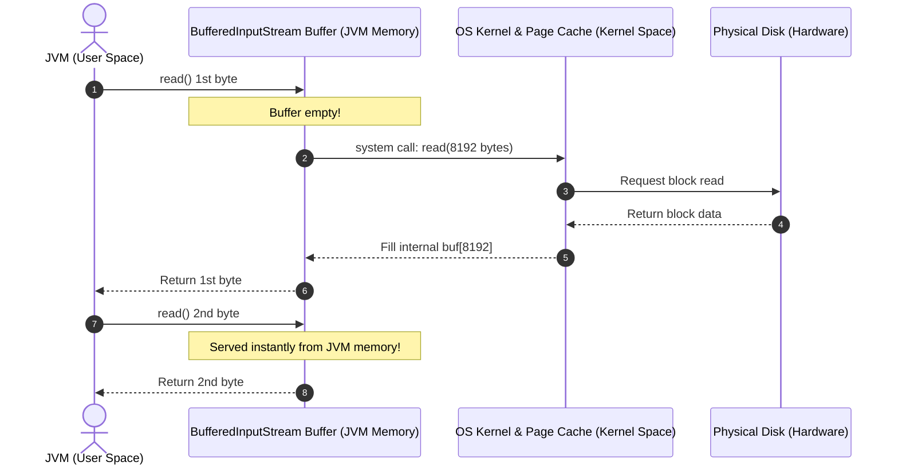

# IO in Java - Part 2

| Concept | What to know |
| --- | --- |
| `BufferedInputStream` | A filter input stream that buffers input by reading large blocks of bytes into an internal buffer (default 8KB) to minimize direct OS disk access. |
| `BufferedOutputStream` | A filter output stream that buffers output by storing written bytes in an internal buffer before flushing them to the underlying stream. |
| `Reader` | The abstract base class representing an input stream of characters; designed for reading textual data with proper character encoding. |
| `Writer` | The abstract base class representing an output stream of characters; designed for writing textual data with proper character encoding. |
| `FileReader` | A concrete subclass of `Reader` used to read character data from a file. |
| `FileWriter` | A concrete subclass of `Writer` used to write character data to a file. |
| `BufferedReader` | A buffered character input stream that provides efficient reading of characters, arrays, and lines via the `readLine()` method. |
| `BufferedWriter` | A buffered character output stream that provides efficient writing of characters, arrays, and lines via the `newLine()` method. |
| `ObjectInputStream` | An input stream used to deserialize primitive data and object graphs previously written with `ObjectOutputStream`. |
| `ObjectOutputStream` | An output stream used to serialize objects and primitive data into a byte stream for storage or transfer. |

## Detailed Notes

### Buffered Streams (Byte Buffering)
Directly reading or writing a file byte-by-byte via `FileInputStream` or `FileOutputStream` involves high overhead due to frequent system calls to the operating system.
* `BufferedInputStream` wraps an existing `InputStream` and reads chunks of bytes (default 8KB) into an internal buffer memory. Subsequent reads pull data directly from the buffer.
* `BufferedOutputStream` accumulates written bytes in a buffer and flushes them to disk only when the buffer is full, the stream is closed, or `flush()` is explicitly called.

## Why Buffered Streams Significantly Outperform Raw Streams

Direct I/O operations (like `FileInputStream.read()` or `FileOutputStream.write()`) are extremely slow because each read/write call triggers a context switch from user space to kernel space, requesting a system call (`read(2)` or `write(2)`) to interact with the physical disk controller or file system. System calls require the CPU to save registers, switch page tables, and execute kernel handler code, which consumes significant CPU cycles. `BufferedInputStream` wraps a raw stream and reads a large block of bytes (default 8,192 bytes or 8KB) in a single system call into an internal byte array (`buf`). Subsequent `read()` calls are served directly from this memory buffer, eliminating 99.9% of user-to-kernel mode context switches. The buffer size of 8KB is chosen because it aligns with modern operating system disk page sizes (usually 4KB or 8KB), ensuring that a single JVM buffer read matches a single OS block request from the physical storage, optimizing the OS page cache utilization.

### User/Kernel Space Buffering Mechanics



### Code Demo: Benchmarking Raw vs. Buffered Streams

```java
import java.io.*;

public class BufferingPerformanceDemo {
    public static void main(String[] args) throws IOException {
        File tempFile = File.createTempFile("benchmark", ".bin");
        tempFile.deleteOnExit();
        
        // Generate a 1MB test file
        try (FileOutputStream fos = new FileOutputStream(tempFile)) {
            byte[] data = new byte[1024 * 1024]; // 1MB
            fos.write(data);
        }

        // Test 1: Raw FileInputStream (Byte-by-Byte)
        long start = System.nanoTime();
        try (FileInputStream fis = new FileInputStream(tempFile)) {
            int b;
            while ((b = fis.read()) != -1) {
                // Process byte
            }
        }
        long rawDuration = System.nanoTime() - start;

        // Test 2: BufferedInputStream (Byte-by-Byte out of buffer)
        start = System.nanoTime();
        try (BufferedInputStream bis = new BufferedInputStream(new FileInputStream(tempFile))) {
            int b;
            while ((b = bis.read()) != -1) {
                // Process byte
            }
        }
        long bufferedDuration = System.nanoTime() - start;

        System.out.println("Raw FileInputStream Duration: " + (rawDuration / 1_000_000.0) + " ms");
        System.out.println("BufferedInputStream Duration: " + (bufferedDuration / 1_000_000.0) + " ms");
    }
}
```

### Context Switch and Disk I/O Cause-Effect Chain

```
Call to fis.read() 
  ↳ CPU saves user-space state & context switches to kernel space
    ↳ OS issues read(2) system call & fetches physical block from disk
      ↳ Data loaded into OS page cache & copied to JVM memory
        ↳ CPU context switches back to user space (massive performance overhead)

Call to bis.read()
  ↳ Checks internal memory array (buf)
    ↳ If present, returns byte instantly (bypasses system calls and OS kernel context switches)
```

```java
// Wrapping file stream with buffered stream
try (BufferedInputStream bis = new BufferedInputStream(new FileInputStream("input.dat"));
     BufferedOutputStream bos = new BufferedOutputStream(new FileOutputStream("output.dat"))) {
    int data;
    while ((data = bis.read()) != -1) {
        bos.write(data);
    }
} catch (IOException e) {
    e.printStackTrace();
}
```

### Reader & Writer (Character Streams)
While byte streams deal with raw bytes (`8-bit`), character streams are designed specifically for character data (`16-bit` Unicode). They automatically translate bytes to characters using character sets (like UTF-8).
* `Reader` and `Writer` are the abstract base classes.
* `FileReader` and `FileWriter` read/write characters directly from/to files.

### BufferedReader & BufferedWriter
* `BufferedReader` buffers a character stream and provides `readLine()`, which reads a line of text terminated by a line feed (`\n`) or carriage return (`\r`).
* `BufferedWriter` buffers character output and provides `newLine()`, which writes the system-dependent line separator.

```java
import java.io.BufferedReader;
import java.io.BufferedWriter;
import java.io.FileReader;
import java.io.FileWriter;
import java.io.IOException;

public class CharacterFileCopy {
    public static void main(String[] args) {
        try (BufferedReader reader = new BufferedReader(new FileReader("input.txt"));
             BufferedWriter writer = new BufferedWriter(new FileWriter("output.txt"))) {
             
            String line;
            while ((line = reader.readLine()) != -1) {
                writer.write(line);
                writer.newLine(); // Platform-independent line break
            }
            System.out.println("Text file copied.");
        } catch (IOException e) {
            e.printStackTrace();
        }
    }
}
```

---

## Case Study: Buffering Performance Comparison

### Problem
Reading a large file (e.g., 5MB) byte-by-byte using raw `FileInputStream` vs `BufferedInputStream`. We want to observe why buffering is essential for I/O performance.

### Mock Benchmark & Mechanism
* **Without Buffering**: Each call to `FileInputStream.read()` triggers a system call (`read(2)`) to request 1 byte from the OS. This causes a CPU context switch between user space and kernel space 5,000,000 times.
* **With Buffering**: `BufferedInputStream` requests 8,192 bytes from the OS in a single system call. The next 8,191 calls to `read()` are answered instantly out of memory, reducing system call overhead by `99.98%`.

```java
// Performance test simulation code
long startTime = System.currentTimeMillis();
try (FileInputStream fis = new FileInputStream("largeFile.bin")) {
    while (fis.read() != -1) {} // Raw byte read
}
long rawTime = System.currentTimeMillis() - startTime;

startTime = System.currentTimeMillis();
try (BufferedInputStream bis = new BufferedInputStream(new FileInputStream("largeFile.bin"))) {
    while (bis.read() != -1) {} // Buffered read
}
long bufferedTime = System.currentTimeMillis() - startTime;

System.out.println("Raw stream time: " + rawTime + " ms");       // e.g., 4200 ms
System.out.println("Buffered stream time: " + bufferedTime + " ms"); // e.g., 15 ms
```

---

## Common Mistakes

### 1. Using Character Streams for Binary Files (Image Corruption)
`FileReader` / `FileWriter` are designed for human-readable text. They translate binary data into Unicode characters using default or specified charsets. If you try to copy a `.png` or `.zip` file using `FileReader`/`FileWriter`, the character mapper will replace invalid byte sequences with replacement characters (like `?` or `\uFFFD`), corrupting the output.
* **Rule**: Always use byte streams (`InputStream` / `OutputStream`) for binary files.

### 2. Forgetting to `flush()` Buffered Streams
Data written to a `BufferedOutputStream` or `BufferedWriter` is stored in memory. If the program crashes or the stream is not closed properly, the buffered data may never be written to disk.
* **Fix**: Ensure streams are closed (which auto-flushes) using try-with-resources, or call `flush()` manually if the stream must remain open.

## Reference Links

- https://docs.oracle.com/en/java/javase/21/docs/api/java.base/java/io/BufferedInputStream.html (BufferedInputStream API Documentation)
- https://docs.oracle.com/en/java/javase/21/docs/api/java.base/java/io/BufferedOutputStream.html (BufferedOutputStream API Documentation)
