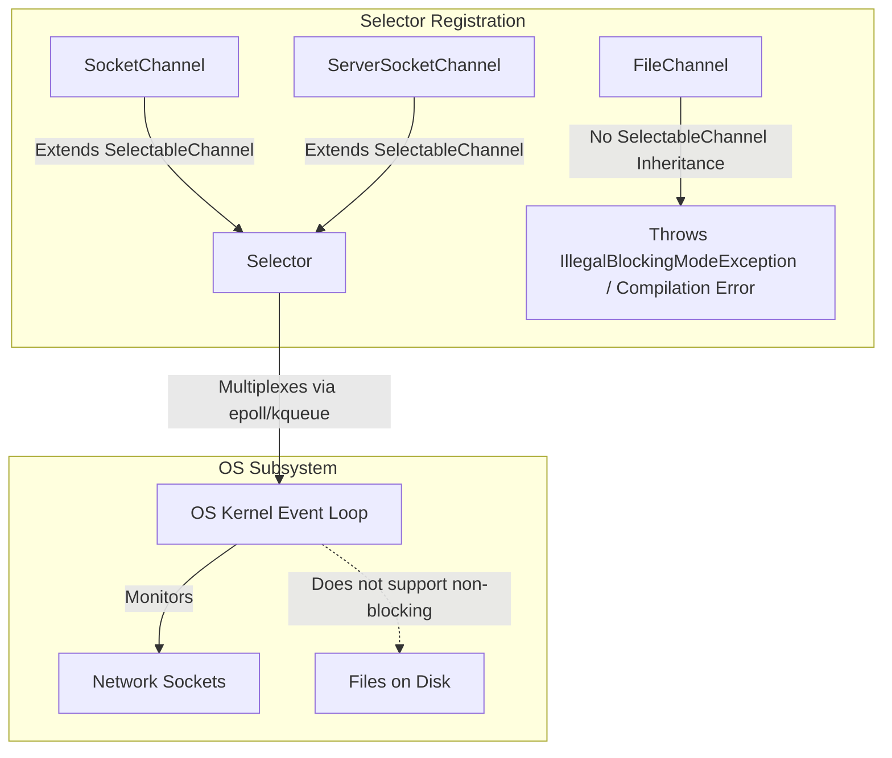

# NIO / NIO.2 - Part 2

| Concept | What to know |
| --- | --- |
| `FileChannel` | A thread-safe, high-performance channel for reading, writing, mapping, and locking files; supports random access operations. |
| `Basic Selector` | A multiplexor of selectable channels, enabling a single thread to manage and monitor multiple non-blocking network channels (sockets). |
| `Basic Asynchronous IO` | Non-blocking file I/O operations that run asynchronously, returning a `Future` or executing a `CompletionHandler` callback upon completion. |

## Detailed Notes

### FileChannel
`java.nio.channels.FileChannel` is a channel for reading, writing, mapping, and manipulating files.
* **Obtaining a FileChannel**: You can open one directly via `FileChannel.open(path, options)`, or obtain one from legacy streams: `fileInputStream.getChannel()` or `fileOutputStream.getChannel()`.
* **Random Access**: Unlike streams, which are sequential, `FileChannel` has a `position(long)` method that allows you to jump to any index in the file for reading or writing.
* **File Locking**: `FileChannel` supports locking file regions via `lock()` (blocks until lock is acquired) or `tryLock()` (non-blocking, returns null if already locked). Locks can be shared (read-only) or exclusive (write-only).

```java
import java.io.RandomAccessFile;
import java.nio.ByteBuffer;
import java.nio.channels.FileChannel;

public class FileChannelDemo {
    public static void main(String[] args) {
        try (RandomAccessFile file = new RandomAccessFile("temp.txt", "rw");
             FileChannel channel = file.getChannel()) {
            
            // 1. Write to channel
            ByteBuffer buf = ByteBuffer.allocate(48);
            buf.clear();
            buf.put("Hello FileChannel".getBytes());
            buf.flip();
            
            while (buf.hasRemaining()) {
                channel.write(buf);
            }
            
            // 2. Read from specific position
            channel.position(6); // Jump to index 6 (skips "Hello ")
            buf.clear();
            int bytesRead = channel.read(buf);
            
            buf.flip();
            while (buf.hasRemaining()) {
                System.out.print((char) buf.get()); // Prints "FileChannel"
            }
            System.out.println();
        } catch (Exception e) {
            e.printStackTrace();
        }
    }
}
```

### Why BIO and NIO Thread Models Differ for Blocking vs Non-Blocking I/O

Traditional Java I/O (BIO) operates on a synchronous, blocking model where every I/O operation blocks the executing thread until the data is fully read or written. When a server handles multiple clients using BIO, it must allocate a dedicated thread for each client connection to prevent one slow client from blocking all others. This "thread-per-connection" model scales poorly because each thread consumes significant system memory (typically 1MB stack size) and causes heavy CPU overhead due to constant thread context switching. Java NIO resolves this limitation by introducing non-blocking channels where operations like `read()` or `write()` return immediately with the number of bytes transferred (which could be zero) instead of waiting for data availability. This design enables a small pool of active threads—or even a single thread—to efficiently manage thousands of concurrent active connections.

```mermaid
graph TD
    subgraph Blocking BIO (Thread-per-Connection)
        Client1[Client 1] -->|Blocks| Thread1[Thread 1]
        Client2[Client 2] -->|Blocks| Thread2[Thread 2]
        Client3[Client 3] -->|Blocks| Thread3[Thread 3]
        Thread1 -->|Sleep/Idle| CPU_BIO[CPU Context Switches]
    end
    subgraph Non-Blocking NIO (Multiplexed I/O)
        ClientN1[Client 1] --> Channel1[Channel 1]
        ClientN2[Client 2] --> Channel2[Channel 2]
        ClientN3[Client 3] --> Channel3[Channel 3]
        Channel1 & Channel2 & Channel3 -->|Registered| Sel[Selector]
        Sel -->|Monitored By| SingleThread[Single Thread]
        SingleThread -->|Efficient| CPU_NIO[CPU Processing]
    end
```

##### Code Example: Blocking Socket vs Non-Blocking Channel Configuration

```java
import java.io.IOException;
import java.net.ServerSocket;
import java.net.Socket;
import java.net.InetSocketAddress;
import java.nio.channels.ServerSocketChannel;
import java.nio.channels.SocketChannel;

public class BioVsNioSockets {
    public static void main(String[] args) throws IOException {
        // BIO: Server socket always blocks on accept()
        try (ServerSocket bioServer = new ServerSocket(8080)) {
            System.out.println("BIO Server waiting (blocking)...");
            // Socket clientSocket = bioServer.accept(); // Blocks execution here until client connects
        }

        // NIO: Server socket channel can be configured as non-blocking
        try (ServerSocketChannel nioServer = ServerSocketChannel.open()) {
            nioServer.bind(new InetSocketAddress(8081));
            nioServer.configureBlocking(false); // Enable non-blocking mode
            System.out.println("NIO Server waiting (non-blocking)...");
            
            SocketChannel clientChannel = nioServer.accept(); // Returns immediately (null if no client connected yet)
            if (clientChannel == null) {
                System.out.println("No connections yet. Thread can perform other tasks."); // Output
            }
        }
    }
}
```

##### Cause-Effect Chain of Thread Blocking in BIO vs NIO

```
[BIO Connection Handling]
Client connects and goes idle
  └── Server thread calls socket.read()
        └── Thread blocks, entering WAITING/BLOCKED OS state
              └── OS performs CPU context switch to run other threads
                    └── High memory consumption (1MB/thread) + CPU Thrashing -> Server crashes under load

[NIO Connection Handling]
Client connects and goes idle
  └── Server thread calls channel.read()
        └── Method returns 0 bytes read immediately (no blocking)
              └── Thread does not block and remains available to process other active channels
                    └── Single thread handles thousands of idle clients -> High scalability and low memory footprint
```

### Basic Selector (Non-blocking I/O)
A `Selector` allows a single thread to monitor multiple selectable network channels (e.g. `SocketChannel`, `ServerSocketChannel`) for events like connections (`OP_ACCEPT`), readiness to read (`OP_READ`), or readiness to write (`OP_WRITE`).
* **Multiplexing**: This is the foundation of high-scalability web servers (like Netty), eliminating the need for a thread-per-connection architecture.
* **Important**: Selectors **only** work with classes inheriting from `SelectableChannel`. File channels do **not** inherit from `SelectableChannel` and cannot be placed in non-blocking mode or registered with a selector.

#### Why Selector Multiplexing Works and Why FileChannel Cannot Use It

The `Selector` mechanism implements I/O multiplexing by integrating with the operating system's native event-polling subsystem (such as `epoll` in Linux, `kqueue` in macOS, or `IOCP` in Windows). These operating system kernels monitor socket file descriptors for asynchronous changes in network buffers and wake up the selector thread only when a channel becomes ready for reading, writing, or accepting. However, filesystems are designed differently than network sockets; files are conceptually always "ready" to be read or written because data is stored statically on disk, and standard OS filesystems do not support a native non-blocking mode for regular file descriptors. Since a `FileChannel` cannot be placed into a non-blocking state, it does not inherit from `SelectableChannel` and cannot be registered with a `Selector`. Trying to register or configure a `FileChannel` as non-blocking results in runtime exceptions, meaning that any non-blocking file access must instead be simulated using `AsynchronousFileChannel` backed by background worker threads.



##### Code Example: FileChannel Registration Attempt

```java
import java.nio.channels.FileChannel;
import java.nio.channels.Selector;
import java.nio.channels.SelectionKey;
import java.nio.file.Path;
import java.nio.file.StandardOpenOption;

public class SelectorFileChannelFailure {
    public static void main(String[] args) {
        try (Selector selector = Selector.open();
             FileChannel fileChannel = FileChannel.open(Path.of("temp.txt"), StandardOpenOption.READ)) {
            
            // FileChannel does NOT have a configureBlocking(false) method.
            // Attempting to register it directly:
            System.out.println("Attempting to register FileChannel with Selector...");
            // fileChannel.register(selector, SelectionKey.OP_READ); // COMPILATION ERROR: register() is not defined on FileChannel
            
        } catch (Exception e) {
            e.printStackTrace();
        }
    }
}
```

##### Cause-Effect Chain of FileChannel Selector Registration

```
OS Filesystem design treats disk files as always ready
  └── Java FileChannel does not inherit from SelectableChannel
        └── FileChannel lacks configureBlocking() and register() methods
              └── Attempt to register FileChannel with a Selector fails at compile time
                    └── Developer must use AsynchronousFileChannel or custom thread pools to avoid blocking the main thread
```

```java
import java.nio.channels.*;
import java.util.Iterator;
import java.util.Set;

public class SelectorDemo {
    public static void main(String[] args) throws Exception {
        Selector selector = Selector.open();
        ServerSocketChannel serverChannel = ServerSocketChannel.open();
        serverChannel.configureBlocking(false); // Non-blocking mode is REQUIRED for Selector!
        
        // Register channel for connections
        serverChannel.register(selector, SelectionKey.OP_ACCEPT);
        
        // Non-blocking select event loop
        while (true) {
            int readyChannels = selector.select(1000); // Wait up to 1 second
            if (readyChannels == 0) continue;
            
            Set<SelectionKey> selectedKeys = selector.selectedKeys();
            Iterator<SelectionKey> keyIterator = selectedKeys.iterator();
            
            while (keyIterator.hasNext()) {
                SelectionKey key = keyIterator.next();
                if (key.isAcceptable()) {
                    // Accept connection
                } else if (key.isReadable()) {
                    // Read data
                }
                keyIterator.remove(); // Must remove handled key!
            }
            break; // Break demo
        }
        serverChannel.close();
        selector.close();
    }
}
```

### Basic Asynchronous I/O
NIO.2 introduced asynchronous channels (e.g. `AsynchronousFileChannel`) which execute operations in a background thread pool.
* **Methods of retrieval**:
  1. **Future-based**: The read/write method returns a `Future<Integer>` object. Calling `.get()` blocks until done.
  2. **Callback-based**: You pass a `CompletionHandler<Integer, Attachment>` which executes its `completed()` or `failed()` callback when done.

```java
import java.nio.ByteBuffer;
import java.nio.channels.AsynchronousFileChannel;
import java.nio.file.Path;
import java.nio.file.StandardOpenOption;
import java.util.concurrent.Future;

public class AsyncFileRead {
    public static void main(String[] args) throws Exception {
        Path path = Path.of("temp.txt");
        try (AsynchronousFileChannel asyncChannel = AsynchronousFileChannel.open(path, StandardOpenOption.READ)) {
            ByteBuffer buffer = ByteBuffer.allocate(100);
            
            // Read asynchronously starting at position 0
            Future<Integer> operation = asyncChannel.read(buffer, 0);
            
            // Wait for completion (simulated wait)
            while (!operation.isDone()) {
                Thread.sleep(10);
            }
            
            buffer.flip();
            System.out.println("Bytes read: " + operation.get());
        }
    }
}
```

---

## Case Study: High-Performance File I/O with Direct Memory Mapping

### Problem
Reading and writing very large files (e.g., 1GB) can exhaust JVM heap memory or cause high GC overhead if loaded into byte arrays.

### Solution: Memory-Mapped Files
By using `FileChannel.map()`, we map a region of a file directly into physical memory (virtual memory space outside the JVM heap), returning a `MappedByteBuffer`.
* **Zero-Copy**: The operating system maps disk pages directly to memory pages, bypassing the need to copy data between kernel buffer and JVM heap buffer.
* **Direct Access**: Modifications to the `MappedByteBuffer` are automatically propagated to the underlying file by the OS.

#### Why Memory-Mapping is Fast and the Zero-Copy Mechanism

In standard Java file I/O (using streams or standard channel reads), reading a block of data requires a "double-copy" process: the OS first reads the data from the disk into the kernel-space page cache, and then copies it across the user-space boundary into a byte array within the JVM heap. This secondary copy operation incurs significant CPU overhead, memory bandwidth usage, and garbage collection pressure when reading large files. `FileChannel.map()` resolves this bottleneck by utilizing the operating system's native `mmap()` system call, which maps the file's binary blocks directly to a region of the application's virtual memory address space. The resulting `MappedByteBuffer` resides outside the standard JVM heap, enabling the Java program to access file bytes directly from the OS page cache without any memory-to-memory copying. This direct access operates at native hardware speeds, and the operating system handles flushing modified memory pages back to the physical disk asynchronously in the background.

```mermaid
graph TD
    subgraph Standard I/O (Double-Copy)
        Disk[Disk Storage] -->|1. Copy| KernelBuf[OS Kernel Page Cache]
        KernelBuf -->|2. Copy| JVMHeap[JVM Heap Buffer]
        JVMHeap -->|Read| UserApp[Java App Code]
    end
    subgraph Memory-Mapped I/O (Zero-Copy)
        Disk2[Disk Storage] -->|1. OS Page Fault Page-In| PageCache[OS Page Cache / Physical RAM]
        PageCache <-->|Mapped via Virtual Memory| MappedBuf[MappedByteBuffer in Virtual Address Space]
        UserApp2[Java App Code] <-->|Direct Read/Write| MappedBuf
    end
```

##### Code Example: Memory-Mapped Reading and Writing

```java
import java.io.RandomAccessFile;
import java.nio.MappedByteBuffer;
import java.nio.channels.FileChannel;

public class MemoryMappedZeroCopyDemo {
    public static void main(String[] args) {
        try (RandomAccessFile file = new RandomAccessFile("mapped_temp.dat", "rw");
             FileChannel channel = file.getChannel()) {
            
            long size = 1024 * 1024; // 1MB
            
            // Map the file directly into virtual memory (READ_WRITE mode)
            MappedByteBuffer mappedBuffer = channel.map(FileChannel.MapMode.READ_WRITE, 0, size);
            
            // Write directly to the page cache
            mappedBuffer.put(0, (byte) 'Z');
            mappedBuffer.put(100, (byte) 'A');
            
            // Read directly from the page cache
            System.out.println("Byte at 0: " + (char) mappedBuffer.get(0)); // Prints: Z
            System.out.println("Byte at 100: " + (char) mappedBuffer.get(100)); // Prints: A
            
        } catch (Exception e) {
            e.printStackTrace();
        }
    }
}
```

##### Cause-Effect Chain of Memory-Mapped File Access

```
Call FileChannel.map()
  └── OS maps file bytes to virtual memory addresses via mmap() system call
        └── MappedByteBuffer object created pointing to virtual addresses outside JVM heap
              └── Application accesses buffer elements (e.g., mappedBuffer.get())
                    └── Page Fault triggered if page is not yet cached in physical RAM
                          └── OS loads page from disk directly into OS Page Cache
                                └── JVM thread reads memory directly from Page Cache without copying to JVM heap
```

```java
import java.io.RandomAccessFile;
import java.nio.MappedByteBuffer;
import java.nio.channels.FileChannel;

public class MemoryMapCaseStudy {
    public static void main(String[] args) throws Exception {
        try (RandomAccessFile file = new RandomAccessFile("largefile.dat", "rw");
             FileChannel channel = file.getChannel()) {
             
            // Map 10MB of the file directly to memory
            long mapSize = 10 * 1024 * 1024; // 10MB
            MappedByteBuffer out = channel.map(FileChannel.MapMode.READ_WRITE, 0, mapSize);
            
            // Write directly to memory map
            for (int i = 0; i < mapSize; i++) {
                out.put((byte) 'A');
            }
            System.out.println("Finished writing 10MB to mapped file.");
        }
    }
}
```

---

## Common Mistakes

### 1. Trying to Register a `FileChannel` with a `Selector`
`FileChannel` does not implement `SelectableChannel`. It cannot be set to non-blocking mode (`configureBlocking(false)`) and attempting to register it with a selector throws an `IllegalBlockingModeException`.
* **Rule**: Selectors are purely for network-based and selectable channel types (like Sockets).

### 2. Assuming File Locks are Cross-JVM Blockers
File locks in Java (`FileChannel.lock()`) are JVM-wide. Different threads within the **same** JVM can still access the file concurrently despite the lock, and some operating systems treat these locks as advisory, meaning non-cooperating processes on the same OS can still bypass them.
* **Fix**: Do not rely on file locking for thread synchronization within the same JVM; use standard concurrent locks instead.

---

## Reference Links

- [Official Java FileChannel Documentation](https://docs.oracle.com/en/java/javase/21/docs/api/java.base/java/nio/channels/FileChannel.html)
- [Official Java Selector Documentation](https://docs.oracle.com/en/java/javase/21/docs/api/java.base/java/nio/channels/Selector.html)
- [Official Java AsynchronousFileChannel Documentation](https://docs.oracle.com/en/java/javase/21/docs/api/java.base/java/nio/channels/AsynchronousFileChannel.html)
