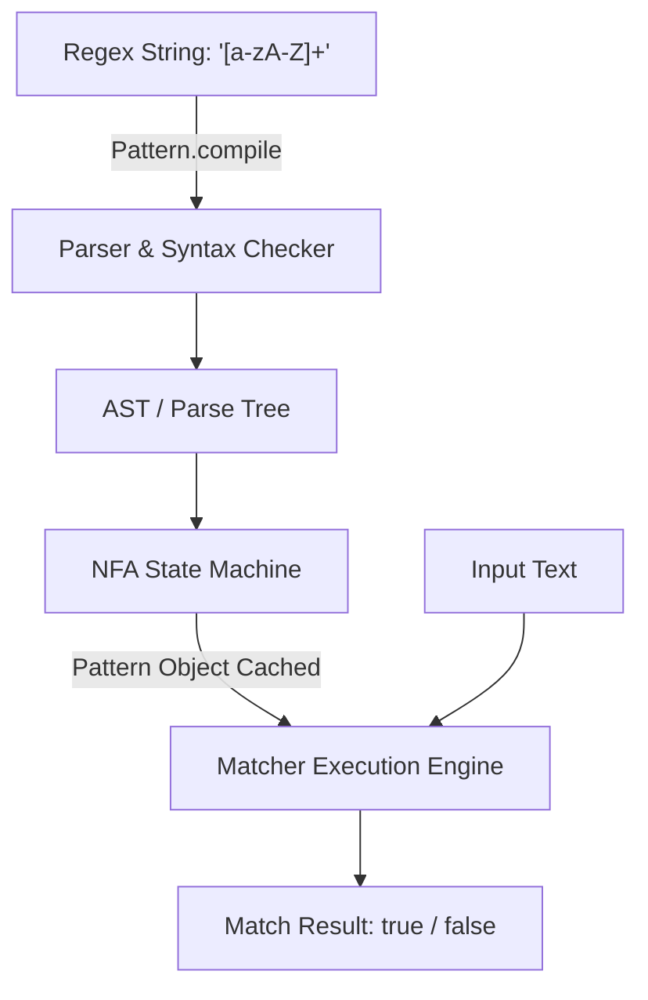

# Regular Expression - Part 1

## Learning Goal

This file covers a focused slice of **Regular Expression**. Study each concept as a practical Java rule, not as isolated vocabulary.

## Outline Coverage

| Concept | What to know |
| --- | --- |
| `What is Regex?` | A regular expression is a pattern language for matching text. |
| `Pattern` | Pattern is the compiled representation of a regular expression. |
| `Matcher` | Matcher applies a Pattern to input text and exposes match operations. |
| `matches` | matches checks whether the entire input satisfies the pattern. |
| `find` | find searches for the next subsequence that matches the pattern. |
| `group` | group returns text captured by the overall match or a capturing group. |
| `Character classes` | Character classes define sets of allowed characters such as digits, letters, or custom ranges. |
| `Quantifiers` | Quantifiers specify how many times the preceding token may repeat. |
| `Capturing group` | A capturing group stores a matched subexpression for later retrieval. |
| `Non-capturing group` | A non-capturing group groups pattern logic without storing a captured result. |

---

## Detailed Notes

### What is Regex?

A regular expression (regex) is a pattern language for matching, searching, and manipulating text. In Java, regular expressions are supported natively via the `java.util.regex` package, primarily through the `Pattern` and `Matcher` classes, and via helper methods in `java.lang.String` (like `matches`, `replaceAll`, and `split`).

#### Code Example: Basic Regex Verification
```java
public class RegexIntro {
    public static void main(String[] args) {
        String input = "Java17";
        // Check if the input starts with word characters and ends with digits
        boolean isMatch = input.matches("[a-zA-Z]+\\d+");
        System.out.println("Matches: " + isMatch); // Prints true
    }
}
```

---

### Pattern

`java.util.regex.Pattern` is the compiled representation of a regular expression. Compiling a regular expression is a costly operation because it parses the regex string into a syntax tree and constructs a state machine.

- **Immutability and Thread Safety**: `Pattern` instances are completely immutable and thread-safe. You should compile a pattern once and cache it in a `static final` field for reuse across threads.
- **Compilation Flags**: You can pass flags to `Pattern.compile(regex, flags)`, such as `Pattern.CASE_INSENSITIVE`, `Pattern.MULTILINE`, or `Pattern.DOTALL`.

#### Code Example: Cached Pattern Pattern
```java
import java.util.regex.Pattern;

public class UserValidator {
    // Compile once and reuse to avoid performance overhead in loops or concurrent threads
    private static final Pattern USERNAME_PATTERN = 
        Pattern.compile("^[a-z0-9_-]{3,16}$", Pattern.CASE_INSENSITIVE);

    public static boolean isValidUsername(String username) {
        if (username == null) return false;
        return USERNAME_PATTERN.matcher(username).matches();
    }
}
```

#### Common Mistake
Re-compiling the `Pattern` inside a frequently called method (e.g., inside a loop or service handler). This degrades throughput significantly because the JVM has to re-parse the regular expression on every invocation.
```java
// BAD: Compiles the pattern on every call!
public boolean badValidate(String email) {
    return Pattern.compile("^[A-Z0-9._%+-]+@[A-Z0-9.-]+\\.[A-Z]{2,6}$", Pattern.CASE_INSENSITIVE)
                  .matcher(email)
                  .matches();
}
```

## Why Pattern Compilation Is Expensive

Compiling a regular expression is not a simple character-by-character check. Under the hood, when `Pattern.compile(regex)` is called, the regex engine parses the regex string into an abstract syntax tree (AST) to validate its syntax. Next, it compiles this tree into an internal representation of a finite state automaton (specifically, a Non-deterministic Finite Automaton, or NFA). This compilation process is a heavy CPU and memory operation that involves allocating numerous node objects, building state transitions, and optimizing the resulting state machine structure. Because of this high compilation overhead, re-compiling a pattern inside a hot loop or a frequently called method degrades throughput significantly; the pattern should be compiled once and cached as a `static final` field.

### Mental Model: Regex Compilation vs. Execution



### Code Example: Caching Patterns vs. On-the-Fly Compilation

```java
import java.util.regex.*;

public class PatternCompilationCost {
    // GOOD: Pattern is compiled once during class loading and reused
    private static final Pattern CACHED_PATTERN = Pattern.compile("^[a-zA-Z]+$");

    // BAD: Re-compiles the pattern on every single method invocation
    public static boolean badValidate(String text) {
        return Pattern.compile("^[a-zA-Z]+$").matcher(text).matches();
    }

    public static boolean goodValidate(String text) {
        return CACHED_PATTERN.matcher(text).matches(); // Reuses NFA state machine
    }

    public static void main(String[] args) {
        System.out.println("Good result: " + goodValidate("Java")); // true
        System.out.println("Bad result: " + badValidate("Java"));   // true
    }
}
```

### Cause-Effect Chain

`String.matches("regex")` called or `Pattern.compile("regex")` called in loop → Engine must parse pattern string and allocate AST nodes → JVM compiles AST into NFA state machine on the heap → Matching runs on the input → Compiled state machine discarded and garbage collected → Repeated execution causes high CPU utilization and GC thrashing.

---

### Matcher

`java.util.regex.Matcher` is the stateful engine that performs match operations on a character sequence by interpreting the compiled `Pattern`.

- **Statefulness**: Unlike `Pattern`, `Matcher` is highly stateful (tracks matching region boundaries, search index, and captured groups).
- **Thread Safety**: `Matcher` instances are **not thread-safe**. Do not share a `Matcher` instance between threads.

#### Code Example: Creating a Matcher
```java
import java.util.regex.Pattern;
import java.util.regex.Matcher;

public class MatcherUsage {
    public static void main(String[] args) {
        Pattern pattern = Pattern.compile("id=\\d+");
        Matcher matcher = pattern.matcher("user: id=4082, role=admin");
        
        if (matcher.find()) {
            System.out.println("Found match: " + matcher.group()); // Prints "id=4082"
        }
    }
}
```

---

### matches

`Matcher.matches()` attempts to match the **entire** input sequence against the pattern.

- **Strict Full-Match**: It returns `true` if and only if the entire string matches the regex.
- **Contrast with String.matches()**: `String.matches(regex)` internally calls `Pattern.matches(regex, input)`, which compiles the pattern and performs a full `matches()` operation.
- **Contrast with lookingAt()**: `Matcher.lookingAt()` only checks if the pattern matches from the *beginning* of the input, while `Matcher.find()` searches for the pattern *anywhere* in the input.

#### Code Example: matches vs lookingAt vs find
```java
import java.util.regex.Pattern;
import java.util.regex.Matcher;

public class MatchTypes {
    public static void main(String[] args) {
        Pattern p = Pattern.compile("\\d+"); // Matches digits
        String text = "123abc456";
        
        Matcher m1 = p.matcher(text);
        System.out.println("matches: " + m1.matches()); // false (entire string is not just digits)
        
        Matcher m2 = p.matcher(text);
        System.out.println("lookingAt: " + m2.lookingAt()); // true (starts with digits "123")
        
        Matcher m3 = p.matcher(text);
        System.out.println("find: " + m3.find()); // true (finds "123")
        System.out.println("find again: " + m3.find()); // true (finds "456")
    }
}
```

---

### find

`Matcher.find()` scans the input sequence looking for the next subsequence that matches the pattern.

- **Iteration**: It returns `true` if a match is found and moves the search pointer immediately after the matched text. You can use it in a `while (matcher.find())` loop to extract all occurrences.
- **Resetting**: Calling `matcher.reset()` restarts the match pointer at the beginning of the input.
- **Parameterized find**: `matcher.find(int start)` resets the matcher and starts searching from the specified character index.

#### Code Example: Finding All Occurrences
```java
import java.util.regex.Pattern;
import java.util.regex.Matcher;

public class FindAll {
    public static void main(String[] args) {
        Pattern pattern = Pattern.compile("0x[0-9a-fA-F]+"); // Hex codes
        Matcher matcher = pattern.matcher("Values: 0x1A, 0xFF, and invalid 0xG1");
        
        while (matcher.find()) {
            System.out.println("Hex found: " + matcher.group() + " at [" + matcher.start() + ", " + matcher.end() + ")");
        }
        // Output:
        // Hex found: 0x1A at [8, 12)
        // Hex found: 0xFF at [14, 18)
    }
}
```

---

### group

`Matcher.group()` returns the input subsequence matched by the previous match operation.

- **Index 0**: `matcher.group(0)` or `matcher.group()` returns the entire matched text.
- **Subgroups**: `matcher.group(i)` returns the text captured by the $i$-th capturing group (numbered by counting opening parentheses from left to right).
- **Group Count**: `matcher.groupCount()` returns the number of capturing groups defined in the pattern (excluding group 0).

#### Code Example: Extracting Capturing Groups
```java
import java.util.regex.Pattern;
import java.util.regex.Matcher;

public class ExtractGroups {
    public static void main(String[] args) {
        Pattern pattern = Pattern.compile("(\\w+):(\\d+)");
        Matcher matcher = pattern.matcher("port:8080 host:9000");
        
        while (matcher.find()) {
            System.out.println("Full match: " + matcher.group(0));
            System.out.println("  Name: " + matcher.group(1));
            System.out.println("  Port: " + matcher.group(2));
        }
    }
}
```

#### Common Mistake
Calling `matcher.group()` before calling `find()`, `matches()`, or `lookingAt()`, or after one of these methods returns `false`. This throws an `IllegalStateException` because the matcher has no active match state.
```java
// BAD: Triggers IllegalStateException!
Matcher matcher = Pattern.compile("\\d+").matcher("abc 123");
String val = matcher.group(); // Exception! Must call matcher.find() first.
```

---

### Character classes

Character classes specify sets of characters that can match a single position in the input.

- **Custom Classes**: `[abc]` matches `a`, `b`, or `c`. `[^abc]` matches any character except `a`, `b`, or `c`. `[a-z]` matches letters from `a` to `z`.
- **Predefined Classes**:
  - `.` matches any character (except line terminators, unless `Pattern.DOTALL` is active).
  - `\d` matches a digit `[0-9]`.
  - `\w` matches a word character `[a-zA-Z_0-9]`.
  - `\s` matches a whitespace character `[ \t\n\x0B\f\r]`.
  - `\D`, `\W`, `\S` are the negations of `\d`, `\w`, `\s`.
- **Double Escaping**: Because backslashes have special meaning in Java String literals, they must be doubled when writing a regex pattern (e.g., `"\\d"` translates to `\d` in the compiled regex).

#### Code Example: Custom Character Class
```java
public class CharacterClasses {
    public static void main(String[] args) {
        // Match a vowel, followed by any non-digit character
        String regex = "[aeiouAEIOU]\\D"; 
        System.out.println("aX".matches(regex)); // true
        System.out.println("a9".matches(regex)); // false
    }
}
```

---

### Quantifiers

Quantifiers define how many times the preceding token can match.

- **Types of Quantifiers**:
  - `?`: 0 or 1 time.
  - `*`: 0 or more times.
  - `+`: 1 or more times.
  - `{n}`: Exactly $n$ times.
  - `{n,}`: At least $n$ times.
  - `{n,m}`: Between $n$ and $m$ times.
- **Matching Strategies**:
  - **Greedy (default)**: Matches as many characters as possible first, then backtracks one character at a time if matching fails. (e.g. `.*A`)
  - **Reluctant/Lazy (append `?`)**: Matches as few characters as possible first, checking the rest of the pattern at each step. (e.g. `.*?A`)
  - **Possessive (append `+`)**: Matches as many characters as possible and **never** backtracks. (e.g. `.*+A`)

#### Code Example: Quantifier Behaviors
```java
import java.util.regex.Pattern;
import java.util.regex.Matcher;

public class QuantifierComparison {
    public static void main(String[] args) {
        String text = "abcXdefXghi";
        
        // Greedy: matches up to the LAST 'X'
        Matcher m1 = Pattern.compile("a.*X").matcher(text);
        if (m1.find()) System.out.println("Greedy: " + m1.group()); // "abcXdefX"
        
        // Reluctant: matches up to the FIRST 'X'
        Matcher m2 = Pattern.compile("a.*?X").matcher(text);
        if (m2.find()) System.out.println("Reluctant: " + m2.group()); // "abcX"
        
        // Possessive: consumes everything, never releases 'X' for the final token 'X'
        Matcher m3 = Pattern.compile("a.*+X").matcher(text);
        System.out.println("Possessive match found: " + m3.find()); // false
    }
}
```

---

### Capturing group

A capturing group is created by enclosing a subexpression inside parentheses `(...)`. It tells the regex engine to save the matched subsequence in memory, allowing you to reference it later.

- **Grouping**: Allows quantifiers to apply to an entire subpattern (e.g., `(abc)+`).
- **Extraction**: Allows extracting parts of the matched string via `matcher.group(index)`.
- **Backreferences**: You can refer back to a previously matched group inside the same regex pattern using `\index` (e.g. `(\\w)\\1` matches double letters like `aa` or `bb`).

#### Code Example: Backreference
```java
import java.util.regex.Pattern;
import java.util.regex.Matcher;

public class BackreferenceExample {
    public static void main(String[] args) {
        // Matches HTML tags where tag name matches the closing tag name
        Pattern pattern = Pattern.compile("<(\\w+)>.*?</\\1>");
        
        System.out.println(pattern.matcher("<b>Bold</b>").matches()); // true
        System.out.println(pattern.matcher("<b>Wrong Tag</i>").matches()); // false
    }
}
```

---

### Non-capturing group

A non-capturing group is defined using the syntax `(?:pattern)`. It groups subexpressions together (e.g. for applying quantifiers or alternation) but does **not** save the matched text in memory.

- **Performance**: Saves memory and processing time by avoiding the storage of matched subsequences.
- **Index Preservation**: Prevents messing up the group numbers of actual capturing groups.

#### Code Example: Non-Capturing Group
```java
import java.util.regex.Pattern;
import java.util.regex.Matcher;

public class NonCapturingGroup {
    public static void main(String[] args) {
        // We want to group the prefix options "http" or "https" or "ftp"
        // but we only want to capture the actual domain name.
        Pattern pattern = Pattern.compile("(?:https?|ftp)://([a-zA-Z0-9.-]+)");
        Matcher matcher = pattern.matcher("https://google.com");
        
        if (matcher.find()) {
            System.out.println("Total groups: " + matcher.groupCount()); // 1 (prefix group is ignored)
            System.out.println("Domain: " + matcher.group(1)); // "google.com"
        }
    }
}
```

## Why Non-Capturing Groups Save Heap Allocations

In regular expressions, capturing groups `(group)` perform dual duties: they group tokens for quantifiers or alternation, and they capture matched substrings for backreferences or retrieval. To store these captured substrings, the regex engine must allocate and maintain internal capture buffers (arrays or list-like structures) to track the start and end offsets of each group. In contrast, non-capturing groups `(?:group)` only group tokens and tell the engine to bypass offset tracking. By avoiding the need to record substring indices, non-capturing groups eliminate heap allocations for match state tracking and avoid hitting the backreference limits of the matcher.

### Mental Model: Capture Buffers vs. Logic Grouping

```
Capturing Group: (\\d+)
[Input: "123"] ---> [Regex Engine] ---> [Heap Allocations: Capture Buffer #1 (start=0, end=3)]

Non-capturing Group: (?:\\d+)
[Input: "123"] ---> [Regex Engine] ---> [No Heap Allocations for offsets (logic only)]
```

### Code Example: Performance Difference of Groups

```java
import java.util.regex.*;

public class GroupAllocationExample {
    public static void main(String[] args) {
        // Captures each group, allocating capture buffers on the heap
        Pattern capturing = Pattern.compile("(\\w+)-(\\d+)");
        Matcher m1 = capturing.matcher("item-4082");
        if (m1.find()) {
            System.out.println(m1.group(1)); // "item"
            System.out.println(m1.group(2)); // "4082"
        }

        // Non-capturing: groups without tracking offset states
        Pattern nonCapturing = Pattern.compile("(?:\\w+)-(?:\\d+)");
        Matcher m2 = nonCapturing.matcher("item-4082");
        if (m2.find()) {
            System.out.println(m2.groupCount()); // 0 (saves heap tracking buffers)
        }
    }
}
```

### Cause-Effect Chain

Using `(pattern)` → Engine reserves capture slot → Records start/end index on match → Allocates heap storage for group state → Substring extracted on demand.

Using `(?:pattern)` → Engine groups logic without reservation → Skips offset recording → Saves heap allocations and reduces GC pressure.

---

## Case Study: Regex Backtracking and ReDoS Prevention

Regular Expression Denial of Service (ReDoS) occurs when a regular expression contains nested quantifiers or overlapping match groups that cause the regex engine to perform exponential backtracking when it encounters an input that *almost* matches but fails at the end.

### The Vulnerable Pattern
Consider the pattern: `(a+)+b`
When matched against the input `aaaaaaaaaaaaaaaaaaaaaaaaaaaX` (many `a`s followed by a mismatch `X`), the engine tries every possible way to group the `a`s into nested groups before failing. This takes $2^n$ attempts, freezing the thread and consuming 100% CPU.

```java
import java.util.regex.Pattern;

public class RedosDemo {
    public static void main(String[] args) {
        // Warning: This pattern can freeze the execution thread!
        Pattern pattern = Pattern.compile("(a+)+b");
        String longString = "aaaaaaaaaaaaaaaaaaaaaaaaaaaaaaaX"; // 31 'a's
        
        long start = System.currentTimeMillis();
        boolean matched = pattern.matcher(longString).matches();
        long duration = System.currentTimeMillis() - start;
        
        System.out.println("Match result: " + matched + " in " + duration + "ms");
    }
}
```

### Mitigation Strategies
1. **Avoid Nested Overlapping Quantifiers**: Do not nest quantifiers when the inner and outer patterns can match the same characters (e.g., instead of `(a+)+` use `a+`).
2. **Use Possessive Quantifiers**: Use possessive quantifiers like `(a+)++b` or `a++b` to disable backtracking. Since the engine will not release matched characters, it fails instantly on mismatches.
3. **Use String Methods or Character Scans**: If regex becomes too complex, replace it with simple character sweeps (e.g., `indexOf` or character-by-character validation).

## Why Backtracking Occurs and How Quantifiers Prevent ReDoS

Backtracking occurs when a regular expression engine using a Nondeterministic Finite Automaton (NFA) encounters a partial mismatch and must return to a previous decision point to try a different execution path. Greedy quantifiers (`*`, `+`) eagerly consume as many characters as possible first, and backtrack one character at a time when subsequent tokens fail to match. Reluctant quantifiers (`*?`, `+?`) consume as few characters as possible first, stepping forward only when subsequent tokens mismatch. Possessive quantifiers (`*+`, `++`) consume as much as possible and immediately fail if subsequent tokens mismatch, completely disabling backtracking. Without careful quantifier selection, nested or overlapping patterns can lead to catastrophic backtracking (ReDoS), freezing execution threads.

### Mental Model: Backtracking Execution Flow

```
Pattern: a+b
Input: aac

Step 1: a+ matches "aa" (Greedy consumption)
Step 2: Engine tries to match 'b' against 'c' -> Fails
Step 3: Engine backtracks: a+ releases last 'a', matches "a"
Step 4: Engine tries to match 'b' against 'a' (at index 1) -> Fails
Step 5: Engine backtracks again, but no more options -> Overall Fail (fails fast)
```

### Code Example: Quantifier Backtracking Behaviors

```java
import java.util.regex.*;

public class BacktrackDemo {
    public static void main(String[] args) {
        // Greedy: Backtracks when matching 'b' fails
        Pattern greedy = Pattern.compile("a+b");
        System.out.println(greedy.matcher("aab").matches()); // true

        // Possessive: Consumes all 'a's, locks them, never backtracks to match 'b'
        Pattern possessive = Pattern.compile("a++b");
        System.out.println(possessive.matcher("aab").matches()); // true
        
        // ReDoS Prevention: possessive fails instantly instead of freezing on mismatch
        Pattern redosVulnerable = Pattern.compile("(a+)+b");
        Pattern redosSafe = Pattern.compile("(a+)++b");
        
        long start = System.currentTimeMillis();
        boolean matched = redosSafe.matcher("aaaaaaaaaaaaaaaaaX").matches(); // false (instant)
        System.out.println("Possessive matched: " + matched + " in " + (System.currentTimeMillis() - start) + "ms");
    }
}
```

### Cause-Effect Chain

Nested/overlapping quantifiers → Input contains almost-matching sequence followed by mismatch → Engine tries exponential combinations of group lengths → Thread blocks at 100% CPU (ReDoS) → Mitigated by possessive quantifiers which lock matches and disable backtracking.

## Reference Links

- https://docs.oracle.com/en/java/javase/21/docs/api/java.base/java/util/regex/Pattern.html (Pattern Java Documentation)
- https://docs.oracle.com/javase/tutorial/essential/regex/ (Oracle Java Regex Tutorial)

---

## Common Review Prompts

- **Which concepts here are compile-time rules?**
  Pattern compilation syntax checks (e.g., unmatched brackets throw `PatternSyntaxException` at compile-time when calling `Pattern.compile()`).
- **Which concepts here affect runtime behavior?**
  Matcher states, greedy vs reluctant backtracks, ReDoS freezing, and grouping boundaries.
- **Which concepts here are likely interview traps?**
  - Confusing `Matcher.matches()` (full string match) with `Matcher.find()` (substring match).
  - Recompile overhead inside loops.
  - Thread safety: sharing stateful `Matcher` objects among multiple threads.
  - `IllegalStateException` when querying groups before calling `find()`.
