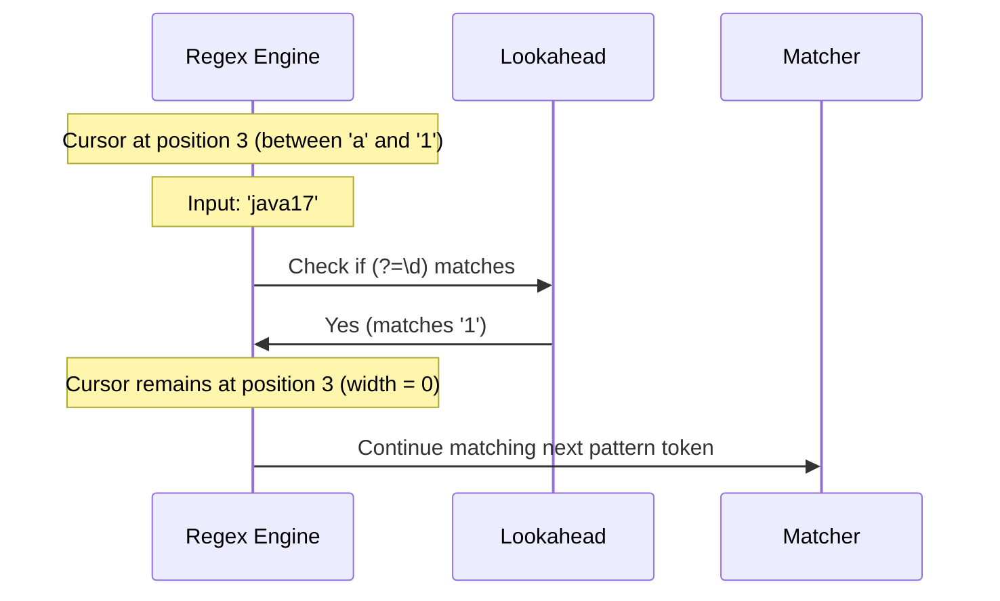

# Regular Expression - Part 2

| Concept | What to know |
| --- | --- |
| `Basic lookahead / lookbehind` | Lookahead and lookbehind are zero-width assertions that match a position without consuming characters. |
| `Validate email, phone, password` | Form validation patterns using regex, emphasizing password strength checks with lookarounds. |
| `Replace using regex` | Replacing substrings using regex via `replaceAll()`, backreferences, and Matcher replacement methods. |
| `Split using regex` | Splitting strings using regex and handling trailing empty tokens using the limit parameter. |

---

## Detailed Notes

### Basic lookahead / lookbehind

Lookarounds (lookahead and lookbehind) are **zero-width assertions**. They match a specific position in the text (like boundaries `^` or `$`), verifying a condition without actually consuming (moving the cursor past) any characters.

- **Lookahead**:
  - **Positive Lookahead `(?=pattern)`**: Asserts that what follows immediately is `pattern`.
  - **Negative Lookahead `(?!pattern)`**: Asserts that what follows immediately is NOT `pattern`.
- **Lookbehind**:
  - **Positive Lookbehind `(?<=pattern)`**: Asserts that what precedes immediately is `pattern`.
  - **Negative Lookbehind `(?<!pattern)`**: Asserts that what precedes immediately is NOT `pattern`.
- **Java Lookbehind Limitation**: In Java's regex engine, lookbehinds have restriction on length. Unlike lookaheads which can be arbitrary length, lookbehind patterns must have a **maximum length** that can be determined at compile time (e.g. you cannot use open-ended quantifiers like `*` or `+`, but you can use fixed lengths or bounded quantifiers like `{1,5}`).

#### Code Example: Extracting Numbers Preceded by Currency Symbols
```java
import java.util.regex.Pattern;
import java.util.regex.Matcher;

public class LookaroundExample {
    public static void main(String[] args) {
        String invoice = "Prices: $100, €50, and 20 items.";
        
        // Match digits that are preceded by $ or € (lookbehind)
        Pattern pattern = Pattern.compile("(?<=\\$|€)\\d+");
        Matcher matcher = pattern.matcher(invoice);
        
        while (matcher.find()) {
            System.out.println("Amount: " + matcher.group()); 
        }
        // Output:
        // Amount: 100
        // Amount: 50
    }
}
```

#### Common Mistake: Using unbounded quantifiers inside Lookbehinds
```java
// BAD: Triggers PatternSyntaxException at compile time!
// Lookbehinds cannot have unbounded quantifiers like '*' or '+'
Pattern p = Pattern.compile("(?<=prefix.*)digits"); 
```

## Why Lookarounds are Zero-Width Assertions

Lookahead and lookbehind assertions are called "zero-width" because they do not consume characters in the input stream during execution. Instead, they act as virtual anchors or logical checkpoints that inspect the upcoming or preceding characters from the current match pointer. Once the assertion succeeds, the regex engine's matching cursor remains at the exact same position it was before the assertion started. This allows multiple conditions to be validated at the exact same character position, which is particularly useful for checking password complexity rules.

#### Mental Model: Zero-Width Navigation



#### Code Example: Asserting Without Consuming

```java
import java.util.regex.*;

public class ZeroWidthDemo {
    public static void main(String[] args) {
        // (?=abc) checks for "abc" forward from start, but doesn't consume it.
        // The subsequent token 'a' then successfully matches the first character.
        Pattern p = Pattern.compile("(?=abc)a");
        Matcher m = p.matcher("abc");
        if (m.find()) {
            System.out.println("Matched: " + m.group()); // Matched: a (only 'a' is consumed)
            System.out.println("Start: " + m.start() + ", End: " + m.end()); // Start: 0, End: 1
        }
    }
}
```

#### Cause-Effect Chain

Engine reaches lookaround group `(?=pattern)` → Temporarily branches to evaluate pattern → Pattern matches successfully → Engine discards matched characters' state and reverts cursor → Continues matching main regex from the original position.

## Why Java Lookbehinds Have Width Limitations

Unlike lookaheads which read forward into the remaining unconsumed string, lookbehinds require the regex engine to step backward in the input buffer. To implement this step-back operation efficiently, the Java regex compiler must pre-calculate the exact range of characters it needs to look back. If the lookbehind pattern has an unbounded width (such as using `*` or `+`), the engine cannot determine at compile time how many steps to rewind. To prevent unpredictable runtime performance and buffer navigation issues, Java's regex engine enforces a fixed-length or bounded-length rule for lookbehind expressions, throwing a `PatternSyntaxException` for unbounded lookbehinds.

#### Mental Model: Lookahead vs. Lookbehind Directions

```
Lookahead (?=abc)  ---> Matches forward into remaining stream (arbitrary length OK)
Input: [x][y][z][a][b][c]
               ^-- (Cursor evaluates forward)

Lookbehind (?<=abc) <-- Steps backward in the buffer (fixed or bounded width required)
Input: [a][b][c][x][y][z]
               ^-- (Cursor evaluates backward)
```

#### Code Example: Bounded vs. Unbounded Lookbehinds

```java
import java.util.regex.*;

public class LookbehindLimitDemo {
    public static void main(String[] args) {
        // Bounded lookbehinds work in Java (length range is known: 1 to 5)
        Pattern bounded = Pattern.compile("(?<=id=\\d{1,5})\\w+");
        System.out.println(bounded.matcher("id=123active").find()); // true
        
        try {
            // Unbounded lookbehinds (using + or *) will fail compilation
            Pattern.compile("(?<=id=\\d+)\\w+");
        } catch (PatternSyntaxException e) {
            System.out.println("Compilation failed: " + e.getDescription()); // Look-behind group does not have an obvious maximum length
        }
    }
}
```

#### Cause-Effect Chain

Lookbehind pattern compiled → Engine checks if pattern width is bounded → If unbounded (`*` or `+`), maximum step-back size is infinite/unknown → Throws `PatternSyntaxException` at compile-time to prevent inefficient memory scans.

---

### Validate email, phone, password

Validation is one of the most common applications of regular expressions. However, writing overly permissive or overly restrictive patterns is a common engineering mistake.

- **Password Complexity**: Lookaheads are perfect for password validation because they let you check multiple independent conditions (e.g. contains uppercase, lowercase, digit) on the same string starting from the beginning.
- **Email Validation**: Real email validation (RFC 5322) is too complex for standard regex. Typically, production applications use simpler regexes that check for basic `@` structure, leaving exact delivery checks to verification emails.

#### Case Study: Password Strength Validation via Lookahead
```java
import java.util.regex.Pattern;

public class PasswordValidator {
    // Password rules:
    // - Must be at least 8 characters long
    // - Must contain at least one digit (?=.*[0-9])
    // - Must contain at least one lowercase letter (?=.*[a-z])
    // - Must contain at least one uppercase letter (?=.*[A-Z])
    // - Must contain at least one special character (?=.*[@#$%^&+=])
    private static final Pattern PASSWORD_PATTERN = Pattern.compile(
        "^(?=.*[0-9])(?=.*[a-z])(?=.*[A-Z])(?=.*[@#$%^&+=])(?=\\S+$).{8,}$"
    );

    public static boolean isValidPassword(String password) {
        if (password == null) return false;
        return PASSWORD_PATTERN.matcher(password).matches();
    }

    public static void main(String[] args) {
        System.out.println(isValidPassword("Weak12"));       // false (too short)
        System.out.println(isValidPassword("NoSpecial123")); // false (no special char)
        System.out.println(isValidPassword("Str0ng#pass"));  // true
    }
}
```

---

### Replace using regex

Java supports replacing substrings matching a regex through String and Matcher methods.

- **Backreferences in Replacement**: You can reference captured groups in the replacement string using `$groupNumber` (e.g. `$1`).
- **Advanced Replacement (`appendReplacement`/`appendTail`)**: `Matcher` provides a loop-based replacement mechanism to dynamically calculate replacements (e.g. transforming text uppercase, evaluating math expressions).

#### Code Example: Swapping Words using Capturing Group Backreferences
```java
public class ReplaceGroup {
    public static void main(String[] args) {
        String text = "John Doe, Jane Smith";
        // Swaps FirstName LastName to LastName, FirstName
        String result = text.replaceAll("(\\w+)\\s+(\\w+)", "$2, $1");
        System.out.println(result); // Output: "Doe, John, Smith, Jane"
    }
}
```

#### Code Example: Dynamic Replacements with appendReplacement
```java
import java.util.regex.Pattern;
import java.util.regex.Matcher;

public class DynamicReplacement {
    public static void main(String[] args) {
        String text = "Double these numbers: 5 and 12";
        Pattern p = Pattern.compile("\\d+");
        Matcher m = p.matcher(text);
        
        StringBuilder sb = new StringBuilder();
        while (m.find()) {
            int val = Integer.parseInt(m.group());
            m.appendReplacement(sb, String.valueOf(val * 2));
        }
        m.appendTail(sb);
        System.out.println(sb.toString()); // Output: "Double these numbers: 10 and 24"
    }
}
```

---

### Split using regex

`String.split(regex)` splits the input string around matches of the regular expression.

- **Trailing Empty Strings Gotcha**: By default, `String.split(regex)` or `String.split(regex, 0)` discards all trailing empty strings.
- **The Limit Parameter**:
  - `limit > 0`: Splits the string at most `limit - 1` times; the final entry contains all remaining unsplit text.
  - `limit < 0`: Splits the string as many times as possible, preserving all trailing empty strings.

#### Code Example: Split Limit Behaviors
```java
import java.util.Arrays;

public class SplitDemo {
    public static void main(String[] args) {
        String data = "apple,banana,,orange,,";
        
        // Default split (limit = 0): trailing empty strings are discarded
        String[] splitDefault = data.split(",");
        System.out.println("Default: " + Arrays.toString(splitDefault));
        // Output: [apple, banana, , orange] (length 4, trailing commas ignored)
        
        // Negative limit: preserves all trailing empty strings
        String[] splitAll = data.split(",", -1);
        System.out.println("Limit < 0: " + Arrays.toString(splitAll));
        // Output: [apple, banana, , orange, , ] (length 6)
        
        // Positive limit: splits into at most 2 elements
        String[] splitTwo = data.split(",", 2);
        System.out.println("Limit = 2: " + Arrays.toString(splitTwo));
        // Output: [apple, banana,,orange,,] (length 2)
    }
}
```

#### Common Mistake: Splitting on regex special characters without escaping
Splitting on dot `.`, pipe `|`, or question mark `?` directly without escaping, since they are active regex metacharacters.
```java
String ip = "192.168.1.1";
// BAD: splits on "any character", returning an empty array!
String[] bad = ip.split("."); 

// CORRECT: escape the dot
String[] good = ip.split("\\."); 
```

## Why String.split Discards Trailing Empty Strings

By default, Java's `String.split(regex)` or `String.split(regex, 0)` is designed for convenience, assuming that trailing empty segments resulting from consecutive separators are unwanted noise (e.g., parsing comma-separated lists with trailing commas). To do this, the regex engine splits the string fully, but then performs a post-processing cleanup step that truncates any trailing empty strings from the resulting array. When you need to preserve all fields—such as when parsing CSV records where a trailing empty string represents an empty database cell—you must pass a negative limit parameter (like `-1`). This negative limit instructs the engine to split as many times as possible and skip the trailing empty truncation step.

#### Mental Model: Default Limit vs. Negative Limit

```
Input: "A,B,,"

Default split(",") or split(",", 0):
Step 1: Match separators -> ["A", "B", "", ""]
Step 2: Clean up trailing empty elements -> ["A", "B"]

Negative limit split(",", -1):
Step 1: Match separators -> ["A", "B", "", ""]
Step 2: Return array directly -> ["A", "B", "", ""]
```

#### Code Example: Split Array Comparison

```java
import java.util.Arrays;

public class SplitExplanation {
    public static void main(String[] args) {
        String input = "name,age,,";
        
        // Discards trailing empty elements
        String[] defaultSplit = input.split(",");
        System.out.println(Arrays.toString(defaultSplit)); // [name, age]
        
        // Preserves all empty elements
        String[] rawSplit = input.split(",", -1);
        System.out.println(Arrays.toString(rawSplit)); // [name, age, , ]
    }
}
```

#### Cause-Effect Chain

Separator matched at end of input → Engine creates empty string array element → Default limit (`0`) triggers post-split scan → Truncates consecutive trailing empty strings → Negative limit (`-1`) skips post-split scan → All array entries preserved.

## Reference Links

- https://docs.oracle.com/en/java/javase/21/docs/api/java.base/java/lang/String.html#split(java.lang.String,int) (String.split Java Documentation)
- https://docs.oracle.com/javase/tutorial/essential/regex/bounds.html (Boundary Matchers Oracle Java Tutorial)

---

  Overusing nested lookarounds can cause performance degradation because the engine checks assertions at every candidate index. Keep lookarounds simple.
- **Why are lookbehinds restricted to fixed-length bounds in Java?**
  Unlike lookaheads (which search forward into unread text), looking behind requires stepping backward into the match buffer. To keep this efficient, the regex compiler must know exactly how far back to look, preventing arbitrary regex quantifiers like `*` or `+`.
- **How can we preserve all empty fields when parsing CSV data with split?**
  Pass a negative integer limit (e.g. `-1`) as the second argument to `String.split(regex, limit)`.
