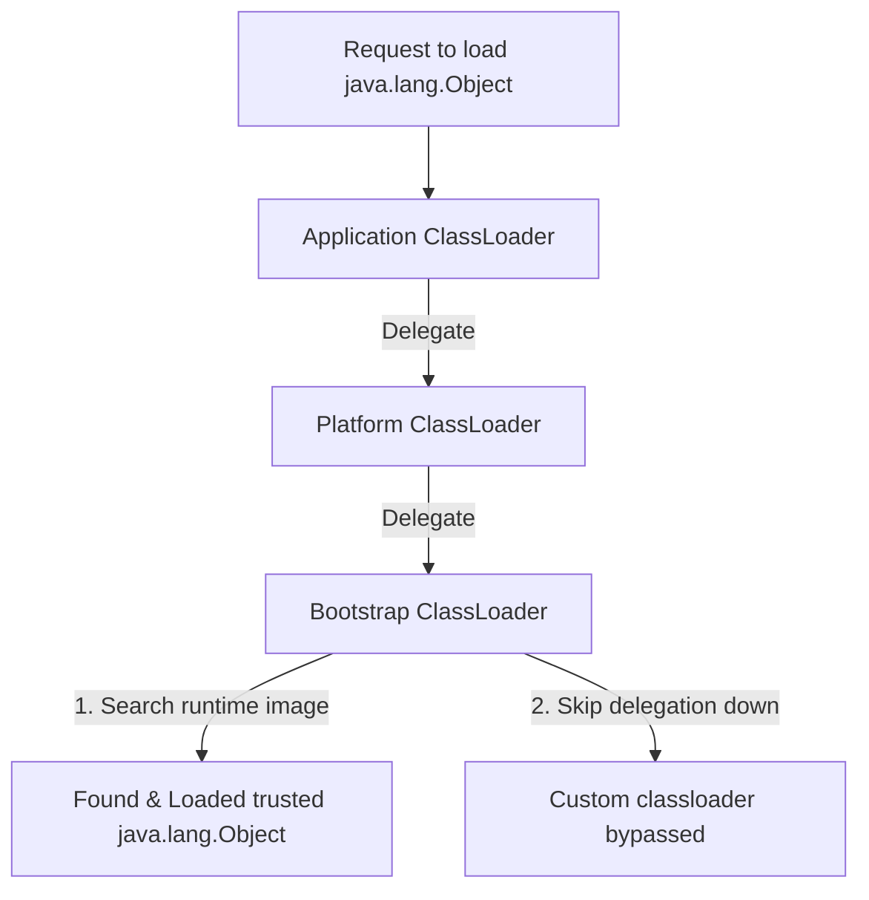

# ClassLoader - Part 1

| Concept | What to know |
| --- | --- |
| `Class loading process` | The multi-phase lifecycle of loading, linking, and initializing class definitions into the JVM memory. |
| `Bootstrap ClassLoader` | The native-code root loader responsible for loading core runtime classes (e.g., `java.lang.Object`). |
| `Platform/Extension ClassLoader` | The loader that loads non-core platform modules or extension APIs. |
| `Application ClassLoader` | The loader (system class loader) that loads classes from the application classpath. |
| `Parent delegation model` | The mechanism where loaders delegate loading to their parent before attempting it themselves. |
| `Dynamic class loading` | Loading classes into JVM memory at runtime on-demand rather than at startup. |
| `Class.forName` | The reflection API method used to load and optionally initialize classes dynamically. |
| `Classpath` | The configuration parameter telling the JVM where to look for user-defined classes and packages. |
| `Basic JAR loading` | How the JVM resolves class files packaged inside ZIP-compressed archive files (JARs). |

## Detailed Notes

### Class loading process

The class loading process is the JVM's mechanism for bringing compiled binary bytecode (stored in `.class` files or retrieved from a network stream) into memory and turning it into a usable `java.lang.Class` object. It occurs dynamically, on-demand, rather than loading all classes at application startup.

## Why the three phases of classloading govern static execution

Classloading is not a single atomic step but a structured process consisting of three distinct phases: Loading, Linking, and Initialization. During the **Loading** phase, the classloader reads the binary representation of the class (the byte array from a `.class` file or network stream) and constructs the corresponding `java.lang.Class` metadata structure in Metaspace. The **Linking** phase is subdivided into *Verification* (ensuring the bytecode is valid and safe), *Preparation* (allocating memory for static fields and initializing them to default values like `0` or `null`), and *Resolution* (resolving symbolic references in the constant pool to actual direct memory references). Finally, the **Initialization** phase runs the static initializers (the `<clinit>` method) and assigns the actual developer-defined values to static variables. The JVM guarantees that static initialization occurs lazily, only when the class is first actively used—such as when a new instance is created, a static method is invoked, or a static field is accessed.

### Mental Model: Class Loading Phases
```
+------------------------------------------------------------------------+
| 1. LOADING: Read bytecode -> Create Class<?> metadata in Metaspace      |
+------------------------------------------------------------------------+
                                   |
                                   v
+------------------------------------------------------------------------+
| 2. LINKING:                                                            |
|    - Verification: Validate bytecode format and safety rules           |
|    - Preparation: Allocate static memory & write defaults (e.g. 0/null)|
|    - Resolution: Map symbolic references to direct memory addresses    |
+------------------------------------------------------------------------+
                                   |
                                   v
+------------------------------------------------------------------------+
| 3. INITIALIZATION: Run static initializers (<clinit>) & field values    |
+------------------------------------------------------------------------+
```

### Code Example
```java
public class ClassLoadingPhasesDemo {
    static class Target {
        // Preparation phase: value is initialized to 0
        // Initialization phase: value is assigned 42
        public static int value = 42;
        
        static {
            System.out.println("Target class initialized!");
        }
    }

    public static void main(String[] args) throws Exception {
        System.out.println("Main started");
        
        // Dynamic loading using Class.forName without initializing
        Class<?> clazz = Class.forName("ClassLoadingPhasesDemo$Target", false, ClassLoadingPhasesDemo.class.getClassLoader());
        System.out.println("Target class loaded but not initialized yet.");
        
        // Triggering active use
        int val = Target.value;
        System.out.println("Static value accessed: " + val);
        
        // Output:
        // Main started
        // Target class loaded but not initialized yet.
        // Target class initialized!
        // Static value accessed: 42
    }
}
```

### Cause-Effect Chain
Active class trigger occurs (e.g., static access) → Class is loaded if not already → Linking executes validation and preparation (default zero-values) → Initialization executes static blocks and real assignments → Class fully ready for runtime execution.

---

### Bootstrap ClassLoader

The Bootstrap ClassLoader is the parent of all classloaders. It is written in native code (C/C++) and embedded within the JVM itself. It is responsible for loading the core Java platform classes, such as those found in `java.lang`, `java.util`, and other fundamental packages (from `java.base` module in Java 9+). Because it is written in native code, it does not have a corresponding `java.lang.ClassLoader` Java object; calling `getClassLoader()` on core classes like `java.lang.String` or `java.lang.Object` returns `null`.

### Platform/Extension ClassLoader

The Platform ClassLoader (known as the Extension ClassLoader prior to Java 9) loads classes from platform/extension directories. In Java 9 and newer, its purpose is to load platform classes and APIs that are not part of the core runtime (e.g., SQL, XML processing packages) but are part of the standard Java SE specification.

### Application ClassLoader

Also known as the System ClassLoader, the Application ClassLoader is responsible for loading classes from the application's classpath (specified by the `CLASSPATH` environment variable, or the `-classpath` / `-cp` command-line options). It is the default loader for user-defined classes and is written in Java (subclass of `java.lang.ClassLoader`).

### Parent delegation model

The parent delegation model is the hierarchical framework that guides how classloaders search for classes. When a classloader receives a request to load a class, it does not attempt to find the class itself first. Instead, it delegates the search to its parent classloader. This delegation traverses up to the Bootstrap ClassLoader. Only if all ancestor classloaders fail to locate the class does the child classloader attempt to load it.

## Why the parent delegation model protects core APIs

The parent delegation model is a core security mechanism in the Java Virtual Machine. When a classloader is requested to load a class, it always delegates the request to its parent classloader first, ascending all the way to the Bootstrap ClassLoader, before attempting to load the class itself. This hierarchy guarantees that core runtime classes, such as `java.lang.Object` or `java.lang.String`, are always loaded by the Bootstrap ClassLoader from the trusted runtime image, rather than by an untrusted application or custom classloader. Even if a malicious developer packages a fake `java.lang.Object` class in a JAR, the parent delegation model ensures that the request is intercepted at the top of the tree, loading the official JVM class instead. Furthermore, the JVM enforces runtime checks (such as checking package names starting with `java.`) and throws a `SecurityException` if an untrusted classloader attempts to define a class within a restricted package.

### Mental Model: Parent Delegation Model


### Code Example
```java
// Conceptual demonstration of package containment checks
public class ClassProtectionDemo {
    public static void main(String[] args) {
        try {
            ClassLoader customLoader = new ClassLoader() {
                @Override
                protected Class<?> findClass(String name) throws ClassNotFoundException {
                    // Try to hijack java.lang by defining a fake class within it
                    byte[] dummyBytes = new byte[0];
                    return defineClass(name, dummyBytes, 0, 0);
                }
            };
            customLoader.loadClass("java.lang.FakeCoreClass");
        } catch (SecurityException e) {
            System.out.println("SecurityException caught: " + e.getMessage());
            // Output: SecurityException caught: Prohibited package name: java.lang
        } catch (ClassNotFoundException e) {
            System.out.println("Class not found");
        }
    }
}
```

### Cause-Effect Chain
Custom class requested → Delegated up to Bootstrap ClassLoader → Trusted core API class returned → Runtime package check fails on attempts to define `java.*` directly → JVM throws `java.lang.SecurityException` preventing API hijacking.

---

### Dynamic class loading

Dynamic class loading refers to the JVM's capability to load classes at runtime on-demand, rather than compiling them all statically or loading them during JVM bootstrap. This allows programs to load plugins, drivers, or modules dynamically without restarting the application.

## Why ClassLoader namespaces dictate type identity uniqueness

In the Java Virtual Machine, a class's identity is not determined solely by its fully qualified name (e.g., `com.example.Service`). Instead, a class's runtime identity is a combination of its fully qualified name and the specific `ClassLoader` instance that defined it. This means that if two different `ClassLoader` instances load the exact same class file bytes from disk, the JVM treats them as two completely distinct types. The JVM partitions types using runtime packages associated with their defining classloaders, ensuring class namespace isolation. Consequently, you cannot cast an instance of a class loaded by `ClassLoader A` to the class definition loaded by `ClassLoader B`, and trying to do so results in a `ClassCastException` at runtime.

### Mental Model: ClassLoader Type Separation
```
+-------------------------------------------------------------------+
|                           JVM Memory                              |
|  +---------------------------+     +---------------------------+  |
|  |       ClassLoader A       |     |       ClassLoader B       |  |
|  |  [com.example.Service]    |     |  [com.example.Service]    |  |
|  |     (Type ID: Class@1)    |     |     (Type ID: Class@2)    |  |
|  +-------------+-------------+     +-------------+-------------+  |
|                |                                 |                |
|         Instantiated as:                  Instantiated as:        |
|            serviceObj1                       serviceObj2          |
+-------------------------------------------------------------------+
Attempting: (com.example.Service) serviceObj2 (using Class@1 context)
Result: java.lang.ClassCastException
```

### Code Example
```java
// Conceptual example of namespace type mismatch
public class NamespaceTypeMismatchDemo {
    public static void main(String[] args) throws Exception {
        // Supposing CustomClassLoader loads class bytes from a specific folder
        ClassLoader loader1 = new CustomClassLoader();
        ClassLoader loader2 = new CustomClassLoader();
        
        Class<?> clazz1 = loader1.loadClass("com.example.Service");
        Class<?> clazz2 = loader2.loadClass("com.example.Service");
        
        System.out.println("clazz1 == clazz2: " + (clazz1 == clazz2));
        // Output: clazz1 == clazz2: false
        
        Object instance2 = clazz2.getDeclaredConstructor().newInstance();
        System.out.println("Is instance2 instance of clazz1? " + clazz1.isInstance(instance2));
        // Output: Is instance2 instance of clazz1? false
    }
}
```

### Cause-Effect Chain
Multiple classloader instances load the same class → Distinct `java.lang.Class` objects created in memory → Namespaces partition type identity → JVM execution engine detects mismatched defining loaders during cast checks → `ClassCastException` thrown despite identical names.

---

### Class.forName

`Class.forName` is a reflection API method used to load a class dynamically by its fully qualified name. By default, calling `Class.forName(name)` not only loads the class but also links and initializes it (running static blocks). If initialization is not desired immediately, the three-argument overload `Class.forName(name, initialize, classloader)` can be used instead.

## Why SPI and plugin frameworks must break parent delegation

The strict parent delegation model operates in a top-down manner, where classloaders delegate upwards to load core platform classes. However, this model breaks down when core platform APIs (loaded by the Bootstrap ClassLoader) need to discover and load third-party service provider implementations (which reside in the classpath and are loaded by the Application ClassLoader). For instance, the Java Database Connectivity (JDBC) API exists as core platform classes, but it needs to load database drivers (like PostgreSQL or MySQL drivers) that are provided by the application. To resolve this, Java introduced the Thread Context ClassLoader (TCCL), which allows a thread to specify a helper classloader (typically the Application ClassLoader) that can be retrieved by core classes to load application classes. Similarly, OSGi and web application servers implement custom delegation networks (such as parent-last or peer-to-peer loading) to isolate plugins or allow web applications to override shared server-level libraries.

### Mental Model: Breaking Parent Delegation for SPI
```
+-----------------------------------------------------------------------+
|  Bootstrap ClassLoader (Loads java.sql.DriverManager)                  |
+-----------------------------------------------------------------------+
                                  |
            Need to load database driver (e.g. org.postgresql.Driver)
            If parent-delegation only: Bootstrap cannot see Application
            loader classes (downwards visibility is prohibited).
                                  |
                                  v
+-----------------------------------------------------------------------+
|  TCCL Hook (Thread.currentThread().getContextClassLoader())           |
|  Allows DriverManager to query the Application ClassLoader           |
+-----------------------------------------------------------------------+
                                  |
                                  v
+-----------------------------------------------------------------------+
|  Application ClassLoader (Loads org.postgresql.Driver)                |
+-----------------------------------------------------------------------+
```

### Code Example
```java
import java.sql.Driver;
import java.util.ServiceLoader;

public class TCCLDemo {
    public static void main(String[] args) {
        // TCCL is set to the Application ClassLoader by default
        ClassLoader originalTCCL = Thread.currentThread().getContextClassLoader();
        
        // Temporarily nullify the TCCL to mimic a clean bootstrap environment
        Thread.currentThread().setContextClassLoader(null);
        
        try {
            // ServiceLoader uses Thread Context ClassLoader by default to find SPIs
            ServiceLoader<Driver> loader = ServiceLoader.load(Driver.class);
            // This fails to find application classpath drivers if TCCL is null
            boolean found = loader.iterator().hasNext();
            System.out.println("Drivers found without TCCL: " + found);
            // Output: Drivers found without TCCL: false
        } finally {
            // Restore TCCL
            Thread.currentThread().setContextClassLoader(originalTCCL);
        }
    }
}
```

### Cause-Effect Chain
Core library loaded by Bootstrap ClassLoader → Needs to instantiate implementation class in Application ClassLoader → Downward delegation forbidden by default model → Thread Context ClassLoader retrieved from current thread execution environment → Delegation bypassed by explicitly querying application loader → SPI loaded successfully.

---

### Classpath

The Classpath is a configuration parameter (command-line option or environment variable) that specifies directories and ZIP/JAR archives where compilation and execution classes are searched.

## Why Custom Classloaders Cause Metaspace Memory Leaks

Web application containers like Tomcat utilize custom classloaders to isolate multiple deployments running on the same JVM instance. Each deployed web application is allocated its own `WebappClassLoader` instance, which handles loading application-specific classes without interference from other apps. However, this setup is highly susceptible to Metaspace memory leaks because of the strict reference retention rules of the Java Garbage Collector. Every class object loaded holds a strong reference to its defining `ClassLoader` via the `getClassLoader()` method, and in turn, the classloader maintains a reference to all classes it has loaded. If a thread, static field, thread-local variable, or system-wide registry (like JDBC drivers or logging frameworks) retains a single reference to any application class after undeployment, the entire classloader and all of its loaded classes cannot be garbage collected. Since class metadata is stored in Metaspace, repeated application redeployments will leak class metadata, eventually exhausting the JVM heap or Metaspace and throwing an `OutOfMemoryError: Metaspace`.

### Mental Model: ClassLoader Reference Cycle
```
System Registry (e.g., ThreadLocal or JDBC)
      | (Leaks reference)
      v
[Application Class (e.g. MyLeakedClass)]
      | (getClassLoader())
      v
[WebappClassLoader]
      | (Holds references to all loaded classes)
      v
[Class Metadata in Metaspace (Hundreds of classes)] ---> Memory cannot be reclaimed!
```

### Code Example
```java
public class MetaspaceLeakSample {
    private static final ThreadLocal<Object> context = new ThreadLocal<>();

    public static void runLeak(ClassLoader webappLoader) throws Exception {
        // Load an application class using our custom webapp loader
        Class<?> leakedClass = webappLoader.loadClass("com.example.LeakedContext");
        Object instance = leakedClass.getDeclaredConstructor().newInstance();
        
        // Storing the instance in a ThreadLocal that is never cleaned up
        context.set(instance);
        
        // Web application is now "undeployed" (webappLoader reference set to null)
        webappLoader = null;
        
        // System.gc() cannot reclaim webappLoader because context thread-local
        // still references the class instance, which references the class,
        // which references the webappLoader.
        System.gc();
        System.out.println("Undeployed webapp but leak remains.");
        // Output: Undeployed webapp but leak remains.
    }
}
```

### Cause-Effect Chain
Webapp undeployed → References to custom classloader discarded by container → Static reference or ThreadLocal keeps reference to webapp class → Class retains reference to defining classloader → Classloader keeps references to all its loaded classes → GC cannot reclaim classloader or any loaded class → Metaspace usage grows continuously with redeploys → Metaspace OutOfMemoryError occurs.

---

### Basic JAR loading

JAR (Java Archive) loading allows multiple compiled `.class` files, resource configuration files, and metadata to be aggregated into a single ZIP-compressed archive. The JVM loads classes directly from inside JARs by reading their ZIP entries, using classpath search configurations to resolve external dependency libraries.

## Reference Links

- https://docs.oracle.com/en/java/javase/21/docs/api/java.base/java/lang/ClassLoader.html (Official ClassLoader API)
- https://docs.oracle.com/javase/specs/jvms/se21/html/jvms-5.html (JVM Spec: Loading, Linking, and Initializing)
- https://tomcat.apache.org/tomcat-11.0-doc/class-loader-howto.html (Tomcat ClassLoader How-To)
